# AIDC HVAC Engineering Wiki - Consolidated Knowledge Base
Generated on: 2026-07-11 17:17:29
This document contains a consolidated version of all engineering wiki pages for easy import into NotebookLM.
---


## ================================================================================
## DOCUMENT: C:\Users\user\Obsidian\Engineering-Wiki\wiki\index.md
## ================================================================================
# Engineering-Wiki Index

AIDC HVAC 工程知識庫索引。由 Antigravity 維護，最後更新：2026-06-06。

---

## ⚡ 快速入口區塊 (Quick Access)

| 🎯 核心目標與標準 | ❄️ 核心液冷組件 | 📊 系統對比專欄 | 🏢 龍頭與主要廠商 |
| :--- | :--- | :--- | :--- |
| [[GB200 NVL72 冷卻需求]] / [[GB300與Blackwell Ultra機櫃架構]] / [[Vera Rubin 機櫃物理與電力架構]] / [[800VDC 直流配電]] / [[AIDC 微電網架構]] | [[液冷系統 - CDU 架構]] / [[NVIDIA GPU 晶片演進與散熱限值]] | [[空冷 vs 液冷]] | [[Vertiv]] / [[CoolIT]] |
| [[PUE 計算]] / [[WUE 計算]] / [[AIDC TCO 成本模型與決策模板]] | [[Cold Plate]] / [[MCL與MCCP液冷技術]] | [[CRAC vs CRAH]] | [[Schneider]] / [[Delta]] |
| [[ASHRAE TC 9.9 Data Center 溫濕度標準]] / [[AIDC 核心標準與規範指引]] | [[快速接頭]] / [[儲冷罐]] / [[HBM與晶片級光通訊熱管理]] / [[TCS 二次側與冷卻水化學管理]] | [[單相 vs 雙相浸沒式液冷]] / [[單相 vs 雙相直接液冷]] | [[Foxconn]] / [[Asetek]] |
| [[設備與廠商選型對照矩陣]] / [[AIDC 驗收測試與調試實務]] | [[浸沒式液冷]] / [[CDU 架構與選型]] / [[PDU與電力引線]] | [[微通道冷板 vs 鰭片式冷板]] | [[STULZ]] / [[Rittal]] / [[Daikin]] / [[Trane]] |
| [[乾冷器]] / [[Tier 分級深度解析]] / [[AIDC FMEA 故障模式與效應分析]] | [[漏液偵測系統]] / [[熱管與均熱板]] | [[Dry Cooler vs. 密閉式冷卻水塔]] / [[N+1 vs 2N vs N+2 備援架構]] | [[Carrier]] / [[奇鋐]] / [[健策]] |
| [[消防系統]] / [[電力品質與諧波]] / [[BMS與DCIM序列控制邏輯]] | [[電化學腐蝕與接地]] / [[AI 工作負載熱特性]] | — | [[雙鴻]] / [[Cooler master]] |
| [[中壓電力引入]] / [[地板荷重與機房結構]] | [[冷媒知識]] | — | — |

---

## 學習模組（wiki/concepts/）

| 頁面 | 摘要 | 測驗分數 |
|------|------|---------|
| [[Module 01 - Data Center 基礎概念]] | DC 定義、Tier 分級、空間架構、AI DC vs 傳統 DC、PUE 入門 | 90/100 |
| [[Module 02 - AIDC 熱負荷與冷卻需求]] | 熱量換算、IT 設備功耗、冷卻容量計算鏈、設計裕度、流量計算 | 93/100 |
| [[Module 03 - 空冷系統架構]] | CRAC/CRAH、熱通道封閉、架架地板、RDHX、ASHRAE TC 9.9 | 91/100 |
| [[Module 04 - 液冷系統深度解析]] | DLC Cold Plate、CDU 架構、TIM、快速接頭、儲冷罐、浸沒式 | 92/100 |
| [[Module 05 - 冷源與冷凍機房]] | Chiller 選型、冷卻塔、Free Cooling、LMTD 計算、PUE 優化 | 94/100 |
| [[Module 06 - 電力架構與機電整合]] | kW/kVA、電力路徑、UPS、發電機、A/B Feed、MEP 協調 | 93/100 |
| [[Module 07 - 設計計算實務]] | 完整設計流程、計算鏈、CFD 驗證、Boss 關、常見錯誤 | 93/100 |
| [[Module 08 - 廠商生態系統]] | 廠商分層、TBE 評分矩陣、選型原則、未來趨勢 | — |

---

## 比較專區（wiki/comparisons/）

| 頁面 | 對對比主題與核心工程價值 |
|------|-------------------|
| [[空冷 vs 液冷]] | 體積熱容量物理限制推導、PUE 效率與能效分析、CAPEX vs OPEX 成本結構與回收期評估 |
| [[CRAC vs CRAH]] | DX 直膨系統與 CW 冷凍水系統工作原理、系統架構圖對比、控制精度與 AIDC 混合部署選型 |
| [[單相 vs 雙相浸沒式液冷]] | 顯熱 vs 潛熱換熱原理、PFAS 環保法規與 GWP 限制、密封壓力容器與沸騰控制、建置成本評估 |
| [[開放式冷卻塔 vs 閉式冷卻塔]] | 蒸發散熱與間接換熱對比、Legionella 防控與水質要求、逼近溫差極限、對 Free Cooling 影響 |
| [[離心式 vs 螺桿式冷凍機]] | 動能式與容積式原理對比、IPLV 與 VFD 變頻控制、喘振防護、無油磁浮技術的能效增益 |
| [[微通道冷板 vs 鰭片式冷板]] | 微通道與宏觀鰭片流體力學對比、極限晶片熱阻 $R_{jc} \le 0.03 \text{ K/W}$ 、水流阻力與壓降、製造工藝 (Skiving vs CNC) |
| [[(In-Row) vs (RDHX)]] | 局部風路循環 vs 機櫃熱風全捕獲、風扇功耗影響、老舊機房液冷升級可行性、混合冷卻系統部署 |
| [[單相 vs 雙相直接液冷]] | 顯熱對流與沸騰相變潛熱機制、絕緣冷媒與 GWP 環保合規、系統高壓氣密與汽鎖 (Vapor Lock) 控制 |
| [[Dry Cooler vs. 密閉式冷卻水塔]] | 顯熱 vs 潛熱換熱根本差異、WUE=0 vs 高耗水、Legionella 風險、45°C 溫水冷卻後全球 Chiller-Free 可行性 |
| [[N+1 vs 2N vs N+2 備援架構]] | 三種備援模式完整定義、可用性成本分析（1.1× vs 2.0×）、UPS/Chiller/CDU 各子系統典型設計選擇 |

---

## 廠商實體（wiki/entities/）

| 頁面 | 廠商定位與 AIDC 核心評估 |
|------|-----------------------|
| [[Vertiv]] | 全球資料中心機電龍頭，XDU 系列大容量 CDU、精密 CRAH、電力與 DCIM 一體化方案，面臨交期瓶頸 |
| [[CoolIT]] | 直接液冷 (DLC) 先驅與純專門技術廠，專利冷板微通道、緊湊型 CHx 系列 CDU，客製化敏捷度高 |
| [[Schneider]] | 施耐德電機，全球電力分配與 EcoStruxure 資料中心軟硬體霸主，Uniflair 精密空調與大容量 CRAH 供應商 |
| [[Daikin]] | 大金空調，冷凍機房核心 Chiller 霸主，掌握 Turbocor 磁浮無油壓縮機專利技術，極限部分負載能效 IPLV/NPLV，支援快速啟動 |
| [[Trane]] | 特靈空調，美系大型 Chiller 與冷凍系統老牌巨頭，CVHE 超低壓離心冰機與預製化冷凍機房模組 |
| [[Foxconn]] | 鴻海精密，自研 Cold Plates、Smart Manifold 與快速接頭，實現從 L10 到 L11 的垂直整合與供應鏈自給 |
| [[Asetek]] | 丹麥液冷先驅，專利 Pump-on-Cold Plate (冷板置泵) 方案，與 Tier-1 伺服器 OEM 深度驗證 |
| [[STULZ]] | 德國精密空調專家，CyberAir 與 CyberRow 氣冷系列，高精度 PID 溫濕度控制能力，客製化彈性極強 |
| [[Delta]] | 台達電子，電源管理與散熱解決方案巨頭，Modulon DPH 模組化 UPS、智慧母線槽、自研 CDU 及高靜壓伺服器風扇 |
| [[Rittal]] | 德國威圖，機櫃結構物理防護霸主，VX IT 機架標準與 LCP 主動/被動 RDHX 門後水冷系統，物理裝甲防護 |
| [[Carrier]] | 開利，全球最大 Chiller 製造商之一，AquaForce Vision PUREtec R-1234ze（GWP=7），備件服務網絡最廣 |
| [[奇鋐]] | 奇鋐科技（AVC 3017），台灣 MCCP 微通道冷板製造龍頭，NVIDIA Vera Rubin 供應鏈認可，真空釺焊量產良率最高 |
| [[健策]] | 健策精密（Jentech 3653），MCL 微通道晶片蓋板台灣領跑者，30 年均熱板工藝，Vera Rubin Ultra 封裝冷卻潛在主力 |
| [[雙鴻]] | 雙鴻科技（Auras 3324），台灣液冷二次側龍頭，同時具備冷板、CDU 與分歧管完整方案，與 ODM 合作緊密 |
| [[Cooler master]] | 酷碼科技（Cooler Master），全球散熱巨合，自研 3D VC 極限空冷技術及機架式 CDU，客製化敏捷度高 |

---

## 概念頁面（wiki/concepts/）

### 01_modules (導讀模組)

| 頁面 | 說明 |
|------|------|
| [[Module 01 - Data Center 基礎概念]] | DC 定義、Tier 分級、空間架構、AI DC vs 傳統 DC、PUE 入門 |
| [[Module 02 - AIDC 熱負荷與冷卻需求]] | 熱量換算、IT 設備功耗、冷卻容量計算鏈、設計裕度、流量計算 |
| [[Module 03 - 空冷系統架構]] | CRAC/CRAH、熱通道封閉、架架地板、RDHX、ASHRAE TC 9.9 |
| [[Module 04 - 液冷系統深度解析]] | DLC Cold Plate、CDU 架構、TIM、快速接頭、儲冷罐、浸沒式 |
| [[Module 05 - 冷源與冷凍機房]] | Chiller 選型、冷卻塔、Free Cooling、LMTD 計算、PUE 優化 |
| [[Module 06 - 電力架構與機電整合]] | kW/kVA、電力路徑、UPS、發電機、A/B Feed、MEP 協調 |
| [[Module 07 - 設計計算實務]] | 完整設計流程、計算鏈、CFD 驗證、Boss 關、常見錯誤 |
| [[Module 08 - 廠商生態系統]] | 廠商分層、TBE 評分矩陣、選型原則、未來趨勢 |

### 02_air_cooling (空冷設備)

| 頁面 | 說明 |
|------|------|
| [[CRAC]] | Computer Room Air Conditioner，自帶壓縮機，小型或邊緣機房 |
| [[CRAH]] | Computer Room Air Handler，需外部冷凍水，大型 AIDC 空冷主力 |
| [[In-Row Cooling]] | 機列式冷卻，30+ kW/rack 高密度補強 |
| [[RDHX]] | 機架後門熱交換器，最快改造方案，18~24°C 供水 |
| [[HAC CAC 熱通道冷通道封閉]] | HAC/CAC 設計、Bypass 控制、盲板安裝 |

### 03_liquid_cooling (液冷迴路組件)

| 頁面 | 說明 |
|------|------|
| [[CDU 架構與選型]] | CDU 選型容量與流量計算、TBE 技術評估矩陣、廠商考量 |
| [[液冷系統 - CDU 架構]] | CDU 內部構造、水路迴路與運作控制邏輯（隔離與水質） |
| [[快速接頭]] | 乾式斷開、帶壓插拔、防呆設計，Hot Swap 的基礎 |
| [[儲冷罐]] | 熱慣性緩衝（10~30 min）、穩壓穩流、排氣補水，液冷的 UPS |
| [[浸沒式液冷]] | 單相/雙相浸沒，PUE≈1.02，2026+ 逐步成熟 |
| [[漏液偵測系統]] | 高風險點分佈圖、繩式感測電纜精度 ±1m、ESD 聯鎖邏輯（<2s 截止閥）、DCIM 整合告警 |
| [[電化學腐蝕與接地]] | 伽凡尼腐蝕三要件、導電率 <10 μS/cm 防護門檻、BTA 銅緩蝕劑、等電位接地設計 |
| [[TCS 二次側與冷卻水化學管理]] | TCS 迴路導電度控制、pH標準、BTA緩蝕配比、乙二醇比熱折衷、微米級旁濾、材料電位序列相容性 |

### 04_cooling_sources (冷源與冷凍水路)

| 頁面 | 說明 |
|------|------|
| [[Chiller Plant]] | 冷凍機房完整架構，一次/二次/三次側，Chiller 選型、台數計算與化學水處理 |
| [[磁浮式冷凍機]] | 磁浮軸承原理、部分負載 COP 優勢、AIDC 首選理由 |
| [[冷卻水塔]] | 冷卻塔類型、濕球溫度限制、水質管理（ASHRAE Guideline 12-2020）|
| [[Free Cooling]] | 三種形式（直接/間接/乾冷器）、各地可用時數、台灣策略、三段控制邏輯 |
| [[乾冷器]] | 乾式空氣冷卻原理、逼近溫差計算、45°C 溫水冷卻全球 Chiller-Free 可行性、乙二醇修正 |
| [[冷媒知識]] | CFC→HCFC→HFC→HFO 四代演進、R-1234ze(E) GWP=7、EU F-Gas 2024 台灣環保署法規 |
| [[氣冷式冰機]] | 空冷冷凝原理、環境溫度對 COP 影響、WUE=0 適用場景、邊緣 DC 與缺水地區應用 |
| [[吸收式冰機]] | LiBr 吸收循環原理、單效/雙效/三效 COP、CHP 廢熱驅動製冷、CCHP 三聯產架構 |
| [[冷卻水泵浦系統]] | 相似律三次方省電原理、一次/二次側解耦架構、VFD 差壓控制、NPSH 空蝕防護、無軸封泵 |

### 05_power_systems (電力配電)

| 頁面 | 說明 |
|------|------|
| [[UPS]] | Online Double Conversion、模組化 UPS、STS 靜態轉換開關、Eco-Mode 效率 vs 穩定性 |
| [[發電機]] | 備援時序、儲油量、排氣方向（不能朝冷卻塔）|
| [[Busbar 匯流排]] | 高密度機架配電唯一可行方式，I²R 發熱 2~5% 需納入 CFD |
| [[PDU與電力引線]] | 落地式 RPP、智慧型機架 rPDU、電力引線配線之氣流阻礙隱患，以及架空隨插即用 Tap-off 插接箱 |
| [[電力品質與諧波]] | 非線性負載 THD、IEEE 519-2014 限值、中性線 3 次諧波疊加、APF 主動濾波 |
| [[中壓電力引入]] | 台電 22kV 引入流程、GIS 開關設備、A/B Feed 雙路設計、申請時程 18~36 個月 |
| [[800VDC 直流配電]] | B200/NVL72 輸電電流與銅排重量物理推導、直流熄弧物理限制（無過零點）、絕緣檢測浮地設計 |
| [[AIDC 微電網架構]] | 分布式能源與 BESS 毫秒級動態削峰計算、SOFC 廢熱回收吸附式冰機（CCHP）整合、STS 孤島無縫切換 |

### 06_standards_calculations (計算與標準)

| 頁面 | 說明 |
|------|------|
| [[PUE 計算]] | PUE 公式、冷卻耗電計算、各等級意義 |
| [[WUE 計算]] | WUE 水資源使用效率指標、PUE vs WUE 折衷物理、優化手段與補水管徑設計範例 |
| [[LMTD 計算]] | 對數平均溫差公式、ε-NTU 換熱有效度法、CDU 熱交換器應用與採購審標實務 |
| [[ASHRAE TC 9.9 Data Center 溫濕度標準]] | A1~A4 等級、量測點（進氣口）、節能關係 |
| [[Tier 分級深度解析]] | Tier I~IV 完整定義、Concurrently Maintainable vs Fault Tolerant、可用性 99.671%→99.995%、成本倍數 |
| [[AIDC 核心標準與規範指引]] | 收錄並導讀 ASHRAE TC 9.9、Guideline 12、NFPA 75/76/2001、IEEE 519、IEC 61508、OCP UQD 等核心規範 |
| [[AIDC TCO 成本模型與決策模板]] | 5年 TCO 成本公式、PUE 與 WUE 邊際成本折衷、CDU 交期風險評估、2N/N+1 輕載能效懲罰曲線 |

### 07_design_safety (設計與安全)

| 頁面 | 說明 |
|------|------|
| [[CFD 模擬]] | 設計流程中的位置（Step 7，設備採購前）、四大驗證項目、液冷 CFD 特殊邊界條件 |
| [[DCIM]] | 資料中心基礎設施管理，PUE 即時計算、告警、容量規劃 |
| [[設備與廠商選型對照矩陣]] | 10 大核心設備與全球一線製造商選型對照、發包規格 RFQ 要點及標準設計工況 |
| [[消防系統]] | VESDA 四級告警邏輯、Pre-Action 雙聯鎖乾管、FM-200 vs Novec 1230 GWP 比較、DLC 漏液 ESD 整合 |
| [[地板荷重與機房結構]] | Vera Rubin 2 噸/架設計基準、IEC 地板等級（A1500 不足）、台灣 BCZ2 地震 0.4g 抗震設計 |
| [[AIDC 驗收測試與調試實務]] | Level 1 ~ Level 5 調試進程、FAT、SAT、IST、假負載滿載拉載、市電斷電切換、冷卻失效測試實務 |
| [[AIDC FMEA 故障模式與效應分析]] | 表格化分析水泵/板換/UQD快接/冷板堵塞/漏水/結露/UPS/發電機等 10 大失效事件與聯鎖保護 |
| [[BMS與DCIM序列控制邏輯]] | 差壓變送器恆壓差控制水泵、三通調節閥露點追蹤邏輯、冰機啟停（Staging）調度、水塔風扇控制 |

### 08_racks_platforms (機櫃與系統平台)

| 頁面 | 說明 |
|------|------|
| [[GB200 NVL72 冷卻需求]] | 原廠規格、供水溫度 ≤17°C、DLC 設計要點 |
| [[GB300與Blackwell Ultra機櫃架構]] | Blackwell Ultra 130~140 kW 系統、UQD 盲插公差、同程/異程平衡、防結露露點閥門控制 |
| [[Vera Rubin 機櫃物理與電力架構]] | 2026 次世代 Rubin 平台、190~230 kW 極限功率、45°C 溫水冷卻設計、重載滑軌、VDC PDB 及中板 (Midplane) 物理分配 |

### 09_chips_packaging (晶片與半導體封裝)

| 頁面 | 說明 |
|------|------|
| [[NVIDIA GPU 晶片演進與散熱限值]] | H100/Blackwell/Rubin 晶片 TDP、Tj 限制、熱通量熱點、50-80 psi 扣合壓力、CTE 剪應力失效 |
| [[Cold Plate]] | DLC 核心換熱元件，80~90% GPU 熱量，≤17°C 供水，雙向流道與雙面冷板 |
| [[TIM 導熱介面材料]] | Cold Plate 與 GPU 之間的導熱介面，GB200 用銦箔（一次性）|
| [[MCL與MCCP液冷技術]] | 微通道液冷板（MCCP）與微通道晶片蓋板（MCL）之封裝級冷卻對流換熱原理及供應鏈陣營 |
| [[HBM與晶片級光通訊熱管理]] | HBM4 堆疊晶圓 $\le 85^\circ\text{C}$ 刷新率熱限制、矽光子 CPO 與外置雷射源 ELS $\le 70^\circ\text{C}$ 波長防飄移溫控 |
| [[熱管與均熱板]] | 相變傳熱原理、等效導熱 10,000~50,000 W/m·K, GPU 散熱鏈位置、LHP 與 MCL 演進 |
| [[AI 工作負載熱特性]] | 訓練 vs 推論功率特徵、Power Spike 1.2~1.3×TDP、熱節流連鎖反應、CDU 設計裕度 1.2×1.1 |

---

## Source 頁面（wiki/sources/）

| 頁面 | 說明 |
|------|------|
| [[AIDC HVAC 學習基地 - Notion]] | 主要來源，Module 01~08 學習記錄、測驗成績、錯誤修正 |

---

## 統計

- 頁面總數：8 個模組頁面 + 49 個概念頁面 + 10 個比較頁面 + 15 個廠商實體頁面 + 1 個 source 頁面 = **83 頁**
- 最後 Ingest：2026-05-20（Notion 學習基地 Module 01~08）
- 最後重構與優化：2026-06-06（依照 CODEX 審查意見全面補齊證據鏈、驗收鏈與失效防線。新增 6 篇工業級技術專頁：標準與規範指引、驗收測試調試實務、FMEA 故障模式分析、TCS水化學與材料相容、TCO成本決策模板、BMS控制邏輯；編寫自動化 fix_encoding_and_consolidate.ps1 統一 UTF-8 編碼並重建 consolidated 檔案；全庫 983 個連結 100% 驗證通過）


## ================================================================================
## DOCUMENT: C:\Users\user\Obsidian\Engineering-Wiki\wiki\log.md
## ================================================================================
# Wiki 活動日誌

記錄所有 ingest、query、lint 活動。格式：`## [日期] 操作類型 | 說明`

## [2026-06-06] expand | 晶片與機櫃專題分類細化與 Blackwell/Rubin 擴充

- **二級目錄重構：**
  - 將 `08_target_platforms/` 重新命名為 `08_racks_platforms/` (機櫃與系統平台)。
  - 新建 `09_chips_packaging/` (晶片與半導體封裝)，並將 `Cold Plate`、`TIM`、`MCL與MCCP`、`HBM與光通訊熱管理`、`熱管與均熱板`、`AI 工作負載熱特性` 移動至此。
- **新建概念頁面 —— 2 頁：**
  - [[NVIDIA GPU 晶片演進與散熱限值]]：詳細梳理 H100、H200、Blackwell (B100/B200)、Blackwell Ultra (B300)、Rubin 的 TDP、Tj 限值、熱點熱通量密度（$100\sim 150 \text{ W/cm}^2$）、50-80 psi 壓迫力與 PCB 翹曲、CTE 錯位應力。
  - [[GB300與Blackwell Ultra機櫃架構]]：解析 Blackwell Ultra $130\sim 140\text{ kW}$ 機櫃級規格、盲插 UQD 接頭浮動公差、DC Power Busbar 盲插安全、同程/異程管路水力平衡、以及 CDU 二次側防結露露點控制器聯鎖。
- **索引更新：**
  - 重構 [[index]]，新增 `08_racks_platforms` 與 `09_chips_packaging` 的表格，並將總頁面數更新為 **76 頁** (共計 78 個實體 Markdown 檔案)。
  - 運行 `verify_links.ps1`，全庫 **934 個 Wikilinks 交叉連結完美通過**，保證 0 斷裂連結。

---

## [2026-06-06] restructure | 知識庫目錄專題重構與 Graph View 優化

- **子目錄重構：** 將 `wiki/concepts/` 下的 50 個概念頁面，依專題目標分類移入 8 個新建的子資料夾：
  - `01_modules/` (8 篇導讀模組)
  - `02_air_cooling/` (5 篇空冷設備)
  - `03_liquid_cooling/` (11 篇液冷與晶片溫控)
  - `04_cooling_sources/` (6 篇冷凍冷源)
  - `05_power_systems/` (6 篇供電系統)
  - `06_standards_calculations/` (5 篇計算與標準)
  - `07_design_safety/` (5 篇設計與消防結構安全)
  - `08_target_platforms/` (3 篇目標平台與負載特性)
- **連結與索引維護：**
  - 重構 [[index]] 首頁的概念表結構，按 8 大專題分組並提供清晰指引。
  - 運行 `verify_links.ps1` 進行完整性驗證，在二級目錄結構下 **934 個 Wikilinks 全數驗證通過**，保持 0 斷裂連結。
  - 此重構完全保留了所有的交叉引用，並為使用者在 Obsidian 中利用 `path:` 篩選為 Graph View 配置 Color Groups 鋪平了道路，有效解決了「毛線球」密集問題。

---

## [2026-06-06] expand | AIDC HVAC 全面知識補強（16 新頁面，5 強化頁面）

- **新建概念頁面（wiki/concepts/）— 11 頁：**
  - [[乾冷器]]（乾式空氣散熱原理、逼近溫差計算、45°C 溫水冷卻後全球 Chiller-Free 可行性圖表）
  - [[漏液偵測系統]]（高風險點分佈、繩式感測電纜 ±1m 精度、ESD 聯鎖邏輯 <2s 截止、DCIM 整合）
  - [[電化學腐蝕與接地]]（伽凡尼腐蝕三要件、導電率 <10 μS/cm 防護門檻、BTA 緩蝕劑、等電位設計）
  - [[熱管與均熱板]]（相變傳熱原理、等效導熱 10,000~50,000 W/m·K、GPU 散熱鏈、LHP 與 MCL 演進）
  - [[Tier 分級深度解析]]（Tier I~IV 完整定義、99.671%→99.995% 可用性、Concurrently Maintainable vs Fault Tolerant）
  - [[消防系統]]（VESDA 四級告警邏輯、Pre-Action 雙聯鎖乾管、FM-200 vs Novec 1230 GWP 比較）
  - [[電力品質與諧波]]（SMPS THD、IEEE 519-2014 限值、中性線 3 次諧波疊加、APF 主動濾波）
  - [[冷媒知識]]（CFC→HCFC→HFC→HFO 四代、R-1234ze(E) GWP=7、EU F-Gas 2024 法規）
  - [[AI 工作負載熱特性]]（訓練 vs 推論功率特徵、Power Spike 1.2~1.3×TDP、熱節流連鎖反應）
  - [[中壓電力引入]]（台電 22kV 引入流程、GIS vs AIS、A/B Feed 中壓雙路、申請時程 18~36 個月）
  - [[地板荷重與機房結構]]（Vera Rubin 2 噸/架設計基準、IEC 地板等級、台灣 BCZ2 地震 0.4g 抗震設計）
- **強化現有頁面（wiki/concepts/）— 5 頁：**
  - [[Free Cooling]]（新增乾冷器整合、三段控制邏輯 Mode A/B/C）
  - [[Chiller Plant]]（新增三次側水路架構圖、化學水處理分節）
  - [[LMTD 計算]]（新增 ε-NTU 換熱有效度法 Section 4）
  - [[CFD 模擬]]（新增液冷 CFD 特殊邊界條件：CDU 廢熱、快接壓降等）
  - [[UPS]]（新增模組化 UPS、STS 靜態轉換開關、Eco-Mode 效率 vs 穩定性分析）
- **新建比較頁面（wiki/comparisons/）— 2 頁：**
  - [[Dry Cooler vs. 密閉式冷卻水塔]]（顯熱 vs 潛熱根本差異、WUE=0 vs 高耗水、全面對比決策框架）
  - [[N+1 vs 2N vs N+2 備援架構]]（三種備援模式定義、成本 1.1×→2.0× 分析、各子系統典型選擇）
- **新建廠商實體頁面（wiki/entities/）— 3 頁：**
  - [[Carrier]]（開利，AquaForce Vision PUREtec R-1234ze GWP=7，全球備件網絡最廣）
  - [[奇鋐]]（AVC 3017，MCCP 微通道冷板製造龍頭，NVIDIA 認可供應商）
  - [[健策]]（Jentech 3653，MCL 微通道晶片蓋板台灣領跑者，Vera Rubin Ultra 封裝冷卻潛力）
- **索引更新：** [[index]] 頁面總數 58 → **74 頁**，快速入口區塊、各分類表均已補齊新頁面連結

---

## [2026-06-06] expand | Computex 2026 前沿液冷技術擴充

- **新建對比頁面（wiki/comparisons/）：**
  - [[單相 vs 雙相直接液冷]]（顯熱對流與沸騰相變潛熱物理機制、絕緣介質 GWP 合規限制、工作壓力、蒸汽鎖與冷凝迴路設計）
- **優化與擴充概念頁面（wiki/concepts/）：**
  - [[Cold Plate]]（加入單向流 vs. 雙向對流 U-turn/Split-flow 流道結構，分析其均溫性優勢與流阻壓降折衷；新增正反面 PCB 夾心冷卻之雙面液冷板設計）
  - [[快速接頭]]（加入單向斷接與雙向斷接 UQD 精密對比，解析無滴漏 Flat-face 閥芯設計；引入 OCP UQD 標準規範與盲插對準徑向公差補償機制）
- **關聯整合與索引：**
  - 修改 [[Module 04 - 液冷系統深度解析]] 以編織雙向流冷板、雙向斷接快接頭與 2P-DLC 等全新主題。
  - 更新 [[index]] 將新技術整合至快速入口區塊及比較專區表，更新總頁面數至 **54 頁**。
  - 重新運行 `verify_links.ps1` 確保全庫 0 dangling links，且雙向 Wikilinks 連結更形緊密。

## [2026-05-21] expand | 補齊 WUE 概念專頁 + 大幅強化 LMTD 設計實務

- **新建概念頁面（wiki/concepts/）：**
  - [[WUE 計算]]（單獨建立水資源使用效率指標專頁，包含 L/kWh 物理公式、PUE vs WUE 物理折衷天平、各等級合規標準、AIDC 瞬時補水量與管徑設計範例、CoC 濃縮倍數等五大優化手段）
- **強化概念頁面（wiki/concepts/）：**
  - [[LMTD 計算]]（大幅擴充 LMTD 工程數字直覺，建立 4 大溫差區間對換熱面積、壓降與 PUE 的物理關聯；新增從寫入 RFQ 溫點到審查廠商技術標計算書中的 Area Margin 與壓降等 3 大實務行動指南）
- **關聯重組：**
  - 修改 [[PUE 計算]] 中的延伸指標說明，建立 active 連結至 [[WUE 計算]] 專頁。
  - 更新 [[index]] 首頁導覽，將 [[WUE 計算]] 整合至 Quick Access 儀表板及計算標準表，更新總頁數為 **53 頁**。
  - 重新運行 `verify_links.ps1`，全庫累積 630 個雙向連結，保持 0 dangling links 完美記錄。

## [2026-05-20] expand | 比較專區與廠商生態大規模擴充 (Stage 4)

- **新建比較頁面（wiki/comparisons/）：**
  - [[單相 vs 雙相浸沒式液冷]]（顯熱與潛熱物理機制、PFAS/GWP 環保合規、密封壓力容器）
  - [[開放式冷卻塔 vs 閉式冷卻塔]]（蒸發散熱與間接換熱效能、Legionella 防控、Free Cooling 影響）
  - [[離心式 vs 螺桿式冷凍機]]（動能與容積壓縮機、IPLV、喘振防護與磁浮無油能效增益）
  - [[微通道冷板 vs 鰭片式冷板]]（微通道與宏觀鰭片流阻壓降、極限晶片熱阻、製造工藝對比）
  - [[(In-Row) vs (RDHX)]]（局部氣流循環與全捕獲、老舊機房液冷升級可行性）
- **新建廠商實體頁面（wiki/entities/）：**
  - [[Schneider]]（施耐德電機，大容量 CRAH、電力與 EcoStruxure 整合優勢）
  - [[Daikin]]（大金空調，冷凍機房 Chiller 與 Turbocor 磁浮壓縮機專利與部分負載能效）
  - [[Trane]]（特靈空調，超大規模 CVHE 低壓離心冰機與模組預製冷凍機房）
  - [[Foxconn]]（鴻海精密，自研 Cold Plates、Smart Manifold 與快速接頭垂直整合）
  - [[Asetek]]（丹麥液冷先驅，專利 Pump-on-Cold Plate 置泵冷板方案與 OEM 驗證）
  - [[STULZ]]（德國精密空調專家，CyberAir/CyberRow 系列與高精度 PID 溫控）
  - [[Delta]]（台達電子，Modulon UPS、智慧母線槽、自研高能效 CDU 與伺服器風扇）
  - [[Rittal]]（德國威圖，VX IT 物理機櫃標準與 LCP 熱交換水門防護方案）
- **全庫網狀關聯重組：**
  - 重構 [[設備與廠商選型對照矩陣]]，增加 [[Delta]] 產品佈局，並將所有廠商升級為 active wikilinks 雙向連結。
  - 修改 [[Module 05 - 冷源與冷凍機房]] 及 [[Module 08 - 廠商生態系統]]，全面編織新比較專頁與廠商實體。
  - 更新 [[index]] 快速入口區塊，新增多維分欄與多重快速導覽路徑，頁面總數自 39 頁擴展至 **52 頁**。
  - 運行 `verify_links.ps1` 驗證，Wikilinks 總數破 450+，保持 0 dangling links 的完美狀態。

## [2026-05-20] expand | CDU 架構釐清 + 新建對比與廠商實體頁面 + 導覽優化

- **新建頁面（wiki/concepts/）：**
  - [[液冷系統 - CDU 架構]]（CDU 內部構造、水路迴路與變頻/溫度/備援控制邏輯、水質指標）
- **優化頁面（wiki/concepts/）：**
  - [[CDU 架構與選型]]（轉型為選型容量/流量計算、TBE 技術評估評分矩陣與廠商橫向對比）
- **新建頁面（wiki/comparisons/）：**
  - [[空冷 vs 液冷]]（體積熱容量物理極限推導、PUE 能效分析、CAPEX vs OPEX 成本結構）
  - [[CRAC vs CRAH]]（DX 直膨系統與 CW 冷凍水系統工作原理、系統熱傳路徑對比、控制指標、AIDC 混合選型）
- **新建頁面（wiki/entities/）：**
  - [[Vertiv]]（Liebert XDU CDU、精密 CRAH、電力與 DCIM 端到端整合優劣勢及 GB200 認證與交期）
  - [[CoolIT]]（專利冷板微流道、CHx 系列列間 CDU、Manifolds 與快接、ODM 協同研發優劣勢）
- **修復與關聯：**
  - 修改 [[Module 01 - Data Center 基礎概念]]、[[Module 04 - 液冷系統深度解析]] 及 [[Module 08 - 廠商生態系統]] 中的 cross-references 與 wikilinks，建立全庫完整的網狀連結。
- **更新：**
  - [[index]] 重組並新增頂部 **「⚡ 快速入口區塊」** 導覽儀表板，頁面總數自 34 頁擴充至 **38 頁**。

---

## [2026-05-20] expand | 補建概念頁面 + 修正 YAML 格式

- **新建頁面（wiki/concepts/）：**
  - 冷卻塔（Cooling Tower）
  - 浸沒式液冷（Immersion Cooling）
  - HAC CAC 熱通道冷通道封閉
  - UPS（不斷電系統）
  - 發電機（Emergency Generator）
  - CFD 模擬
  - Cold Plate（液冷冷板）
  - TIM 導熱介面材料
- **新建頁面（wiki/sources/）：**
  - AIDC HVAC 學習基地 - Notion（修復所有頁面的 dangling source 引用）
- **修正：** 19 個概念頁面的 YAML `sources` 格式（`[ [ ".." ] ]` → `[ "[ [ .. ] ]" ]`，Obsidian wikilink 正確語法）
- **更新：** index.md 重組為分類索引，頁面總數 8 → 29

---

## [2026-05-20] ingest | Notion AIDC HVAC 學習基地 Module 01~08

- **來源：** Notion「AIDC HVAC 學習基地 | 東旭筆記」（鴻海入職前培訓，2026-04 至 2026-05）
- **建立頁面：**
  - Module 01 - Data Center 基礎概念（測驗 90/100）
  - Module 02 - AIDC 熱負荷與冷卻需求（測驗 93/100）
  - Module 03 - 空冷系統架構（測驗 91/100）
  - Module 04 - 液冷系統深度解析（測驗 92/100）
  - Module 05 - 冷源與冷凍機房（測驗 94/100）
  - Module 06 - 電力架構與機電整合（測驗 93/100）
  - Module 07 - 設計計算實務（測驗 93/100）
  - Module 08 - 廠商生態系統
  - index.md、log.md（此文件）
- **關聯圖節點（待建立頁面）：** PUE 計算、Free Cooling、Chiller Plant、LMTD 計算、GB200 NVL72 冷卻需求、ASHRAE TC 9.9、液冷系統 CDU 架構、Module 02~08（已建立）
- **頁面總數：** 8 個模組頁面
- **備註：** 此為 Engineering-Wiki 初始化 ingest，素材來自入職前自主學習記錄，含自我測驗 Q&A 與觀念修正記錄


## ================================================================================
## DOCUMENT: C:\Users\user\Obsidian\Engineering-Wiki\wiki\comparisons\(In-Row) vs (RDHX).md
## ================================================================================
---
tags: [comparison, air-cooling, row-level, rack-level, In-Row, RDHX, air-flow-management, hvac-retrofit]
sources: ["[[AIDC HVAC 學習基地 - Notion]]", "[[Module 03 - 空冷系統架構]]"]
created: 2026-05-20
updated: 2026-05-20
---

# 技術對比：行間冷卻 (In-Row) vs 門後熱交換器 (RDHX)

在 AIDC 從傳統低密度空冷（<10 kW/rack）向高密度 AI 運算（>30 kW/rack）過渡的過程中，白區的熱管理面臨嚴峻挑戰。傳統高架地板送風的房間級精精密空調（CRAH）由於送風距離長、氣流容易短路，已無法有效冷卻 30 kW 以上的機架。

為此，行級（Row-level）與機架級（Rack-level）的近端冷卻技術應運而生。其中最主流的兩種空氣側高效散熱技術為 **行間冷卻精密空調（In-Row Cooling）** 與 **機架門後熱交換器（RDHX, Rear Door Heat Exchanger）**。

---

## 1. 氣流路徑與物理運作原理

| 項目 | 行間冷卻精密空調 (In-Row) | 門後熱交換器 (RDHX) |
| :--- | :--- | :--- |
| **安裝位置** | 直接擺放在伺服器機櫃列（Row）之中，與 IT 機櫃並排安裝。 | 安裝在 IT 機櫃背部，取代傳統的網孔後門。 |
| **氣流循環路徑** | **橫向水平氣流**。In-Row 從冷通道吸入冷空氣，IT 機櫃將其吹出至熱通道，In-Row 再從熱通道吸入熱風，經冷卻後吹回冷通道（形成局部的橫向循環）。 | **穿櫃式直吹氣流**。伺服器內建風扇將熱風直接吹向機櫃背部，熱風直接穿過安裝在背門上的熱交換盤管，熱量在機櫃出口處被盤管內的冷卻水「截胡」，吹出至白區環境的是常溫冷風。 |
| **動力來源** | 內建多個高性能 EC 變頻風扇，主動進行空氣循環。 | **被動式**：無風扇，完全依賴伺服器內部風扇的餘壓將風送過盤管。<br>**主動式**：背門自帶 EC 輔助風扇，主動克服盤管風阻。 |

---

## 2. 散熱密度極限與熱量補獲率 (Heat Capture Rate)

### A. 行間冷卻 (In-Row)：高密度補強的首選
*   **散熱極限**：單台 In-Row 散熱量可達 **30 kW ~ 60 kW**。在白區佈局中，可支撐單機架 **30 kW ~ 45 kW** 的高密度 AI 機櫃。
*   **熱量捕獲率**：由於 In-Row 與 IT 機櫃共用通道，若沒有嚴格封閉通道（HAC/CAC），部分熱空氣仍會繞流至冷通道，熱捕獲率通常在 80% ~ 90%。

### B. 門後熱交換器 (RDHX)：冷卻至環境常溫的藝術
*   **散熱極限**：製冷容量通常在 **20 kW ~ 60+ kW**。由於安裝在每個機櫃的正後方，它能在**熱源出口處直接截獲 100% 的發熱量**。
*   **熱量捕獲率**：接近 **100%**。熱風在離開機櫃的瞬間即被降溫至 20°C ~ 24°C（環境常溫）。這意味著整個白區白區完全不需要傳統 CRAH 做主力空調，白區白區退化為「常溫環境」，消除了局部的熱島效應。

---

## 3. 白區空間優化與佈局架構比較

AIDC 白區的每一平方公分地板都攸關算力櫃的容積率與租金收益。

```
【In-Row 佈局】佔用地板面積
┌───┐┌───┐┌──────┐┌───┐┌───┐
│ IT││ IT││In-Row││ IT││ IT│  <-- 與伺服器櫃並排
└───┘└───┘└──────┘└───┘└───┘

【RDHX 佈局】零地板佔用
┌───┐┌───┐┌───┐┌───┐
│ IT││ IT││ IT││ IT│      <-- 無需並排，背門厚度外擴
└───┘└───┘└───┘└───┘
 [盤管][盤管][盤管][盤管]  <-- 掛在機櫃背部
```

### A. 行間冷卻 (In-Row)：佔用 IT 機櫃空間
*   **空間佔用**：In-Row 寬度通常為 300 mm 或 600 mm，必須佔用伺服器機櫃的並列空間。這會直接減少一個白區列內能上架的 IT 機架數量，降低算力密度。
*   **管路複雜度**：冷凍水管路必須引入伺服器列內，管路閥件暴露在 IT 機櫃上方，有潛在漏水疑慮。

### B. 門後熱交換器 (RDHX)：零地板佔用
*   **空間佔用**：**零地板佔用**。它直接懸掛在現有機櫃的背部，僅向後外擴約 100~200 mm 的深度，完全不佔用伺服器並排的黃金地板空間。這對於白區空間受限的專案而言是巨大的商業優勢。
*   **美觀與靈活**：機櫃排列整齊一致，外觀清爽。

---

## 4. EC 風扇能耗、一次側水溫與舊機房改造成本

### A. 能效與風能損耗（PUE 的隱形殺手）
*   **In-Row**：由於風阻較大且需維持長距離水平送風，In-Row 內建的 EC 風扇功耗較高。在高熱負載下，其風機電耗常佔冷卻電功耗的 15%~20%，對 PUE 表現有輕微拉升作用。
*   **RDHX (被動式)**：**風扇能耗為 0**。完全壓榨伺服器內部風扇的餘壓。但這會導致伺服器內部風扇轉速提高，伺服器電耗略升。
*   **RDHX (主動式)**：背門配備超薄變頻風扇，由於僅需克服盤管局部阻力，風機能耗極低。
*   **供水溫度優勢**：RDHX 散熱盤管面積大，設計供水溫度通常可提高至 **18°C ~ 22°C**（遠高於 In-Row 的 7°C ~ 12°C 供水）。這意味著一次側冷源可以極大化利用 **Free Cooling 自然冷卻**，甚至直接關閉冷凍機（Chiller），大幅降低整年能耗。

### B. 舊空冷機房升級改造（Retrofit）
*   **RDHX 的壓倒性優勢**：當現有 5 kW/rack 的舊空冷機房突然需要塞入幾台 30 kW 的 AI 伺服器時，無需重新規劃白區氣流封閉通道或大動乾戈移位機櫃。只需**將這幾台伺服器機櫃的後門拆下，換裝為 RDHX**，並引入冷凍水管即可。對周邊既有伺服器零干擾，是極速升級 AI 算力基礎設施的黃金方案。
*   **In-Row**：改造時必須搬開現有機櫃，在列間騰出空間插入 In-Row 主機，施工週期長，干擾大。

---

## 5. 工程選型對比矩陣

| 評估項目 | 行間冷卻精密空調 (In-Row) | 門後熱交換器 (RDHX) |
| :--- | :---: | :---: |
| **氣流循環原理** | 局部水平橫向循環 (主動送風) | 穿櫃式直吹，熱量背部直接截獲 |
| **單機櫃支持極限** | 30 kW ~ 45 kW (需封閉通道) | **40 kW ~ 60+ kW** (熱量截獲率約 100%) |
| **白區地板空間佔用** | 佔用 (需與 IT 櫃並排，減少算力機架數) | **不佔用 (掛在機櫃背部，零地板佔用)** |
| **風機運行電耗** | 較高 (EC 風扇送風長，功耗大) | 被動式：**0** / 主動式：極低 |
| **設計冷凍水供水溫度** | 低 (7°C ~ 12°C，防止高溫差換熱不足) | **高 (18°C ~ 22°C，極利於 Free Cooling)** |
| **冷凝結露風險** | 中等 (送風濕度控制成熟) | 較低 (供水溫常高於機房露點，防結露極佳) |
| **現有空冷舊機房改造** | 困難 (需移開機櫃，重新規劃氣流) | **極簡單 (直接替換機櫃後門，隨插即用)** |
| **管路漏水風險與防護** | 中 (管件在白區櫃頂上方) | 中 (需配合帶防漏保護的滴水盤與漏水偵測) |
| **設備初始成本 (CAPEX)** | 中等 | 被動式較便宜，主動式較貴 |
| **鴻海/AIDC 戰術定位** | **高密度空冷機房的標準設計元件**。<br>適合全新規劃、具備完整冷熱通道封閉（HAC/CAC）的 AI 機房。 | **舊機房極速升級 AI 機架的黃金過渡方案**。<br>或作為高密度白區不設通道封閉、希望白區維持常溫舒適度的優雅方案。 |

---

## 6. Cross-References

*   系統基礎模組：[[Module 03 - 空冷系統架構]]、[[CRAC]]、[[CRAH]]
*   氣流管理技術：[[HAC CAC 熱通道冷通道封閉]]、[[CFD 模擬]]
*   代表性廠商實體：[[Rittal]] (機櫃與被動 RDHX 龍頭)、[[STULZ]] (高階 In-Row 專家)、[[Vertiv]] (DSE/PCW 行排空調整合)


## ================================================================================
## DOCUMENT: C:\Users\user\Obsidian\Engineering-Wiki\wiki\comparisons\CRAC vs CRAH.md
## ================================================================================
---
tags: [comparison, air-cooling, CRAC, CRAH, HVAC-design]
sources: ["[[AIDC HVAC 學習基地 - Notion]]"]
created: 2026-05-20
updated: 2026-05-20
---

# 系統對比：CRAC vs CRAH

在資料中心白區環境的精密空冷（Precision Air Cooling）設計中，**CRAC（電腦室精密空調）** 與 **CRAH（電腦室空氣處理機）** 是最常見的兩種末端送風冷卻設備。雖然它們的外觀極為相似，但其 **底層熱力學迴路、冷源配置與適用規模** 卻有著本質上的區別。

---

## 1. 系統架構與熱力循環原理

### A. CRAC (Computer Room Air Conditioner)
*   **本質**：自帶壓縮機的 **直膨式（Direct Expansion, DX）冷媒系統**。
*   **運作流程**：
    1.  白區熱風吸入 CRAC。
    2.  熱風流經內部的 **冷媒蒸發器（Evaporator）**，與低壓液態冷媒進行熱交換，空氣降溫後吹回白區。
    3.  汽化後的冷媒被內建的 **壓縮機（Compressor）** 壓縮成高壓高溫氣體。
    4.  高溫冷媒排至室外的 **冷凝器（Condenser）**，將熱量放給大氣並冷凝為液態。
    5.  冷媒流經膨脹閥降壓，回到蒸發器循環。
*   **類比**：商用超大型「分離式冷氣機」。

### B. CRAH (Computer Room Air Handler)
*   **本質**：無壓縮機的 **冷凍水（Chilled Water, CW）末端處理機組**。
*   **運作流程**：
    1.  室外集中式冷凍機房（[[Chiller Plant]]）產生 **7°C ~ 12°C** 的冷凍水。
    2.  冷凍水經由不鏽鋼/碳鋼管道泵送至白區機房的 CRAH 內部 **水盤管（Chilled Water Coil）**。
    3.  白區熱風經由 CRAH 內部的風扇吹過低溫水盤管，將熱量傳遞給冷凍水。
    4.  降溫後的空氣被吹回白區冷通道；升溫後的冷凍水（~17°C）回流到 Chiller Plant 重新冷卻。
*   **類比**：大型中央空調系統的「風機盤管 / 空氣處理機 (AHU)」。

---

## 2. 熱傳路徑對比 (Mermaid)

```mermaid
graph TD
    subgraph CRAC 直膨系統 (DX Loop)
        IT_Heat_CRAC["IT 設備發熱"] -->|對流風送| Evap["CRAC 內部蒸發器 (吸熱)"]
        Evap -->|冷媒蒸汽| Comp["內置壓縮機 (加壓)"]
        Comp -->|高溫高壓冷媒| Cond["室外風冷冷凝器 (排熱)"]
        Cond -->|散熱至大氣| Air_Out_1["大氣 (Ultimate Heat Sink)"]
    end

    subgraph CRAH 冷凍水系統 (CW Loop)
        IT_Heat_CRAH["IT 設備發熱"] -->|對流風送| CW_Coil["CRAH 水盤管 (吸熱)"]
        CW_Coil -->|冷凍回水| Chiller["室外冰水主機 Chiller"]
        Chiller -->|冷卻循環水| Tower["室外冷卻塔 Cooling Tower"]
        Tower -->|蒸發排熱| Air_Out_2["大氣 (Ultimate Heat Sink)"]
    end

    classDef dx fill:#fff3e0,stroke:#ffb74d,stroke-width:2px;
    classDef cw fill:#e3f2fd,stroke:#64b5f6,stroke-width:2px;
    class Evap,Comp,Cond dx;
    class CW_Coil,Chiller,Tower cw;
```

---

## 3. 技術規格與指標橫向對比

| 比較項目 | CRAC 直膨式系統 | CRAH 冷凍水系統 | 工程選型要點說明 |
|:---|:---|:---|:---|
| **冷源介質** | 氟系冷媒（R410A, R134a 等） | 高純度水 / 乙二醇水溶液 | — |
| **內部關鍵組件**| 壓縮機、蒸發器、膨脹閥、風扇 | 水盤管、水流量調節閥、風扇 | CRAH 內部無壓縮機，振動與噪音低 |
| **單機冷卻容量**| 較小 (通常 20 ~ 90 kW/台) | 較大 (可達 100 ~ 400+ kW/台) | AIDC 單架功耗高，需 CRAH 大風量支撐 |
| **綜合能效比 (COP)**| **較低 (COP ≈ 2.5 ~ 3.5)** | **極高 (配合 Chiller COP 可達 5.0 ~ 7.0)** | CRAH 省去末端壓縮機功耗，節能效果顯著 |
| **自然冷卻 (Free Cooling)**| ❌ **不支援** (或需額外增設氟泵迴路，極複雜) | ✅ **天然支援** (冬季冷卻水可直供，Chiller 停機) | AIDC 降低 PUE 的關鍵核心設計 |
| **初始 CAPEX** | 較低（中小機房，不需冷凍水管路與主機） | 較高（需建置冷凍機房、冷卻塔、雙環網鋼管）| 大型機房（>5 MW）折舊後，CRAH 較划算 |
| **運維 OPEX** | 較高（多台壓縮機維修率高、能耗大）| 較低（僅需維護集中式 Chiller 與水泵）| 集中化管理有利於降低長期的運維人工成本 |
| **漏液與水損風險**| 極低（冷媒洩漏僅為氣體，無泡水短路風險）| 有（管路破裂有水淹白區風險，需嚴格防漏）| 需於地板下安裝漏水感應線與排水溝槽 |
| **適用資料中心規模**| **小型、邊緣（Edge）資料中心（< 500 kW）**| **中大型、超大型 AI 資料中心（> 2 MW）** | AIDC 主力空冷基礎設施 |

---

## 4. 控制指標與調節特性對比

精密機房控制對於溫濕度的穩定度要求極高，兩者在控制調節上有顯著差異：

### A. 溫度與流量調節精準度
*   **CRAC 的調節**：
    *   傳統 CRAC 採用壓縮機「啟/停」控制，溫度波動較大。
    *   現代高階 CRAC 雖導入變頻壓縮機（Inverter Compressor）與電子膨脹閥，但因冷媒相位變化的延遲，PID 調節反應時間仍需 1~3 分鐘。
*   **CRAH 的調節**：
    *   CRAH 配置 **比例式雙通或三通調節閥（Modulating Control Valve）**。
    *   透過直接調節冷凍水流量，PID 控制精度可達 $\pm 0.5^\circ\text{C}$，且反應時間在秒級範圍內，對 AI 運算瞬間拉高功耗的因應力極佳。

### B. 濕度控制
*   **除濕邏輯**：資料中心需要維持適當相對濕度（40% ~ 60% RH）。
    *   **CRAC**：為進行局部除濕，壓縮機需強行運轉調低盤管溫度至露點以下，容易造成過度冷卻，隨後需要啟動電加熱器重熱（Re-heat），此為極大的電能浪費。
    *   **CRAH**：藉由中控 Chiller 供水溫度調節，或直接調節 CRAH 二通閥開度即可精準除濕，重熱需求極低。

---

## 5. AIDC 部署架構與實務選型原則

在高密度 AI 資料中心（如 GB200 機架達 120 kW）的混合散熱（Hybrid Cooling）設計中，CRAC 與 CRAH 的角色已完全定調：

1.  **CRAH 作為中大型 AIDC 白區唯一空冷主力**
    *   **定位**：白區環境冷風的「基本盤」。
    *   **任務**：帶走約 10~20% 無法進行液冷熱交換的 IT 設備熱量（如網卡、記憶體、硬碟、交換機、電源模組），並確保整體機房空氣溫度維持在 ASHRAE A1/A2 標準（< 27°C）。
    *   **架構**：CRAH 通常沿著白區牆側（Wall-mounted）或於列間（In-Row）部署，並強制實施 **HAC（熱通道封閉）**，避免冷熱風混合。
2.  **CRAC 退守至邊緣與配機灰區**
    *   **定位**：局部輔助與單獨隔離室的冷源。
    *   **任務**：部署於 **灰區的 UPS 電池房、中壓配電室、或獨立的網管調度室**。這些房間發熱量較小（約 20~50 kW），不值得拉設龐大的冷凍水管路，使用獨立的 CRAC 具有極佳的防護隔離效果。

---

## 6. Cross-References

*   概念頁面：[[CRAC]]、[[CRAH]]
*   系統整合：[[Module 03 - 空冷系統架構]]
*   冷源後台：[[Chiller Plant]]、[[Free Cooling]]
*   液冷邊界：[[CDU 架構與選型]]、[[液冷系統 - CDU 架構]]
*   環境標準：[[ASHRAE TC 9.9 Data Center 溫濕度標準]]


## ================================================================================
## DOCUMENT: C:\Users\user\Obsidian\Engineering-Wiki\wiki\comparisons\Dry Cooler vs. 密閉式冷卻水塔.md
## ================================================================================
---
tags: [comparison, free-cooling, dry-cooler, cooling-tower, WUE, heat-rejection]
sources: ["[[乾冷器]]", "[[冷卻水塔]]", "[[Free Cooling]]"]
created: 2026-06-06
updated: 2026-06-06
---

# 系統對比：Dry Cooler vs. 密閉式冷卻水塔

**乾冷器（Dry Cooler）** 與 **冷卻水塔（Cooling Tower）** 都是 AIDC 冷源系統的**熱排放設備**，將建築內部的熱量最終排入大氣。但兩者的換熱原理截然不同，對 AIDC 的能效、耗水量和適用場景影響巨大。

---

## 0. 常見誤解：乾冷器 ≠ 密閉式冷卻塔（外觀與結構速辨）

最容易混淆的不是「乾冷器 vs 開式冷卻塔」（兩者長相、原理差異明顯），而是「**乾冷器 vs 密閉式冷卻塔（閉式冷卻塔）**」——因為兩者內部水路都是「封閉、不直接接觸大氣」，外觀看起來都是一個方型鐵箱子加風扇，很容易誤以為是同一種設備。關鍵分辨點只有一個：**箱子裡有沒有額外的噴水**。

```
【乾冷器 Dry Cooler】— 純翅片散熱，像「超大的車用水箱」
   外觀：方型鋼箱，內部是密密麻麻的翅片管（像汽車散熱排放大版），頂部或側面裝大風扇
   箱子內部：只有空氣流過翅片，沒有任何噴水機構，箱底沒有積水盤

        熱水進 →[翅片管]→ 冷水出
                  ↑↑↑
              風扇抽風（純空氣，乾的）
   外觀辨識：箱體輕、底部乾燥、聽不到「水流嘩嘩聲」，只有風扇聲

【密閉式冷卻塔 Closed-Circuit Cooling Tower】— 翅片+噴水雙重結構，像「會自己淋雨的水箱」
   外觀：同樣是方型鋼箱+風扇，但箱子裡多了一組「噴淋頭」與「集水盤／水槽」
   箱子內部：盤管外面會被頂部噴淋頭持續灑水，箱底有積水盤收集滴落的水再循環

        熱水進 →[盤管]→ 冷水出
                  ↑↑↑ ←－－噴淋水持續灑在盤管外側
              風扇抽風（混合濕空氣，吹過會帶走蒸發的水氣）
                  ↓
              箱底積水盤（需要補水、加藥、定期排污）
   外觀辨識：箱體較重、底部一定有水盤、運轉時能聽到水流聲、箱體頂部排氣口常有白茫茫的「水蒸氣」冒出
```

**一句話分辨**：**如果你看到設備排氣口冒白煙（水蒸氣）、底部有水盤要補水，那是密閉式冷卻塔；如果完全沒有噴水、純粹靠風扇吹乾燥的翅片，那才是乾冷器。**

| 辨識點 | 乾冷器 | 密閉式冷卻塔 |
|:---|:---|:---|
| 箱內是否有噴淋頭 | ❌ 沒有 | ✅ 有 |
| 底部是否有水盤/水槽 | ❌ 沒有 | ✅ 有，且需定期補水加藥 |
| 排氣口是否冒白煙（水蒸氣） | ❌ 不會 | ✅ 夏天常見白煙 |
| 是否需要水質化學處理 | ❌ 不需要 | ✅ 需要（防藻、防垢、殺菌）|
| 重量/體積（同散熱量下） | 較輕、較緊湊 | 較重、較大（多了水盤與噴淋系統）|
| 出水溫度受什麼限制 | 環境**乾球溫度**（較高）| 環境**濕球溫度**（較低，因為有蒸發加成）|

> 兩者唯一的共同點：process water（裡面真正要冷卻的那股水）**都是封閉迴路、不直接接觸大氣**，這也是兩者常被搞混的根本原因。差別只在「箱子外殼是否額外噴水輔助蒸發」。完整的開式/閉式冷卻塔對比見 [[開放式冷卻塔 vs 閉式冷卻塔]]。

---

## 1. 換熱原理：顯熱 vs. 潛熱

這是兩者最根本的差異：

### 冷卻水塔（Cooling Tower）— 蒸發換熱

$$Q = Q_{sensible} + Q_{latent} = \dot{m}_{air} C_p \Delta T_{air} + \dot{m}_{evap} h_{fg}$$

- 少量水（約 1~3% 的循環水量）**蒸發**，吸收大量潛熱（水的汽化熱 = 2,257 kJ/kg）
- 剩餘水降溫後回流
- **出水溫度的物理下限 = 環境濕球溫度（WBT）+ 接近溫度（3~5°C）**
- 台灣夏季 WBT = 26~28°C → 出水最低 29~33°C

### 乾冷器（Dry Cooler）— 顯熱換熱

$$Q = \dot{m}_{air} \times C_p \times \Delta T_{air}$$

- 冷卻液在密閉管路中，只靠**空氣的顯熱帶走熱量**，無蒸發
- **出水溫度的物理下限 = 環境乾球溫度（DBT）+ 接近溫度（5~8°C）**
- 台灣夏季 DBT = 33~37°C → 出水最低 38~42°C
- 但 DBT 比 WBT 高（一般高 3~8°C），所以乾冷器出水溫度通常**高於**冷卻塔

---

## 2. 全面對比表

| 對比項目 | 乾冷器（Dry Cooler）| 冷卻塔（Cooling Tower）|
|:---|:---|:---|
| **換熱機制** | 空氣顯熱 | 蒸發潛熱 + 顯熱 |
| **冷卻下限（夏季台灣）**| DBT + 5°C ≈ **38~42°C** | WBT + 4°C ≈ **30~33°C** |
| **冷卻能力** | 較弱（受 DBT 限制）| **較強（受 WBT 限制，通常更低）**|
| **耗水量 WUE** | **= 0（零耗水）** | 1~3 L/kWh（蒸發 + 排汙 + 飄散）|
| **Legionella 風險** | **無**（密閉系統）| 有（需 ASHRAE Guideline 12 水質管理）|
| **適用供水溫度** | **> 35°C（溫水液冷首選）**| ≤ 30°C（傳統冷凍水，低溫液冷）|
| **維護複雜度** | **低**（翅片清洗）| 高（水質化學處理、藻類、清洗）|
| **設備體積** | 緊湊 | 較大（水盤、集水槽）|
| **室外安裝要求** | 良好通風即可 | 需考慮飄水（Drift）、噪音管制 |
| **台灣夏季 GB200（需 ≤17°C）**| ❌ 需搭配 Chiller | ❌ 同樣需搭配 Chiller |
| **台灣夏季 Vera Rubin（需 ≤45°C）**| ✅ **直接可行** | ⚠️ 理論可行但浪費（WUE 高）|

---

## 3. 決策框架：何時選哪個？

### 選乾冷器（Dry Cooler）的情境

✅ **Vera Rubin / 45°C 溫水液冷系統**（最強強制理由）
✅ 廠址水資源受限（WUE 要求 = 0）
✅ 台灣缺水地區、乾旱地帶
✅ 希望完全避免 Legionella 風控與水質管理成本
✅ 建置時程緊，不想做開放式水路水質系統設計

### 選冷卻塔（Cooling Tower）的情境

✅ **GB200 / 傳統低溫液冷（≤ 17°C）**，必須搭配 Chiller，Chiller 的冷凝器需靠冷卻塔散熱
✅ 傳統 CRAH 空冷機房，冷凍水溫度 6~12°C，無法用乾冷器
✅ 冷卻容量極大（> 50 MW），冷卻塔的 WBT 優勢有成本價值
✅ 允許消耗水資源，並有完善的水質管理能力

---

## 4. 混合方案（Hybrid Cooling）

部分 AIDC 採用**混合型冷卻**，結合兩者優勢：

```
[夏季高溫期]：
  Dry Cooler（提供 38~42°C 預冷）→ 輔助 Chiller 降低冷凝壓力 → Chiller COP 提升

[冬季低溫期]：
  Dry Cooler 獨立運行（GB200 類型也能 Free Cooling）
  或 Waterside Economizer（冷卻塔 + Chiller Bypass）
```

---

## 5. 能效與成本快速對比

以 1,000 台 Vera Rubin 機架（200 MW IT 負載）為例：

| 方案 | 年耗電估算 | 年耗水估算 | WUE |
|:---|:---:|:---:|:---:|
| 傳統冷卻塔 + Chiller（空冷機房）| +60~80 MW（Chiller 電耗）| ~200,000 噸/年 | ~2.0 |
| 乾冷器（Vera Rubin 45°C）| +4~8 MW（乾冷器風扇）| **0 噸/年** | **0** |

---

## 6. Cross-References

- 乾冷器詳解：[[乾冷器]]
- 冷卻塔詳解：[[冷卻水塔]]
- 開式/閉式冷卻塔細部對比（含密閉式冷卻塔的水質、Approach 數據）：[[開放式冷卻塔 vs 閉式冷卻塔]]
- Free Cooling 策略：[[Free Cooling]]
- WUE 效率指標：[[WUE 計算]]
- Vera Rubin 溫水方案：[[Vera Rubin 機櫃物理與電力架構]]


## ================================================================================
## DOCUMENT: C:\Users\user\Obsidian\Engineering-Wiki\wiki\comparisons\GB300 vs Vera Rubin.md
## ================================================================================
---
tags: [comparison, NVIDIA, GPU, Blackwell, Rubin, cooling, rack-architecture, AIDC, warm-water, CDU, dry-cooler]
sources: ["[[GB300與Blackwell Ultra機櫃架構]]", "[[Vera Rubin 機櫃物理與電力架構]]", "[[NVIDIA GPU 晶片演進與散熱限值]]", "[[高溫冷卻液與溫水冷卻技術]]", "[[高溫冷卻液冷卻架構設計]]", "[[液冷系統 - CDU 架構]]"]
created: 2026-06-17
updated: 2026-06-17
---

# 系統對比：GB300 (Blackwell Ultra) vs Vera Rubin

GB300 與 Vera Rubin 代表 NVIDIA 連續兩個世代的 AI 超級機架（NVL72 架構），兩者在晶片工藝、機櫃電力密度與冷卻設計哲學上存在**世代性的系統跳躍**。本頁分三個維度深入比較：晶片架構、冷卻系統架構、機櫃設計整合。

---

## 1. 晶片架構對比

| 對比項目 | GB300 (Blackwell Ultra) | Vera Rubin |
|:---|:---|:---|
| **GPU 型號** | B300 | Rubin (V100) |
| **CPU 型號** | Grace CPU | Vera CPU（88 核 Olympus） |
| **製程節點** | 4nm (CoWoS-L) | **3nm** (CoWoS-R) |
| **記憶體** | 288GB **HBM3e**（16-hi 堆疊） | **HBM4**（3D TSV 矽穿孔直連） |
| **GPU TDP** | 1,200 W+ | **1,500 W+** |
| **NVLink** | NVLink 5 | **NVLink 6（3.6 TB/s 雙向）** |
| **網路晶片** | ConnectX-8 | **ConnectX-9 SuperNIC（1.6 Tb/s）** |
| **封裝特徵** | 雙 Compute Die，水平整合 | CoWoS-R，HBM4 TSV 直連晶粒 |
| **晶片 $T_j$ 上限** | $\le 80^\circ\text{C}$（HBM3e $\le 85^\circ\text{C}$） | $\le 80^\circ\text{C}$（HBM4 $\le 85^\circ\text{C}$，CPO 雷射源 $\le 70^\circ\text{C}$） |

**GB300** 是 Blackwell 架構的 Ultra 強化版，雙 Die 平面封裝不變，主要改良 HBM3e 容量（+50%）與頻寬（+30%）。

**Vera Rubin** 是架構層級重新設計：CoWoS-R 重排中介層，HBM4 透過 TSV 直連 Compute Die 消除傳統焊球瓶頸；Rubin Ultra 版更走向 3-Die 多晶片整合，往 600 kW/rack 推進。

---

## 2. 冷卻系統架構對比

### 2-A. ASHRAE W-Class 定位

ASHRAE TC 9.9 第五版以進水溫度上限命名液冷等級（W17/W27/W32/W40/W45/W+）。等級越高代表 IT 設備能容忍越熱的冷卻液，換來冷源側越大的自然冷卻空間。

| 平台 | ASHRAE 等級 | 供水溫度 | 回水溫度 | 台灣氣候下 Chiller 需求 |
|:---|:---:|:---:|:---:|:---|
| **GB200**（前一代基準） | **W17** | $\le 17^\circ\text{C}$ | $\approx 23^\circ\text{C}$ | **全年 100% 必須 Chiller** |
| **GB300**（溫水起點） | **W40/W45** | $40^\circ\text{C}$（設計基準）/ $45^\circ\text{C}$（允許上限） | $\approx 50\text{–}55^\circ\text{C}$ | **大幅減少，但尚未 100% 消除（廠商實作不一）** |
| **Vera Rubin**（溫水終點） | **W45** | $45^\circ\text{C}$（官方標準化） | $65^\circ\text{C}$（官方標準化） | **全球所有氣候區 100% Chiller-Free** |

> **等級定義要點**：符合某個 W-class，代表 IT 設備在該進水溫度範圍內任意溫度下皆能維持滿載不降頻（"full, unthrottled operation"），不是只測試上限那一個點。

### 2-B. 全系統拓樸演進

三代平台的冷源側拓樸是最大的系統性差異：

```
《W17 冷水拓樸 — GB200》
Chiller（全年運轉）←→ 冷卻塔 ←→ 一次側水泵 ←→ CDU(PHE) ←→ 二次側 TCS → Cold Plate
          ↑
    PUE ≈ 1.30–1.50，台灣全年無法使用乾冷器

《W40/W45 過渡拓樸 — GB300（溫水起點）》
乾冷器（多數時間自然冷卻） ←→ 一次側水泵 ←→ CDU(PHE) ←→ 二次側 TCS → Cold Plate
        ↑
   視廠商實作，部分仍保留 Chiller 作備援或混合配置，供水 35–45°C 不一致

《W45 溫水拓樸 — Vera Rubin（溫水終點，標準化）》
乾冷器（全年自然冷卻，100%） ←→ 一次側水泵 ←→ CDU(PHE) ←→ 二次側 TCS → Cold Plate
        ↑
   Chiller 整套移除或降級為極端天氣 Trim Chiller（< 20% 容量）
   PUE ≤ 1.10，WUE = 0
```

**二次側（TCS）與一次側的隔離不變**：即使 Vera Rubin 的供水已達 45°C，CDU 板式熱交換器（PHE）仍必須存在，原因是二次側水質要求 $< 10\ \mu\text{S/cm}$，而乾冷器一次側接觸大氣落塵與藻類，電導度遠超標準，混合會直接導致 GPU 短路。拓樸簡化的是**冷源本身**，隔離邏輯不受影響。

### 2-C. 乾冷器與台灣氣候的耦合

乾冷器出水溫度由**環境乾球溫度（DBT）**決定：

$$T_{outlet} = T_{ambient,DBT} + \Delta T_{approach}（典型\ 3\sim8^\circ\text{C}）$$

台灣夏季 DBT ≈ 35°C → 乾冷器出水 ≈ 38–40°C。

| 供水要求 | 台灣夏季乾冷器可達性 | 結論 |
|:---|:---|:---|
| GB200（$\le 17^\circ\text{C}$） | ❌ 完全無法達標 | 全年需 Chiller |
| GB300（$40^\circ\text{C}$ 設計基準） | ✅ 乾冷器出水 38–40°C 恰好達標 | 大幅減少 Chiller，但邊界情況仍存在 |
| Vera Rubin（$45^\circ\text{C}$ 上限） | ✅ 乾冷器出水 38–40°C 遠低於上限 | 全年 100% 自然冷卻，餘量充足 |

### 2-D. CDU 控制邏輯的根本反轉

這是冷卻設計思維最大的改變：

| 控制邏輯 | GB200 時代（低溫冷水） | GB300 / Vera Rubin（溫水） |
|:---|:---|:---|
| **核心保護目標** | **怕太冷**：防止供水低於機房露點導致結露 | **怕太熱**：防止供水超過 IT 設備允許上限 |
| **供水溫度下限** | $T_{supply} \ge T_{dew} + 2^\circ\text{C}$（露點安全裕度） | 不再是問題（45°C 遠高於任何機房露點） |
| **供水溫度上限** | 無實質上限（冰水越冷越好） | **45°C**，超過就觸發備援啟動或 IT 降頻 |
| **三通閥控制目標** | 維持供水 $\le 17^\circ\text{C}$；低負載時關小閥防過冷 | 維持供水 $\le 45^\circ\text{C}$；乾冷器出水上升時才啟動備援 |
| **Economizer 邏輯** | 「省一點算一點」（Chiller 為主，Free Cooling 補充） | **預設永遠自然冷卻**，高溫才啟動備援（邏輯反轉） |

**GB300 的露點管理**：由於 GB300 仍有部分混合氣冷組件（OSFP 模組、儲存）需較低水溫（約 20–25°C 水乙二醇），這些路徑仍存在露點風險，CDU 需維持分區露點追蹤邏輯。Vera Rubin 因全機架供水皆為 45°C，**機房白區結露風險幾乎完全消除**。

### 2-E. 溫差預算（ΔT Budget）壓縮與冷板要求

供水溫度上升直接壓縮晶片可用的散熱溫差，這是溫水冷卻對冷板設計的核心代價：

| 世代 | 供水溫度 | 晶片 $T_j$ 上限 | 可用 ΔT 預算 | 冷板熱阻要求 |
|:---|:---:|:---:|:---:|:---|
| **GB200**（W17） | $\le 17^\circ\text{C}$ | HBM3e $\le 85^\circ\text{C}$ | **≈ 68°C（寬裕）** | 一般微通道冷板即可 |
| **GB300**（W40/W45） | $40\text{–}45^\circ\text{C}$ | HBM3e $\le 85^\circ\text{C}$ | **≈ 40–45°C（壓縮一半）** | 低熱阻冷板：結到冷卻液熱阻 $\le 0.030^\circ\text{C/W}$ |
| **Vera Rubin**（W45） | $45^\circ\text{C}$ | HBM4 $\le 85^\circ\text{C}$；CPO 雷射 $\le 70^\circ\text{C}$ | **≈ 40°C（最窄）** | 必須 MCCP 微通道冷板，流道寬度 $80\text{–}100\ \mu\text{m}$ |

> 供水溫度每提高 1°C，就直接吃掉 1°C 的冷板溫差預算。因此溫水冷卻平台必須同步升級冷板微通道密度與分流設計，才能在更小溫差下把熱阻壓低。詳見 [[MCL與MCCP液冷技術]]。

### 2-F. 流量、管徑、泵功耗

ΔT 放大帶來一個「隱性好處」——相同熱負載所需流量大幅縮小：

$$\dot{m} = \frac{Q}{C_p \times \Delta T}$$

| 系統 | 供/回水溫度 | ΔT | 190 kW 負載所需流量 |
|:---|:---:|:---:|:---:|
| 傳統冷水（GB200 類，W17） | $16/26^\circ\text{C}$ | $10^\circ\text{C}$ | $\approx 272\ \text{L/min}$ |
| 溫水過渡（GB300 類，W40） | $40/55^\circ\text{C}$ | $15^\circ\text{C}$ | $\approx 181\ \text{L/min}$ |
| 高溫溫水（Vera Rubin，W45） | $45/65^\circ\text{C}$ | $20^\circ\text{C}$ | $\approx 136\ \text{L/min}$ |

→ Vera Rubin 相較 GB200 流量減少約 50%，代表**管徑、泵揚程、泵功率均可同步縮小**，是溫水路線在機電 CAPEX 上容易被忽略的額外紅利。

### 2-G. PHE（板式熱交換器）設計差異

許多人直覺認為「供水溫度貼近環境溫度，LMTD 被壓縮、PHE 會更難設計」，但實際相反：

- GB200 時代：一次側供水 7°C，二次側目標 15°C，兩側溫差只有 2–3°C，PHE 設計極限，選型困難
- GB300 / Vera Rubin：一次側（乾冷器迴路）與二次側都在高溫區間運作，兩側接近溫度（Approach Temperature）可維持 4–6°C，PHE 選型**反而更輕鬆且更便宜**

### 2-H. 備援設計邏輯

| 備援策略 | GB300 | Vera Rubin |
|:---|:---|:---|
| **冷源備援** | Chiller 仍為主要備援機組（容量大） | **削峰式 Trim Chiller**（僅需 15–25% 全負載容量，應對極端熱浪） |
| **乾冷器 N+1** | 模組陣列並聯，單台故障風扇補速 | 同，但設計基準更嚴（乾冷器出水需全年 $\le 45^\circ\text{C}$） |
| **超溫保護聯鎖** | 較少見（供水溫度通常有充裕餘量） | **必要**：若供水 > 45°C → DCIM 告警 → 啟動 Trim Chiller → IT 軟性降頻 |
| **結露保護聯鎖** | **仍需要**（混合氣冷路徑，低水溫段） | **基本消除**（45°C 供水遠高於任何露點） |

### 2-I. 廢熱回收（Heat Reuse）潛力

| 項目 | GB300 回水 ≈ 50–55°C | Vera Rubin 回水 65°C |
|:---|:---|:---|
| **建築供暖 / 區域供熱** | ⚠️ 部分可用（需確認廠商實作回水溫度） | ✅ 直接可用（40–60°C 需求完全覆蓋） |
| **生活熱水預熱** | ✅ 可行 | ✅ 餘裕充足 |
| **吸收式製冷再生熱源** | ⚠️ 溫度接近下限 | ⚠️ 需加溫至 70–90°C，仍需補強 |
| **ESG 價值** | 有限 | **高**（65°C 回水是最具商業廢熱再利用價值的 AIDC 世代） |

### 2-J. 水化學管理差異

溫度是化學反應的加速劑，供水溫度從 15°C 升至 45°C 對二次側水化學管理帶來顯著衝擊：

| 管理項目 | GB200（15°C） | GB300（40°C） | Vera Rubin（45°C） |
|:---|:---|:---|:---|
| **細菌增殖風險** | 低（15°C 抑菌） | **高**（40°C 是細菌最適生長帶） | **高**（同 GB300） |
| **殺菌劑策略** | 可用氧化性殺菌劑 | 改用非氧化性（Isothiazolinone / Glutaraldehyde） | 同，但投藥週期需 3–6 個月 |
| **BTA 緩蝕劑消耗速率** | 慢 | 快（每升 10°C，腐蝕速率約 ×2） | 最快，巡檢頻率需最高 |
| **密封材質** | 一般 EPDM | **耐高溫 EPDM / FKM 氟橡膠** | **FKM 氟橡膠**（回水 65°C 長期） |
| **DI 濾芯更換週期** | 較長 | **縮短**（電導度上升更快） | 最短（45°C 促進離子釋出） |

詳見 [[TCS 二次側與冷卻水化學管理]]、[[電化學腐蝕與接地]]。

### 2-K. 管路設計差異

| 管路項目 | 低溫冷水（GB200） | 溫水（GB300/Vera Rubin） |
|:---|:---|:---|
| **保溫目的** | **防結露**（管壁低於露點） | **節能 + 人員燙傷防護**（65°C 回水可造成接觸燙傷） |
| **熱膨脹補償** | 溫差 ≈ 11°C，通常免特殊補償 | **溫差 ≈ 45°C（20→65°C），**碳鋼管每 100m 伸長約 5cm，必須設置伸縮接頭或膨脹彎 |
| **管材** | 碳鋼 / 304SS | 一次側碳鋼可用，法蘭墊片 / O-Ring 需升級 FKM；二次側維持紅銅 / 316L SS |
| **快接 O-Ring** | 一般 EPDM | **耐高溫 EPDM / FKM**（需重新驗證耐溫等級） |

---

## 3. 機櫃設計對比

| 對比項目 | GB300 (Blackwell Ultra) | Vera Rubin |
|:---|:---|:---|
| **單機櫃額定功耗** | **130 ~ 140 kW** | **190 ~ 230 kW**（Ultra：~600 kW） |
| **配電架構** | DC Busbar，54V DC | **48V/50V DC，1,400A ~ 2,000A** |
| **NVLink 互連** | NVLink 5 Cable（實體線纜） | **無電纜銅纜中板（Cable Cartridge Midplane）** |
| **Switch Tray 冷卻** | 液冷 | 液冷 |
| **Power Shelf** | 電源機架整合 | **6~8 組 33 kW Power Shelf**（×6 PSU 模組，N+1） |
| **Tray 重量** | 60~70 kg | **60~80 kg**（MCCP + HBM4 組件更重） |
| **盲插公差** | 徑向 ±1.5 mm，UQD Flat-Face 無滴漏 | 同規格 UQD |

### Midplane 的世代意義

**GB300** 仍依賴實體 NVLink 線纜，機櫃白區有線纜管理需求，風道可能受影響。

**Vera Rubin** 引入 **Cable Cartridge Midplane**：Tray 推入即插入中板，72 顆 GPU 的 3.6 TB/s 矩陣互連完全消除線纜，風道全開，MTTR 大幅降低。

---

## 4. 三代平台能效總覽

| 指標                |         GB200（基準）          |                GB300                 |     Vera Rubin     |
| :---------------- | :------------------------: | :----------------------------------: | :----------------: |
| **ASHRAE 液冷等級**   |            W17             |               W40/W45                |        W45         |
| **供水溫度**          |   $\le 17^\circ\text{C}$   |     $40\text{–}45^\circ\text{C}$     | $45^\circ\text{C}$ |
| **回水溫度**          | $\approx 23^\circ\text{C}$ | $\approx 50\text{–}55^\circ\text{C}$ | $65^\circ\text{C}$ |
| **台灣 Chiller 需求** |          全年 100%           |             大幅降低（邊界仍存在）              |    **0（完全消除）**     |
| **PUE 目標**        |         1.30–1.50          |              1.10–1.20               |     **≤ 1.10**     |
| **WUE**           |          高（冷卻塔耗水）          |                 趨近 0                 |  **= 0（乾冷器零耗水）**   |
| **廢熱再利用**         |           無實用價值            |                  有限                  | **65°C 回水，可供暖或預熱** |

```
世代定位：
  GB200 ──────────────────── GB300 ──────────────── Vera Rubin
  ≤17°C，W17                40°C 基準/45°C 上限      45°C 標準化
  Chiller 全年              Chiller 大幅減少          Chiller 完全消除
  PUE 1.3~1.5               PUE 1.1~1.2              PUE ≤ 1.10
  WUE 高                    WUE 趨近 0                WUE = 0
  無廢熱再利用               有限廢熱再利用             65°C 廢熱可再利用
```

---

## 5. 對 AIDC 設計選型的影響

| 設計決策 | 建議 |
|:---|:---|
| **新建機房冷源** | 確定部署 Vera Rubin → 直接規劃純乾冷器廠房，省去 Chiller 機房與冷凍水管路 |
| **現有 GB200 機房改建 GB300** | 確認 CDU 二次側可否升溫至 40°C；評估混合氣冷組件的獨立水路管理方案；更換密封材質 |
| **Busbar 容量預留** | Rubin NVL72 需支援 1,400–2,000A DC，建議預留 ≥20% 裕度 |
| **防結露策略** | GB300 部署仍需完整的露點追蹤邏輯；Vera Rubin 45°C 供水後可大幅簡化 |
| **超溫保護** | Vera Rubin 必須設計超溫聯鎖（DCIM → Trim Chiller → IT 軟性降頻），這是冷水時代沒有的新需求 |
| **水化學管理升級** | GB300 起就需要改用非氧化性殺菌劑、縮短巡檢週期、升級密封材質 |
| **管路熱膨脹設計** | 溫水系統溫差達 45°C，必須計算管路熱膨脹並加入伸縮接頭或膨脹彎 |

---

## Cross-References

- 個別平台詳細解析：[[GB300與Blackwell Ultra機櫃架構]]、[[Vera Rubin 機櫃物理與電力架構]]
- 前一代對比基準：[[GB200 NVL72 冷卻需求]]
- 晶片演進與散熱限值：[[NVIDIA GPU 晶片演進與散熱限值]]
- 溫水冷卻完整技術背景：[[高溫冷卻液與溫水冷卻技術]]
- 溫水系統架構設計細節：[[高溫冷卻液冷卻架構設計]]
- CDU 水路架構與控制邏輯：[[液冷系統 - CDU 架構]]
- 乾冷器選型與氣候分析：[[乾冷器]]、[[Free Cooling]]
- 冷板微通道技術：[[MCL與MCCP液冷技術]]、[[Cold Plate]]
- 水化學管理：[[TCS 二次側與冷卻水化學管理]]、[[電化學腐蝕與接地]]
- 盲插快接：[[快速接頭]]
- 配電架構：[[PDU與電力引線]]、[[Busbar 匯流排]]
- ASHRAE 標準：[[高溫冷卻液與溫水冷卻技術]]（W17/W27/W32/W40/W45/W+ 分級）


## ================================================================================
## DOCUMENT: C:\Users\user\Obsidian\Engineering-Wiki\wiki\comparisons\N+1 vs 2N vs N+2 備援架構.md
## ================================================================================
---
tags: [comparison, redundancy, reliability, N+1, 2N, tier, power, cooling]
sources: ["[[Tier 分級深度解析]]", "[[UPS]]", "[[Chiller Plant]]"]
created: 2026-06-06
updated: 2026-06-06
---

# 系統對比：N+1 vs. 2N vs. N+2 備援架構

備援架構設計是 AIDC 可靠性工程的核心決策。N+1、2N、N+2 三種架構在**可用性**、**建置成本**、**維護彈性**三個維度上有根本性的差異。理解它們的本質，才能為電力、冷卻、CDU 等各子系統做出正確的設計選擇。

---

## 1. 三種備援架構定義

### N+1（加一備援）

- **N**：維持正常運行所需的最少設備台數
- **+1**：多一台備用
- **設計原則**：任意一台設備故障 → 剩餘 N 台仍能滿足 100% 負載

```
例：N=3，N+1=4 台（如 4 台 1,000 RT Chiller 服務 3,000 RT 冷卻需求）
正常：4 台各承擔 75% → 某台故障時 → 剩餘 3 台各承擔 100% → 滿足負載
```

### 2N（雙活雙路）

- **設計原則**：兩套完全獨立的系統，**各自完整承載 100% 負載**
- 正常運行時，兩套各承載 50%（或單路待機）
- 任何一套完全失效，另一套接手全部負載

```
例：2N UPS（A 路 + B 路）：
IT 設備雙 PSU，同時接 A 路和 B 路
A 路 UPS 整組故障 → IT 設備無縫由 B 路供電（PSU 自動切換）
```

### N+2（加二備援）

- 在 N+1 基礎上多一台冷備援
- 可同時容忍**一台計畫維護 + 一台意外故障**
- 接近 Tier IV 的容錯能力，但成本低於 2N
- 常見於電力系統：N 台 UPS + 2 台備援，任一維護時仍有 +1 安全裕度

---

## 2. 三架構全面對比

| 評估維度 | N+1 | **2N** | N+2 |
|:---|:---|:---|:---|
| **可用性等級** | Tier III（可同步維護）| **Tier IV（容錯）**| Tier III+（接近 IV）|
| **任意 1 設備故障** | ✅ 不中斷 | ✅ 不中斷 | ✅ 不中斷 |
| **1 台維護 + 1 台故障** | ❌ 可能中斷 | ✅ 不中斷 | ✅ **不中斷（N+2 優勢）**|
| **建置設備台數（N=4 為例）**| N=4+1=5 台 | 2N=8 台 | N=4+2=6 台 |
| **相對建置成本（N=4）**| 1.25× | **2.0×** | 1.5× |
| **設備使用率（正常運行）**| 80% | **50%** | 67% |
| **電力/冷源隔離度** | 共用母線 / 共用管路 | **完全獨立雙路** | 共用母線，但有 2 備 |
| **適用 Tier 等級** | Tier II~III | **Tier IV** | Tier III+ |

---

## 3. 各子系統的典型設計選擇

### 電力系統（UPS）

| 子系統 | 常見方案 | 理由 |
|:---|:---|:---|
| **UPS 主機** | **2N（A 路 + B 路）** | IT 設備雙 PSU 直接受益，可靠性最高 |
| **UPS 電池組** | N+1（每路 UPS 的電池） | 電池成本高，N+1 已足夠 |
| **靜態轉換開關（STS）**| 每路 1 台（共 2 台）| STS 本身可靠度極高，N+1 足夠 |
| **發電機** | **N+1（鴻海標準）** | 發電機可靠度高，2N 成本過高 |

### 冷卻系統（Chiller）

| 子系統 | 常見方案 | 理由 |
|:---|:---|:---|
| **Chiller 主機** | **N+1** | 台數計算後加一台備援，最普遍 |
| **冷卻水塔** | N+1 | 冷卻塔單台故障影響有限 |
| **一次側泵組** | N+1 | 每個泵組（Primary Pump Group）2+1 配置 |
| **二次側泵組** | **N+1** | 按壓差控制，VFD 備援 |

### 液冷系統（CDU）

| 子系統 | 常見方案 | 理由 |
|:---|:---|:---|
| **CDU 主機** | **N+1（推薦 2N）** | CDU 故障直接影響 GPU 溫度，需要快速備援；鴻海高端 AIDC 偏向 2N |
| **CDU 內部泵組** | N+1（CDU 內建）| 見 [[液冷系統 - CDU 架構]] |
| **電磁截止閥** | 每路 1 個 | 獨立控制 |

---

## 4. 成本 vs. 可用性的工程決策

以 1,000 台 GB200 機架（60 MW IT 負載）的 Chiller 系統為例：

| 方案 | Chiller 台數（2,000 RT/台）| 建置成本倍數 | 年可用性 |
|:---|:---:|:---:|:---:|
| N（無備援，不建議）| 10 台 | 1.0× | < 99.9% |
| **N+1（推薦基準）**| **11 台** | **1.1×** | **99.98%** |
| N+2 | 12 台 | 1.2× | 99.99% |
| 2N | 20 台 | **2.0×** | **99.995%** |

> **Foxconn AIDC 的決策哲學：**
> - 電力（UPS）：選 **2N**（雙 PSU IT 設備直接受益，增量成本相對小）
> - 冷卻（Chiller）：選 **N+1**（Chiller 冗余台數成本高，N+1 在 Tier III 下已足夠）
> - 液冷（CDU）：視等級選 **N+1 或 2N**（高端 AIDC 選 2N）
> 此組合通常對應 **Tier III+ 設計**，可用性 > 99.99%，而成本控制在 2N 電力 + 冷卻的 40~50%。

---

## 5. Cross-References

- Tier 標準與可用性要求：[[Tier 分級深度解析]]
- UPS 2N 設計：[[UPS]]（A/B Feed、STS）
- Chiller N+1 計算：[[Chiller Plant]]（台數計算）
- CDU 備援：[[CDU 架構與選型]]、[[液冷系統 - CDU 架構]]
- 發電機備援：[[發電機]]
- 電力引入架構：[[中壓電力引入]]（A/B Feed 中壓層設計）


## ================================================================================
## DOCUMENT: C:\Users\user\Obsidian\Engineering-Wiki\wiki\comparisons\空冷 vs 液冷.md
## ================================================================================
---
tags: [comparison, cooling-systems, thermodynamics, PUE, cost-analysis]
sources: ["[[AIDC HVAC 學習基地 - Notion]]"]
created: 2026-05-20
updated: 2026-05-20
---

# 系統對比：空冷 vs 液冷

在資料中心（Data Center）熱管理工程中，**「空冷（Air Cooling）」** 與 **「液冷（Liquid Cooling）」** 代表了兩種完全不同的熱傳遞介質與系統哲學。隨著 AI 晶片（如 NVIDIA H100、GB200）功耗呈指數級增長，冷卻技術正在經歷一場從空冷走向液冷的革命性轉型。

---

## 1. 熱力學本質：為什麼液冷是必然趨勢？

冷卻的核心是將晶片運算產生的熱能，以最快的速度移出機房。移熱公式為：

$$Q = \dot{m} \times C_p \times \Delta T = \rho \times V \times C_p \times \Delta T$$

其中：
*   $Q$ = 移熱量 ($\text{kW}$)
*   $\rho$ = 介質密度 ($\text{kg/m}^3$)
*   $V$ = 介質體積流量 ($\text{m}^3/\text{s}$)
*   $C_p$ = 介質比熱容 ($\text{kJ/kg}\cdot\text{K}$)
*   $\rho \times C_p$ = **體積熱容量 (Volumetric Heat Capacity, $\text{kJ/m}^3\cdot\text{K}$)**

### 物理性質對比

| 冷卻介質 | 密度 $\rho$ ($\text{kg/m}^3$) | 比熱容 $C_p$ ($\text{kJ/kg}\cdot\text{K}$) | 體積熱容量 ($\text{kJ/m}^3\cdot\text{K}$) | **移熱能力差距** |
|:---|:---:|:---:|:---:|:---:|
| **空氣 (Air)** | 1.2 | 1.006 | **1.207** | **1.0 倍 (基值)** |
| **水 (Water)** | 1,000 | 4.184 | **4,184** | **≈ 3,500 倍** |

> 💡 **工程推導結論：**
> 水的體積熱容量是空氣的 **3,466 倍**。
> 若要帶走單架 **120 kW**（如 GB200 NVL72）的發熱量，在設計溫差 $\Delta T = 10^\circ\text{C}$ 下：
> *   **空冷需要**：$36,000 \text{ m}^3/\text{hr}$ 的風量。在物理空間限制的白區機房內，根本無法塞下這麼大斷面的風道與超高轉速風扇（會產生極大的風扇功耗與 > 90 dB 噪音）。
> *   **液冷只需**：$10.3 \text{ m}^3/\text{hr}$（約 $172 \text{ L/min}$）的水流量，僅需一根直徑 **2 英吋** 的水管即可輕鬆搞定。

---

## 2. 核心技術指標橫向對比

| 對比項目 | 空冷系統 (Air Cooling) | 直接液冷 (Direct Liquid Cooling, DLC) | 浸沒式液冷 (Immersion Cooling) |
|:---|:---|:---|:---|
| **換熱介質** | 空氣（藉由對流換熱） | 去離子純水 / 氟化液（藉由冷板換熱） | 礦物油 / 合成氟化液（直接浸泡） |
| **單機櫃功率極限** | **30 ~ 40 kW/rack** (極限需搭配 RDHX) | **100 ~ 150 kW/rack** | **150 ~ 200+ kW/rack** |
| **典型機房 PUE** | **1.30 ~ 1.50** | **1.10 ~ 1.25** | **1.02 ~ 1.08** |
| **一次側供水溫度** | 一般 7°C ~ 12°C | **15°C ~ 17°C** (GB200 規範) | 30°C ~ 45°C |
| **Free Cooling 時數**| 台灣地區全年僅 < 1,000 小時可用 | 台灣地區可達 2,000~4,000 小時 | 台灣地區可實現 **全年 100% 自然冷卻** |
| **白區空間佔用** | 高 (風道、CRAH 佔用大量白區面積) | 低 (管路走頂部或地板下，節省空間) | 中等 (臥式浸沒槽佔地面積大) |
| **漏液風險** | 無 | **有 (需雙向隔離、漏液偵測、快接)** | 無 (冷媒本身不導電，無滲漏危害) |
| **維護易用性 (MTTR)**| 極佳 (IT 設備隨時熱插拔) | 良好 (需熟練操作快速接頭與防盲插) | 困難 (IT 維修需吊裝、瀝油，程序繁瑣) |
| **代表機型** | NVIDIA H100 (空冷版) | **NVIDIA GB200 NVL72** | 未來超高密度算力中心 |

---

## 3. 能效 (PUE) 與運行成本 (OPEX) 分析

液冷系統能將資料中心 PUE 從 1.4 降至 1.15 以下，其能效優勢主要來自三個面向：

1.  **冷源側：大幅拉高供水溫度，解放 Free Cooling**
    *   **空冷機房**：為維持伺服器進氣口在 ASHRAE 規定的 18~27°C，冰水主機（Chiller）供水溫度必須控制在 **7°C ~ 12°C**。此時 Chiller 的 COP（能效比）較低，且台灣夏天根本無法使用 Free Cooling。
    *   **液冷機房**：GPU 耐溫能力高，CDU 二次側供水達 **16°C**，一次側水溫可放寬至 **18°C ~ 22°C**。這使冰水主機效率大幅提升（供水溫度每升 1°C，Chiller 節電約 2~3%），且大幅增加了冷卻塔 Free Cooling（乾冷器直接散熱）的可用時數。
2.  **輸配側：水泵功耗遠低於風扇功耗**
    *   流體力學中，輸送相同熱量，**水泵（Pump）功耗僅為風扇（Fan）功耗的 1/10 ~ 1/20**。空冷系統為了在高阻抗機櫃中塞入空氣，伺服器小風扇需維持極高轉速，耗費大量電能；液冷則將功耗轉移至高效能變頻水泵，顯著降低機房輔助用電。
3.  **末端側：消滅局部熱點 (Hot Spots)**
    *   空氣換熱係數低，易在機房產生紊流與局部熱點，迫使工程師調低整間機房的空調溫度（造成能源浪費）。液冷冷板直接貼合熱源，實現精準換熱，消滅局部熱點。

---

## 4. 成本結構分析 (CAPEX vs OPEX)

工程師在進行專案評估時，必須評估液冷投資的回收年限 (Payback Period)：

### 1. CAPEX (初始投資)
*   **液冷系統偏高**：
    *   IT 設備需配置昂貴的銅製冷板（Cold Plate）、TIM 導熱材料（GB200 的一次性銦箔）。
    *   需採購高精密度的 [[CDU 架構與選型]]、[[儲冷罐]]。
    *   管道需採用無縫 304/316 不鏽鋼管，且需配置大量進口乾式斷開 [[快速接頭]]。
    *   安全防護需加裝全套漏液感應線與 DCIM 即時監控。
*   **空冷系統偏低**：採用傳統 CRAH 精密空調與架高地板，管路與設備均為標準成熟品。

### 2. OPEX (運維成本)
*   **液冷系統極低**：PUE 的降低帶來電費的斷崖式下跌。以一個 **100 MW** 的超大型 AI 資料中心為例：
    *   PUE 從 1.45 降至 1.15 $\to$ 年省電費達 **NT$ 1.5 億 ~ 3.0 億元**。
    *   投資回收期通常在 **1.5 ~ 3 年** 內即可完成。

---

## 5. 鴻海 AIDC 實務選型策略

鴻海在建置新一代 GPU 算力機房時，採取以下技術路線選擇原則：

*   **單櫃功率 < 30 kW**：無條件選擇 **空冷 + 熱通道封閉 (HAC)**，系統最成熟，CAPEX 最低。
*   **單櫃功率 30 ~ 50 kW**：選擇 **空冷 + 機架後門熱交換器 (RDHX)** 作為過渡方案，或採用 **列間精密空調 (In-Row Cooling)**，不需大幅改動水質與管路。
*   **單櫃功率 > 50 kW (如 GB200 NVL72)**：無條件使用 **直接液冷 (DLC) 冷板系統**，並配置高冗餘 CDU。
*   **前瞻性實驗項目**：在綠能指標極高、水資源匱乏或極端節能要求的場景，部署 **單相浸沒式液冷** 試點。

---

## 6. Cross-References

*   空冷末端設備：[[CRAC]]、[[CRAH]]、[[HAC CAC 熱通道冷通道封閉]]、[[RDHX]]
*   液冷核心組件：[[Cold Plate]]、[[CDU 架構與選型]]、[[液冷系統 - CDU 架構]]、[[儲冷罐]]、[[快速接頭]]
*   評估案例：[[GB200 NVL72 冷卻需求]]
*   能效指標：[[PUE 計算]]
*   冷源主機：[[Chiller Plant]]


## ================================================================================
## DOCUMENT: C:\Users\user\Obsidian\Engineering-Wiki\wiki\comparisons\單相 vs 雙相直接液冷.md
## ================================================================================
---
tags: [comparison, liquid-cooling, DLC, single-phase, two-phase, heat-transfer, gpu-cooling]
sources: ["[[Module 04 - 液冷系統深度解析]]", "[[Cold Plate]]"]
created: 2026-06-06
updated: 2026-06-06
---

# 技術對比：單相 vs. 雙相直接液冷 (1P-DLC vs. 2P-DLC)

在 AIDC 直接液冷（DLC, Direct Liquid Cooling）技術的發展路徑中，隨著單顆晶片功耗（TDP）向 1000W 甚至 1500W+ 演進，散熱設計正從傳統的 **單相直接液冷（1P-DLC, Single-Phase DLC）** 邁向最具前瞻性的 **雙相直接液冷（2P-DLC, Two-Phase DLC / 兩相相變直冷）**。

這兩者在熱傳導物理機制、冷卻介質選擇、工作壓力、管道密封與流體能效上均有本質性差異。

---

## 1. 物理熱傳導機制對比

| 項目 | 單相直接液冷 (1P-DLC) | 雙相直接液冷 (2P-DLC) |
| :--- | :--- | :--- |
| **物理機制** | **顯熱熱傳 (Sensible Heat)**：冷卻液在流動中始終保持「液態」。熱量完全依靠冷卻液的溫度上升（溫升 $\Delta T$）來吸收並帶走。 | **潛熱熱傳 (Latent Heat)**：冷卻液接觸發熱晶片（冷板內側）時達到沸點並**汽化（Boiling/Vaporization）**，利用「汽化潛熱」帶走巨大熱量。 |
| **對流換熱係數 ($h$)** | 較高。依賴微流道內的強制對流，對流換熱係數一般在 $10,000 \sim 30,000 \text{ W/m}^2\cdot\text{K}$。 | **極高**。沸騰相變換熱係數可達 $50,000 \sim 100,000+ \text{ W/m}^2\cdot\text{K}$，解熱能力高出一個數量級。 |
| **均溫性 ($\Delta T_{\text{surface}}$)** | 較差。液體沿著流道越流越熱，出水端溫度高，晶片表面會形成溫度梯度。 | **極佳**。因為液體沸騰時溫度恆定於沸點，整顆晶片表面的冷板溫度極度均勻（溫差 $\le 1^\circ\text{C}$）。 |

---

## 2. 冷卻介質與環保合規性

### A. 1P-DLC 冷卻介質
*   **主流介質**：**去離子水（DI Water）** 或 **乙二醇/丙二醇水溶液（PG/EG Water）**。
*   **優勢**：比熱容極高（純水 $C_p \approx 4.18 \text{ kJ/kg}\cdot\text{K}$），傳熱能力強，成本極低，環保無毒。
*   **劣勢**：水具有導電性，若冷板或接頭發生微滲漏，會瞬間引發晶片短路燒毀。

### B. 2P-DLC 冷卻介質
*   **主流介質**：**絕緣氟化液（Dielectric Fluids）**，如氟化碳或特殊低沸點環保冷媒。
*   **優勢**：完全不導電（絕緣），即便管路發生嚴重洩漏直接噴灑在帶電運行的主機板上，亦不會引發任何短路與設備損壞。
*   **劣勢**：
    *   比熱容低（約為水的 1/4）。
    *   **環保壁壘**：傳統氟化液（如 3M Novec 系列）因涉及 PFAS（全氟和多氟烷基物質）環保法規與全球暖化潛勢（GWP）限制已被逐步淘汰。目前業界正積極研發低 GWP、對臭氧層無害的新型環保相變冷媒。

---

## 3. 系統工作壓力與氣密防洩漏要求

熱力學的物理規律決定了**相變必然伴隨體積膨脹與壓力劇增**。

*   **1P-DLC：低壓安全系統**
    *   系統通常運行在常壓或低正壓（工作壓力 **$1.5 \sim 2.5 \text{ bar}$**）。
    *   管路配管、快速接頭與閥件的耐壓與密封難度低。若有滲漏，多為液滴，易被機櫃內的 DCIM 漏液偵測繩（Leak Detection Cable）捕獲。
*   **2P-DLC：中高壓氣密系統**
    *   為了精確控制冷媒的沸點（例如將沸點控制在 $50^\circ\text{C}$ 以保障 GPU 不超過 $75^\circ\text{C}$），整個水路系統必須維持特定的飽和蒸汽壓（運行壓力常高達 **$4.0 \sim 8.0 \text{ bar}$** 以上）。
    *   **氣密真空挑戰**：管路必須達到「高真空級氣密標準」，防止冷媒氣化後從微小分子間隙中逸散。一旦逸散不僅會破壞臭氧層/引發環保懲罰，更會因冷媒流失導致系統解熱容量衰退。
    *   **閥件要求**：快速接頭必須使用最高規的氣密封雙向斷接閥（UQD），防範插拔時的氣體噴濺。

---

## 4. 水阻、汽鎖與水泵/能效考量

*   **1P-DLC 的水泵能耗**：
    因為比熱高，單相系統需要水泵不斷加大流量以應對 1000W+ 晶片。高流量流經微通道冷板會產生高達 $0.5 \text{ bar}$ 的流阻，迫使 CDU 變頻水泵長期在高功率區運行，消耗大量二次側電能。
*   **2P-DLC 的蒸汽阻塞 (Vapor Lock) 與冷凝迴路**：
    *   相變冷媒汽化後，體積會瞬間膨脹數百倍。如果冷板內部的流道和出口管道設計太窄，氣化的蒸汽會堵塞在通道中，阻擋後續液體進入（稱為 **汽鎖 Vapor Lock**），導致晶片因失去冷卻液而瞬時乾燒超溫。
    *   因此，2P-DLC 系統的 CDU 內部必須配備極高效率的**冷凝器（Condenser）**，以一次側低溫水將二次側回流的蒸汽快速凝結回液態，並配備氣液分離罐，對重力回流或低泵送壓力的動態控制要求極高。

---

## 5. 工程選型對比矩陣

| 比較維度 | 單相直接液冷 (1P-DLC) | 雙相直接液冷 (2P-DLC) |
| :--- | :---: | :---: |
| **物理傳熱機制** | 顯熱對流（液體不相變） | 汽化潛熱（沸騰相變） |
| **冷卻介質** | 去離子水 / 乙二醇水溶液 | 絕緣氟化液 / 環保低沸點冷媒 |
| **漏液風險** | **極高** (水導電，滲漏易燒毀晶片) | **極低** (介質絕緣，漏液不傷電器) |
| **單晶片解熱極限** | 約 $1000\text{W} \sim 1200\text{W}$ | **可達 $1500\text{W} \sim 2000\text{W}+$** |
| **晶片表面均溫性** | 一般 ($\Delta T \approx 5 \sim 8^\circ\text{C}$) | **極佳 ($\Delta T \le 1^\circ\text{C}$)** |
| **系統運行壓力** | 低壓 ($1.5 \sim 2.5 \text{ bar}$) | 中高壓 ($4.0 \sim 8.0 \text{ bar}$) |
| **管道與快接密封難度** | 中等 | **極苛刻** (防範氣體逸散) |
| **系統致命工程風險** | 漏液導電燒毀 | **汽鎖 (Vapor Lock) 乾燒**、冷媒逸散成本 |
| **CDU 特殊組件需求** | 變頻水泵、精密過濾器、DI 濾芯 | **冷凝器 (Condenser)**、氣液分離罐、真空維持泵 |
| **初始建置成本 (CAPEX)** | 基準值 (已進入大規模商業化) | 昂貴 (約為 1P-DLC 的 2~3 倍，冷媒昂貴) |
| **鴻海/AIDC 戰略評估** | **當下主流與絕對主力**。<br>針對 GB200 NVL72，1P-DLC 配合雙向流冷板已能滿足日常量產標準。 | **前瞻儲備技術**。<br>針對未來 TDP $\ge 1500\text{W}$ 的次世代 GPU 平台進行技術卡位，於 Computex 展示，作為高密度極限算力中心的未來儲備。 |

---

## 6. Cross-References

*   系統硬體：[[Cold Plate]]、[[快速接頭]] (UQD 規格)
*   冷源架構：[[液冷系統 - CDU 架構]]、[[CDU 架構與選型]]
*   浸沒式相變對比：[[單相 vs 雙相浸沒式液冷]] (同為相變原理，但 DLC 是直接通液至冷板內部)
*   實務模組：[[Module 04 - 液冷系統深度解析]]


## ================================================================================
## DOCUMENT: C:\Users\user\Obsidian\Engineering-Wiki\wiki\comparisons\單相 vs 雙相浸沒式液冷.md
## ================================================================================
---
tags: [comparison, liquid-cooling, immersion-cooling, single-phase, two-phase]
sources: ["[[AIDC HVAC 學習基地 - Notion]]", "[[Module 04 - 液冷系統深度解析]]"]
created: 2026-05-20
updated: 2026-05-20
---

# 技術對比：單相 vs 雙相浸沒式液冷

在極致密度（單機架 >100 kW）與追求極限 PUE（<1.05）的 AIDC 設計中，**浸沒式液冷（Immersion Cooling）** 被視為終極冷卻技術。浸沒式將伺服器直接浸泡在完全不導電的介電液（Dielectric Fluid）中，移除所有伺服器風扇與散熱片界面的熱阻。然而，依據冷卻液在換熱過程中是否發生相變，技術路線分為 **單相（Single-Phase）** 與 **雙相（Two-Phase）**。

---

## 1. 熱力學物理機制：顯熱 vs 潛熱

| 物理指標 | 單相浸沒式 (Single-Phase) | 雙相浸沒式 (Two-Phase) |
| :--- | :--- | :--- |
| **換熱原理** | **顯熱交換 (Sensible Heat)** | **潛熱相變 (Latent Heat / Phase Change)** |
| **物理行為** | 介電液吸收 IT 熱量後溫度上升，保持液態，透過泵循環至外部板換（PHE）散熱。 | 介電液吸收 IT 熱量達到沸點後**沸騰汽化**，蒸氣上升至槽頂冷凝管，受冷凝結回流。 |
| **主要傳熱方程式** | $Q = \dot{m} \times C_p \times \Delta T$ | $Q = \dot{m} \times h_{fg}$ |
| **核心優勢參數** | $C_p$ (比熱容) 與 $\Delta T$ (供回水溫差) | $h_{fg}$ (汽化潛熱，熱導率極大) |

### 物理特點分析：
*   **單相浸沒**：完全依賴液體的循環對流。液體不發生汽化，因而對液體的比熱容和泵的循環流量要求較高。其換熱效率高於空氣，但受限於液體邊界層的對流換熱係數。
*   **雙相浸沒**：利用冷媒汽化時高昂的**汽化潛熱（Heat of Vaporization）**，沸騰換熱係數（Boiling Heat Transfer Coefficient）極大，能在晶片表面形成氣泡擾動，換熱效率達到物理極限，表面逼近溫差（Approach Temp）幾乎為 0°C。

---

## 2. 冷卻介質（Dielectric Fluid）選型與環保挑戰

介電液的物理與化學性質決定了浸沒式系統的成敗。

### A. 單相介電液
*   **常用介質**：**合成烴（Synthetic Hydrocarbons / PAO）** 或 **有機矽油（Silicon Oils）**（如綠色環保的植物油基介質）。
*   **特點**：
    *   無味、無毒，閃點高（>150°C），無蒸發損耗。
    *   **電導率極低**，漏液時不會引起短路。
    *   缺點是黏度較高（Viscosity），在低溫啟動時阻力較大，需精準計算流道水阻。

### B. 雙相介電液
*   **常用介質**：**氟化液（Fluorinated Liquids）**（如 3M Novec 系列、Fluorinert 系列或其替代氟化碳化合物）。
*   **特點**：
    *   沸點極低且精確（如 50°C ~ 60°C），黏度極低，熱傳速度極快。
    *   **致命弱點：環保與法規風險**。
        *   **PFAS (永久化學品) 限制**：由於氟化液屬於全氟和多氟烷基物質（PFAS），在自然界中極難降解，全球（尤以歐盟和美國 EPA）法規正逐步禁用，導致 3M 等主要化工廠宣布停產。
        *   **GWP (全球暖化潛勢) 極高**：早期雙相氟化液的 GWP 是二氧化碳的數千倍，微量蒸發逸散會對環境造成嚴重溫室效應。

---

## 3. 硬體結構與機械運維複雜度 (MTTR)

由於雙相存在氣液相變，其槽體（Tank）的機械設計與單相有本質區別。

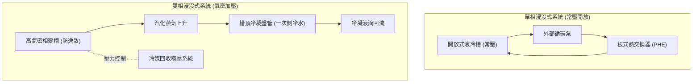

### A. 單相系統：開放/半封閉式結構
*   **結構設計**：通常為常壓設計的頂開式槽體（類似魚缸）。液位保持恆定，頂部蓋板僅作防塵與防微量揮發用，不需要絕對氣密。
*   **運維與 MTTR**：**極為簡單**。當伺服器故障時，直接打開蓋板，將伺服器緩慢吊裝拉起，靜置滴乾介電液後即可進行熱插拔維護。MTTR 通常 <30 分鐘。

### B. 雙相系統：嚴格氣密與壓力容器
*   **結構設計**：必須是**絕對氣密（Hermetic Sealing）**的密封壓力容器。因為冷媒沸騰會產生蒸氣壓，一旦氣密失效，高昂的氟化液將迅速蒸發逸散（每天損失 1% 即代表數萬美元的 OPEX 災難）。
*   **運維與 MTTR**：**極度複雜**。維護伺服器前，必須先停止白區白區發熱，等待冷媒蒸氣完全冷凝回流，或利用**冷媒回收系統**將槽內氣體抽空並冷凝儲存，才能打開艙門。維護時需穿戴專業防護配備，MTTR 常大於 2 小時。

---

## 4. CAPEX 與 OPEX 成本結構回收期分析

浸沒式系統的經濟效益評估必須考慮壽命週期總成本（LCC）。

### A. 初始投資 (CAPEX)
*   **單相**：中等偏高。液冷槽體與外部 PHE 成本適中，合成烴介電液價格合理（約佔槽體系統成本的 20~30%）。
*   **雙相**：**極度高昂**。需要氣密槽體、高精密冷凝管路、壓力防爆安全閥與昂貴的**冷媒回收泵站**。最關鍵的是**氟化液成本極高**（初裝液體成本可能佔整個系統 CAPEX 的 50% 以上）。

### B. 營運成本 (OPEX) 與能效
*   **單相**：水泵循環能耗低，PUE 表現穩定在 1.02 ~ 1.04。由於無揮發損耗，液體補給成本極低。
*   **雙相**：理論上 PUE 可以達到物理極限的 1.01 ~ 1.02（完全無泵送能耗，靠重力回流），但 **氟化液蒸發補償成本**（每天只要有微量 0.05% 的逸散率，累積一年即是龐大負擔）通常會抵消省下的電費。

---

## 5. 技術規格與工程選型矩陣

| 對比項目 | 單相浸沒式液冷 (Single-Phase) | 雙相浸沒式液冷 (Two-Phase) |
| :--- | :---: | :---: |
| **極限排熱容量 (per Rack)** | **100 kW ~ 150 kW** | **200 kW ~ 300+ kW** (物理散熱上限最高) |
| **設計 PUE 表現** | 1.02 ~ 1.04 | 1.01 ~ 1.02 |
| **冷卻介質成本** | 較低 (合成烴/植物基油) | 極高 (全氟化液) |
| **運維維護難度 (MTTR)** | 簡單 (熱插拔，靜置滴乾) | 極複雜 (需氣密回收、抽真空) |
| **環保法規風險 (PFAS / GWP)**| **無風險** | **極高風險** (歐美逐步禁用 PFAS，面臨停產) |
| **介質揮發損失** | 幾乎為 0 | 每年 1% ~ 5% 揮發耗損風險 (依氣密性而定) |
| **伺服器硬體修改** | 拆卸風扇，安裝加長拉環即可。 | 需拔除風扇，且需進行**沸騰增強塗層**以防晶片熱點。 |
| **化學相容性挑戰** | 需注意電纜護套、密封膠的溶脹與 TIM 材料溶解。 | 氟化液溶解性極強，會迅速洗掉硬體上的標籤與不相容油脂。 |
| **鴻海/AIDC 戰術定位** | **目前商用與試點的主力首選**，技術成熟度（TRL 8）高。 | **技術儲備與前瞻研究**，在法規與介質問題未解決前，暫不推薦大規模發包。 |

---

## 6. Cross-References

*   系統基礎模組：[[Module 04 - 液冷系統深度解析]]、[[Module 08 - 廠商生態系統]]
*   上游冷源：[[設備與廠商選型對照矩陣]]
*   代表性廠商實體：[[Foxconn]] (自研相變研究)、[[Rittal]] (液冷槽體結構)、[[CoolIT]] (DLC 對比)


## ================================================================================
## DOCUMENT: C:\Users\user\Obsidian\Engineering-Wiki\wiki\comparisons\開放式冷卻塔 vs 閉式冷卻塔.md
## ================================================================================
---
tags: [comparison, cooling-tower, open-loop, closed-loop, condenser-water, facility-loop]
sources: ["[[AIDC HVAC 學習基地 - Notion]]", "[[Module 05 - 冷源與冷凍機房]]"]
created: 2026-05-20
updated: 2026-05-20
---

# 技術對比：開放式冷卻塔 vs 閉式冷卻塔

在 AIDC HVAC 系統中，**冷卻水塔（Cooling Tower）** 是將整個資料中心（包括 IT 設備與動力系統）產生的熱量，最終排散至大氣環境中的最末端散熱裝置。依據冷卻水是否與外部大氣直接接觸，冷卻水塔分為 **開式冷卻塔（Open-Loop Cooling Tower）** 與 **閉式冷卻塔（Closed-Loop Cooling Tower，又稱密閉式冷卻塔或蒸發式冷凝器）**。

這兩種水塔的技術選型直接決定了一次側（Facility Loop）的水質、冷凍機房的能效以及冬季自然冷卻（Free Cooling）的運轉時數。

---

## 1. 運作原理與熱傳遞路徑

| 項目 | 開式冷卻塔 (Open-Loop) | 閉式冷卻塔 (Closed-Loop) |
| :--- | :---: | :---: |
| **結構示意圖** | 冷卻水 $\to$ 噴淋 $\to$ 大氣直接接觸（填料） $\to$ 水槽回水 | 工藝水（密閉銅管內流動） $\leftrightarrow$ 管外噴淋水 $\leftrightarrow$ 大氣接觸 |
| **物理機制** | **直接蒸發散熱 + 對流換熱**。冷卻水直接噴淋在填料上，與流動空氣接觸，利用一部分水的汽化潛熱帶走餘熱。 | **隔牆式熱交換 + 蒸發熱傳**。工藝水（密閉水迴路）在不鏽鋼或銅盤管內流動，噴淋水在管外形成水膜，利用噴淋水蒸發吸收管內水熱量。 |
| **熱傳遞路徑** | 冷凍機冷凝器 $\to$ 填料蒸發 $\to$ 大氣。 | 冷凍機冷凝器 $\to$ 盤管壁 $\to$ 噴淋水膜 $\to$ 大氣（多了管壁熱阻）。 |

---

## 2. 水質控制與結垢（一次側的防禦防線）

在 AIDC 運維實務中，**水質（Water Quality）** 是維持運轉效率的最關鍵防線。

### A. 開式冷卻塔：完全開放的空氣過濾器
*   **水質挑戰**：冷卻水直接接觸大氣，會將空氣中的沙塵、孢子、腐蝕性氣體（如二氧化硫）洗入水中。冷卻水因蒸發而濃縮，導致鈣、鎂離子濃度升高，在冷凍機冷凝器銅管內壁迅速**結垢（Fouling）**。
*   **生物風險**：溫暖的開式水路是**軍團菌（Legionella）**滋生的溫床，需配置極為嚴格的加藥系統（阻垢劑、殺菌滅藻劑）與頻繁的排污（Blowdown）及補水。
*   **熱阻衰減**：冷凝器銅管內只要結垢 0.1 mm，換熱效率便會下降 10% 以上，導致 Chiller 的 COP 急劇惡化。

### B. 閉式冷卻塔：一次側的物理物理隔離
*   **水質保障**：管內運行的工藝水（一次側冷卻水）完全處於封閉狀態，不與空氣接觸。可以使用脫鹽水或乙二醇溶液，**水質維持 100% 純淨**，冷凝器或 CDU 換熱器內壁永遠不結垢、不腐蝕。
*   **運維簡化**：僅需對外部的噴淋水（量小）進行常規加藥維護，盤管內工藝水迴路幾乎不需要任何化學處理，大幅降低水質運維成本與意外停機風險。

---

## 3. 夏季逼近溫差（Approach）與 Free Cooling 時數

冷卻塔的冷卻極限是由環境 **濕球溫度（Wet-Bulb Temperature, $T_{wb}$）** 決定的。

$$T_{\text{water, out}} = T_{wb} + \Delta T_{\text{approach}}$$

### A. 開式冷卻塔的能效優勢
*   **極低的 Approach**：由於是直接蒸發換熱，開式塔換熱效率極高，逼近溫差 $\Delta T_{\text{approach}}$ 可低至 **2°C ~ 3°C**。
*   **實務工況**：在台北夏季設計濕球溫度 28°C 下，開式塔能穩定提供 **30°C ~ 31°C** 的冷卻供水，確保冷凍機冷凝器運作在極佳的排熱能效下。

### B. 閉式冷卻塔的物理熱阻阻礙
*   **較高的 Approach**：由於多了一道盤管管壁熱阻與噴淋水二次換熱，閉式塔的逼近溫差較大，通常為 **4°C ~ 6°C**。
*   **Free Cooling 的致命傷**：
    *   在冬季自然冷卻（Free Cooling）模式下，當室外濕球溫度降至約 10°C 時，開式塔能直接提供 13°C 的冷卻水進行自然冷卻；而閉式塔因 Approach 較大，室外濕球溫度必須降到 7°C ~ 8°C 以下才能實現同等冷卻。
    *   這導致閉式塔在溫帶或亞熱帶地區（如台灣）的 **Free Cooling 年可用時數會比開式塔縮短 30% 以上**，影響整年的 PUE 表現。

---

## 4. 防凍、空間佔用與運行能耗對比

### A. 冬季防凍措施
*   **開式塔**：在寒冷地區，冬季停機時水槽極易結冰，必須配置高功率的水槽電伴熱帶（Electric Heater），或者在停機時將水排空至白區防凍水箱。
*   **閉式塔**：由於管路封閉，可在工藝水中直接充填 **乙二醇防凍液（Glycol）**。即便在 -20°C 的北方停機，也完全沒有凍裂盤管的風險。

### B. 運行能耗與佔地
*   **開式塔**：結構簡單，風阻小，風機馬達功耗較低。水泵僅需將水送至塔頂重力分配閥，揚程要求低。佔地面積小。
*   **閉式塔**：由於內部排滿了熱交換盤管，空氣阻力極大，需要更大馬力的風機。此外，系統多了一組**噴淋水泵（Spray Pump）**，耗電量較大。盤管重量沉重，結構鋼支架與佔地面積通常是開式塔的 1.5 倍以上。

---

## 5. 工程選型對比矩陣

| 選型指標 | 開式冷卻塔 (Open-Loop) | 閉式冷卻塔 (Closed-Loop) |
| :--- | :---: | :---: |
| **主要傳熱界面** | 直接接觸填料 (PVC Fill) | 紫銅管或不鏽鋼熱交換盤管 |
| **逼近溫差 (Approach Temp)** | **極優 (2.0°C ~ 3.0°C)** | 較差 (4.5°C ~ 6.0°C) |
| **管路內部水質結垢風險** | 極高 (吸入風塵，需頻繁排污加藥) | **零風險 (100% 封閉純淨運行)** |
| **夏季冷凍機 COP 表現** | 優 (冷卻水溫低，Chiller 排熱效率高) | 中 (水溫高出 1~2°C，Chiller 耗電略升) |
| **Free Cooling 年可用時數** | **最大化** | 較短 (受限於逼近溫差) |
| **防凍能力** | 需水槽電加熱防凍，有凍裂風險。 | 優 (可直接加乙二醇，防凍安全度高) |
| **系統總耗電 (風機+水泵)** | 較低 | 較高 (需額外運行噴淋泵，風阻高) |
| **佔地面積與濕重** | 小、輕 | 大、極重 (盤管與噴淋水重) |
| **CAPEX 初始設備投資** | 便宜 (約為閉式塔的 40% ~ 50%) | 昂貴 (換熱盤管金屬成本高) |
| **維護保養難度** | 高 (需定期清洗填料與冷凝器銅管) | 低 (僅需保養外盤管與噴淋噴頭) |
| **鴻海/AIDC 戰術定位** | **超大型資料中心/冷源機房的主力首選**（結合精密化學自動水處理），以榨取最高的 Free Cooling 時數。 | **高防護、中小型邊緣機房、寒冷高溫差地區**，或作為不設 Chiller、直接一/二次側 PHE 熱交換液冷系統的最前線防護。 |

---

## 6. Cross-References

*   系統基礎模組：[[Module 05 - 冷源與冷凍機房]]
*   末端冷源設備：[[冷卻水塔]]、[[Chiller Plant]]、[[Free Cooling]]
*   容易混淆的設備辨析（閉式冷卻塔 vs 乾冷器，外觀與結構差異）：[[Dry Cooler vs. 密閉式冷卻水塔]] 第 0 節
*   代表性廠商實體：[[Trane]] (Chiller 聯動)、[[Daikin]] (能效搭配)、[[Schneider]] (電力防凍配套)


## ================================================================================
## DOCUMENT: C:\Users\user\Obsidian\Engineering-Wiki\wiki\comparisons\微通道冷板 vs 鰭片式冷板.md
## ================================================================================
---
tags: [comparison, liquid-cooling, cold-plate, micro-channel, macro-fin, heat-transfer, gpu-cooling]
sources: ["[[AIDC HVAC 學習基地 - Notion]]", "[[Module 04 - 液冷系統深度解析]]"]
created: 2026-05-20
updated: 2026-05-20
---

# 技術對比：微通道冷板 vs 鰭片式冷板

在 AIDC 直接液冷（DLC, Direct Liquid Cooling）系統中，**冷板（Cold Plate）** 是安裝在 GPU 與 CPU 表面、直接將晶片熱量傳遞給冷卻液的關鍵二次側末端換熱元件。高功率 AI 晶片（如 NVIDIA H100 TDP 700W, Blackwell GB200 TDP 1000W+）的熱流密度（Heat Flux）極高，對冷板內部的流道結構設計提出了極致的挑戰。

依據冷板內部液冷換熱流道的物理結構，冷板可分為 **微通道冷板（Micro-Channel Cold Plate）** 與 **鰭片式冷板（Fin-Type / Macro-Fin Cold Plate）**。

---

## 1. 物理構造與流體熱力學原理

| 項目 | 微通道冷板 (Micro-Channel) | 鰭片式冷板 (Macro-Fin) |
| :--- | :--- | :--- |
| **流道尺度** | **微米級（Micro-scale）**。流道寬度通常在 $50 \mu\text{m} \sim 200 \mu\text{m}$ 之間，深度在 $1 \text{ mm} \sim 3 \text{ mm}$。 | **毫米級（Milli-scale）**。流道寬度通常為 $1 \text{ mm} \sim 3 \text{ mm}$，呈摺疊鰭片或針狀柱陣列。 |
| **熱傳對流物理** | 流道尺度極小，邊界層厚度極薄。在極小的水流下即可實現高剪切力，對流換熱係數 $h$ 極高。 | 依賴傳統流體亂流（Turbulent Flow）熱傳，邊界層較厚。 |
| **熱傳公式與參數** | 換熱面積與體積比（Surface-to-Volume Ratio）極大。 | 換熱面積比中等。 |

---

## 2. 換熱效能與熱阻抗（GPU 散熱的黃金指標）

對於 TDP 超過 1000W 的高效能晶片，冷板設計的終極目標是將 **晶片接面到冷卻液的熱阻抗（Thermal Resistance, $R_{jc}$）** 壓制到極限。

$$Q = \frac{T_{\text{junction}} - T_{\text{liquid}}}{R_{jc}}$$

### A. 微通道冷板：1000W+ GPU 的唯一救星
*   **極低熱阻抗**：其熱阻抗通常能壓制在 **$\le 0.03 \text{ K/W}$** 甚至更低。
*   **物理優勢**：微通道流道直接對準晶片核心發熱區（Die Area）。由於冷卻液距離晶片僅有微米級的不鏽鋼或紫銅壁阻隔，能迅速導出瞬時高熱阻，使 GPU 接面溫度穩定控制在原廠規定的 75°C ~ 85°C 安全線內，大幅提升算力穩定性。

### B. 鰭片式冷板：傳統 CPU 與中低功率器件的選擇
*   **熱阻抗表現**：熱阻抗通常在 **$0.08 \sim 0.15 \text{ K/W}$**。
*   **散熱極限**：適合單顆 TDP < 350W 的傳統伺服器 CPU。一旦面對熱流密度極大、發熱源極度集中的高階 GPU，鰭片式冷板會因熱傳導速率跟不上而產生局部熱點（Hot Spots），導致晶片因過熱降頻（Thermal Throttling）。

---

## 3. 水阻與流體壓降（CDU 水泵的硬考驗）

熱力學的定律是公平的：**極致的散熱效能，是以極高的流體壓力為代價換來的。**

### A. 微通道的高壓降阻礙
*   **流動阻力公式**：流體阻力（壓降 $\Delta P$）與流道水力直徑的四次方成反比。微通道的尺度極小，這導致冷卻液在流經微通道區時，內部**摩擦壓降極大**。
*   **工程挑戰**：單顆微通道冷板的壓降常高達 **$0.3 \sim 0.6 \text{ bar}$**。一個機櫃（120 kW）內幾十顆 GPU 冷板並聯與串聯後，二次側的總流阻極高。這要求 CDU 的二次側變頻水泵必須具備極高的揚程（如 3.0 ~ 4.0 bar 以上），這會大幅拉升 CDU 水泵的變頻能耗，在 TBE 技術評標中是核心計算點。

### B. 鰭片式冷板的超低流阻優勢
*   **流降阻力**：由於流道寬度是微米級的十幾倍，冷卻液流動順暢，單板壓降通常 **$<0.1 \text{ bar}$**。
*   **水泵節能**：整個液冷迴路阻力低，CDU 水泵僅需低功率運行即可滿足流量需求，二次側能耗表現極佳。

---

## 4. 製造工藝、防堵塞要求與成本 (CAPEX)

### A. 製造工藝複雜度
*   **微通道**：無法使用傳統沖壓或鑄造加工。必須採用 **精密微細切削（Skiving）** 或高精密 **真空釺焊/擴散焊接（Diffusion Bonding）** 工藝，將極薄的帶有微通道的銅片與冷板底座融為一體。工藝極其嚴苛，報價極其昂貴。
*   **鰭片式**：製造簡單。可採用傳統 CNC 銑削、金屬沖壓鰭片後進行低溫焊接，成本低廉，易於大規模量產。

### B. 二次側水質防堵塞要求
*   **微通道的致命弱點：極易堵塞**。流道僅有幾十微米，水中若有微小的碎屑、膠體、焊渣或離子析出，會瞬間將流道完全堵死，導致 GPU 燒毀。因此，**微通道冷板必須強制配合二次側 $<50 \mu\text{m}$ 甚至 $<5\mu\text{m}$ 的精密過濾器**，且水質電導率需嚴格維持在 $<10 \mu\text{s/cm}$。
*   **鰭片式**：容泥量高，對水路中的微小顆粒物不敏感，運維難度低。

---

## 5. 工程選型對比矩陣

| 評估項目 | 微通道冷板 (Micro-Channel) | 鰭片式冷板 (Macro-Fin) |
| :--- | :---: | :---: |
| **內部流道尺度** | 微米級 ($50 \sim 200 \mu\text{m}$) | 毫米級 ($1.0 \sim 3.0 \text{ mm}$) |
| **換熱對流表面積比** | **極高** (換熱能力極致) | 中等 |
| **接面熱阻抗 ($R_{jc}$)** | **極低 ($\le 0.03 \text{ K/W}$)** | 較高 ($0.08 \sim 0.15 \text{ K/W}$) |
| **適用晶片功率 (TDP)** | **高達 700W ~ 1500W+** (AI GPU 唯一解) | 適合 $\le 350\text{W}$ (常規 CPU) |
| **單板水流壓降 ($\Delta P$)** | **極大 ($0.3 \sim 0.6 \text{ bar}$)** | 極低 ($\le 0.1 \text{ bar}$) |
| **CDU 水泵揚程需求** | 極高 (需要高規格高功率水泵) | 低 |
| **水質過濾防護要求** | **嚴苛 ($\le 5 \mu\text{m}$ 過濾 + DI 去離子)** | 一般 ($\le 50 \mu\text{m}$ 過濾) |
| **製造工藝** | 精密微切/擴散焊 (高難度) | 傳統 CNC 銑削/沖壓釺焊 |
| **設備初始成本 (CAPEX)** | 昂貴 (約為鰭片式冷板的 3~5 倍) | 便宜 |
| **鴻海/AIDC 戰術定位** | **高功率 AI GPU（GB200/H100）的標配首選**。<br>鴻海研發冷板時，內部微流道的水阻與換熱平衡是核心 TBE 優化指標。 | **普通 CPU 伺服器、邊緣運算機房**，或對 PUE 要求一般、追求極低 CAPEX 的高密度過渡專案。 |

---

## 6. Cross-References

*   系統硬體：[[Module 04 - 液冷系統深度解析]]、[[Cold Plate]]、[[TIM 導熱介面材料]]
*   泵送控制：[[液冷系統 - CDU 架構]] (壓差/流量控制)
*   自研生態與廠商：[[Foxconn]] (自研冷板專利)、[[CoolIT]] (專利微通道)、[[Delta]] (台達冷板整合)


## ================================================================================
## DOCUMENT: C:\Users\user\Obsidian\Engineering-Wiki\wiki\comparisons\離心式 vs 螺桿式冷凍機.md
## ================================================================================
---
tags: [comparison, chiller, centrifugal-chiller, screw-chiller, chiller-plant, cooling-capacity]
sources: ["[[AIDC HVAC 學習基地 - Notion]]", "[[Module 05 - 冷源與冷凍機房]]"]
created: 2026-05-20
updated: 2026-05-20
---

# 技術對比：離心式 vs 螺桿式冷凍機

在超大型 AIDC 一次側冷源設計中，**冷凍水系統機房（Chiller Plant）** 是提供高功率液冷（CDU 一次側）與空氣側精密空調（CRAH）所需冷凍水的冷源核心。在白區高熱負載的連續運行下，冷凍主機（Chiller）的能耗通常佔資料中心冷卻總耗電的 40% 以上。

冷凍主機的核心是壓縮機。在工業級大容量應用中，最主流的兩種壓縮機技術為 **離心式壓縮機（Centrifugal Chiller）** 與 **螺桿式壓縮機（Screw Chiller）**。

---

## 1. 物理壓縮機制：動能轉換 vs 容積壓縮

| 項目 | 離心式冷凍機 (Centrifugal) | 螺桿式冷凍機 (Screw) |
| :--- | :--- | :--- |
| **運作原理** | **速度型 / 動能型壓縮**。高速旋轉的葉輪（Impeller）賦予氣態冷媒高動能，透過擴壓器（Diffuser）減速，將動能轉化為壓力能。 | **容積型 / 擠壓型壓縮**。氣態冷媒被吸入陰陽雙轉子（Screws）齧合的齒槽間隙，隨著轉子旋轉齒槽體積縮小，冷媒被物理擠壓升壓。 |
| **結構特點** | 轉速極高（數千至數萬 RPM），運動零組件少，無機械磨損。 | 轉速較低（通常為 3000 RPM），轉子齧合面需大量高粘度**潤滑油（Lube Oil）**密封與減震。 |
| **排氣閥控制** | 使用導葉閥（Inlet Guide Vanes, IGV）或 VFD 變頻調節流量。 | 使用滑閥（Slide Valve）調節齒槽有效體積，實現無段容量調節（25%~100%）。 |

---

## 2. 容量規模與分期建設策略 (Scalability)

AIDC 的建設規模通常非常龐大，但也面臨客戶算力部署的不確定性，因此分期發包建設（Phased Expansion）是常態。

### A. 離心式冷凍機：超大型機房的怪獸
*   **製冷容量**：單機容量極大，通常從 **300 RT 到高達 3000+ RT**（冷噸）。
*   **優勢**：在超大型 Hyperscale 資料中心（總熱負載 >50 MW）中，採用大容量離心機可以極大地減少主機台數，簡化機房閥門配管與控制邏輯，降低單位製冷噸數的初始設備成本（CAPEX/RT 最低）。
*   **缺點**：體積巨大，對運輸與白區機房承重要求極高。

### B. 螺桿式冷凍機：分期與模組化建設的利器
*   **製冷容量**：單機容量中等，通常在 **80 RT 到 800 RT** 之間。
*   **優勢**：由於單機容量適中，非常利於資料中心配合算力櫃上架率進行**分期擴建、併網運作**。例如，第一期部署 3 台 400 RT 螺桿機，隨後依負載增加再並接 3 台，能有效避免初期「大馬拉小車」的低能效運行。

---

## 3. 部分負載能效 (IPLV/NPLV) 與喘振 (Surge) 風險

資料中心很少在 100% 滿載下運行，一年中大部分時間處於部分負載（Part-Load，25%~75%），因此 **IPLV（綜合部分負載效能）** 或 **NPLV（非標準工況部分負載值）** 比滿載 COP 更具決定性。

### A. 離心式冷凍機：變頻節能極致，但需防範「喘振」
*   **能效表現**：在 70%~100% 負載區間，配合變頻器（VFD），離心機的能效是所有冷凍主機之冠，滿載 COP 可達 **6.5 ~ 7.2**，變頻部分負載 COP 甚至能突破 **9.0**。
*   **致命弱點：喘振（Surge）**。
    *   **物理現象**：當冷媒流量過低（負載 < 20%~30%）或冷卻水溫過高（冷凝壓力過高）時，排氣管內的氣流會發生**逆流**，導致壓縮機產生強烈的氣流衝擊、震動與刺耳噪音，甚至損毀葉輪。
    *   **防護機制**：必須配置熱氣旁通閥（Hot-Gas Bypass），在低負載時將排氣旁通回吸氣口，但這會造成嚴重的能量浪費（能效急劇惡化）。

### B. 螺桿式冷凍機：低載運行的安全防線
*   **能效表現**：滿載能效（COP 5.2 ~ 6.0）略低於離心機，但其滑閥無段調節能確保在 25%~100% 負載下皆有平穩且優良的能效表現。
*   **物理優勢：絕無喘振**。螺桿機是容積式壓縮，只要轉子旋轉，氣體就必定會被推出，**在物理上完全不存在喘振風險**。即使在 10% 的極低負載下，主機仍能安全、平穩地持續運轉，非常適合作為 AIDC 初期運行的冷源保障。

---

## 4. 潤滑油管理與磁浮無油壓縮機的劃時代變革

傳統壓縮機的蒸發器和冷凝器銅管表面，都會因為循環冷媒中夾帶的潤滑油而形成一層薄薄的油膜，這層油膜會增加熱阻，導致換熱能效下降約 8% ~ 15%。

### A. 磁浮離心式冷凍機 (Magnetic Bearing Chiller)
為了消除油膜熱阻與喘振問題，業界推出了革命性的 **磁浮無油離心機**（如採用 Daikin Turbocor 磁浮壓縮機）：
*   **無油運行**：主軸採用主動式磁浮軸承（Magnetic Bearings）懸浮旋轉，**完全不需潤滑油**。換熱管壁永遠 100% 純淨，能效長期不衰減。
*   **啟動電流極低**：一般主機啟動電流高達數百安培，會對柴油發電機網路造成巨大衝擊；磁浮主機啟動電流僅 **2 安培**，極利於資料中心斷電後發電機快速復電。
*   **不喘振**：內建數位磁浮控制器，能依據升壓比動態調整轉速，極大化拓寬了無喘振運行區間。

---

## 5. 工程選型對比矩陣

| 評估維度 | 離心式冷凍機 (Centrifugal) | 螺桿式冷凍機 (Screw) |
| :--- | :---: | :---: |
| **壓縮機原理** | 動能/速度型壓縮 (葉輪) | 容積擠壓型壓縮 (雙轉子) |
| **製冷容量範圍 (單機)** | **極大 (300 ~ 3,000+ RT)** | 中等 (80 ~ 800 RT) |
| **滿載能效 (COP)** | **極優 (6.2 ~ 7.2)** | 中上 (5.2 ~ 6.0) |
| **變頻部分負載能效 (IPLV)**| **卓越 (磁浮無油主機可達 9.0~11.0)** | 優秀 (6.5 ~ 7.5) |
| **喘振風險** | **有風險** (低載時需防喘振旁通) | **零風險** (物理特性決定，極低載安全) |
| **機械磨損與壽命** | 幾乎無接觸磨損，壽命長達 25~30 年 | 有轉子磨損，需定期更換潤滑油與濾芯 |
| **啟動電流衝擊** | 大 (常規電機大)；**磁浮主機極小 (2A)** | 中等 |
| **佔地與承重比 (CAPEX/RT)** | 噸數大時，佔地面積與 CAPEX 效率最高 | 模組化並聯時佔地較多，管路閥件多 |
| **設備初始採購成本** | 昂貴 (但大 RT 單位性價比高) | 中等 (單機價格低) |
| **鴻海/AIDC 戰術定位** | **超大型集中式冷源機房的主力首選**。<br>強力推薦發包 **磁浮無油變頻離心機**，以追求極限 PUE，並將啟動電流降至最低。 | **分期分批建置機房、中小型邊緣機房**，或作為超大型機房在低載/冬季 Free Cooling 剛啟動時的**低載備載主機**。 |

---

## 6. Cross-References

*   一次側系統：[[Module 05 - 冷源與冷凍機房]]、[[Chiller Plant]]
*   相關計算與標準：[[LMTD 計算]]、[[PUE 計算]]
*   龍頭廠商實體：[[Daikin]] (磁浮核心 Turbocor)、[[Trane]] (大容量離心機霸主)、[[Schneider]] (電力整合)


## ================================================================================
## DOCUMENT: C:\Users\user\Obsidian\Engineering-Wiki\wiki\concepts\01_modules\Module 01 - Data Center 基礎概念.md
## ================================================================================
---
tags: [concept, data-center, AIDC, foundation]
sources: ["[[AIDC HVAC 學習基地 - Notion]]"]
created: 2026-05-20
updated: 2026-05-20
module: "01"
quiz_score: 90
---

# Module 01 - Data Center 基礎概念

> **學習目標：** 搞清楚 Data Center 是什麼、有哪些類型、空間怎麼分、AI DC 跟傳統 DC 差在哪裡。這是整個學習體系的地基，後面所有設備與系統都建立在這個框架上。

## 什麼是 Data Center？

DC 是一棟或一群專門建築，集中放置大量 IT 設備（伺服器、儲存裝置、網路設備），用來執行運算、儲存資料、傳輸網路服務。可以理解成：**一個幫「資料」居住、工作的超大型工廠。**

需要四大系統：
- **電力系統** — 穩定供電（IT設備 + 空調）
- **冷卻系統（HVAC）** — 帶走所有電子設備的熱量
- **網路系統** — 高速資料進出
- **安全系統** — 門禁、監控、消防

## Tier 分級（Uptime Institute 標準）

| Tier | 年可用率 | 停機容忍 | 備援架構 | 典型應用 |
|------|---------|---------|---------|---------|
| Tier I | 99.671% | ~28.8 hr/yr | 無備援 | 小型企業機房 |
| Tier II | 99.741% | ~22 hr/yr | 部分備援 | 一般企業 DC |
| Tier III | 99.982% | ~1.6 hr/yr | 可同時維護（N+1）| 大型商業DC、鴻海廠內DC |
| Tier IV | 99.995% | ~0.4 hr/yr | 完全容錯（2N）| 金融、國防、超大型雲端 |

> ⚠️ **重要：Tier 分級 ≠ 冷卻方式。** Tier 只看備援架構與可靠度，與空冷/液冷完全無關。
> 鴻海 AIDC 通常 Tier III 以上，部分關鍵設施達 Tier IV。

### N+1 vs 2N 備援差異

| 架構 | 邏輯 | 對應 Tier |
|------|------|---------|
| **N+1** | N 台滿足需求，多 1 台備援，任一故障不影響服務 | Tier II~III |
| **2N** | 完全兩套獨立系統，各自能承擔 100% 負載 | Tier III~IV |

## 空間架構

| 空間 | 英文 | 放什麼 | HVAC 關連度 |
|------|------|--------|------------|
| **白區** | White Space | 伺服器機架（機房本體）| 最高，18~27°C、濕度 40~60% RH |
| **灰區** | Gray Space | UPS、PDU、配電盤、電池 | 中，有散熱需求但不嚴格 |
| **機電區** | Mechanical Space | Chiller、冷卻塔、空調主機、水泵 | HVAC 後台主機房 |

## 機架功率密度演進

| 時代 | 每機架功耗 | 冷卻方式 |
|------|-----------|---------|
| 傳統伺服器（2010~2020）| 5~10 kW/rack | 送風式空調即可 |
| 高效能運算（HPC）| 20~40 kW/rack | 需強化空調或液冷 |
| AI 伺服器（GPU Cluster，現在）| **50~100+ kW/rack** | **必須液冷** |
| 下世代 AI（2025+）| **120~200 kW/rack** | 浸沒液冷或直接液冷 |

> AI 機架的功率是傳統機架的 **10~20 倍**，這是液冷崛起的根本原因。

## PUE（Power Usage Effectiveness）

$$PUE = \frac{\text{資料中心總用電}}{\text{IT設備用電}}$$

| PUE 值 | 意義 |
|--------|------|
| 1.0 | 理想值（無損耗）|
| 1.2~1.3 | 鴻海 AIDC 目標 |
| 1.5 | 每消耗 1.5W，IT 只用 1W |
| 2.0 | 舊式低效機房 |

**冷卻耗電計算：**
- 冷卻耗電 = IT Load × **(PUE - 1)**
- PUE 每降 0.1 → 約省 NT$1~3 億電費/年
- PUE 1.25、IT 負載 100 MW → 冷卻耗電 = 25 MW（≈ 8,000 戶台灣家庭用電）

## 為什麼 AI DC 必須液冷？（工程推導）

帶走 120 kW 熱量，ΔT = 10°C，公式 Q = ṁ × Cp × ΔT：

| 冷媒 | Cp | 密度 | 需要流量 |
|------|-----|------|---------|
| 空氣 | 1.006 kJ/kg·K | 1.2 kg/m³ | **36,000 m³/hr** |
| 水 | 4.186 kJ/kg·K | 1,000 kg/m³ | **10.3 m³/hr** |
| **差距** | | | **3,500 倍** |

> **標準回答：** 水的體積熱容量是空氣的 3,500 倍。GB200 單機架 120 kW，空冷風量在機房物理空間內根本無法實現，液冷是唯一解。

## 主要 AI 伺服器型號

| 產品 | GPU | 單機架功耗 | 冷卻需求 |
|------|-----|-----------|---------|
| NVIDIA HGX H100 | H100 SXM | ~10 kW/server | 可空冷，液冷更好 |
| NVIDIA HGX H200 | H200 | ~12 kW/server | 建議液冷 |
| **NVIDIA GB200 NVL72** | B200 | **~120 kW/rack** | **必須直接液冷** |
| NVIDIA GB300 | B300 | ~130+ kW/rack | 直接液冷 |

## 重點整理

1. DC = 電力 + 冷卻 + 網路 + 安全，HVAC 是核心基礎設施
2. Tier III/IV 是鴻海 AIDC 標準，代表高備援、高可靠性
3. 空間分白區（機房）/ 灰區（電力）/ 機電區（空調主機）
4. AI 機架功耗是傳統的 10~20 倍，這是液冷崛起的根本原因
5. PUE 是衡量 DC 效率的核心指標，HVAC 工程師要讓它越低越好
6. GB200 NVL72 = 鴻海現在最重要的目標機型，功耗 ~120 kW/rack

## Cross-References

- 相關：[[Free Cooling]]、[[Chiller Plant]]、[[PUE 計算]]
- 相關：[[液冷系統 - CDU 架構]]、[[CDU 架構與選型]]、[[GB200 NVL72 冷卻需求]]、[[空冷 vs 液冷]]
- 下一模組：[[Module 02 - AIDC 熱負荷與冷卻需求]]
- 參考：[[ASHRAE TC 9.9 Data Center 溫濕度標準]]

## Sources

- Notion「AIDC HVAC 學習基地」Module 01 — 含自我測驗記錄（90/100，2026-04-22 完成）


## ================================================================================
## DOCUMENT: C:\Users\user\Obsidian\Engineering-Wiki\wiki\concepts\01_modules\Module 02 - AIDC 熱負荷與冷卻需求.md
## ================================================================================
---
tags: [concept, thermal, calculation, AIDC]
sources: ["[[AIDC HVAC 學習基地 - Notion]]"]
created: 2026-05-20
updated: 2026-05-20
module: "02"
quiz_score: 93
---

# Module 02 - AIDC 熱負荷與冷卻需求

> **學習目標：** 理解 AI Data Center 的熱負荷從哪裡來、有多大、怎麼算。掌握 PUE、機架功率密度等核心指標，能從 IT 功耗推導出冷卻系統所需處理能力。這是所有設備選型的起點。

## 熱的本質：電功率 → 熱量

電能輸入 IT 設備後，幾乎全部轉換為熱能。IT 設備消耗的電功率（kW）≈ 散出的熱量（kW）。

**必背換算：**
- 1 kW = 3,412 BTU/hr
- 1 RT（冷凍噸）= 3.517 kW = 12,000 BTU/hr
- 熱量公式：**Q = ṁ × Cp × ΔT**
- 1 MW AI GPU 機群 ≈ 284 RT，相當於約 280 戶家庭冷氣用量

## IT 設備功耗參考

| 設備 | 功耗 |
|------|------|
| NVIDIA H100 SXM5（整機）| ~10~12 kW |
| NVIDIA H200 SXM（整機）| ~10~12 kW |
| **NVIDIA GB200 NVL72（整架）**| **120 kW** |
| AMD MI300X（整機）| ~9~11 kW |
| 400GbE ToR Switch | ~1~2 kW |
| NVIDIA InfiniBand NDR400 Switch | 最高 5.4 kW |

## 機架功率密度趨勢

| 時代 | 密度 | 冷卻方式 |
|------|------|---------|
| 傳統 DC | 3~8 kW/rack | 傳統空冷 |
| H100 時代 | 20~40 kW/rack | 強化空冷或輔助液冷 |
| GB200 時代 | 100~120 kW/rack | **必須全液冷** |
| 下一代預測 | 200+ kW/rack | 更高流量液冷 |

## 冷卻需求計算鏈（必背）

```
台數 × 功耗 = IT Load
↓ × 設計裕度（1.2）
設計冷卻容量（kW）
↓ ÷ 3.517
設計 RT 數
↓ ÷ 單台容量，無條件進位，+ N+1
Chiller 台數
↓ ÷ COP
Chiller 耗電
↓ IT Load × PUE
設施總用電
↓
水量（L/s）、風量（m³/s）、UPS kVA
```

**設計裕度：1.15~1.25（AIDC 標準）**，原因：
- GPU 實際功耗可超過 TDP 標示值 105~110%
- 未來可能增加機台
- 系統老化損耗

## 冷凍水流量計算（重要單位觀念）

$$\dot{m} = \frac{Q}{Cp \times \Delta T}$$

> ⚠️ **Q 用 kW 計算，結果直接是 kg/s，不需除以 3,600！**
> kW = kJ/s，所以 kJ/s ÷ (kJ/kg·K × K) = kg/s

**範例（GB200 × 300 台 Boss 關）：**

| 項目 | 計算 | 答案 |
|------|------|------|
| IT 負載 | 300 × 120 kW | 36,000 kW |
| 設計容量 | 36,000 × 1.2 | 43,200 kW = 12,286 RT |
| 冷凍水流量 | 43,200 ÷ (4.186 × 8) | 1,290 L/s |
| 設施總用電 | 36,000 × 1.25 | 45,000 kW |
| Chiller 台數 | 12,286 ÷ 2,000 → 7台 + N+1 | **8 台** |

## AIDC vs 傳統 DC 熱負荷特性

- 熱密度：AIDC 可達 100+ kW/rack，相差 10~20 倍
- 負載穩定度：AI 訓練 GPU 利用率可達 80~95%，幾乎全時間高負載
- 熱源集中：整個機架幾乎全是 GPU
- 規模：單一 AIDC 可達 100~500 MW IT 負載

## Cross-References

- 相關：[[PUE 計算]]、[[Chiller Plant]]、[[Free Cooling]]
- 相關：[[Module 01 - Data Center 基礎概念]]
- 下一模組：[[Module 03 - 空冷系統架構]]
- 計算工具：[[Module 07 - 設計計算實務]]

## Sources

- Notion「AIDC HVAC 學習基地」Module 02 — 含自我測驗（93/100，2026-04-27）
- 修正記錄：流量單位 kg/s 不需除以 3,600


## ================================================================================
## DOCUMENT: C:\Users\user\Obsidian\Engineering-Wiki\wiki\concepts\01_modules\Module 03 - 空冷系統架構.md
## ================================================================================
---
tags: [concept, air-cooling, CRAC, CRAH, ASHRAE]
sources: ["[[AIDC HVAC 學習基地 - Notion]]"]
created: 2026-05-20
updated: 2026-05-20
module: "03"
quiz_score: 91
---

# Module 03 - 空冷系統架構

> 空冷在 AIDC 裡是**輔助角色**，不是主角。空冷的極限是 30~40 kW/rack，超過就必須導入液冷。

## 空冷基本熱力學

**Q = ρ × V̇ × Cp × ΔT**

- 標準條件 ρ = 1.2 kg/m³（20°C 海平面）
- Cp = 1.006 kJ/kg·K
- 典型設計：CRAC 送風 17°C → 回風 35°C（ΔT = 18°C）
- 冷卻每 1 kW ≈ **0.055 m³/s** 風量

## CRAC vs CRAH

| 比較項目 | CRAC | CRAH |
|---------|------|------|
| 全名 | Computer Room Air Conditioner | Computer Room Air Handler |
| 冷源 | 自帶壓縮機，冷媒直膨式（DX）| 外部冷凍水 |
| 能效 | EER 2.5~3.5 | 配合高效 Chiller COP 5~7 |
| 適用規模 | < 500 kW 小型機房 | 大型 AIDC（MW 級）|
| 自然冷卻 | 不支援 | **支援**，冷凍機可停機節能 |

> 類比：CRAC = 分離式冷氣（自帶壓縮機），CRAH = AHU（需外部冷源驅動）

## 熱通道/冷通道封閉

**Hot Air Recirculation（熱氣回流）** 是進氣溫度偏高的主因，不是空間距離。

| 狀態 | 熱氣回流率 | 進氣溫度影響 |
|------|-----------|------------|
| 未封閉 | 20~35% | 比設計值高 3~8°C |
| 安裝 CAC/HAC | < 5% | 接近設計值 |

安裝封閉後可少裝 **15~25%** 的 CRAH。

### CAC vs HAC

| 項目 | CAC（封冷通道）| HAC（封熱通道）|
|------|--------------|--------------|
| 機房環境 | 較熱（熱氣在外面）| 較涼（熱氣被關住）|
| 人員安全 | 需注意走道溫度 | ✅ 走道涼爽，安全 |
| 高密度適用 | 勉強（50 kW 以下）| ✅ GB200 標準配備 |
| Hyperscaler 選擇 | 少見 | ✅ 主流 |

> ⚠️ ASHRAE 量測點在機架**進氣口**，不是排氣口！

## 架高地板靜壓箱設計

- 標準地板高度：600mm（傳統）～900~1200mm（高密度）
- 設計靜壓：12.5~25 Pa
- 穿孔磚開口率：12%~56%，依位置調節
- 常見問題：穿孔磚位置錯誤、管線阻塞、地板縫隙未封孔

## In-Row Cooling（IRC）

- 容量：10~50 kW/台
- 適用：30+ kW/rack 高熱密度區域
- 廠商：Vertiv Liebert XD、Schneider InRow、Rittal LCP

## RDHX（機架後門熱交換器）

- 供水溫度：**18~24°C**（比 GB200 DLC 的 ≤17°C 寬鬆，可搭配 Free Cooling）
- 帶走熱量：最多 ~60 kW/rack
- 優點：**最快的改造方案**，幾天工期，不改現有機房佈局
- ⚠️ 對 GB200（120 kW）只能帶走一半熱量，是輔助方案不是完整解

**分階段策略：**
- 短期：RDHX 先裝 → 帶走 50% 熱量，機房先撐住
- 中期：規劃 CDU + DLC 完整改造
- 長期：新建廠區直接按 80% 液冷標準設計

## ASHRAE TC 9.9 熱環境標準

| 等級 | 進氣溫度範圍 | 節能機會 |
|------|-----------|---------|
| A1 | 15~32°C | 低 |
| A2 | 10~35°C | 中 |
| A3 | 5~40°C | 高 |
| A4 | 5~45°C | 最高 |

進氣溫度每提升 1°C → 冷凍機能耗降低 **2~3%**

## 空冷轉液冷觸發條件

| 機架平均功耗 | 建議方案 |
|-----------|---------|
| < 20 kW | 空冷即可，搭配 CAC/HAC |
| 20~40 kW | 強烈建議評估液冷或 IRC/RDHX 補強 |
| > 40 kW | **必須液冷** |
| GB200 NVL72（120 kW）| **必須直接液冷（DLC/CDU）** |

## Cross-References

- 上一模組：[[Module 02 - AIDC 熱負荷與冷卻需求]]
- 下一模組：[[Module 04 - 液冷系統深度解析]]
- 設備：[[CRAC]]、[[CRAH]]、[[RDHX]]、[[In-Row Cooling]]
- 標準：[[ASHRAE TC 9.9 Data Center 溫濕度標準]]
- 相關：[[Free Cooling]]

## Sources

- Notion「AIDC HVAC 學習基地」Module 03 — 含自我測驗（91/100，2026-04-28）
- 修正記錄：Hot Air Recirculation 才是進氣溫度偏高主因；ASHRAE 量測點在進氣口


## ================================================================================
## DOCUMENT: C:\Users\user\Obsidian\Engineering-Wiki\wiki\concepts\01_modules\Module 04 - 液冷系統深度解析.md
## ================================================================================
---
tags: [concept, liquid-cooling, CDU, DLC, immersion]
sources: ["[[AIDC HVAC 學習基地 - Notion]]"]
created: 2026-05-20
updated: 2026-05-20
module: "04"
quiz_score: 92
---

# Module 04 - 液冷系統深度解析

> **CDU 板式熱交換器 = 傳熱不傳質。** 二次側純水帶著 GPU 熱進來放熱，一次側冷水進來吸熱出去。水質不能混合，否則一片 H100 GPU 三四萬美元就不見了。

## 為什麼空冷不夠？

水 vs 空氣體積熱容量比較：

| 性質 | 水 | 空氣 | 差距 |
|------|----|------|------|
| Cp（kJ/kg·K）| 4.186 | 1.006 | 4.16 倍 |
| 密度（kg/m³）| 1,000 | 1.2 | 833 倍 |
| **體積熱容量** | | | **3,500 倍** |

→ 帶走 120 kW 熱量，水管只需 10.3 m³/hr，空氣需要 36,000 m³/hr。**這就是液冷必要性的工程推導。**

## 直接液冷（DLC）— Cold Plate

- 銅/鋁流道結構，緊貼在 GPU Die 上方。詳細設計請見 [[Cold Plate]]。
- **流道流向創新**：為解決高熱流密度晶片表面溫差，流道已由傳統「單向流」演進至「雙向對流（Counter-flow）」與「分流（Split-flow）」設計，將晶片表面溫差壓制在 $\le 2 \sim 3^\circ\text{C}$ 以確保算力均勻性。
- **相變直冷趨勢**：DLC 技術正由顯熱交換的單相液冷，向利用冷媒汽化潛熱解熱 1500W+ 晶片的雙相直接液冷演進。詳細對比請見：[[單相 vs 雙相直接液冷]]。
- 帶走 80~90% GPU 熱量。
- 供水 15~17°C，回水 35~45°C，ΔT 10~20°C。
- 流體：純水，電導度 < 10 μS/cm，pH 7~9。
- GB200 NVL72：NVIDIA 封閉式 DLC，整架一體式設計。


### TIM（Thermal Interface Material）導熱介面材料

消除 Cold Plate 與 GPU Die 表面微觀凸凹間的空氣間隙（空氣導熱係數僅 0.026 W/m·K，銅為 400 W/m·K，差 15,000 倍）

| TIM 類型 | 導熱係數 | 應用場景 |
|---------|---------|---------|
| 導熱膏 | 4~10 W/m·K | 一般 CPU/GPU |
| 液態金屬 | 30~80 W/m·K | 高效能 GPU |
| **銦箔（Indium Foil）**| **~80 W/m·K** | **GB200 頂級 AI GPU** |

> ⚠️ GB200 用銦箔，只能用一次，換 Cold Plate 就要換新銦箔。

## CDU（Coolant Distribution Unit）— 核心關鍵設備

### 系統三層架構

```
《一次側 — 機電區》
Chiller → 冷卻塔 → 一次側水泵
↓
《中間層 — CDU》
一次側水 ↔ 板式熱交換器 ↔ 二次側冷卻液
↓
《二次側 — 白區機架內》
分歧管 → 快速接頭 → Cold Plate（貼 GPU）→ 儲冷罐 ← 回水
```

### 熱流方向（重要！）

| 側別 | 進 CDU 時 | 出 CDU 時 | 目的地 |
|------|----------|----------|------|
| 二次側 | **熱**（剛從 GPU 回來）| **冷** | 回去冷卻 GPU |
| 一次側 | **冷**（從 Chiller 來）| **熱** | 回去 Chiller |

### CDU 規格參數

- 容量：200~600 kW/台（Vertiv XDU 最新款 600 kW）
- 一次側供水溫度：**≤ 17°C**（設計目標 15°C）
- 代表廠商：Vertiv（Liebert XDU）、CoolIT、Asetek、ZutaCore

### 為什麼一次/二次側必須隔離？

| 原因 | 具體風險 |
|------|---------|
| 水質等級差異 20~50 倍 | 一次側電導度 200~500 μS/cm，二次側需 < 10 μS/cm |
| GPU 短路風險 | 電導度超標 → 電流透過液體 → GPU 燒毀（H100 = $30,000~40,000 USD）|
| 化學相容性 | 一次側殺菌劑、防凍劑會損傷 Cold Plate 細流道 |

## 快速接頭三大特性

| 特性 | 說明 | 工程意義 |
|------|------|---------|
| **乾式雙向斷接** | 拔開後兩端閥芯同時自動封閉，滴水不漏。詳見 [[快速接頭]]。 | 高價 GPU 旁作業的基本安全要求，滿足 OCP UQD 標準 |
| **帶壓插拔** | 系統運作中可安全插拔，具備盲插位移補償 | Hot Swap 熱插拔與機架盲插對準成為可能 |
| **防呆設計** | 供回水接頭外觀不同，插反插不進去 | 防止現場施工接反方向 |

## 儲冷罐三大功能

| 功能 | 類比 | 工程意義 |
|------|------|---------|
| **熱慣性緩衝** | 儲冰系統、UPS | 緊急停機時撐住 **10~30 分鐘** |
| **穩壓穩流** | 水塔、膨脹水筒 | 吸收系統壓力波動，保護管路接頭 |
| **排氣補水** | 汽車副水筒 | 排除管路氣泡，維持系統充滿水 |

## 液冷技術路線比較

| 技術路線 | 適用場景 | 優點 | 缺點 | 成熟度 |
|---------|---------|------|------|------|
| **Cold Plate DLC** | AIDC 主流（GB200/Rubin）| 可單獨抽換、維護簡單 | 需配管到每台設備 | ✅ 現在即可大規模部署。前沿發展包括微通道冷板的升級：[[MCL與MCCP液冷技術]] |
| **單相浸沒** | 超高密度特殊場景 | 密度最大化、噪音極低 | 液體貴、維修複雜 | 2026~2028 逐步成熟 |
| **雙相浸沒** | 研究/極端效率 | PUE ≈ 1.02，效率最高 | 法規限制（GWP）、成本高 | 小量商用 |
| **Hybrid 空冷 + DLC** | H100 時代改造機房 | 不需完全重建系統 | PUE 較高 | ✅ H100 時代最常見 |

## 液冷系統設計要點

- **晶片與 HBM 的溫度限界**：GPU 核心可耐受更高溫，但 HBM4 刷新率衰減溫度約束為 **$\le 85^\circ\text{C}$**；CPO（光電共同封裝）與雷射源 ELS 則面臨更低的 **$\le 70^\circ\text{C}$** 溫控限制。詳細解析請見：[[HBM與晶片級光通訊熱管理]]。
- **機櫃物理架構的融合**：Rubin 機架 NVL72 將 72 顆 GPU 與 36 顆 CPU 整合，採用溫水冷卻設計。詳細組件請見：[[Vera Rubin 機櫃物理與電力架構]]。
- GB200 供水溫度：**≤ 17°C**（台灣氣候全年需 Chiller 輔助）；而次世代 Rubin 平台支援 **$45^\circ\text{C}$** 溫水冷卻，可 100% 自然冷卻。
- 台灣夏天露點溫度可達 24~26°C，需防止 Cold Plate 表面結露。
- 水質：電導度 < 10 μS/cm、pH 7~9、濁度 < 1 NTU。

## Cross-References

- 上一模組：[[Module 03 - 空冷系統架構]]
- 下一模組：[[Module 05 - 冷源與冷凍機房]]
- 設備：[[CDU 架構與選型]]、[[液冷系統 - CDU 架構]]、[[Cold Plate]]、[[快速接頭]]、[[儲冷罐]]、[[TIM 導熱介面材料]]、[[MCL與MCCP液冷技術]]
- GPU 規格與機架：[[GB200 NVL72 冷卻需求]]、[[Vera Rubin 機櫃物理與電力架構]]
- 相關：[[Free Cooling]]、[[Chiller Plant]]、[[LMTD 計算]]、[[浸沒式液冷]]、[[空冷 vs 液冷]]、[[單相 vs 雙相直接液冷]]、[[HBM與晶片級光通訊熱管理]]、[[高溫冷卻液與溫水冷卻技術]]
- 廠商：[[Module 08 - 廠商生態系統]]、[[Vertiv]]、[[CoolIT]]

## Sources

- Notion「AIDC HVAC 學習基地」Module 04 — 含自我測驗（92/100，2026-04-29）
- 修正記錄：TIM 導熱介面材料的功能；儲冷罐的穩壓穩流與排氣補水功能


## ================================================================================
## DOCUMENT: C:\Users\user\Obsidian\Engineering-Wiki\wiki\concepts\01_modules\Module 05 - 冷源與冷凍機房.md
## ================================================================================
---
tags: [concept, chiller, free-cooling, cooling-tower, LMTD]
sources: ["[[AIDC HVAC 學習基地 - Notion]]"]
created: 2026-05-20
updated: 2026-05-20
module: "05"
quiz_score: 94
---

# Module 05 - 冷源與冷凍機房

## 三大核心觀念

> **① 瓶頸永遠在冷卻塔，不在冰機。**
> 冰機要多冷都可以，但冷卻水溫度下限被冷卻塔的濕球溫度綁死。
>
> **② 設計冷卻容量 = IT 負載 × 裕度，不是 IT 負載本身。**
> Chiller 台數第一步一定先乘 1.2。
>
> **③ Free Cooling 不是開關，是連續的光譜。**
> 冷卻塔出水越低，Chiller 工作越輕鬆，COP 越高。

## 冷凍機（Chiller）選型

**COP = 冷卻量 ÷ 投入電力**

| 類型 | 容量範圍 | 特點 | AIDC 適用性 |
|------|---------|------|------------|
| [[離心式 vs 螺桿式冷凍機|離心式（Centrifugal）]] | 500~5000 RT | 大容量，可 VFD 變頻 | ✅ 大型 AIDC 主流 |
| [[離心式 vs 螺桿式冷凍機|螺桿式（Screw）]] | 100~1500 RT | 維護簡單，部分負載效能差 | 中型或備用 |
| **磁浮式（Magnetic Bearing）**| | 零摩擦，部分負載 COP 卓越 | ✅ AIDC 首選 |
| 吸收式（Absorption）| | 廢熱驅動，無壓縮機電耗 | 特殊場景 |

### 磁浮式 vs 傳統離心式 — 部分負載 COP

| 負載率 | 傳統離心式 COP | 磁浮式 COP |
|-------|--------------|----------|
| 100% | 6.0 | 6.5 |
| 75% | 5.0 | 7.0 |
| **50%** | **3.5** | **8.0** |
| 25% | 2.0 | 7.5 |

磁浮的是**轉軸軸承**（不是螺桿），消除摩擦損耗，50% 負載時 COP 是傳統的 2 倍以上。

## 冷卻塔設計

**AIDC 主用[[開放式冷卻塔 vs 閉式冷卻塔|開放式冷卻塔]]，而非密閉式**（熱交換效能佳，詳見 [[開放式冷卻塔 vs 閉式冷卻塔]]）

- 設計接近溫度（Approach to Wet Bulb）：3~5°C
- **冷卻塔出水溫度下限 = 當地濕球溫度 + 接近溫度（3~5°C）**

| 地點 | 濕球溫度 | 冷卻塔出水下限 | GB200 供水可行性 |
|------|---------|--------------|----------------|
| 台灣（夏）| 26~28°C | 29~33°C | ❌ 完全不行 |
| 台灣（冬）| 12~16°C | 15~21°C | ⚠️ 部分可行 |
| 新加坡（全年）| 25~27°C | 28~32°C | ❌ 幾乎不行 |

冷卻水水質：濃縮循環比率 3~5，加藥殺菌，依 ASHRAE Guideline 12-2020 定期清洗（Legionella 防控）

## 自然冷卻（Free Cooling）

| 類型 | 適用條件 | 效益 |
|------|---------|------|
| 直接空氣 | 戶外溫度 < 18°C 且無污染 | PUE 最低 |
| 間接蒸發冷卻（IEC）| 戶外濕球 < 16°C | 水質可控 |
| 冷凍水側（Waterside Economizer）| 戶外濕球 < 10°C | 最常見 |

**台灣 Free Cooling 可用時數：** 約 1,000~2,000 hr/yr（部分 Free Cooling）
**北歐（瑞典、芬蘭）：** 超過 6,000 hr/yr — Meta、Google 選址北歐的原因

## LMTD（對數平均溫差）計算

$$LMTD = \frac{\Delta T_1 - \Delta T_2}{\ln(\Delta T_1 / \Delta T_2)}$$

- ΔT₁ = 熱流體進口 - 冷流體出口
- ΔT₂ = 熱流體出口 - 冷流體進口（取絕對值）

**範例（CDU 熱交換器，逆流換熱）：**
- 一次側 15°C 進 → 25°C 出
- 二次側 30°C 進 → 18°C 出
- ΔT₁ = 30 - 25 = 5°C；ΔT₂ = 18 - 15 = 3°C
- LMTD = (5 - 3) / ln(5/3) ≈ **3.9°C**

> LMTD 越小 → 需要越大面積的熱交換器。降低一次側供水溫度可提升 LMTD，縮小設備尺寸。

## PUE 優化策略（冷源側）

| 優化手段 | PUE 改善 | 投資成本 |
|---------|---------|---------|
| 提高冷凍水供水溫度（12→15°C）| 0.05~0.1 | 低 |
| 導入磁浮式冷凍機 | 0.03~0.08 | 高 |
| 加入 Free Cooling（冬季）| 0.05~0.15 | 中 |
| 冷凍水大溫差設計（ΔT 6→10°C）| 0.02~0.05 | 低 |
| CDU 二次側高回水溫度設計 | 0.03~0.06 | 低 |

## 選址策略

- **AI 訓練 DC** → 北海道/北歐，延遲無所謂，追求低電費 + 大量 Free Cooling
- **AI 推論 DC** → 台灣/新加坡，追求低延遲，接近客戶

## Cross-References

- 上一模組：[[Module 04 - 液冷系統深度解析]]
- 下一模組：[[Module 06 - 電力架構與機電整合]]
- 設備：[[Chiller Plant]]、[[Free Cooling]]、[[LMTD 計算]]
- 相關：[[PUE 計算]]、[[GB200 NVL72 冷卻需求]]
- 廠商：[[Trane]]、Carrier、[[Daikin]]、Johnson Controls（York）→ [[Module 08 - 廠商生態系統]]
- 技術比較：[[離心式 vs 螺桿式冷凍機]]、[[開放式冷卻塔 vs 閉式冷卻塔]]

## Sources

- Notion「AIDC HVAC 學習基地」Module 05 — 含自我測驗（94/100，2026-04-30，最高分）
- 修正記錄：磁浮的是轉軸軸承；AIDC 用開放式冷卻塔；Chiller 台數計算必須先乘設計裕度 1.2


## ================================================================================
## DOCUMENT: C:\Users\user\Obsidian\Engineering-Wiki\wiki\concepts\01_modules\Module 06 - 電力架構與機電整合.md
## ================================================================================
---
tags: [concept, power, UPS, MEP, electrical]
sources: ["[[AIDC HVAC 學習基地 - Notion]]"]
created: 2026-05-20
updated: 2026-05-20
module: "06"
quiz_score: 93
---

# Module 06 - 電力架構與機電整合

## 三大必記原則

> 1. 機架功耗決定冷卻設計起點，電力與冷卻必須同步 Co-design
> 2. UPS 切換那 30 秒，Chiller 冷卻慣性要撐得住
> 3. 發電機排氣方向不能朝向冷卻塔，這是新人最常踩的坑

## kW vs kVA（重要單位換算）

$$kVA = kW \div PF$$

| IT Load | PF | 電力系統需求 |
|---------|-----|------------|
| 1 MW | 0.95 | 1.05 MVA |
| 10 MW | 0.92 | 10.87 MVA |
| 100 MW | 0.90 | 111 MVA |

> ⚠️ **UPS kVA = IT Load（kW）÷ UPS 輸出 PF（0.9）**，不是用伺服器 PF！

## 電力路徑（Power Flow）

```
台電高壓（161kV/69kV）
↓
高壓變電站（HV Substation）
↓
降壓變壓器 → 11.4 kV / 480 V
↓
主配電盤（MSB）
↓
UPS（不斷電系統）
↓
PDU / RPP（配電箱）
↓
Rack（IT Load）
```

## 備援架構

| 架構 | 說明 | 對應 Tier |
|------|------|---------|
| N | 剛好滿足需求，無備援 | Tier I |
| N+1 | 多一套備援，任一故障可繼續 | Tier II~III |
| **2N** | 完全雙系統（A/B Feed），各自承載 100% | Tier III~IV |
| 2N+1 | 兩套系統再多一台備援 | Tier IV+ |

### A/B Feed 雙電源設計

每個機架同時接兩路電源，A 與 B 必須**完全物理隔離**（路徑、設備、機房區域分開）。GB200 NVL72 內建雙 PSU 同時接 A/B Feed。

## UPS 系統

| 類型 | 切換時間 | AIDC 適用性 |
|------|---------|------------|
| **Online Double Conversion** | **0 ms** | ✅ 唯一選擇 |
| Line Interactive | 2~4 ms | ⚠️ 有風險 |
| Offline | 10~20 ms | ❌ 伺服器當機 |

> 伺服器 PSU 電容只能撐住 8~20 ms，所以 AIDC 必選 Online Double Conversion

### 電池技術

| 類型 | 體積 | 壽命 | 充電 | TCO |
|------|------|------|------|-----|
| 鉛酸 | 基準 | 3~5 年 | 8~12 hr | 高 |
| **鋰電池 LiFePO4** | 小 40% | **10~15 年** | 1~2 hr | 低 |

100 MW AIDC：鉛酸 800 噸 vs 鋰電池 320 噸，建築結構節省幾千萬元

## 發電機備援時序

```
市電中斷（0 ms）
↓
UPS 電池接手（0~10 秒）
↓
發電機啟動（10~30 秒）
↓
ATS 切換至 Generator 供電
↓
市電恢復 → 切回市電
```

| 項目 | 標準要求 | 鴻海 AIDC 目標 |
|------|---------|--------------|
| 啟動時間 | < 30 秒 | < 15 秒 |
| 儲油量 | 至少 12 小時 | **48~72 小時** |
| 備援配置 | N+1 | N+1 或 2N |

## 高密度機架配電

GB200 機架 120 kW，三相 480V：**I = 120,000 ÷ (1.732 × 480) ≈ 144A**；次世代 Rubin 機櫃功耗甚至達 **$190 \text{ kW} \sim 230 \text{ kW}$**。

*   **配電組件演進**：從傳統落地 PDU/RPP 及地板下 Power Whips 配線，演進為架空 Busbar 搭配隨插即用 Tap-off 插接箱設計。詳細解析請見：[[PDU與電力引線]]。
*   **集中直流配電**：針對 GB200 及 Rubin 等超高密度機架，傳統機架 AC PDU 已被中央 Power Shelf 與後部垂直直流銅排（DC Busbar）盲插結構取代。詳細結構請見：[[Vera Rubin 機櫃物理與電力架構]]。

| 比較項目 | 傳統電纜（10 kW）| Busbar（120 kW）|
|---------|----------------|----------------|
| 電流 | ~20A | ~250A |
| 配電方式 | 一般電纜 | **Busbar（匯流排）為主** |
| 發熱損耗（I²R）| 低 | **顯著，2~5% 額外熱負荷** |

> ⚠️ Busbar 發熱要納入機房環境溫度計算，是 IT 熱負荷的額外 2~5%！

## 電力與冷卻的耦合

- IT 設備消耗的**所有電力，100% 轉換為熱**
- 設施總用電 = IT Load × PUE
- 冷卻耗電 = IT Load × (PUE - 1)
- PUE 1.3 時，冷卻耗電佔總用電 the 23%

## MEP 協調注意事項

1. 機架功率必須讓電力與冷卻工程師同步確認。
2. 市電瞬斷時，Chiller 也需備援電源維持冷卻慣性。
3. **發電機排氣方向不能朝向冷卻塔進風面**，距離至少 15~20m，需 CFD 驗證。

## Cross-References

- 上一模組：[[Module 05 - 冷源與冷凍機房]]
- 下一模組：[[Module 07 - 設計計算實務]]
- 設備：[[UPS]]、[[發電機]]、[[Busbar 匯流排]]、[[PDU與電力引線]]、[[Vera Rubin 機櫃物理與電力架構]]
- 相關：[[PUE 計算]]、[[Chiller Plant]]、[[Module 04 - 液冷系統深度解析]]
- 廠商：[[Module 08 - 廠商生態系統]]

## Sources

- Notion「AIDC HVAC 學習基地」Module 06 — 含自我測驗（93/100，2026-05-01）
- 修正記錄：UPS kVA 計算用 UPS 輸出 PF（0.9），不是伺服器 PF


## ================================================================================
## DOCUMENT: C:\Users\user\Obsidian\Engineering-Wiki\wiki\concepts\01_modules\Module 07 - 設計計算實務.md
## ================================================================================
---
tags: [concept, calculation, design, CFD, sizing]
sources: ["[[AIDC HVAC 學習基地 - Notion]]"]
created: 2026-05-20
updated: 2026-05-20
module: "07"
quiz_score: 93
---

# Module 07 - 設計計算實務

> **設計不是「算出答案」，而是「在限制條件下做選擇」。**
> 公式給你下限，經驗給你判斷上限，模擬驗證結果。
> 快速估算 + 設計裕度 + CFD 驗證，三個工具一起用，才是完整的 AIDC HVAC 工程師。

## 標準設計流程（8 步驟）

| Step | 內容 | 關鍵輸出 |
|------|------|---------|
| 1 | **定義 IT Load（kW/MW）** ← 最重要 | 機台數量 × 單機功率 |
| 2 | 計算設計總熱負荷（含裕度）| 設計冷卻容量（kW/RT）|
| 3 | 選擇冷卻架構（空冷/液冷/混合）| 架構決策 |
| 4 | 風量 / 水量 Sizing | m³/s 或 L/s |
| 5 | 設備選型（CRAH/CDU/Chiller/Pump）| 設備規格與台數 |
| 6 | 電力容量匹配（kVA/UPS/Generator）| 電力系統設計 |
| **7** | **CFD 模擬驗證** ← 設備採購**前** | 驗證報告 |
| 8 | Commissioning（實測驗證）| 調試完成 |

> ⚠️ CFD 一定在**設備採購前**完成，不是最後階段！CFD 發現問題代價是改圖，施工後發現是拆牆改管。

## 完整計算鏈

```
台數 × 功耗 = IT Load
↓ × 設計裕度（1.2）
設計冷卻容量（kW）
↓ ÷ 3.517
設計 RT 數
↓ ÷ 單台容量，無條件進位，+ N+1
Chiller 台數
↓ ÷ COP
Chiller 耗電
↓ IT Load × PUE
設施總用電
↓
水量（L/s）、風量（m³/s）、UPS kVA
```

## 設計裕度係數

| 場景 | 裕度係數 | 說明 |
|------|---------|------|
| 傳統 DC | 1.10~1.15 | 負載穩定，成長慢 |
| AIDC（AI）| **1.15~1.25** | 高成長、高不確定性 |
| 初期規劃階段 | 1.25~1.35 | 資訊不完整時保守估算 |

## 風量計算（空冷）

$$Q = \rho \times \dot{V} \times Cp \times \Delta T$$

> 每 1 kW 熱負荷所需風量 ≈ **0.055 m³/s**（ΔT ≈ 15°C 時）

## 水量計算（液冷）

$$\dot{m} = \frac{Q}{Cp \times \Delta T}$$

| 設計 ΔT | 每 kW 所需水量 |
|--------|--------------|
| ΔT = 5°C | ≈ 0.048 L/s |
| ΔT = 8°C | ≈ 0.030 L/s |
| ΔT = 10°C | ≈ 0.024 L/s |

**GB200 NVL72（120 kW，ΔT = 8°C）：**
Flow = 120 ÷ (4.186 × 8) ≈ **3.6 L/s/rack**

### 為什麼 ΔT = 8°C 是 GB200 工程平衡點？

- ΔT = 12°C：流量均等性惡化、回水溫度接近邊界、Chiller 多耗電可能抵消水泵節能
- ΔT = 5°C：水泵耗電大幅提升
- **8°C = 工程風險最低、系統最穩定的設計點**

## CFD 模擬三大驗證項目

| 驗證項目 | 發現問題 | 對應處理 |
|---------|---------|---------|
| 氣流分布 | 冷風 Bypass（未過機架直接回風）| 調整穿孔磚位置、增加封閉 |
| 熱場分布 | Hot Spot（局部超過 ASHRAE 上限）| 調整 CRAH 位置或增加 In-Row |
| 靜壓場 | 靜壓不均（遠端風量不足）| 調整地板高度或穿孔磚開口率 |
| 外流場 | 發電機排氣影響冷卻塔進風 | 調整排氣口位置或方向 |

## 工程經驗法則

| 經驗法則 | 數值 |
|---------|------|
| 1 MW IT Load | ≈ 340 RT（含 1.2 裕度）|
| 空冷每 1 kW | ≈ 0.055 m³/s 風量 |
| 液冷每 1 kW | ≈ 0.030 L/s 水量（ΔT = 8°C）|
| 機架 > 40 kW | 建議評估液冷 |
| 機架 > 80 kW | 必須液冷 |
| PUE 每下降 0.1 | 冷卻耗電降約 7~10% |

## 常見設計錯誤

1. **低估 IT Load** — 最嚴重，直接導致整體設計失敗
2. 只算冷凍噸，不算風量/水量
3. 忽略未來擴展（Scalability）
4. 電力與冷卻不同步設計（最常見於分包設計）
5. 發電機排氣沒有做 CFD 驗證

## Boss 關（GB200 × 300 台完整計算）

| 項目 | 計算 | 答案 |
|------|------|------|
| IT 總負載 | 300 × 120 kW | 36,000 kW |
| 設計冷卻容量 | 36,000 × 1.2 ÷ 3.517 | 43,200 kW = 12,284 RT |
| 液冷負荷（80%）| 43,200 × 80% | 34,560 kW |
| 液冷流量 | 34,560 ÷ (4.186 × 8) | **1,032 L/s** |
| 空冷負荷（20%）| 43,200 × 20% | 8,640 kW |
| Chiller 台數 | 12,284 ÷ 3,000 = 4.1 → 5 + N+1 | **6 台** |
| Chiller 耗電 | 43,200 ÷ 7.0 | 6,171 kW |
| 設施總用電 | 36,000 × 1.25 | 45,000 kW |
| UPS 容量 | 36,000 ÷ 0.9 | **40,000 kVA** |

## Cross-References

- 此模組整合：[[Module 01 - Data Center 基礎概念]] 至 [[Module 06 - 電力架構與機電整合]]
- 計算基礎：[[Module 02 - AIDC 熱負荷與冷卻需求]]
- 設備選型：[[Module 05 - 冷源與冷凍機房]]、[[Module 08 - 廠商生態系統]]
- 相關：[[PUE 計算]]、[[LMTD 計算]]、[[GB200 NVL72 冷卻需求]]

## Sources

- Notion「AIDC HVAC 學習基地」Module 07 — 含自我測驗（93/100，2026-05-06）
- 修正記錄：CFD 在設備採購前完成；CDU 機體本身也是熱源需納入 Hot Spot 分析


## ================================================================================
## DOCUMENT: C:\Users\user\Obsidian\Engineering-Wiki\wiki\concepts\01_modules\Module 08 - 廠商生態系統.md
## ================================================================================
---
tags: [vendors, ecosystem, TBE, procurement]
sources: ["[[AIDC HVAC 學習基地 - Notion]]"]
created: 2026-05-20
updated: 2026-05-20
module: "08"
---

# Module 08 - 廠商生態系統

> AIDC 競爭的本質不是設備，而是：**「誰能整合最多廠商，並讓系統穩定運作」**
> 工程師的價值：看懂每家廠商的強與弱，做出組合最佳解，而不是被業務牽著走。

## 生態系分層

| Layer | 類別 | 代表廠商 | 決定什麼 |
|-------|------|---------|---------|
| 1 | IT 設備（Heat Source）| NVIDIA、AMD、Intel | **熱密度上限（最關鍵）** |
| 2 | 機櫃/系統整合 | [[Foxconn]]、廣達、緯創、英業達、Supermicro | 機架功率密度/液冷形式 |
| 3 | 冷卻系統 | [[Vertiv]]、[[Schneider]]、[[CoolIT]] | **PUE / 能否支撐高密度** |
| 4 | 電力系統 | [[Schneider]]、[[Vertiv]]、Eaton、ABB | 可靠度（Tier）|
| 5 | DCIM/BMS | Siemens、[[Schneider]]、[[Vertiv]] | 可視化與運維 |
| 6 | EPC/SI | AECOM、Arup、中鼎、漢唐 | 能不能真的蓋出來 |

## GPU / IT 設備

| 廠商 | 產品 | 優勢 | 劣勢 |
|------|------|------|------|
| **NVIDIA（絕對主導）**| H100/H200/GB200 | 生態完整（CUDA）| 高度 Vendor Lock-in |
| AMD | MI300X/MI350 | 高記憶體、成本競爭力 | 軟體生態較弱 |
| Intel | Gaudi 2/3 | 價格/開放性 | 市占低 |

## 空冷設備廠商

| 廠商 | 強項 |
|------|------|
| **[[Vertiv]]（市場龍頭）**| Liebert 系列（[[CRAC]]/[[CRAH]]/[[In-Row Cooling|InRow]]），完整產品線 + DC 專用 |
| **[[Schneider]] Electric（APC）**| EcoStruxure + [[In-Row Cooling|InRow]]，電力 + [[DCIM]] 整合 |
| [[STULZ]]（德國）| 精密空調專家，客製化能力高，支援高精度 PID 溫控 |
| [[Rittal]] | [[In-Row Cooling|InRow]] / Edge DC / [[RDHX]] 水門 |

## 液冷設備廠商（未來 AIDC 核心戰場）

### CDU
- **[[Vertiv]]**（Liebert XDU）
- **[[CoolIT]] Systems**（冷板液冷領導者）
- **[[Asetek]]**（自研自製 Pump-on-Cold Plate 技術）
- Motivair（高階 HPC）
- [[Rittal]] (VX IT 水門解決方案)、[[Schneider]]、[[Delta]] (自研高能效 CDU)

### Cold Plate
- [[CoolIT]]、[[Asetek]]、Boyd
- **[[Foxconn]]（自研 Cold Plates 與 Smart Manifold 能力）**

### Immersion Cooling
- Submer（歐洲）、GRC（Green Revolution Cooling）
- LiquidStack、Asperitas

## 冷源系統（Chiller Plant）

| 廠商系別 | 代表廠商 | 特點 |
|---------|---------|------|
| 美系 | [[Trane]]、Carrier | 大型系統整合能力強，CVHE 超低壓機組 |
| 日系 | [[Daikin]]、三菱重工 | 效率高、穩定，磁浮壓縮機領導者 |
| 其他 | Johnson Controls（York）| 磁浮機（[[Daikin]] Turbocor、Johnson Controls）|

## 電力系統廠商

| 類別 | 主要廠商 |
|------|---------|
| UPS | [[Schneider]]、[[Vertiv]]、Eaton、[[Delta]]、ABB |
| Switchgear/Transformer | ABB、Siemens、[[Schneider]]、GE |
| 發電機 | Cummins、Caterpillar、MTU（Rolls-Royce）|

## TBE（技術投標評估）評分矩陣

以液冷 CDU 為例：

| 評分項目 | 權重 | 說明 |
|---------|------|------|
| 技術成熟度（TRL）| 20% | 是否有實際 AIDC 案例、GB200 驗證 |
| 冷卻效能（COP/熱阻抗）| 20% | 熱交換器效率、泵能耗 |
| 可靠度與備援設計 | 15% | N+1 架構、故障安全機制 |
| 維護易用性（MTTR）| 15% | 零件備貨期、本地服務支援 |
| **交期（Lead Time）** | 15% | **鴻海搶單速度極快，這項權重很高** |
| CAPEX 成本 | 10% | 追求最低價不常是最佳策略 |
| 可擴展性 | 5% | 未來密度升級空間 |

## 廠商選型核心原則

- **核心設備（UPS、Chiller）**：優先 Tier-1 廠商，不賭關鍵設備
- **液冷新興設備（CDU、Cold Plate）**：可接受新創廠商，但需有 GB200 實際驗證資料
- **不要單一廠商綁死**：核心設備至少備選兩家
- **交期是鴻海的命脈**：無法 3~6 個月內交貨，TBE 直接失分

## 未來趨勢

- NVIDIA 往「整機櫃 Solution」走（GB200 NVL72）
- 液冷廠商快速崛起（CoolIT/Submer）
- 台灣 ODM 成為核心供應鏈（[[Foxconn]]/廣達/緯創）
- 電力設備往 HVDC（高壓直流）發展
- 軟體（DCIM + AI）成為新戰場

## Cross-References

- 設備詳解：[[Module 03 - 空冷系統架構]]、[[Module 04 - 液冷系統深度解析]]
- 冷源：[[Module 05 - 冷源與冷凍機房]]
- 電力：[[Module 06 - 電力架構與機電整合]]
- Layer 5 詳解：[[DCIM]]
- 廠商選型：[[設備與廠商選型對照矩陣]]、[[Vertiv]]、[[CoolIT]]、[[Schneider]]、[[Daikin]]、[[Trane]]、[[Foxconn]]、[[Asetek]]、[[STULZ]]、[[Delta]]、[[Rittal]]
- 採購流程：TBE、RFQ 文件（參考 CTCI 經驗）

## Sources

- Notion「AIDC HVAC 學習基地」Module 08 — 廠商生態系統


## ================================================================================
## DOCUMENT: C:\Users\user\Obsidian\Engineering-Wiki\wiki\concepts\02_air_cooling\CRAC.md
## ================================================================================
---
tags: [entity, equipment, air-cooling, CRAC]
sources: ["[[AIDC HVAC 學習基地 - Notion]]"]
created: 2026-05-20
updated: 2026-05-20
---

# CRAC

**CRAC（Computer Room Air Conditioner，電腦室空調）** 是內建壓縮機的精密空調設備，以冷媒直膨式（DX）換熱方式冷卻機房空氣，可獨立運行，不需外部冷凍水系統。

## 工作原理

採用蒸氣壓縮循環（Vapor Compression Cycle）：
- 冷媒在蒸發器吸熱 → 壓縮機加壓 → 冷凝器排熱至戶外 → 膨脹閥降壓 → 循環

**類比：** CRAC = 大型分離式冷氣機（自帶壓縮機）

## 規格參數

| 參數 | 數值 |
|------|------|
| 單機容量 | 20~60 kW |
| 能效比（EER）| 2.5~3.5 |
| 適用機房規模 | < 500 kW |
| 冷源 | 自帶壓縮機，無需外部冷凍水 |
| 自然冷卻 | ❌ 不支援 |

## 優缺點

| 優點 | 缺點 |
|------|------|
| 無需外部冷凍水管路，部署彈性高 | EER 較低（2.5~3.5），能耗較高 |
| 單機故障影響範圍小 | 壓縮機維護成本高 |
| 適合小型機房或邊緣機房 | 單機容量有限 |
| 安裝簡單，工期短 | 無法支援 Free Cooling |

## CRAC vs CRAH 比較

| 項目 | CRAC | CRAH |
|------|------|------|
| 冷源 | 自帶壓縮機（冷媒）| 外部冷凍水 |
| 能效 | EER 2.5~3.5 | 配合高效 Chiller COP 5~7 |
| 適用規模 | < 500 kW | MW 級大型 AIDC |
| 自然冷卻 | ❌ | ✅ |
| 部署彈性 | 高 | 需整體規劃 |

## AIDC 應用場景

在高密度 AIDC（GB200 機架 120 kW）中，CRAC 幾乎不作為主力冷卻設備，僅用於：
- 邊緣機房或小型 IT 區域
- 維修走廊環境溫度控制
- 臨時或緊急補充冷卻

## 代表廠商

- **Vertiv**（Liebert 系列）
- Schneider Electric（APC）
- STULZ（CyberAir）
- Rittal

## Cross-References

- 比較：[[CRAH]]
- 系統：[[Module 03 - 空冷系統架構]]
- 替代方案：[[In-Row Cooling]]、[[RDHX]]
- 廠商：[[Module 08 - 廠商生態系統]]


## ================================================================================
## DOCUMENT: C:\Users\user\Obsidian\Engineering-Wiki\wiki\concepts\02_air_cooling\CRAH.md
## ================================================================================
---
tags: [entity, equipment, air-cooling, CRAH]
sources: ["[[AIDC HVAC 學習基地 - Notion]]"]
created: 2026-05-20
updated: 2026-05-20
---

# CRAH

**CRAH（Computer Room Air Handler，電腦室空氣處理機）** 使用外部冷凍水系統作為冷源，空氣吹過冷凍水盤管降溫，是大型 AIDC 的標準空冷設備。

## 工作原理

冷凍水（來自 Chiller）流經盤管（Coil）→ 空氣吹過盤管降溫 → 冷風送入冷通道 → 熱風回到 CRAH 盤管 → 回水至 Chiller

**類比：** CRAH = AHU 空氣處理機組（需外部冷源驅動）

## 規格參數

| 參數 | 數值 |
|------|------|
| 單機容量 | 50~300 kW |
| 能效 | 配合高效 Chiller，COP 5~7 |
| 適用規模 | MW 級大型 AIDC |
| 冷源 | 外部冷凍水系統 |
| 自然冷卻 | ✅ **支援**（冷凍機可停機節能）|

## 優缺點

| 優點 | 缺點 |
|------|------|
| 能效高，PUE 可低至 1.2 以下 | 必須配合 Chiller Plant |
| 單台容量大（50~300 kW）| 冷凍水管路設計複雜 |
| **支援 Free Cooling** | 需整體機房規劃 |
| 可搭配磁浮冷凍機大幅提升 COP | — |

## 氣流設計

典型 CRAH 送風參數：
- 送風溫度：17~22°C
- 回風溫度：30~40°C
- ΔT：15~20°C
- 每 1 kW 熱負荷所需風量：≈ **0.055 m³/s**

> ⚠️ ASHRAE 量測點在機架**進氣口**，不是 CRAH 出風口，也不是機架排氣口！

## 部署形式

- **地板送風式**：搭配架高地板靜壓箱，傳統主流
- **天花板送風式**：搭配熱通道封閉（HAC），現代 Hyperscaler 主流
- **微軟 DC 實際案例**：平地板 + CRAH 在兩側直吹冷通道，機架後方 HAC 封閉

## CRAC vs CRAH 比較

| 項目 | CRAC | CRAH |
|------|------|------|
| 冷源 | 自帶壓縮機（冷媒）| 外部冷凍水 |
| 能效 | EER 2.5~3.5 | COP 5~7 |
| 適用規模 | < 500 kW | MW 級 |
| Free Cooling | ❌ | ✅ |
| AIDC 首選 | 小型/邊緣 | ✅ 大型 AIDC |

## 在 AIDC 的角色

CRAH 在高密度 AIDC 中是**輔助冷卻**角色：
1. 維持白區整體環境溫度（ASHRAE A2：< 35°C）
2. 帶走非 GPU 設備（交換機、儲存）的熱量
3. CDU 周邊散熱輔助

主力冷卻由液冷（CDU + DLC）承擔。

## 代表廠商

- **Vertiv**（Liebert DSE 系列）
- Schneider Electric
- Munters
- STULZ

## Cross-References

- 比較：[[CRAC]]
- 系統：[[Module 03 - 空冷系統架構]]
- 冷源：[[Chiller Plant]]、[[Free Cooling]]
- 補強方案：[[In-Row Cooling]]、[[RDHX]]
- 標準：[[ASHRAE TC 9.9 Data Center 溫濕度標準]]


## ================================================================================
## DOCUMENT: C:\Users\user\Obsidian\Engineering-Wiki\wiki\concepts\02_air_cooling\HAC CAC 熱通道冷通道封閉.md
## ================================================================================
---
tags: [equipment, air-cooling, containment, airflow, HAC, CAC]
sources: ["[[AIDC HVAC 學習基地 - Notion]]"]
created: 2026-05-20
updated: 2026-05-20
---

# HAC/CAC 熱通道冷通道封閉（Hot/Cold Aisle Containment）

**熱通道冷通道封閉**是解決機房 Hot Air Recirculation（熱氣回流）問題最直接有效的手段。在 AIDC 空冷架構中，這是降低進氣溫度、減少冷卻設備台數的關鍵措施。

> **Hot Air Recirculation（熱氣回流）是進氣溫度偏高的主因，不是機架排列距離。**

## 問題根源：Hot Air Recirculation

機架前面（冷通道）吸冷空氣，後面（熱通道）排熱空氣。若沒有封閉，熱氣會從熱通道繞回冷通道，導致進氣溫度升高。

| 狀態 | 熱氣回流率 | 進氣溫度影響 |
|------|-----------|------------|
| 未封閉 | 20~35% | 比設計值高 3~8°C |
| 安裝 CAC 或 HAC | < 5% | 接近設計值 |

> 封閉後可少裝 **15~25%** 的 CRAH，是投資效益極高的改善手段。

## CAC vs HAC

| 項目 | CAC（封冷通道）| HAC（封熱通道）|
|------|--------------|--------------|
| 封閉對象 | 冷通道（機架前面）| 熱通道（機架後面）|
| 機房環境溫度 | 較高（熱氣散在外面）| 較低（熱氣被關住）|
| 走道溫度 | 正常（外面涼）| ✅ 走道涼爽，人員安全 |
| 消防設計 | 需注意冷通道內人員進入 | 需注意熱通道高溫環境 |
| 高密度適用性 | 勉強（50 kW/rack 以下）| ✅ GB200 等高密度標準配備 |
| Hyperscaler 選擇 | 少見 | ✅ 主流（Google、AWS、微軟）|
| ASHRAE 量測點 | 進氣口（CAC 內部）| 進氣口（CAC/HAC 外部）|

## 安裝組件

### CAC（封冷通道）
- 冷通道頂部封板（Aisle Cap）
- 冷通道兩端門板
- 可選：熱氣偵測傳感器

### HAC（封熱通道）
- 熱通道頂部封板
- 熱通道兩端門板（通常帶快開設計，緊急逃生）
- 機架空置槽位必須填盲板（Blanking Panel），防止熱氣從槽位洩漏至冷通道

## 盲板（Blanking Panel）的重要性

空置機架槽位若不填盲板，熱氣可從槽位直接穿透至冷通道，封閉效果大打折扣。

| 盲板安裝率 | 熱氣回流率 |
|-----------|-----------|
| 0%（未安裝）| 20~35% |
| 50% | 10~20% |
| 100% | < 5% |

> 盲板是最便宜的冷卻改善手段，安裝成本極低但效果顯著。

## 與液冷的搭配

在 Hybrid 冷卻架構（如 RDHX + 空冷）中，HAC 仍是必要元件：

- RDHX 帶走 50~60% 熱量，剩餘熱量仍透過空氣排出
- HAC 確保剩餘熱空氣不回流，維持 CRAH 效率
- GB200 全液冷機架仍需 HAC 隔離，維持機房環境溫度

## Cross-References

- 空冷系統：[[Module 03 - 空冷系統架構]]
- 相關設備：[[CRAH]]、[[RDHX]]、[[In-Row Cooling]]
- 標準：[[ASHRAE TC 9.9 Data Center 溫濕度標準]]（量測點定義）
- 設計驗證：[[CFD 模擬]]（氣流分布與 Bypass 分析）


## ================================================================================
## DOCUMENT: C:\Users\user\Obsidian\Engineering-Wiki\wiki\concepts\02_air_cooling\In-Row Cooling.md
## ================================================================================
---
tags: [entity, equipment, air-cooling, in-row]
sources: ["[[AIDC HVAC 學習基地 - Notion]]"]
created: 2026-05-20
updated: 2026-05-20
---

# In-Row Cooling

**In-Row Cooling（IRC，列間冷卻）** 是將冷卻設備直接安裝在機架排列中間的近端冷卻方案，大幅縮短冷風路徑，降低熱氣混合風險。

## 工作原理

```
機架（熱）→ IRC（帶走熱量）→ 機架（熱）→ IRC → 機架
```

IRC 安裝在機架之間，熱風從機架後方排出後立刻被 IRC 吸入冷卻，不需穿越整個機房。

## 關鍵規格

| 參數 | 數值 |
|------|------|
| 單機容量 | 10~50 kW |
| 適用機架功耗 | 20~30 kW/rack |
| 溫度控制精度 | ±2°C |
| 冷源 | 冷凍水直接進入 IRC 盤管 |
| 地板依賴 | 不依賴架高地板或天花板回風 |

## 優缺點

| 優點 | 缺點 |
|------|------|
| 氣流路徑極短，溫度控制精準 | 佔用機架空間（需 1U 寬度）|
| 不依賴架高地板 | 冷凍水管路需配到每個 IRC |
| 可精準對應高熱密度區域 | 成本高於傳統 CRAH |
| 適合局部高密度升級 | 對 GB200（120 kW）仍不夠用 |

## 空冷極限補強

IRC 是在空冷框架下把熱密度上限從 **15 kW → 30 kW/rack** 的補強手段。

超過 40 kW/rack 後，IRC 也無法應對，必須轉向液冷（CDU + DLC）。

## 與其他方案比較

| 方案 | 適用功耗 | 改造難度 | 成本 |
|------|---------|---------|------|
| CRAH | < 20 kW/rack | 低 | 低 |
| **IRC** | 20~30 kW/rack | 中 | 中 |
| RDHX | 20~60 kW/rack | 低 | 中 |
| CDU + DLC | > 40 kW/rack | 高 | 高 |

## 代表廠商

- **Vertiv**（Liebert XD 系列）
- **Schneider Electric**（APC InRow）
- Rittal（LCP）

## Cross-References

- 比較：[[CRAH]]、[[RDHX]]、[[CDU 架構與選型]]
- 系統：[[Module 03 - 空冷系統架構]]
- 觸發條件：[[Module 03 - 空冷系統架構]]（空冷轉液冷觸發條件）
- 冷源：[[Chiller Plant]]


## ================================================================================
## DOCUMENT: C:\Users\user\Obsidian\Engineering-Wiki\wiki\concepts\02_air_cooling\RDHX.md
## ================================================================================
---
tags: [entity, equipment, liquid-cooling, RDHX]
sources: ["[[AIDC HVAC 學習基地 - Notion]]"]
created: 2026-05-20
updated: 2026-05-20
---

# RDHX

**RDHX（Rear Door Heat Exchanger，機架後門熱交換器）** 將冷凍水盤管安裝在機架後門，伺服器風扇將熱風吹出後立刻經過盤管降溫，出口風溫可接近室溫。

## 工作原理

```
伺服器風扇 → 熱風（~45°C）→ 後門冷凍水盤管 → 冷風（~25°C）→ 機房走道
```

不需要改變現有氣流組織，直接在機架出風口「攔截」熱量。

## 關鍵規格

| 參數 | 數值 | 備註 |
|------|------|------|
| 冷凍水供水溫度 | **18~24°C** | 比 GB200 DLC 的 ≤17°C 寬鬆，可搭配 Free Cooling |
| 單機架帶走熱量 | 最多 **~60 kW** | |
| 適用機架功耗 | 20~60 kW | GB200（120 kW）只能帶走一半 |
| 工期 | **幾天** | 最快的改造方案 |

## 優缺點

| 優點 | 缺點 |
|------|------|
| **改造工期最短**（幾天）| 每機架需獨立冷凍水管路 |
| 不改變現有機房佈局 | 安裝複雜 |
| 可與地板送風系統共存 | 需防止結露（供水溫需高於露點）|
| 供水溫度要求寬鬆（18~24°C）| 對 GB200（120 kW）只能帶走 50% |
| 可搭配 Free Cooling 節能 | 不是完整解，是過渡方案 |

## RDHX 是「最快」的改造方案

傳統改造 vs RDHX：

```
傳統改造：重新規劃 CRAH → 增加管路 → 停機施工 → 數週工期
RDHX：升級機架後門 → 接冷凍水管 → 完成，工期幾天
```

## 對 GB200 的限制

GB200 NVL72 功耗 120 kW/rack，RDHX 最多帶走 ~60 kW：
- ⚠️ 只能解決一半熱量，需搭配 CDU DLC 才是完整方案

## 分階段改造策略

| 階段 | 方案 | 時程 |
|------|------|------|
| 短期 | RDHX 先裝，帶走 ~60 kW，機房先撐住 | 立即 |
| 中期 | 規劃 CDU + DLC 完整改造 | 3~6 個月 |
| 長期 | 新建廠區直接按 80% 液冷標準設計 | 下一期 |

## 代表廠商

- Vertiv
- Schneider APC
- Rittal
- Motivair

## Cross-References

- 比較：[[In-Row Cooling]]、[[CDU 架構與選型]]
- 系統：[[Module 03 - 空冷系統架構]]
- 液冷：[[Module 04 - 液冷系統深度解析]]
- 冷源：[[Free Cooling]]（供水溫度可搭配）
- 目標機型：[[GB200 NVL72 冷卻需求]]


## ================================================================================
## DOCUMENT: C:\Users\user\Obsidian\Engineering-Wiki\wiki\concepts\03_liquid_cooling\CDU 架構與選型.md
## ================================================================================
---
tags: [concept, CDU, liquid-cooling, equipment, procurement, selection]
sources: ["[[AIDC HVAC 學習基地 - Notion]]"]
created: 2026-05-20
updated: 2026-05-20
---

# CDU 架構與選型

**CDU（Coolant Distribution Unit，冷卻液分配裝置）** 是高功率 AI 資料中心（如 GB200 機架）液冷系統的核心換熱設備。本頁面專注於 CDU 的 **容量選型設計、熱力計算、TBE（技術投標評估）指標與商務採購決策**。

> 💡 關於 CDU 的內部細部水路、二次側變頻控制邏輯、故障切換以及水質電導度控制指標，請參考技術專頁：[[液冷系統 - CDU 架構]]。

---

## 1. CDU 選型容量與流量計算

在 AIDC 設計實務中，CDU 的容量選型必須嚴格匹配 IT 設備（如 GPU/CPU 機架）的最大發熱量。

### A. 核心物理公式
CDU 的熱力計算基於比熱容公式：

$$Q = \dot{m} \times C_p \times \Delta T$$

其中：
*   $Q$ = 散熱功率 / 熱負荷 ($\text{kW}$)
*   $\dot{m}$ = 質量流量 ($\text{kg/s}$)，對水而言流量可近似以體積流量 $\text{L/min}$ 表示：$\dot{m} \approx \frac{\text{Flow Rate (L/min)} \times 1.0}{60}$
*   $C_p$ = 水的比熱容 ($\approx 4.186 \text{ kJ/kg}\cdot\text{K}$)
*   $\Delta T$ = 供回水溫差 ($\text{K}$ 或 $^\circ\text{C}$)

---

### B. 實務設計選型範例（以單架 GB200 NVL72 為例）

*   **已知條件**：
    *   單一機架最大 IT 熱負荷 $Q = 120 \text{ kW}$
    *   二次側（IT 迴路）設計供水溫度 $T_{s2} = 16^\circ\text{C}$，設計回水溫度 $T_{r2} = 26^\circ\text{C}$（設計溫差 $\Delta T_2 = 10^\circ\text{C}$）
    *   冷卻液比熱容 $C_p = 4.186 \text{ kJ/kg}\cdot\text{K}$

*   **計算步驟**：
    1.  **計算二次側所需質量流量 $\dot{m}_2$**：
        $$\dot{m}_2 = \frac{Q}{C_p \times \Delta T_2} = \frac{120}{4.186 \times 10} \approx 2.867 \text{ kg/s}$$
    2.  **換算為二次側體積流量 $V_2$（以純水密度計）**：
        $$V_2 = 2.867 \text{ kg/s} \times 60 \text{ s/min} \approx 172 \text{ L/min}$$
    3.  **考量設計裕度 (Design Margin)**：
        機房設計通常會為 CDU 保留 **1.15 至 1.25 倍** 的安全係數（預留未來 GPU 溢價功耗或換熱效率衰減）：
        $$Q_{\text{design}} = 120 \text{ kW} \times 1.2 = 144 \text{ kW/rack}$$
        $$V_{2\text{, design}} = 172 \text{ L/min} \times 1.2 \approx 206 \text{ L/min/rack}$$

---

### C. 板式熱交換器與對數平均溫差 (LMTD)

CDU 內部板換（PHE）的尺寸選型取決於換熱面積與對數平均溫差。計算公式為：

$$Q = U \times A \times LMTD$$

*   $U$ = 總傳熱係數（316L 不鏽鋼板換一般在 $3,000 \sim 6,000 \text{ W/m}^2\cdot\text{K}$）
*   $A$ = 換熱面積 ($\text{m}^2$)
*   $LMTD$ = 對數平均溫差，公式與計算範例請詳見 [[LMTD 計算]]。
*   **工程選型要點**：LMTD 越小（一次側與二次側溫差越近，如接近溫差 $\Delta T_{\text{approach}} = 2 \sim 3^\circ\text{C}$），所需換熱面積 $A$ 越大，CDU 體積與 CAPEX 越高，但能提升系統整體能效（可拉高一次側供水溫度以實現 Free Cooling）。

---

## 2. CDU 關鍵機電組件選型計算

除了板式熱交換器（PHE）的熱力計算外，CDU 的選型還必須嚴格計算並核對以下四大核心機電組件：

### A. 二次側循環水泵選型（Pump Sizing）

循環水泵是整個二次側液冷水路的動力心臟。選型時必須精確核算「流量」與「揚程（壓力限制）」：

1.  **設計流量 ($\text{Flow Rate}$)**：
    *   由 IT 最大發熱量與供回水溫差決定（如前述計算，GB200 單架約需 $206 \text{ L/min}$）。
2.  **設計揚程 / 總水阻力壓降 ($\text{Total Pump Head, } \Delta P_{\text{total}}$)**：
    *   水泵必須克服二次側「最不利管路迴路」的所有流體阻力。總壓降計算公式：
        $$\Delta P_{\text{total}} = \Delta P_{\text{CDU internal}} + \Delta P_{\text{Manifold}} + \Delta P_{\text{Hoses}} + \Delta P_{\text{QDs}} + \Delta P_{\text{Cold Plate}} + \Delta P_{\text{Control Valves}} + \text{Margin}$$
    *   **典型壓降數值參考（以 $100\% \text{ Flow}$ 計）**：
        *   CDU 內部管路及板換（二次側）：$0.3 \sim 0.5 \text{ bar}$
        *   機櫃分配歧管（Manifold）：$0.15 \sim 0.25 \text{ bar}$
        *   晶片冷板微通道（Cold Plate）：$0.2 \sim 0.4 \text{ bar}$
        *   快速接頭（QDs, 包含機櫃進出與節點插拔，常為 2~3 對）：$0.3 \sim 0.6 \text{ bar}$（QDs 是二次側流阻的大頭！）
        *   **合計二次側總阻力**：通常落在 **$1.8 \sim 2.5 \text{ bar}$** 之間。
    *   **選型建議**：考量管路積垢與局部阻力變形，揚程通常會預留 **$15\% \sim 20\%$ 的安全裕度**。因此 CDU 二次側水泵設計揚程一般選定在 **$2.5 \sim 3.5 \text{ bar}$**（相當於 $25 \sim 35$ 米水柱揚程）。
3.  **水泵類型與控制**：
    *   為了杜絕機械密封磨損導致的漏液風險，AIDC 級 CDU **無條件採用「無軸封屏蔽泵（Canned Motor Pump）」或「磁力驅動泵（Magnetic Drive Pump）」**。
    *   控制方式必須配備變頻器（VFD），以二次側**恆定壓差（DP Control）**為反饋調節泵速。

---

### B. 膨脹罐與穩壓系統選型（Expansion Tank Sizing）

膨脹罐（又稱氣壓罐、穩壓罐）在二次側密閉水路中扮演「緩衝與定壓」的角色：

1.  **膨脹水量計算 ($V_e$)**：
    *   冷卻液會隨著溫度波動（例如開機 $10^\circ\text{C}$ 至滿載回水 $30^\circ\text{C}$ 或故障溫升）而熱脹冷縮。計算公式：
        $$V_e = V_{\text{system}} \times \Delta v$$
        *   $V_{\text{system}}$：整個二次側迴路（包含 CDU 內部、外管、Manifold 及所有冷板）的總充水量。
        *   $\Delta v$：水在溫差範圍內的比容變化率（水在 $10^\circ\text{C} \to 35^\circ\text{C}$ 時體積膨脹約 $0.6\%$）。
2.  **定壓與防氣蝕設計**：
    *   膨脹罐必須維持系統在最低工作溫度下的**最低充氣壓力（通常為 $1.0 \sim 1.5 \text{ bar}$）**。
    *   **核心安全指標（NPSHa）**：此預壓能確保水泵吸入口的「有效汽蝕餘量 (NPSHa)」大於水泵的「必須汽蝕餘量 (NPSHr)」，**徹底防止水泵在高溫下產生汽蝕（Cavitation）**進而損壞葉片。

---

### C. 雙聯精密過濾系統選型（Duplex Filter Sizing）

為了防止微小金屬碎屑、管道焊渣或雜質堵塞 Cold Plate 的微通道，過濾器的選型至關重要：

1.  **精度要求**：
    *   二次側總管過濾精度通常選用 **$50 \mu\text{m}$** 濾網，伺服器進口選用 **$5 \mu\text{m}$**。
2.  **不中斷維護設計（Duplex Configuration）**：
    *   CDU 必須選配**雙聯切換過濾器（Duplex Filter with Changeover Valve）**。
    *   當運轉中的濾芯因堵塞導致前後壓差大於設定值（如 $\Delta P_{\text{filter}} \ge 0.3 \text{ bar}$）時，廠務人員可手動或自動切換至備用濾芯水路，在**不斷機（Online）**的情況下安全更換髒污的過濾袋。

---

### D. 一次側調節閥選型與閥權度（Control Valve & Valve Authority）

一次側冷卻水流經 PHE 的量是由調節閥控制的，其選型決定了 PID 控溫的穩定度：

1.  **閥門流通能力計算 ($K_v$ 或 $C_v$)**：
    *   公式為：
        $$K_v = V \times \sqrt{\frac{S_g}{\Delta P_{\text{valve}}}}$$
        *   $V$ = 一次側最大體積流量 ($\text{m}^3\text{/h}$)
        *   $\Delta P_{\text{valve}}$ = 閥門全開時的設計壓力降 ($\text{bar}$)
2.  **閥權度（Valve Authority, $a$）**：
    *   調節閥全開時的壓降 $\Delta P_{\text{valve}}$ 必須佔整個一次側水路分支總壓降的 **$30\% \sim 50\%$**。
    *   **工程陷阱**：若調節閥選型過大（$K_v$ 過大，即閥權度太低），閥門稍微動一下流量就會產生劇烈變動，導致**二次側供水溫度產生劇烈 PID 震盪**，無法穩定在原廠要求的 $\pm 1^\circ\text{C}$ 精準區間內。

---

## 3. TBE（Technical Bid Evaluation）技術評估評分矩陣

在鴻海或其他 ODM/SI 的專案採購中，針對多家供應商提供的 CDU 進行技術評標時，通常使用以下加權評估矩陣：

| 評估維度 | 權重 | 技術指標與評估要點 |
|:---|:---:|:---|
| **技術成熟度與認證 (TRL)** | 20% | * 是否通過 NVIDIA 原廠的 GB200 生態系認證。<br>* 是否有 Tier-1 資料中心（如 AWS, Microsoft, Meta）的實際大規模部署案例。<br>* 水泵與閥件的 MTBF（平均無故障時間）。 |
| **冷卻效能與節能 (COP)** | 20% | * 板式熱交換器的接近溫差（Approach Temperature $\le 3^\circ\text{C}$）。<br>* 變頻泵在部分負載（Part-load）下的能耗曲線。<br>* 內部流阻（Pressure Drop），低流阻可降低水泵功耗。 |
| **可靠度與備援設計** | 15% | * 水泵 N+1 備援（如雙泵配置，各承載 100% 流量）。<br>* 雙電源輸入（ATS 雙路切換）。<br>* 控制系統（PLC）是否具備雙冗餘。 |
| **維護易用性與 MTTR** | 15% | * 水泵、過濾器、控制卡是否支援 **前維護**（不需移機即可正面抽換）。<br>* 平均修復時間 (MTTR < 30 分鐘)。<br>* 本地零件庫存與 24/7 原廠工程師響應時效。 |
| **交期 (Lead Time)** | **15%** | * **鴻海/AIDC 機房建置的核心命脈**。<br>* 生產交期是否能控制在 12~16 週內。<br>* 是否具備全球多產地製造能力以分散地緣政治風險。 |
| **CAPEX 成本** | 10% | * 單台設備採購單價。<br>* 耗損性配件（過濾芯、去離子罐）的後續營運成本。 |
| **可擴展性與模組化** | 5% | * 機架式 CDU 能否在不改動管路下，透過模組化升級容量。<br>* 軟體對 BMS/DCIM 的通訊協議兼容性（Modbus TCP, BACnet）。 |

---

## 3. 代表廠商生態系統比較

目前 AIDC 液冷市場上，CDU 的供應主要集中於幾家國際機電巨頭與液冷先驅：

```mermaid
radarchart
    title CDU 供應商能力綜合評估 (示意)
    labels: 技術成熟度, 產能交期, 本地售後服務, 電能整合度, 客製化彈性
    "Vertiv": [9.5, 8.5, 9.5, 9.5, 7.5]
    "CoolIT": [9.0, 7.5, 7.5, 5.0, 9.0]
```

### 1. [[Vertiv]] (維諦)
*   **代表產品**：Liebert XDU 系列（XDU450, XDU1350, 以及最新 600 kW+ 機架式/列間式）。
*   **優勢**：資料中心基礎設施龍頭，產品線橫跨電力、空冷、液冷與 DCIM。售後服務網點最密，交期與財務穩定度高。
*   **定位**：超大型 AIDC 專案的首選，偏向標準化、高可靠度的整套解決方案。

### 2. [[CoolIT]] (酷力)
*   **代表產品**：CHx 系列（如 CHx200, CHx750 列間式 CDU）。
*   **優勢**：液冷技術專門先驅，Cold Plate 與 CDU 技術底蘊極深。與 NVIDIA 合作緊密，具備極強的機櫃級客製化設計能力。
*   **定位**：高密度 HPC 及追求極限換熱效能專案的首選。

### 3. **Schneider Electric** (施耐德)
*   **優勢**：電能整合度地表最強，結合 APC 品牌在中大型機房配電與機櫃佈線上有壓倒性優勢，CDU 產品正與其 EcoStruxure 軟體架構深度整合。
*   **定位**：機電一體化需求極高、注重集中控制與配電安全的專案。

### 4. **Motivair** 與 **nVent**
*   **優勢**：專門提供高規格客製化工業級熱管理設備，在極端高壓、超高流量的氣候適應性系統中有獨特技術。

---

## 4. 廠商選型三大黃金原則

1.  **「不被單一廠商綁死 (No Vendor Lock-in)」**：
    *   在專案的 RFQ（報價需求書）中，必須至少指定兩家合格供應商（如 Vertiv + CoolIT 雙軌並行），以維持議價權與交期備案。
2.  **「交期凌駕微幅能效差異」**：
    *   若 A 廠 COP 略高 2%，但交期需 9 個月；B 廠交期僅 4 個月。在 AIDC 搶食算力紅利的商業邏輯下，**無條件選擇交期快的廠商**。
3.  **「認證先於價格」**：
    *   未通過 NVIDIA GB200 生態系相容性測試的廠商，縱使 CAPEX 便宜 30%，技術評標 TBE 階段亦應直接予以扣分或否決，防止高價 GPU 損毀責任釐清不清。

---

## 5. Cross-References

*   技術細節與水質：[[液冷系統 - CDU 架構]]
*   換熱面積計算：[[LMTD 計算]]
*   末端吸熱元件：[[Cold Plate]]、[[儲冷罐]]
*   上游冷源：[[Chiller Plant]]
*   實體廠商與選型：[[設備與廠商選型對照矩陣]]、[[Vertiv]]、[[CoolIT]]
*   廠商評估模組：[[Module 08 - 廠商生態系統]]


## ================================================================================
## DOCUMENT: C:\Users\user\Obsidian\Engineering-Wiki\wiki\concepts\03_liquid_cooling\TCS 二次側與冷卻水化學管理.md
## ================================================================================
---
tags: [concept, AIDC, liquid-cooling, water-chemistry, TCS, corrosion, bio-film, electrochemistry]
sources: ["[[AIDC 核心標準與規範指引]]", "[[電化學腐蝕與接地]]"]
created: 2026-06-06
updated: 2026-06-06
---

# TCS 二次側與冷卻水化學管理

直接液冷（DLC）的二次側水路，即 **TCS（Technology Cooling System, 技術冷卻系統）**，是直接接觸伺服器冷板與快速接頭的閉環迴路。水質的失控會迅速引發腐蝕、結垢、生物黏泥沉積等物理化學病害，導致 $80\mu\text{m}$ 的冷板微通道阻塞。

本專頁詳細規範了 TCS 及一次側冷卻水系統的化學控制指標、藥劑化學反應與維護週期。

---

## 1. TCS 二次側的核心水質指標

為了保護二次側迴路中昂貴的紅銅（冷板）、不鏽鋼（管道）與快接金屬，水質必須常年維持在極窄的安全參數內：

| 參數 (Parameter) | 標準上限值 | 檢測頻率 | 物理化學反應與控制手段 |
| :--- | :--- | :--- | :--- |
| **電導率 (Conductivity)** | **$\le 10 \ \mu\text{s/cm}$** | 實時監測 | 超標代表水中游離離子增多，會加速伽凡尼腐蝕。需透過 **去離子（DI）旁路濾芯** 持續吸附。 |
| **pH 值** | **$6.5 \sim 8.0$** | 每週 | 銅在弱鹼性（$7.0\sim 8.0$）中最穩定。pH $<6.5$ 會剝離銅表面的保護性氧化層（$\text{Cu}_2\text{O}$）；pH $>8.5$ 會攻擊銲錫與鋁。 |
| **濁度 (Turbidity)** | $\le 1.0 \text{ NTU}$ | 每月 | 代表水中懸浮微粒。需利用 **$5\mu\text{m}$ 旁路袋濾器** 持續過濾，避免微粒沉積於微通道。 |
| **銅離子 ($\text{Cu}^{2+}$)** | $\le 0.1 \text{ ppm}$ | 每季 | 游離銅離子會在管路的不鏽鋼表面發生還原反應，奪取電子並引發不鏽鋼的點蝕（Pitting）。 |
| **細菌總數 (TBC)** | $\le 100 \text{ CFU/mL}$ | 每月 | 細菌繁殖會形成高熱阻的生物膜（Biofilm）。需定期投入**非氧化性殺菌劑**。 |

---

## 2. 二次側化學藥劑與配比實務

### 銅緩蝕劑 —— 苯並三氮唑（BTA, Benzotriazole）
紅銅是冷板的首選材料，但銅易與溶解氧反應。
*   **作用化學原理**：BTA 是一種含氮的雜環化合物。它能與銅表面游離的 $\text{Cu}^+$ 離子形成一層高度緻密的配位高分子保護膜：
    $$\text{Cu} + \text{BTA} \rightarrow \text{Cu-BTA 聚合物保護膜}$$
*   **濃度標準**：TCS 中 BTA 的活性濃度應維持在 **$10 \sim 30 \text{ ppm}$**。低於 $5 \text{ ppm}$ 會失去保護效果，高於 $50 \text{ ppm}$ 則無額外增益。

### 乙二醇（Ethylene Glycol）防凍配比與熱阻天平
在寒冷地區或有防凍需求的系統中，會加入乙二醇或丙二醇。
*   **配比天平**：通常配比為 **$25\% \sim 30\%$**（冰點降至 $-15^\circ\text{C}$）。
*   **水損折衷（Penalty）**：乙二醇的黏度遠高於純水，且比熱容較低。**$30\%$ 的乙二醇會導致水泵壓降升高約 $20\%$，且熱傳導效能降低約 $15\%$**。因此在無結冰風險的台灣 AIDC 中，業界強烈傾向使用**純去離子水 + 殺菌劑**的無乙二醇配方。

### 殺菌劑（Biocides）選型
二次側為閉環溫水路（供水 32°C ~ 45°C），是細菌極佳的培養基。
*   **藥劑選擇**：嚴禁使用氯氣、次氯酸鈉等氧化性殺菌劑（會強烈腐蝕銅和橡膠）。必須使用**非氧化性殺菌劑**：
    *   **異噻唑啉酮（Isothiazolinone）** 或 **戊二醛（Glutaraldehyde）**，能穿透細胞膜破壞細菌蛋白質結構。
*   **維護週期**：每 3~6 個月衝擊性投藥一次。

---

## 3. 去離子 (DI) 濾芯工作與更換週期

TCS 系統管路中會裝設一個旁路（Bypass）的 **去離子（DI）罐**（混床離子交換樹脂，包含強酸陽離子與強鹼陰離子樹脂）。

```
  [ 二次側回水主幹管 ] -----------------------------------------------> [ 二次側供水 ]
            |                                                              ^
            +--> [ 旁路控制閥 ] ---> [ 5μm 袋濾器 ] ---> [ DI 離子交換罐 ] ---+
```

*   **工作原理**：當導電金屬離子（如 $\text{Cu}^{2+}, \text{Fe}^{3+}$）流經離子交換樹脂時，樹脂會釋放 $\text{H}^+$ 和 $\text{OH}^-$ 並將金屬離子鎖在樹脂內，維持水質的高電阻率。
*   **更換閾值**：當電導率監測器顯示數值 **$>10 \ \mu\text{S/cm}$**，且持續 24 小時無法下降時，代表 DI 樹脂已達到吸附飽和（飽和失效），必須立即進行熱插拔更換離子罐。
*   **典型更換週期**：在系統正常沖洗乾淨的情況下，更換週期為 **$6 \sim 12 \text{ 個月}$**。

---

## 4. 伽凡尼金屬電位序列與材料相容性（Material Compatibility）

TCS 水路中包含多種金屬與非金屬。如果將電位差過大的金屬混合併聯，會引發猛烈的**伽凡尼電化學腐蝕（Galvanic Corrosion）**。

### 伽凡尼電位序列 (Galvanic Series in Water)
金屬電位越高越惰性（陰極），電位越低越活潑（陽極，會被腐蝕溶解）：

$$\text{Gold (金)} > \text{Platinum (鉑)} > \text{Titanium (鈦)} > \text{316 Stainless Steel} > \text{Copper (紅銅)} > \text{Brass (黃銅)} > \text{Tin (錫)} > \text{Aluminum (鋁)} > \text{Zinc (鋅)}$$

*   **⚠️ 致命組合：鋁 - 銅迴路（Aluminum-Copper Loop）**
    *   如果將紅銅冷板與鋁製 Manifold 分歧管或鋁製散熱片放在同一個 TCS 迴路中，紅銅（電位約 $-0.2\text{ V}$）與鋁（電位約 $-0.9\text{ V}$）之間存在巨大的電位差。
    *   **結果**：鋁會作為陽極發生劇烈的**犧牲性腐蝕**，快速穿孔漏水，而釋放出的鋁離子會堵塞整個系統。因此，**OCP ACS 規範明令禁止在二次側 TCS 水路中使用任何接觸冷卻液的鋁製組件**。
*   **材料相容性清單**：
    *   **容許金屬**：紫銅 (C1100)、316L 不鏽鋼、黃銅（需脫鋅處理）。
    *   **容許橡膠/密封**：EPDM（三元乙丙橡膠，耐高溫乙二醇）、FKM（氟橡膠）。
    *   **禁用材料**：鋁、鍍鋅鋼管、矽膠（低溫下易溶出矽氧烷，在高溫冷板表面沉積形成熱阻阻礙層）。

---

## Cross-References

*   腐蝕理論與等電位接地：[[電化學腐蝕與接地]]
*   機櫃快接頭選型：[[快速接頭]]、[[GB300與Blackwell Ultra機櫃架構]]
*   二次側控制告警點：[[AIDC 驗收測試與調試實務]]
*   高溫溫水路的化學/材料衝擊深入分析：[[高溫冷卻液與溫水冷卻技術]]


## ================================================================================
## DOCUMENT: C:\Users\user\Obsidian\Engineering-Wiki\wiki\concepts\03_liquid_cooling\快速接頭.md
## ================================================================================
---
tags: [equipment, liquid-cooling, quick-disconnect, DLC]
sources: ["[[AIDC HVAC 學習基地 - Notion]]"]
created: 2026-05-20
updated: 2026-05-20
---

# 快速接頭（Quick Disconnect Coupling）

**快速接頭**是 DLC 液冷系統中連接 CDU 二次側分歧管與伺服器 Cold Plate 的可插拔接頭。三大特性使它成為 GPU 旁帶壓作業的安全基礎，也讓 Hot Swap 成為可能。

在高密度 AI 資料中心（如 GB200 機櫃），快速接頭技術已從傳統手動插拔演進至高度精密、零洩漏的**雙向斷接標準組件**。

---

## 核心技術：單向斷接 vs. 雙向斷接 (UQD)

依據斷開連接時的內部閘閥控制機制，快速接頭分為以下兩類：

*   **單向斷接 (Single-shut-off / Single Valved)**：
    *   **機制**：僅有插頭（Male）或插座（Female）的其中一側（通常為一次側/管路供水側）裝有單向控制閥。
    *   **缺點**：拔開接頭的瞬間，未裝閥的另一側（伺服器冷板側）管路內殘存的冷卻液會直接流出。這在滿佈昂貴 GPU/CPU 晶片的白區機櫃內是**絕對不可接受的災難**。
*   **雙向斷接 (Double-shut-off / Double Valved)**：
    *   **機制**：公頭與母頭兩側均內建精密彈簧滑塞閥。連接時，兩端閥芯互相頂開建立通道；斷開時，兩側閥芯在幾微秒內藉由內部彈簧迅速彈回，同時緊密關閉兩端水路。
    *   **無滴漏（Zero-drip / Flat-face）設計**：採用平底無滴漏（Flat-face）閥芯設計，拔開時殘餘溢出液體極限壓制在 **$\le 0.02 \sim 0.05 \text{ mL}$** 以下（僅幾滴微量濕潤，可用擦拭布抹除），徹底保障了帶電運行（Hot-swap）安全性。

---

## OCP UQD (Universal Quick Disconnect) 標準規範

為推動高密度液冷生態系的互換性與標準化，**開放運算計畫 (OCP)** 定義了 UQD 標準：

1.  **規格互換性**：定義了 UQD10、UQD15、UQD20（數字代表水力流道通徑，如 $10\text{ mm}$, $15\text{ mm}$），確保不同製造商（如 Stäubli、CPC、Parker）的快速接頭能無縫互插。
2.  **極限流阻與壓力損失**：要求在額定流量下，UQD 的流阻壓降必須控制在極低範圍（例如 UQD10 在 $15 \text{ L/min}$ 下壓降 $\le 0.2 \text{ bar}$），防止其成為二次側管路的流阻瓶頸。
3.  **盲插對準補償 (Blind-Mate Alignment)**：
    *   在 GB200 NVL72 等機櫃中，伺服器抽屜是直接推入機架後部進行盲插對接的。
    *   UQD 盲插接頭（Blind-mate Connector）具備 **$\pm 1.0 \sim 2.0 \text{ mm}$ 的徑向與軸向對準偏差補償能力**，插頭端能在滑動座上微幅浮動，防止對接時因機架形變或施工公差硬碰硬磨損毀壞。
4.  **超長循環壽命**：規範在帶壓狀態下至少需承受 **$500 \sim 1000$ 次以上的插拔循環**，且無任何機械疲勞或滲漏。

---

## 三大特性

| 特性 | 說明 | 工程意義 |
|------|------|---------|
| **乾式雙向斷接（Dry Disconnect）**| 拔開後兩端閥芯同時自動封閉，無洩漏 | 高價 GPU（H100/B200 = 數萬美元）旁作業的基本安全要求 |
| **帶壓插拔（Live Disconnect）**| 系統在運作壓力下仍可安全插拔 | Hot Swap 熱插拔成為可能，不需停整個液冷迴路 |
| **防呆設計（Fool-proof）**| 供水接頭與回水接頭外觀不同，插反物理上插不進去 | 防止現場施工接反供/回水方向 |

> 三個特性缺一不可：少了乾式雙向斷接，拔接頭就噴水在 GPU 上；少了防呆，施工方向接反會讓 Cold Plate 反向流動，冷卻效果異常。

## 在系統中的位置

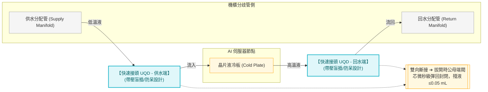

## Hot Swap 作業流程

帶壓插拔讓單台伺服器維修不需停整個機架的液冷系統：

1. 確認該台伺服器流量閥關閉（若有）
2. 拔開回水接頭 → 兩端閘門同時關閉，無洩漏
3. 拔開供水接頭 → 同上
4. 抽出伺服器，進行維修或更換
5. 插入伺服器，接上供/回水接頭（防呆確保方向正確）
6. 確認流量恢復正常

## 設計規格

| 參數 | 典型值 |
|------|-------|
| 工作壓力 | 5~10 bar |
| 適用流量 | 依管徑，DN10~DN25 常見 |
| 材質 | 不鏽鋼 316L 或黃銅（二次側純水環境用不鏽鋼）|
| 接液材質限制 | 與二次側純水相容，禁止鋅合金（離子污染）|

## 代表廠商

- **Stäubli**（瑞士，AIDC 快速接頭市場主流）
- **Parker Hannifin**（Schrader-Bellows 系列）
- **CPC（Colder Products）**
- Eaton（Aeroquip）

## Cross-References

- 上層系統：[[CDU 架構與選型]]（快速接頭屬於二次側末端）
- 末端設備：[[Cold Plate]]（快速接頭連接 Cold Plate 進出水口）
- 液冷架構：[[Module 04 - 液冷系統深度解析]]
- 搭配元件：[[儲冷罐]]（系統壓力穩定後，快速接頭插拔才安全）


## ================================================================================
## DOCUMENT: C:\Users\user\Obsidian\Engineering-Wiki\wiki\concepts\03_liquid_cooling\浸沒式液冷.md
## ================================================================================
---
tags: [equipment, liquid-cooling, immersion, advanced]
sources: ["[[AIDC HVAC 學習基地 - Notion]]"]
created: 2026-05-20
updated: 2026-05-20
---

# 浸沒式液冷（Immersion Cooling）

**浸沒式液冷（Immersion Cooling）** 是將 IT 設備整體浸入介電液體（Dielectric Fluid）中散熱的技術。與 Cold Plate DLC 的「接觸式」相比，浸沒式是「全身浸泡式」，可達到更高的散熱密度與更低的 PUE，但維護複雜度與成本也相對更高。

## 單相浸沒 vs 雙相浸沒

| 比較項目 | 單相浸沒（Single-Phase）| 雙相浸沒（Two-Phase）|
|---------|----------------------|-------------------|
| 冷卻液狀態 | 始終液態，不發生相變 | 液態 → 沸騰蒸發 → 冷凝回液 |
| 典型冷卻液 | 礦物油、合成烴類、Engineered Fluid | 氟碳化合物（Fluorocarbon）|
| 冷卻效率 | 高 | **極高**（利用汽化潛熱，熱密度最大）|
| PUE | ~1.03~1.05 | **~1.02~1.03** |
| 維護複雜度 | 中（需控油、過濾）| 高（冷凝系統、法規限制）|
| 成熟度（2026）| ✅ 逐步商用 | ⚠️ 小量商用，法規仍在制定 |
| 代表廠商 | Submer、GRC、LiquidStack | Asperitas、GRC |

## 技術原理

### 單相浸沒

```
IT 設備完全浸入介電液槽
↓
液體吸熱，自然對流或泵循環帶走熱量
↓
液體流至外部熱交換器放熱
↓
冷卻後液體回流
（始終維持液態）
```

### 雙相浸沒

```
IT 設備浸入低沸點介電液（沸點 ~50°C）
↓
設備發熱 → 液體沸騰蒸發（帶走大量汽化潛熱）
↓
蒸氣上升至槽頂冷凝盤管
↓
冷凝回液體，滴落回槽中
（相變潛熱帶走熱量，效率遠高於顯熱）
```

## 與 Cold Plate DLC 的比較

| 比較項目 | Cold Plate DLC | 單相浸沒 | 雙相浸沒 |
|---------|----------------|---------|---------|
| 冷卻密度 | 高（80~90% GPU 熱量）| 更高（100%）| 最高 |
| PUE | ~1.1~1.2 | ~1.03~1.05 | ~1.02 |
| GPU 可抽換性 | ✅ 容易 | ⚠️ 需清洗 | ⚠️ 複雜 |
| 系統改造 | 中（需配管）| 大（需液槽）| 最大 |
| 現有設備相容性 | 高（NVIDIA 有官方方案）| 低（需改板卡設計）| 低 |
| AIDC 大規模部署（2026）| ✅ 主流 | 逐步增加 | 極少 |
| 成本 | 中 | 高（液體貴）| 極高 |

## 為什麼現在不是 AIDC 主流？

1. **維護複雜度高**：設備泡在油裡，維修時需清洗，增加 MTTR
2. **液體成本高**：高品質介電液體昂貴，且有消耗（蒸發、洩漏）
3. **板卡設計限制**：許多 GPU 板卡不允許浸泡（風扇、塑膠件、線材）；NVIDIA GB200 官方 DLC 為 Cold Plate 方案
4. **法規限制（雙相）**：高 GWP 氟碳化合物受 EPA/EU 監管；EU F-Gas Regulation 逐步收緊
5. **生態系不成熟**：CDU/Cold Plate 已有 Vertiv、CoolIT 等成熟供應商，浸沒式供應鏈薄弱

## AIDC 部署策略

| 場景 | 適用液冷技術 | 原因 |
|------|-----------|------|
| GB200 NVL72 大規模部署（現在）| Cold Plate DLC | NVIDIA 官方方案，維護可行 |
| 超高密度特殊區域 | 單相浸沒 | 密度最大化，2026+ 逐步成熟 |
| 極致能效研究場景 | 雙相浸沒 | PUE ~1.02，但成本與法規仍是障礙 |

## 代表廠商

| 廠商 | 國家 | 專長 |
|------|------|------|
| **Submer** | 西班牙 | 單相浸沒，SmartPodX 模組化液槽 |
| **GRC（Green Revolution Cooling）** | 美國 | 單/雙相浸沒，ICEtank |
| **LiquidStack** | 荷蘭 | 雙相浸沒，Hyperscaler 合作 |
| Asperitas | 荷蘭 | 單相浸沒，自然對流（無泵）|

## Cross-References

- 對比：[[Cold Plate]]（現今 AIDC 主流液冷方案）
- 系統：[[Module 04 - 液冷系統深度解析]]（液冷技術路線全貌）
- 廠商：[[Module 08 - 廠商生態系統]]
- 效能指標：[[PUE 計算]]


## ================================================================================
## DOCUMENT: C:\Users\user\Obsidian\Engineering-Wiki\wiki\concepts\03_liquid_cooling\高溫冷卻液冷卻架構設計.md
## ================================================================================
---
tags: [concept, AIDC, liquid-cooling, warm-water, architecture, redundancy]
sources: ["[[高溫冷卻液與溫水冷卻技術]]", "[[CDU 架構與選型]]", "[[乾冷器]]"]
created: 2026-06-16
updated: 2026-06-16
---

# 高溫冷卻液冷卻架構設計 (Warm Water Cooling — System Architecture Design)

本頁專注於**高溫冷卻液（ASHRAE W40/W45，$32 \sim 45^\circ\text{C}+$ 供水）落地時的系統架構設計**：拓樸如何簡化、管路材料如何因應更大的溫度/壓力波動、容量與熱力計算如何隨溫差預算改變，以及極端高溫天氣下的備援邏輯。應用背景與動機請見 [[高溫冷卻液與溫水冷卻技術]]；單體設備選型請見 [[高溫冷卻液冷卻設備]]。

---

## 1. 系統拓樸與冷源整合

### A. 仍然保留「一次側/二次側」隔離，但一次側冷源大幅簡化

即使供水溫度提升到 $45^\circ\text{C}$，**二次側（TCS，接觸 Cold Plate）與一次側（接觸戶外環境）仍必須透過 CDU 板式熱交換器（PHE）隔離**，原因不變：

*   二次側水質要求 $< 10\ \mu\text{S/cm}$，一次側（接觸乾冷器、可能含大氣落塵與藻類）電導度遠高於此，混合會立即引發 GPU 短路風險（詳見 [[液冷系統 - CDU 架構]]）。
*   即使溫度夠高，**水質隔離的理由與冷水系統完全相同，不會因為溫度上升而消失**。

真正被簡化的是一次側冷源本身：

```
《傳統冷水拓樸（GB200，W17）》
Chiller（全年運轉） ←→ 冷卻塔 ←→ 一次側水泵 ←→ CDU(PHE) ←→ 二次側 TCS → Cold Plate

《溫水過渡拓樸（GB300，W40/W45，直接前一代）》
乾冷器（多數時間自然冷卻） ←→ 一次側水泵 ←→ CDU(PHE) ←→ 二次側 TCS → Cold Plate
        ↑
   （視廠商實作，部分仍保留 Chiller 作備援或混合配置，未完全標準化）

《高溫溫水拓樸（Vera Rubin，W45，標準化極致版）》
乾冷器（全年自然冷卻） ←→ 一次側水泵 ←→ CDU(PHE) ←→ 二次側 TCS → Cold Plate
        ↑
   （Chiller 整套移除或降級為極端天氣備援機）
```

> GB300（詳見 [[GB300與Blackwell Ultra機櫃架構]]）已是溫水冷卻的起點（供水 $40 \sim 45^\circ\text{C}$），拓樸上即可開始導入乾冷器；Vera Rubin 則是把這條路線推向官方標準化、100% Chiller-Free。

→ 拓樸層級的最大改變，是**整段「冷卻水塔 + Chiller + 製冷劇」一次性消失**，由乾冷器直接取代，詳見 [[乾冷器]]、[[Free Cooling]]。

### B. Economizer 控制邏輯的反轉

傳統冷水系統的 Economizer 邏輯是「能多省一點 Chiller 負載就多省」（見 [[Free Cooling]] 模式 A/B/C）。高溫溫水拓樸下，控制邏輯反轉為**「預設永遠自然冷卻，只有環境溫度超標才啟動備援」**：

```
模式 A（常態，> 99% 時間）：純乾冷器自然冷卻
  條件：環境 DBT + 接近溫度 ≤ 45°C（幾乎所有氣候區全年成立）
  → 一次側泵運轉，乾冷器風扇變頻調節，Chiller/備援冷源完全停機

模式 B（極端高溫備援，罕見）：
  條件：環境 DBT 過高（如熱浪 > 40°C），乾冷器出水 > 45°C 供水上限
  → 啟動小型備援冷源（Trim Chiller）或啟用 Adiabatic 噴霧預冷
  → 僅需「削峰」而非全功率製冷，備援設備容量可大幅縮小（通常 < 20% 滿載容量）
```

### C. 混合架構（Hybrid）的過渡選項

新建廠區可直接採全乾冷器拓樸；既有冷水機房改造則常見**混合拓樸**：保留既有 Chiller/冷卻塔作為備援，僅新增乾冷器陣列作為主力冷源，透過三通閥依環境溫度自動切換主力路徑。

---

## 2. 管路與材料設計

### A. 熱膨脹補償需求大幅提高

高溫溫水系統的管路溫度波動範圍遠大於冷水系統：

| 項目 | 傳統冷水系統 | 高溫溫水系統 |
|:---|:---:|:---:|
| 運行溫度範圍 | $15 \sim 26^\circ\text{C}$（$\Delta \approx 11^\circ\text{C}$） | $20^\circ\text{C}$（停機常溫）$\to 65^\circ\text{C}$（滿載回水）（$\Delta \approx 45^\circ\text{C}$） |
| 管路熱膨脹量 | 小，通常免特殊補償 | **顯著**，碳鋼管每 $100\text{ m}$ 約伸長 $5\text{ cm}$ 等級需納入計算 |

**設計對策**：

*   管路系統須加入**伸縮接頭（Expansion Joint）**或**膨脹彎（Expansion Loop）**，吸收開機/停機循環產生的熱應力。
*   管路固定支架須區分「固定點（Anchor）」與「滑動支撐（Sliding Support）」，避免熱脹冷縮造成管件疲勞或焊縫開裂。
*   快速接頭、Cold Plate 等剛性元件附近，應預留柔性軟管段（Flexible Hose）吸收局部變形，避免應力直接傳遞到精密接頭（詳見 [[快速接頭]]）。

### B. 保溫設計邏輯反轉

傳統低溫冷水管路保溫的主要目的是**防結露**（管壁溫度低於室內露點，見 [[ASHRAE TC 9.9 Data Center 溫濕度標準]]）。高溫溫水管路（$45 \sim 65^\circ\text{C}$）已**高於室內露點**，結露風險消失，但保溫目的轉變為：

1.  **節能**：減少管路熱量散失到機房白區，避免額外加重空調負載。
2.  **人員燙傷防護**：$65^\circ\text{C}$ 回水管表面溫度足以造成接觸性燙傷，需依職安規範包覆保溫層或警示標示。
3.  **維持系統 ΔT**：避免管路沿途散熱導致供水溫度在長距離輸送後低於設計值過多（雖然這對高溫系統反而是「意外的小幫助」，但仍須納入熱力計算避免誤差）。

### C. 管材與密封材質升級

延續 [[高溫冷卻液與溫水冷卻技術]] 第 4 節的化學/材料分析，架構設計階段需落實：

*   管路本體：碳鋼管路（一次側乾冷器迴路）可維持，但法蘭墊片、O-Ring 需全面改用耐高溫等級（FKM 氟橡膠、耐溫 EPDM）。
*   二次側仍維持紅銅/316L 不鏽鋼為主，材料相容性清單與伽凡尼腐蝕風險不變，但反應速率加快，需提高巡檢頻率（見 [[電化學腐蝕與接地]]）。

---

## 3. 容量與熱力計算的差異

### A. ΔT 放大帶來的「隱性好處」——流量與管徑縮小

高溫溫水系統的供回水溫差（ΔT）通常設計得比冷水系統更大：

$$\dot{m} = \frac{Q}{C_p \times \Delta T}$$

| 系統 | 供/回水溫度 | ΔT | 同等 200 kW 負載所需流量 |
|:---|:---:|:---:|:---:|
| 傳統冷水（GB200 類）| $16/26^\circ\text{C}$ | $10^\circ\text{C}$ | $\approx 287\text{ L/min}$ |
| 溫水過渡（GB300 類）| $40/55^\circ\text{C}$ | $15^\circ\text{C}$ | $\approx 191\text{ L/min}$ |
| 高溫溫水（Rubin 類）| $45/65^\circ\text{C}$ | $20^\circ\text{C}$ | $\approx 143\text{ L/min}$ |

→ ΔT 加倍 → 流量減半 → **管徑、泵揚程、泵功率均可同步縮小**，是高溫冷卻液架構在機電 CAPEX 上的額外紅利（與「節省 Chiller」的效益並列，但常被忽略）。

### B. LMTD 與 PHE 換熱面積：不必然更難設計

許多人直覺認為「供水溫度貼近環境溫度，LMTD 會被壓縮、PHE 會變貴」（見 [[LMTD 計算]] 對冷水系統的討論）。但在乾冷器 + 高溫溫水的組合中：

*   一次側（乾冷器迴路）與二次側（TCS）兩側都在「高溫區間」運作（如一次側 $40/60^\circ\text{C}$，二次側 $45/65^\circ\text{C}$），**兩側溫差設計仍可維持 $4 \sim 6^\circ\text{C}$ 的接近溫度**，落在 [[LMTD 計算]] 中的「綠色安全區」，PHE 選型反而比 GB200 那種被迫壓到 $2.5^\circ\text{C}$ 以下「紅色警戒區」的設計更輕鬆、更便宜（GB300 因供水已達 $40^\circ\text{C}+$，同樣享有這個好處，是溫水路線從 GB300 起就能拿到的紅利）。
*   **關鍵差異不在 PHE 本身，而在乾冷器與 Chiller 的本質**：乾冷器不需要像 Chiller 一樣，為了追求極致 COP 而把一次側供水壓到接近環境濕球溫度；乾冷器的設計目標只是「比 IT 上限低幾度即可」，留有更寬裕的溫差設計空間。

### C. 容量計算須計入的新變數

*   **乾冷器出水溫度的氣候依賴性**：容量計算必須以當地**歷史極端乾球溫度（如近 10 年 1% 超越機率乾球溫度）**為基準，而非平均氣溫，確保備援冷源容量足夠覆蓋極端熱浪天數（詳見 [[乾冷器]] 第 5 節備援邏輯）。
*   **風扇能耗 vs 換熱面積的權衡**：乾冷器陣列的容量計算公式與 PHE 相同（$Q = U \times A \times LMTD$），但 $U$ 值較低（空氣側對流係數遠低於水側），需以更大換熱面積或更高風扇轉速補償，此權衡直接影響乾冷器 OPEX（風扇電耗）與 CAPEX（佔地面積）。

---

## 4. 備援與故障切換設計

### A. 極端高溫日的「削峰」備援邏輯

由於乾冷器在 99% 以上時間可獨立完成全部散熱任務，備援冷源的設計思路與傳統「N+1 全容量冗餘」不同，改採**「削峰式（Trim/Peak-shaving）備援」**：

```
[乾冷器陣列（主力，承擔全年 ≥99% 時數）]
        │
        ├── 正常：100% 由乾冷器負擔
        │
        └── 極端熱浪（環境 DBT 超過設計基準）：
             [小型備援冷源（Trim Chiller，容量約為總負載 15~25%）] 並聯啟動
             → 僅需把乾冷器出水從略高於 45°C「削」回 45°C 以下
```

→ 備援冷源容量需求遠低於傳統 Chiller-only 系統的 100% 全容量配置，是 CAPEX 節省的另一來源。

### B. 乾冷器陣列本身的 N+1 設計

*   乾冷器以**模組化陣列**部署（多台並聯），單台故障時其餘機組可透過提高風扇轉速（VFD）暫時補足缺口，須在容量計算時預留 **$N+1$ 或 $N+2$** 模組裕度。
*   風扇與泵均建議採用變頻控制，故障診斷（震動、電流異常）整合進 [[DCIM]]，故障機組可線上隔離維修不影響整體運轉。

### C. 連鎖保護與漏液/超溫雙重監控

高溫溫水系統除了既有的 [[漏液偵測系統]] 邏輯外，需額外增加**二次側超溫保護聯鎖**：

```
二次側供水溫度監測
       ↓
若供水溫度 > IT 設備上限（如 45°C）持續 > 設定時間
       ↓
[1] DCIM 告警
       ↓
[2] 強制啟動備援 Trim Chiller / Adiabatic 噴霧預冷
       ↓（若仍無法降溫）
[3] 觸發 IT 負載降頻保護（與 GPU BMC 協同的軟性降載，優於硬性斷電）
```

> 與冷水系統「怕太冷結露」的保護邏輯相反，高溫溫水系統的核心保護邏輯是「怕太熱超出 IT 設備上限」，這是架構設計思維上最大的反轉點。

---

## Cross-References

*   應用背景與動機：[[高溫冷卻液與溫水冷卻技術]]
*   單體設備選型：[[高溫冷卻液冷卻設備]]
*   冷源設備：[[乾冷器]]、[[Free Cooling]]、[[Dry Cooler vs. 密閉式冷卻水塔]]
*   CDU 系統與水質隔離：[[CDU 架構與選型]]、[[液冷系統 - CDU 架構]]
*   熱力計算：[[LMTD 計算]]
*   安全聯鎖：[[漏液偵測系統]]、[[AIDC FMEA 故障模式與效應分析]]
*   代表平台：[[Vera Rubin 機櫃物理與電力架構]]、[[GB300與Blackwell Ultra機櫃架構]]（溫水冷卻起點）、[[GB200 NVL72 冷卻需求]]（仍為低溫冷水）

## Sources

*   GB300 供水溫度規格：[GB300 Liquid Cooling Requirements 2026 - ToneCooling](https://tonecooling.com/gb300-liquid-cooling-requirements-2026/)


## ================================================================================
## DOCUMENT: C:\Users\user\Obsidian\Engineering-Wiki\wiki\concepts\03_liquid_cooling\高溫冷卻液冷卻設備.md
## ================================================================================
---
tags: [concept, AIDC, liquid-cooling, warm-water, equipment, CDU, dry-cooler]
sources: ["[[高溫冷卻液與溫水冷卻技術]]", "[[高溫冷卻液冷卻架構設計]]", "[[乾冷器]]", "[[CDU 架構與選型]]"]
created: 2026-06-16
updated: 2026-06-16
---

# 高溫冷卻液冷卻設備 (Warm Water Cooling — Equipment Selection)

本頁專注於高溫冷卻液架構下，**各單體設備在選型規格上與傳統低溫冷水系統的具體差異**：冷源端的乾冷器/混合冷卻器、CDU 本體設計、泵閥耐溫規格，以及監測與水質維護設備。系統層級的拓樸與計算邏輯請見 [[高溫冷卻液冷卻架構設計]]。

---

## 1. 乾冷器 / 混合冷卻器選型

詳細工作原理與容量計算公式已在 [[乾冷器]] 頁面完整說明，本節聚焦**選型決策**本身。

### A. 純乾冷器（Dry Cooler）vs 混合冷卻器（Adiabatic / Hybrid Cooler）

| 類型 | 原理 | 適用場景 | 優缺點 |
|:---|:---|:---|:---|
| **純乾冷器** | 純空氣顯熱換熱，全程無水 | 全年氣候溫和、無極端熱浪地區 | WUE = 0，無水處理需求；極端高溫日散熱能力打折 |
| **混合冷卻器（Adiabatic Cooler）** | 平時走乾式，極端高溫時噴霧蒸發預冷進氣 | 熱帶/亞熱帶有短期熱浪風險地區（如台灣夏季） | 多數時間 WUE = 0，僅熱浪時段耗少量水；設備與控制複雜度higher |
| **濕式冷卻塔（對照組）** | 全程蒸發冷卻 | 傳統低溫冷水系統 | 出水溫度更低但全年耗水、需 Legionella 防範 |

> **選型建議**：台灣等夏季短期極端高溫地區，**混合冷卻器是性價比最優解**——平時零耗水運轉，僅熱浪期間短暫切換噴霧模式，相較全濕式冷卻塔大幅降低 WUE，又比純乾冷器多一道應對極端氣候的安全邊際。

### B. 選型關鍵參數

*   **接近溫度（Approach Temperature）**：典型 $3 \sim 8^\circ\text{C}$，數值越小換熱面積越大、設備越貴，需與 [[高溫冷卻液冷卻架構設計]] 第 3 節的容量計算聯動決定。
*   **設計基準乾球溫度**：必須採用當地**歷史極端乾球溫度（如 1% 超越機率 DBT）**，而非年平均溫度，避免熱浪天容量不足。
*   **風扇能耗曲線（Part-load Efficiency）**：AIDC 全年大多數時間非滿載運轉，需審查廠商提供的變頻風扇在 30~70% 負載下的能耗曲線，避免低負載時風扇效率不佳拖累 PUE。
*   **噴霧水質要求（混合型）**：噴霧用水若使用自來水，蒸發後礦物質會在翅片表面結垢，長期影響換熱效率，建議搭配軟水或低硬度水源，並設置定期沖洗排污。

### C. 代表廠商

| 廠商 | 產品線 | 特色 |
|:---|:---|:---|
| **BAC（Baltimore Aircoil）** | Hybrid Cooler 系列 | 乾濕複合技術先驅，全球大型資料中心案例多 |
| **EVAPCO** | AT 系列 Adiabatic Cooler | 模組化陣列設計，適合大規模並聯部署 |
| **Güntner** | Güntner Cooler (GFH) 系列 | 歐洲市場主力，翅片防腐蝕塗層選項多 |
| **Vertiv / Motivair** | 整合於 CDU 系統商的乾冷器配套方案 | 與其 CDU 產品線統包，介面與控制系統一致性高 |

---

## 2. CDU 於高溫水路的差異設計

延續 [[CDU 架構與選型]] 的選型框架，高溫水路下 CDU 本體需特別注意以下差異：

### A. PHE 板片材質與壓力等級

*   板片材質仍以 **316L 不鏽鋼**或**鈦合金**為主（與冷水系統相同），但因高溫下材料強度略降，需重新核對板片在 $65^\circ\text{C}$ 工作溫度下的**耐壓等級（Pressure Rating）**是否仍滿足系統設計壓力（通常 $6 \sim 10\text{ bar}$）。
*   墊片（Gasket）材質須由一般 NBR 升級為 **EPDM（耐高溫配方）或 FKM**，避免長期高溫導致墊片硬化、洩漏。

### B. 控制邏輯差異

| 控制邏輯 | 傳統低溫 CDU | 高溫溫水 CDU |
|:---|:---|:---|
| 主要保護目標 | 防止供水溫度過低引發結露 | 防止供水溫度過高超出 IT 上限 |
| 一次側調節閥動作 | 升高一次側流量以降低二次側出水溫度 | 升高一次側流量以**限制**二次側出水溫度上限 |
| 備援啟動條件 | 一次側 Chiller 故障/容量不足 | 環境 DBT 超標、乾冷器出水接近 IT 上限 |

詳細聯鎖邏輯見 [[高溫冷卻液冷卻架構設計]] 第 4 節 C 項。

### C. 流量/揚程選型的連動調整

由於高溫系統設計 ΔT 通常更大（如 $20^\circ\text{C}$ vs 傳統 $8 \sim 10^\circ\text{C}$，見 [[高溫冷卻液冷卻架構設計]] 第 3 節 A 項），同等熱負荷下二次側泵的**設計流量可同步調降**，但泵揚程仍需依快速接頭、Cold Plate 微通道等局部阻力重新核算，不可直接套用冷水系統的揚程數據。

---

## 3. 泵與閥件耐溫規格

### A. 循環泵

*   仍應採用**無軸封屏蔽泵（Canned Motor Pump）**或**磁力驅動泵（Magnetic Drive Pump）**杜絕機械密封漏液風險（與 [[CDU 架構與選型]] 原則一致），但需額外確認：
    *   泵體軸承潤滑脂的**耐溫等級**是否覆蓋 $65^\circ\text{C}$ 連續運轉工況（一般工業泵潤滑脂額定多為 $\le 80^\circ\text{C}$，裕度有限，須向廠商索取耐溫測試報告）。
    *   馬達繞組絕緣等級（Insulation Class）在高溫液體長期浸潤環境下的降額（Derating）係數。
*   **NPSH 餘量**：高溫液體的飽和蒸氣壓較高，泵入口若壓力不足容易引發**汽蝕（Cavitation）**，須比冷水系統預留更大的 NPSHa 安全邊際（呼應 [[CDU 架構與選型]] 膨脹罐定壓設計）。

### B. 閥件與執行器

*   調節閥閥體與閥座材質需確認耐溫上限涵蓋 $65^\circ\text{C}$ 回水工況，電動執行器（Actuator）的電子元件若安裝於管路保溫層附近，需評估環境溫度對其壽命的影響。
*   電磁截止閥（用於漏液 ESD 聯鎖，見 [[漏液偵測系統]]）的密封材質同樣須升級為耐高溫等級，確保緊急關閉動作不因長期高溫導致閥芯卡死。

---

## 4. 監測與水質設備

### A. 溫度/壓力感測器

*   感測器探頭與線材材質須涵蓋 $65^\circ\text{C}+$ 量測範圍，且因應 [[高溫冷卻液冷卻架構設計]] 中「怕過熱」的保護邏輯反轉，**二次側供水超溫告警**取代「供水過低結露告警」成為核心監測點。

### B. 水質與殺菌設備

承接 [[TCS 二次側與冷卻水化學管理]] 的化學分析，設備層面需配套：

*   **加藥系統（Dosing System）**：因高溫加速殺菌劑消耗（見 [[高溫冷卻液與溫水冷卻技術]] 第 4 節 Arrhenius 效應分析），建議採用**自動定量加藥泵**取代人工定期投藥，並縮短投藥週期至 $3 \sim 6$ 個月。
*   **DI 離子交換罐**：更換頻率需比冷水系統更密（腐蝕反應加快導致離子溶出更快），建議搭配連續電導度監測自動觸發更換提醒，而非僅依固定週期排程。
*   **線上生菌數監測（Online TBC Monitoring）**：傳統依賴每月人工採樣送驗（見 [[TCS 二次側與冷卻水化學管理]] 表格），高溫系統建議升級為**線上式生物膜感測器**，提早偵測生物膜形成趨勢，避免等到人工採樣才發現超標。

### C. 乾冷器翅片與噴霧水質維護設備

*   翅片清洗：定期以低壓水柱或專用清潔劑清除翅片積塵，維持換熱效率（積塵會降低 $U$ 值，間接迫使乾冷器出水溫度上升，擠壓 IT 端 ΔT 預算）。
*   混合冷卻器噴霧系統：需配置**軟水裝置或加藥防垢系統**，避免噴霧水礦物質結垢於翅片表面。

---

## Cross-References

*   架構與拓樸設計：[[高溫冷卻液冷卻架構設計]]
*   應用背景與動機：[[高溫冷卻液與溫水冷卻技術]]
*   乾冷器原理與容量計算：[[乾冷器]]、[[Dry Cooler vs. 密閉式冷卻水塔]]
*   CDU 選型框架：[[CDU 架構與選型]]、[[液冷系統 - CDU 架構]]
*   水質化學管理：[[TCS 二次側與冷卻水化學管理]]、[[電化學腐蝕與接地]]
*   漏液與安全聯鎖：[[漏液偵測系統]]
*   儲冷罐與穩壓：[[儲冷罐]]


## ================================================================================
## DOCUMENT: C:\Users\user\Obsidian\Engineering-Wiki\wiki\concepts\03_liquid_cooling\高溫冷卻液與溫水冷卻技術.md
## ================================================================================
---
tags: [concept, AIDC, liquid-cooling, warm-water, ASHRAE, free-cooling, water-chemistry]
sources: ["[[AIDC 核心標準與規範指引]]", "[[Vera Rubin 機櫃物理與電力架構]]", "[[Free Cooling]]", "[[乾冷器]]", "[[TCS 二次側與冷卻水化學管理]]"]
created: 2026-06-16
updated: 2026-06-16
---

# 高溫冷卻液與溫水冷卻技術 (Warm Water / High-Temperature Coolant Cooling)

**高溫冷卻液（Warm Water Cooling）** 指二次側 TCS 迴路供水溫度突破傳統 $15 \sim 17^\circ\text{C}$ 限制，提升至 $32^\circ\text{C} \sim 45^\circ\text{C}$ 甚至更高的液冷設計路線。這是繼「空冷 → 液冷」之後，AIDC 散熱技術的下一個關鍵轉折點——目的不是冷卻液本身要更熱，而是讓**供水溫度盡量貼近環境溫度**，從而徹底擺脫 Chiller 的能耗與耗水負擔。

> 核心思維反轉：傳統設計「先決定晶片要多冷，再算冷源要多強」；溫水冷卻設計「先決定晶片能忍多熱，再讓冷源完全不開機」。

---

## 1. ASHRAE 液冷分級標準（Liquid Cooling Classes）

ASHRAE TC 9.9 針對資料中心液冷設施**進水溫度上限**訂出明確的分級標準（對應 [[ASHRAE TC 9.9 Data Center 溫濕度標準]] 中空冷的 A1~A4 等級）。早期版本以 **W1~W5** 命名，但 **2022 年第五版（5th Edition）已改用「溫度數字直接命名」**，重新命名為 **W17 / W27 / W32 / W40（新增）/ W45 / W+**，並補上明確的進水溫度上限數字：

|  等級（新）  |                   進水溫度上限                    | 冷源需求（典型）                                     | 代表應用                                                                                                         |
| :-----: | :-----------------------------------------: | :------------------------------------------- | :----------------------------------------------------------------------------------------------------------- |
| **W17** |         **$\le 17^\circ\text{C}$**          | 典型使用 Chiller，可選配冷凍水側自然冷卻                     | GB200 NVL72（$\le 17^\circ\text{C}$，恰好落在 W17 上限）                                                              |
| **W27** |         **$\le 27^\circ\text{C}$**          | 典型使用 Chiller，可選配 Waterside Economizer        | H100 時代液冷改造                                                                                                  |
| **W32** |         **$\le 32^\circ\text{C}$**          | **多數地點可不用 Chiller**（但受當地濕球/乾球溫度限制，台灣夏季仍可能不足） | 過渡型應用                                                                                                        |
| **W40** |         **$\le 40^\circ\text{C}$**          | **多數地點可不用 Chiller**                          | **GB300 NVL72**（冷板熱阻設計基準供水 $40^\circ\text{C}$）                                                               |
| **W45** |         **$\le 45^\circ\text{C}$**          | **典型可不用 Chiller，追求最大能效**                     | **GB300 NVL72**（允許上限 $45^\circ\text{C}$）、**Vera Rubin NVL72**（$45^\circ\text{C}$ 供水 / $65^\circ\text{C}$ 回水） |
| **W+**  | **$> 45^\circ\text{C}$（無固定上限，由 IT 設備自行定義）** | 典型可不用 Chiller                                | 尚無主流量產平台明確採用                                                                                                 |

> **合規定義要點**：要符合某個 W-class，代表 IT 設備必須能在該等級「進水溫度範圍內的任意溫度下」都維持滿載、不降頻運轉（"full, unthrottled operation"），不是只測試上限那一個點。

→ **等級越高，代表 IT 設備能容忍越熱的冷卻液，換來冷源側越大的自然冷卻空間。** 這與空冷 A1→A4 提升進氣溫度上限換取 Free Cooling 時數的邏輯完全對稱。本筆記後文沿用業界較常見的舊稱（W1~W5）行文時，會同時標註對應的新制溫度數字以避免混淆。

---

## 2. 高溫冷卻液在 AIDC 的應用場景

### A. 晶片級直接液冷（Cold Plate DLC）—— 目前最主要的應用

高溫冷卻液最核心的應用就是搭配 Cold Plate DLC，直接服務 GPU/CPU 機架：

*   **代表案例**：Vera Rubin NVL72（$45^\circ\text{C}$ 供水 / $65^\circ\text{C}$ 回水，相當於 **W45** 等級），詳見 [[Vera Rubin 機櫃物理與電力架構]]。
*   **與前代的關鍵差異**：Vera Rubin 的直接前一代是 **GB300（Blackwell Ultra NVL72，$130 \sim 140\text{ kW}$）**，而 GB300 其實已經是溫水冷卻的**起點**——冷板熱阻設計基準供水即為 $40^\circ\text{C}$（**W40**），實際部署允許上限達 $45^\circ\text{C}$（**W45**，詳見 [[GB300與Blackwell Ultra機櫃架構]]）。更早的 GB200（$120\text{ kW}$）才是仍停留在 $\le 17^\circ\text{C}$（**W17**）低溫供水的世代。換言之，**「低溫冷水 → 高溫溫水」的世代交替節點是 GB200 → GB300**，Vera Rubin 則是把這個方向做到官方標準化、100% Chiller-Free 的極致版本（GB300 仍是過渡世代，廠商實作的供水溫度從 $35 \sim 45^\circ\text{C}$ 不等，未統一）。
*   **意義**：GB300 與 Vera Rubin 都已進入溫水冷卻的量產驗證階段，後續架構設計與設備選型章節以 Vera Rubin 的 $45^\circ\text{C}$/W45 規格為主要場景，但 GB300 是實務上更早落地的案例。

### B. 浸沒式液冷與溫水冷卻的天然契合

[[浸沒式液冷]] 使用的介電液（礦物油、合成烴類）耐溫遠高於水（可耐受 $60 \sim 70^\circ\text{C}$ 以上而不分解），對供水溫度的敏感度本來就比純水系統低：

*   單相浸沒槽體本身的熱慣性大、散熱面積大，更容易接受 $40^\circ\text{C}+$ 的外部冷卻液供水。
*   目前浸沒式液冷在 AIDC 仍非主流（見 [[浸沒式液冷]] 第「為什麼現在不是 AIDC 主流」一節），但若與高溫冷卻液（乾冷器 Chiller-Free）結合，是長期最具 PUE 優勢的組合路線之一。

### C. 廢熱回收再利用（Heat Reuse / Waste Heat Recovery）——高溫冷卻液獨有的延伸價值

傳統低溫冷水系統（回水 $\approx 23 \sim 26^\circ\text{C}$）的廢熱溫度太低，幾乎沒有再利用價值，只能直接排放到大氣。**高溫冷卻液的回水可達 $65^\circ\text{C}$**，已達到多種建築/工業熱能應用的實用門檻：

| 再利用場景 | 所需溫度 | $65^\circ\text{C}$ 回水可行性 |
|:---|:---:|:---:|
| 建築供暖 / 區域供熱（District Heating）| $40 \sim 60^\circ\text{C}$ | ✅ 可直接或經小幅升溫使用 |
| 生活熱水預熱 | $40 \sim 50^\circ\text{C}$ | ✅ 可行 |
| 游泳池 / 溫室加溫 | $25 \sim 35^\circ\text{C}$ | ✅ 餘裕充足 |
| 吸收式製冷機（Absorption Chiller）再生熱源 | $\ge 70 \sim 90^\circ\text{C}$ | ⚠️ 通常仍需加溫補強，但已大幅降低所需外加熱量 |

> 北歐（如瑞典、丹麥）已有大型資料中心將廢熱併入市政區域供熱網的案例。台灣雖無區域供熱網普及條件，但廠區內部熱水預熱、員工宿舍供暖等場景仍可評估。**這是高溫冷卻液在「節能」之外，少數能直接創造額外商業/ESG 價值的延伸應用**，後續若要展開可另立專頁深入。

### D. 邊緣與熱帶氣候站點的機電簡化

高溫冷卻液搭配乾冷器後，機電系統不再需要 Chiller 與冷卻水塔，對空間受限、缺乏專業機電維運團隊的**邊緣機房（Edge DC）**或熱帶地區站點特別有利：

*   省去冷卻水塔的水處理與 Legionella 防範需求（[[冷卻水塔]]）。
*   設備數量減少 → 故障點減少 → 適合無人值守或低人力站點。

---

## 3. 為什麼要刻意把冷卻液變熱？——熱力學與商業邏輯

### A. 與乾冷器的溫度耦合

[[乾冷器]] 出水溫度受**環境乾球溫度（DBT）**決定：

$$T_{outlet} = T_{ambient,DBT} + \Delta T_{approach}（典型 3\sim8^\circ\text{C}）$$

台灣夏季 DBT $\approx 35^\circ\text{C}$ → 乾冷器出水 $\approx 38\sim40^\circ\text{C}$。

*   若 IT 設備要求供水 $\le 17^\circ\text{C}$（**W17**，如 GB200）→ 乾冷器**完全無法達標**，全年必須開 Chiller。
*   若 IT 設備接受供水 $40 \sim 45^\circ\text{C}$（**W40/W45**，如 GB300、Vera Rubin）→ 乾冷器出水**遠低於上限**，可大幅減少甚至全年 100% 自然冷卻。

詳細氣候對照表見 [[乾冷器]] 第 2 節、[[Free Cooling]]。

### B. 節能效益量化

| 指標                  |      傳統低溫冷水（W17，GB200）       | 高溫溫水（W40/W45，GB300/Vera Rubin） |
| :------------------ | :--------------------------: | :----------------------------: |
| PUE                 | $1.3 \sim 1.5$（Chiller 全年運轉） |         **$\le 1.10$**         |
| WUE                 |          高（冷卻塔蒸發耗水）          |       **$= 0$（乾冷器零耗水）**        |
| 冷源 CAPEX            |        需大量 Chiller 機組        |            大幅縮減或免除             |
| 全年 Chiller 運轉時數（台灣） |         8,760 hr（全年）         |              趨近 0              |

> 一台 Chiller 的耗電量約佔 AIDC 總用電 10~20%；高溫冷卻液路線直接打掉這塊成本，是繼晶片本身效能提升外，最大的 PUE 改善槓桿。

---

## 4. 高溫對冷卻液化學與材料的衝擊

冷卻液變熱並非沒有代價——溫度是多數化學反應的加速劑，二次側水化學管理的難度隨之上升（詳見 [[TCS 二次側與冷卻水化學管理]]）：

### A. 生物膜與細菌增殖風險升高

*   閉環溫水路（供水 $32 \sim 45^\circ\text{C}$）恰好落在多數細菌的最適生長溫度帶，是遠優於 $15^\circ\text{C}$ 冷水路的培養基。
*   **對策**：嚴禁氧化性殺菌劑（腐蝕銅/橡膠），改用**異噻唑啉酮（Isothiazolinone）**或**戊二醛（Glutaraldehyde）**等非氧化性殺菌劑，且投藥週期需從 6 個月以上**縮短至 3~6 個月**。

### B. 腐蝕反應速率加快（Arrhenius 效應）

化學反應速率粗略遵循「溫度每升高 $10^\circ\text{C}$，反應速率增加約 1 倍」的經驗法則。這意味著：

*   銅表面 BTA 緩蝕劑保護膜（見 [[電化學腐蝕與接地]]）在高溫下消耗更快，需提高巡檢頻率與補充濃度。
*   伽伐尼腐蝕、氧化反應在 $45^\circ\text{C}$ 下的速率，可能是 $15^\circ\text{C}$ 系統的 **2~4 倍**，對電導度（< 10 μS/cm）與 DI 濾芯更換週期的管控要求更嚴格。

### C. 密封與管路材料的耐溫升級

*   橡膠/密封材質須由一般 EPDM 升級為**耐高溫 EPDM 配方**或 FKM（氟橡膠），避免長期 $45 \sim 65^\circ\text{C}$ 回水導致橡膠硬化、龜裂、滲漏。
*   快速接頭（[[快速接頭]]）的 O-Ring 與閥座材質同樣需重新驗證耐溫等級。

---

## 5. 高溫對晶片端熱設計的擠壓——溫差預算（ΔT Budget）急劇縮小

供水溫度上升的最大代價，是晶片到冷卻液之間「可用溫差」被大幅壓縮：

| 設計世代 | 供水溫度 | 晶片安全上限 | 可用 ΔT 預算 | 冷板技術要求 |
|:---|:---:|:---:|:---:|:---|
| GB200（W17）| $\le 17^\circ\text{C}$ | HBM3e $\le 85^\circ\text{C}$ | **$\approx 68^\circ\text{C}$** | 一般微通道冷板即可滿足 |
| GB300（W40/W45，前一代，溫水起點）| $40 \sim 45^\circ\text{C}$ | HBM3e $\le 85^\circ\text{C}$ | **僅 $\approx 40 \sim 45^\circ\text{C}$**（較 GB200 大幅壓縮）| 已要求低熱阻冷板（結到冷卻液熱阻 $\le 0.030^\circ\text{C/W}$） |
| Vera Rubin（W45）| $45^\circ\text{C}$ | HBM4 $\le 85^\circ\text{C}$ | **僅 $\approx 40^\circ\text{C}$** | 必須採用低熱阻 **MCCP（微通道冷板）**，詳見 [[MCL與MCCP液冷技術]] |

→ 供水溫度每提高 $1^\circ\text{C}$，等於把晶片可用的散熱溫差預算直接吃掉 $1^\circ\text{C}$。因此溫水冷卻平台必須同步在**冷板微通道密度、流道分流設計（雙向對流/分流）**上做大幅升級，才能在更小的溫差下仍把熱阻壓低，確保 HBM4（$\le 85^\circ\text{C}$）與 CPO/ELS 雷射源（$\le 70^\circ\text{C}$）不超溫，詳見 [[HBM與晶片級光通訊熱管理]]。

同理，CDU 板式熱交換器的 LMTD 設計也受影響——一次側與二次側溫差被壓縮，需要更大換熱面積或更接近溫差（Approach Temperature）來維持同等換熱量，詳見 [[LMTD 計算]]、[[CDU 架構與選型]]。

---

## 6. 產業路線對照總結

```
GB200 NVL72（120 kW）：W17 等級 → 供水 ≤17°C → 台灣全年需 Chiller → PUE 1.3~1.5
        ↓ 平台演進（真正的低溫→高溫世代交替點，從這裡開始）
GB300 / Blackwell Ultra NVL72（130~140 kW，直接前一代，溫水起點）：W40/W45 等級 → 供水 40~45°C（廠商實作不一）→ 可大幅減少 Chiller 依賴，但尚未官方標準化 100% Chiller-Free
        ↓ 平台演進（標準化、推向極致）
Vera Rubin NVL72（190~230 kW，2026 量產）：W45 等級 → 供水 45°C / 回水 65°C → 全球 100% Chiller-Free → PUE ≤1.10, WUE = 0
```

> 修正提醒：GB300 並非沿用 GB200 的低溫冷水設計，而是業界第一個明確支援溫水冷卻的機架世代（詳見 [[GB300與Blackwell Ultra機櫃架構]]）。Vera Rubin 是把 GB300 已經打開的方向，做到官方規格統一與 100% Chiller-Free 的成熟版本。

高溫冷卻液不是單一組件的改動，而是牽動「冷源（Chiller→乾冷器）、化學管理（殺菌/緩蝕策略）、材料選型（耐溫密封）、冷板設計（微通道密度）」四個層面同步升級的系統工程決策。

---

## Cross-References

*   延伸專頁：[[高溫冷卻液冷卻架構設計]]（系統拓樸、管路材料、容量計算、備援切換）、[[高溫冷卻液冷卻設備]]（乾冷器選型、CDU 差異設計、泵閥規格、監測水質設備）
*   標準依據：[[ASHRAE TC 9.9 Data Center 溫濕度標準]]、[[AIDC 核心標準與規範指引]]（W1~W5 舊制定義，第五版已更名為 W17/W27/W32/W40/W45/W+）
*   冷源端配套：[[乾冷器]]、[[Free Cooling]]、[[Dry Cooler vs. 密閉式冷卻水塔]]
*   應用場景：[[浸沒式液冷]]（溫水耐受性更高）、[[冷卻水塔]]（邊緣站點機電簡化對比）
*   化學管理衝擊：[[TCS 二次側與冷卻水化學管理]]、[[電化學腐蝕與接地]]
*   晶片端衝擊：[[HBM與晶片級光通訊熱管理]]、[[MCL與MCCP液冷技術]]、[[Cold Plate]]
*   代表平台：[[Vera Rubin 機櫃物理與電力架構]]、[[GB300與Blackwell Ultra機櫃架構]]（直接前一代，溫水冷卻起點）、[[GB200 NVL72 冷卻需求]]（仍為低溫冷水）
*   系統計算：[[CDU 架構與選型]]、[[LMTD 計算]]、[[PUE 計算]]、[[WUE 計算]]
*   模組總覽：[[Module 04 - 液冷系統深度解析]]、[[Module 05 - 冷源與冷凍機房]]

## Sources

*   GB300 供水溫度規格（40°C 設計基準 / 45°C 允許上限）：[GB300 Liquid Cooling Requirements 2026 - ToneCooling](https://tonecooling.com/gb300-liquid-cooling-requirements-2026/)、[NVIDIA GB300 NVL72 Liquid Cold Plate: Thermal Design - ToneCooling](https://tonecooling.com/nvidia-gb300-nvl72-liquid-cold-plate/)
*   廠商實作差異（Supermicro 40°C/35°C 方案）：[Lenovo NVIDIA GB300 NVL72 Rack Scale AI Product Guide](https://lenovopress.lenovo.com/lp2357-lenovo-nvidia-gb300-nvl72-rack-scale-ai)
*   ASHRAE 第五版 W-class 重新命名與溫度上限（W17/W27/W32/W40/W45/W+）：[What You Need to Know About ASHRAE's Fifth Edition of Thermal Guidelines - Upsite](https://www.upsite.com/blog/what-you-need-to-know-about-ashraes-fifth-edition-of-thermal-guidelines/)、[Major Changes to ASHRAE's Fifth Edition – Liquid Cooling Chapter Updates - Upsite](https://www.upsite.com/blog/major-changes-to-ashraes-fifth-edition-of-thermal-guidelines-part-3-liquid-cooling-chapter-updates/)


## ================================================================================
## DOCUMENT: C:\Users\user\Obsidian\Engineering-Wiki\wiki\concepts\03_liquid_cooling\液冷系統 - CDU 架構.md
## ================================================================================
---
tags: [concept, CDU, liquid-cooling, design, water-quality]
sources: ["[[AIDC HVAC 學習基地 - Notion]]"]
created: 2026-05-20
updated: 2026-05-20
---

# 液冷系統 - CDU 架構

**CDU（Coolant Distribution Unit，冷卻液分配裝置）** 是 DLC（Direct Liquid Cooling）直接液冷系統與機房一次側冰水系統（Facility Water System）的物理邊界。其核心功能是藉由內部的板式熱交換器（PHE）進行 **「傳熱不傳質」** 的熱交換，徹底隔離外部機電水路與機架內的高敏感 GPU 液冷迴路。

---

## 1. 內部水路系統架構

CDU 內部包含了精密的一/二次側熱交換模組、循環水泵、過濾器、控制閥門及各類感測器。以下是典型的 CDU 內部構造示意圖：

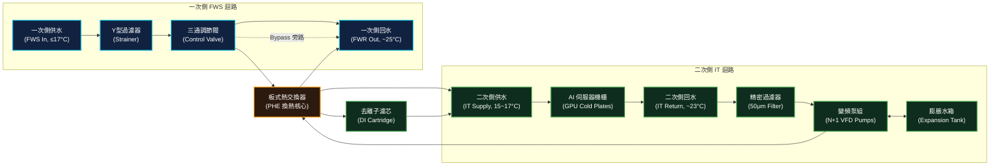

### 核心內部組件功能說明

1. **板式熱交換器 (Plate Heat Exchanger, PHE)**
   - **材質**：通常使用高抗腐蝕的 **316L 不鏽鋼**，表面經精密雷射焊接，耐壓能力 > 10~16 bar。
   - **作用**：高效率換熱，並形成物理屏障，防止一次側混濁的廠務冰水與二次側高純度去離子水混合。
2. **二次側變頻循環水泵 (IT Loop VFD Pumps)**
   - **配置**：通常採 **N+1 備援**（例如雙泵 1+1，或三泵 2+1，通常為垂直多段離心泵）。
   - **控制**：配備變頻器（VFD），依據伺服器發熱量實施**恆定壓差（Constant DP）**控制。
3. **一次側三通調節閥 (3-Way Modulating Control Valve)**
   - **作用**：根據二次側供水溫度的反饋，自動調節流入板式熱交換器的一次側冰水流量。當伺服器低負載時，三通閥將大部分一次側水由旁路（Bypass）直接旁通回水管路，防止二次側過度冷卻導致低溫結露。
4. **精密過濾器 (Secondary Loop Strainers)**
   - **配置**：二次側通常設有 **50 微米 (μm)** 的主過濾器，並在伺服器機架進口處設有 **5 微米** 的二級過濾，確保無碎屑堵塞 Cold Plate 微細流道（Micro-channels）。
5. **去離子濾芯 (DI/Polishing Cartridge)**
   - **作用**：二次側迴路旁接一條小流量的 DI 濾芯（約佔總流量的 5~10%），連續濾除水中的溶解離子，維持電導度 < 10 μS/cm。
6. **穩壓膨脹系統 (Expansion Tank / Accumulator)**
   - **作用**：與 [[儲冷罐]] 及膨脹水箱整合，吸收溫升導致的水體膨脹、維持系統正壓防止氣蝕、並在泵切換時提供壓力補償與熱慣性緩衝。

---

## 2. 關鍵控制邏輯 (Operations & Control)

CDU 的自動控制系統（BMS/PLC）必須高度穩定，以確保 GPU 在極端載荷波動下供水溫度與壓力的平穩。

### A. 二次側流量控制：恆定壓差控制 (DP Control)
*   **機制**：在二次側供水總管（Supply Manifold）與回水總管（Return Manifold）之間裝設**壓差變送器 (DP Sensor)**。
*   **邏輯**：當伺服器因運算結束使 Cold Plate 端的二通閥關閉（或快接拔除）導致管路阻力增加、壓差升高時，CDU PLC 會自動調降變頻泵（VFD）轉速，使壓差維持在設定值。
*   **工程意義**：防止管路超壓損壞快速接頭與冷板，並節省泵功耗。

### B. 二次側供水溫度控制：PID 調節
*   **目標**：維持二次側供水溫度在 **15°C ~ 17°C** 之間（依 GB200 原廠規範）。
*   **邏輯**：
    *   當**二次側供水溫度高於設定值**（例如 17°C），PID 控制器會輸出訊號，加大一次側三通調節閥的開度，讓更多冷冰水流入 PHE。
    *   當**溫度過低**（例如低於 15°C），閥門關小，部分一次側水旁通，以**防止機房露點溫度 (Dew Point) 高於水溫時產生表面結露**。

### C. 泵組備援與故障切換 (Failover)
*   **主從切換 (Lead-Lag)**：雙變頻泵定期（例如每運行 100 小時）進行主備輪換，平衡設備磨損。
*   **故障自檢**：當運作中的泵浦發生故障（電流異常、變頻器告警、或泵後無流量/壓差驟降），PLC 必須在 **< 2.0 秒** 內發出指令啟動備用泵，並在切換期間由累積水罐吸收水阻波動，實現無感無痛切換。

---

## 3. 一/二次側隔離設計與水質指標

水質是決定液冷系統壽命的關鍵。一次側水與二次側水指標相差甚巨：

| 指標項目 | 一次側（廠務冰水 Facility Water）| 二次側（IT 冷卻液 IT Coolant）| 控制技術 / 備註 |
|:---|:---|:---|:---|
| **電導度 (Conductivity)** | 200 ~ 500 μS/cm | **< 10 μS/cm** (最佳常態 1.0~2.0) | 使用 DI 離子交換濾芯連續吸附 |
| **pH 值** | 6.5 ~ 8.5 | **7.0 ~ 9.0** (弱鹼性) | 防止酸性腐蝕銅製冷板，添加緩蝕劑 |
| **濁度 (Turbidity)** | < 5 NTU | **< 1 NTU** | 精密濾芯過濾細小雜質 |
| **生物控制** | 加氯/殺菌劑定期處理 | 嚴格防菌、加長效非氧化性殺菌劑 | 防止生物粘泥堵塞微流道 |
| **物理隔離意義** | 水質差，含泥沙與大顆粒，管路長 | 水質極高，與高溫高壓電子元件直接換熱 | **PHE 傳熱不傳質** 的根本出發點 |

> ⚠️ **警告：二次側電導度超標的危害**
> 若二次側水質變差，電導度上升至 > 50 μS/cm，一旦 Cold Plate 或快速接頭發生微滲漏，液體流經 GPU 板卡將會引發**電弧與短路**，造成單張價值數萬美元的 GPU 晶片永久性燒毀。

---

## 4. Cross-References

*   選型與商務評估：[[CDU 架構與選型]]
*   二次側吸熱組件：[[Cold Plate]]、[[TIM 導熱介面材料]]
*   管路配件：[[快速接頭]]、[[儲冷罐]]
*   物理溫差計算：[[LMTD 計算]]
*   系統整合模組：[[Module 04 - 液冷系統深度解析]]
*   代表廠商實體：[[Vertiv]]、[[CoolIT]]


## ================================================================================
## DOCUMENT: C:\Users\user\Obsidian\Engineering-Wiki\wiki\concepts\03_liquid_cooling\電化學腐蝕與接地.md
## ================================================================================
---
tags: [concept, liquid-cooling, corrosion, grounding, water-quality, electrochemistry]
sources: ["[[液冷系統 - CDU 架構]]", "[[Cold Plate]]", "[[快速接頭]]"]
created: 2026-06-06
updated: 2026-06-06
---

# 電化學腐蝕與接地 (Electrochemical Corrosion & Grounding)

液冷系統長期運行最隱性的殺手不是漏液，而是**電化學腐蝕（Electrochemical Corrosion）**——它在無任何外部徵兆的情況下，悄悄侵蝕管路、冷板與接頭，直到某次例行保養才發現管壁已千瘡百孔。

理解其原理，是液冷系統長期可靠運行的核心知識。

---

## 1. 伽伐尼腐蝕（Galvanic Corrosion）原理

只要以下三個條件**同時存在**，伽伐尼腐蝕就會發生：

1. **兩種不同金屬**（標準電極電位不同）
2. **電解質**（能導電的液體，如含鹽或離子的水）
3. **電氣連通**（兩種金屬之間有電流路徑）

**電池反應模型：**

```
陽極（Anode, 電位較低，被腐蝕）  → 氧化反應，金屬離子溶入水中
陰極（Cathode, 電位較高，被保護）← 還原反應
     ↑                                  ↑
     └──────── 電解質（水）───────────┘
               （離子電流通路）
```

### AIDC 液冷系統的危險金屬組合

| 金屬 | 標準電極電位（V vs. SHE）| 在 DLC 系統中的位置 |
|:---|:---:|:---|
| **鋁（Al）** | -1.67 V（最易腐蝕）| 機架框架、某些伺服器外殼 |
| **鋅（Zn）** | -0.76 V | 鍍鋅鋼製機架配件 |
| **鐵（Fe）** | -0.44 V | 結構鋼、部分管道 |
| **鉛（Pb）** | -0.13 V | 焊接填料 |
| **銅（Cu）** | **+0.34 V（最穩定）** | 冷板（Cold Plate）、銅管 |
| **不鏽鋼（SS316L）** | ~+0.1 V（鈍化後）| 管路、PHE、泵體 |

> **核心危害：** DLC 系統中，**銅冷板（高電位）** 與 **鋁機架（低電位）** 透過冷卻水形成伽伐尼電池，鋁陽極被持續腐蝕。電位差越大（銅 vs 鋁相差 2.0 V），腐蝕速率越快。

---

## 2. 電導度為何是最關鍵的防護參數

### 切斷電解質路徑

伽伐尼腐蝕需要液體「能導電」才能作為離子傳遞介質。**去離子水（Deionized Water）** 幾乎不含離子，電導度極低，幾乎切斷了電解質的電流通路：

$$\text{電流密度} \propto \frac{1}{\text{水的電阻率}} = \text{電導度 (Conductivity)}$$

| 水質狀態 | 電導度 | 伽伐尼腐蝕速率 |
|:---|:---:|:---|
| 自來水（台灣）| ~200~500 μS/cm | 高速腐蝕 |
| 工業純水 | ~10~50 μS/cm | 中速腐蝕 |
| **DLC 二次側目標** | **< 10 μS/cm** | **低速** |
| **理想狀態** | **< 2 μS/cm** | **極緩慢，可接受** |
| 超純水（半導體級）| < 0.1 μS/cm | 幾乎為零 |

> ⚠️ **電導度超標的連鎖危害：** 電導度 > 50 μS/cm → 伽伐尼電流增強 → 銅離子（Cu²⁺）大量溶出 → Cu²⁺ 沉積在鋁件表面形成銅鍍層 → 鋁表面產生的新銅 / 鋁電位差加速鋁腐蝕（自催化惡化）→ 鋁製機架腐蝕穿孔。

### 動態電導度管理

二次側水的電導度不是裝好就一直維持，而是持續變化的：

- **銅離子溶出** → 電導度升高
- **O-Ring 橡膠老化** → 有機物溶出 → 電導度升高
- **大氣 CO₂ 溶入水中** → 形成碳酸 → pH 下降 + 電導度升高

因此，CDU 內設置**去離子濾芯（DI Polishing Cartridge）** 旁路，連續維持電導度 < 10 μS/cm（[[液冷系統 - CDU 架構]]）。

---

## 3. pH 值的腐蝕控制機制

### 弱鹼性環境（pH 7.0~9.0）的保護作用

- 在 pH > 7 的弱鹼環境中，銅表面自然形成一層緻密的**氧化銅（Cu₂O）保護膜**，阻隔後續腐蝕（鈍化效應）。
- pH < 6（酸性）→ 保護膜溶解，銅的腐蝕速率急增（每降低 1 pH，腐蝕速率增加 2~4 倍）。
- pH > 10（強鹼）→ 銅膜溶解（形成 Cu(OH)₄²⁻），同樣有害。

### 緩蝕劑（Corrosion Inhibitor）

除了控制 pH 外，二次側水中通常添加微量緩蝕劑：

| 緩蝕劑 | 作用機制 | 應用 |
|:---|:---|:---|
| **苯并三氮唑（BTA, Benzotriazole）** | 在銅表面形成有機保護層，抑制 Cu 溶解 | DLC 系統銅管路標準添加劑 |
| **亞硝酸鈉（NaNO₂）** | 促進不鏽鋼鈍化膜形成 | SS 管路保護 |
| **鉬酸鈉（Na₂MoO₄）** | 廣譜緩蝕，對銅、鋁均有效 | 混合材質系統 |

> ⚠️ 緩蝕劑的添加量有嚴格限制（ppm 級），過量會影響電導度並引入新的腐蝕問題，需定期化學分析。

---

## 4. 等電位接地設計（Equipotential Bonding）

### 問題根源

伽伐尼腐蝕不只來自液體中的離子電流，還可能來自**漏電流（Stray Current）**：
- IT 設備電源供應器的微量漏電流
- UPS 接地不良造成的中性線電位差
- 靜電電荷積累（液體流動產生靜電，稱為**流動電位，Streaming Potential**）

若機架、CDU、管路的接地電位不一致，微小電位差會在液冷迴路中引發持續腐蝕電流。

### 設計要求

```
[機架 A] ─┐
[機架 B] ─┤
[CDU 本體] ─┼──→ [等電位匯流排 (Equipotential Busbar)] ──→ [機房主接地銅排]
[管路法蘭] ─┤
[乾冷器外殼] ─┘
```

1. **所有金屬外殼統一接地**：機架、CDU 外殼、泵體、乾冷器外殼均透過接地線連至機房等電位匯流排。
2. **橡膠補償節的跨接**：柔性橡膠接頭本身不導電，兩端管段需用跨接銅線（Cross-Bonding Wire）橋接，避免接地中斷。
3. **非金屬管路的接地**：若採用 HDPE 或 CPVC 非金屬管，管內液體的靜電累積需在特定間距設置 **導靜電塗層** 或 **石墨塗敷管段**。

### 去離子水的高電阻率反而帶來靜電風險

純水電阻率高（> 1 MΩ·cm），液體高速流動（Re > 4000）時會在管路內壁和液體之間產生明顯的**電荷分離**（即流動電位）：

- 流速越高 → 靜電積累越快
- 常見於 CDU 泵送壓力高、管路細的 MCCP 系統（高壓降特性）

**處理方式：**
- 系統設計流速不超過 3~4 m/s（降低靜電產生速率）
- 在關鍵位置加裝靜電消散接頭（Anti-Static Fitting）

---

## 5. 水質監測計畫

| 監測項目 | 目標值 | 監測頻率 | 處理手段 |
|:---|:---:|:---:|:---|
| 電導度 (Conductivity) | < 10 μS/cm | 連續監測 | DI 濾芯更換 |
| pH 值 | 7.0 ~ 9.0 | 每月 | 添加 NaOH 或 pH 調節劑 |
| 銅離子 (Cu²⁺) | < 0.1 mg/L | 每季 | 加強 DI 過濾 / 沖洗 |
| 鋁離子 (Al³⁺) | < 0.1 mg/L | 每季 | 檢查異材質接觸點 |
| 濁度 (Turbidity) | < 1 NTU | 每月 | 精密濾芯更換 |
| 細菌 (CFU/mL) | < 100 | 每季 | 加入長效非氧化性殺菌劑 |
| 緩蝕劑濃度 (BTA) | 依廠商規格 | 每半年 | 補充添加 |

---

## 6. Cross-References

- 水質指標詳細規格：[[液冷系統 - CDU 架構]]（一/二次側水質對比表）
- 去離子濾芯原理：[[液冷系統 - CDU 架構]]（DI Polishing Cartridge）
- 漏液後的電弧危害：[[漏液偵測系統]]
- TIM 材質選擇：[[TIM 導熱介面材料]]（銦箔與液態金屬）


## ================================================================================
## DOCUMENT: C:\Users\user\Obsidian\Engineering-Wiki\wiki\concepts\03_liquid_cooling\漏液偵測系統.md
## ================================================================================
---
tags: [concept, liquid-cooling, safety, leak-detection, ESD, DCIM]
sources: ["[[液冷系統 - CDU 架構]]", "[[Cold Plate]]", "[[快速接頭]]"]
created: 2026-06-06
updated: 2026-06-06
---

# 漏液偵測系統 (Liquid Leak Detection System)

在直接液冷（DLC）系統中，**漏液偵測系統（Liquid Leak Detection System）** 是保護價值數萬美元 GPU 晶片的最後一道安全防線。二次側冷卻液一旦滲漏至主板或 GPU 封裝上，即便是高純度去離子水，在直流電場下仍會因微量離子引發**電弧短路（Arc Flash）**，造成晶片永久性燒毀。

---

## 1. 漏液的高危風險點

在一套完整的 DLC 液冷系統中，以下位置是漏液機率最高的薄弱環節：

| 風險位置 | 漏液原因 | 等級 |
|:---|:---|:---:|
| **快速接頭（Quick Disconnect）** | 多次插拔磨損、O-Ring 老化、誤操作帶壓拔除 | 🔴 極高 |
| **Cold Plate 與 GPU 之間的管接頭** | 振動鬆動、熱膨脹反覆應力 | 🔴 極高 |
| **CDU 一/二次側水泵密封件** | 機械密封磨損 | 🟡 中 |
| **柔性軟管（Flexible Hose）** | 彎曲疲勞、接頭夾緊不足 | 🟡 中 |
| **板式熱交換器（PHE）** | 墊片老化、高壓疲勞 | 🟡 中 |
| **地板下或橋架段硬管接頭** | 施工焊接品質不佳 | 🔵 低 |

---

## 2. 偵測技術類型

### A. 點式感測器（Point Sensor）

安裝在特定高風險位置下方，當液體接觸時即觸發告警。

**原理分類：**

1. **導電式（Conductivity-based）**：
   - 兩個相鄰電極，乾燥時電阻 > MΩ 級，液體橋接後電阻驟降至 kΩ 以下
   - 電路偵測到電阻突降 → 觸發告警
   - 優點：靈敏度高，幾乎無誤報
   - 缺點：只能偵測單點，需密集布置

2. **光學式（Optical）**：
   - 利用全反射原理：感測器玻璃稜鏡接觸液體後，折射率改變，全反射消失
   - 優點：不受液體導電性影響（可偵測純水、礦物油）
   - 缺點：浸沒式液冷的絕緣冷媒（氟化液）偵測優選

### B. 繩式感應線纜（Rope-Type / Sensing Cable）

沿管路全線連續布置，任意點漏液均能偵測，並可定位漏液位置。

```
[CDU 出水管路]──[感應線纜]──[快接群]──[感應線纜]──[機架底部滴水盤]
                    ↓
             [線纜監控主機]
                    ↓
             [DCIM / BMS 告警]
```

**工作原理：**
- 感應線纜為同軸多芯結構，外層兩股感應絲與液體接觸後，電阻值（或電容值）在接觸點局部改變
- 主控制器持續掃描線纜阻抗分佈，計算漏液位置（精度 ±1 m）

**優勢：**
- 線性覆蓋，不留死角
- 可定位：主機顯示「距探頭 12.3 m 處漏液」，運維人員立即定位
- 支援 Modbus/BACnet 與 DCIM 整合

**劣勢：**
- 成本高於點式
- 感應線纜一次性（接觸液體後需更換，不可重用）

---

## 3. 系統佈局策略

### 機架內部

```
[機架頂部]
  └─ 冷板進出口快速接頭群：布置點式感測器 × 2（進、出各一）
  └─ 感應線纜沿機架垂直走線
[機架底部]
  └─ 防滴水盤（Drip Tray）：底部中央放置點式感測器
  └─ 集水凹槽 → 洩水閥（常閉，告警後自動開啟）
```

### CDU 本體周圍

- CDU 下方地板設置**防漏堤（Containment Bund）**，感應線纜沿堤內側環繞
- 一次側進出口閥組：點式感測器
- 膨脹水箱底座：點式感測器

### 地板下管路（如有）

- 主幹管路接頭每個節點配置點式感測器
- 感應線纜沿管溝全長布置

---

## 4. 緊急停機聯鎖邏輯（Emergency Shutdown, ESD）

漏液偵測不只是發出警報，更要透過自動聯鎖保護系統阻止災害擴大：

```
漏液感測器觸發
       ↓
[1] DCIM 系統分級告警（嚴重告警，SMS + Email + Pager）
       ↓
[2] 對應機架區域電磁截止閥關閉（< 2 秒）
       ↓
[3] CDU 二次側變頻泵降速 → 停止（防止繼續加壓）
       ↓（若 30 秒內未消警）
[4] 通知值班工程師現場確認
       ↓（若確認為真實漏液）
[5] 對應機架 PDU 斷電（保護 IT 設備）
       ↓
[6] CDU 一次側截止閥關閉（隔離廠務冰水）
```

> ⚠️ **關鍵設計原則**：偵測告警 → 閥門關閉的響應時間必須 **< 2 秒**，否則漏液量可能已足以引發短路。自動斷電必須先於人員介入，不能依靠人工操作。

---

## 5. 與 DCIM 整合

現代 AIDC 的漏液偵測主機透過標準協定（Modbus TCP / BACnet IP）將以下數據上傳 DCIM：

| 數據點 | 說明 |
|--------|------|
| 漏液告警狀態 | 各感測器 / 各線纜區段的即時告警 |
| 漏液位置 | 繩式線纜的定位距離（m） |
| 歷史事件記錄 | 告警時間、持續時長、響應動作 |
| 電磁閥狀態 | 開 / 關 / 故障 |
| 系統健康狀態 | 感測器斷線、主機故障自我診斷 |

---

## 6. 定期測試與維護要求

| 項目 | 頻率 | 說明 |
|------|------|------|
| 點式感測器功能測試 | 每季 | 滴少量純水測試觸發 |
| 繩式線纜阻抗巡檢 | 每月 | 主機自動掃描，確認無斷線 |
| ESD 聯鎖邏輯測試 | 每半年 | 模擬告警，驗證閥門關閉、泵停機時序 |
| 感應線纜更換 | 接觸液體後立即 | 接觸後不可重用 |
| 電磁閥密封測試 | 每年 | 確認閥門在關閉狀態下無洩漏 |

---

## 7. Cross-References

- 液冷二次側水路架構：[[液冷系統 - CDU 架構]]
- 高風險漏液點：[[快速接頭]]（O-Ring 磨損）
- DCIM 整合平台：[[DCIM]]
- 電導度為何影響漏液危害：[[電化學腐蝕與接地]]
- 機架底部防滴水設計：[[Vera Rubin 機櫃物理與電力架構]]（Drip Tray）


## ================================================================================
## DOCUMENT: C:\Users\user\Obsidian\Engineering-Wiki\wiki\concepts\03_liquid_cooling\儲冷罐.md
## ================================================================================
---
tags: [equipment, liquid-cooling, buffer-tank, CDU]
sources: ["[[AIDC HVAC 學習基地 - Notion]]"]
created: 2026-05-20
updated: 2026-06-17
---

# 儲冷罐（Thermal Buffer Tank）

## 一句話理解

儲冷罐就是液冷系統的「緊急蓄冷池」：平時默默儲存低溫冷卻液，等到冷源（CDU / Chiller）異常停機時，靠罐內存量繼續帶走 GPU 的熱，爭取 10~30 分鐘讓控制系統完成安全降載（Graceful Shutdown）。

> **類比：儲冷罐 ＝ 冷卻系統的 UPS。** 就像 UPS 在市電中斷時繼續供電，儲冷罐在冷源中斷時繼續供冷。沒有 UPS，伺服器停電；沒有儲冷罐，GPU 沒有冷卻直接過熱。

---

## 先搞清楚：AIDC 有三種不同的「Buffer Tank」

工程文件常讓人混淆，AIDC 裡「Buffer Tank」其實指三種不同設備：

| 名稱 | 位置 | 容積規模 | 主要用途 |
|-----|------|---------|---------|
| **TCS 儲冷罐** | CDU 二次側液冷迴路 | 數百~數千 L | 液冷緊急緩衝、穩壓穩流、排氣補水 |
| **冷凍水水頭缸** | Chiller 一次/二次側之間 | 數千~數萬 L | 一次/二次側流量解耦（詳見[[冷卻水泵浦系統]]）|
| **蓄冷槽 TES** | Chiller Plant 一次側 | 數萬~數十萬 L | 電力尖峰移載（夜間儲冷、白天釋冷）|

**本頁講的是 TCS 儲冷罐**（液冷 CDU 二次側），規模最小但最靠近 GPU，重要性最高。

---

## 在系統中的位置

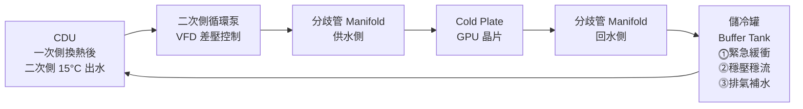

儲冷罐接在**回水側**（GPU 用完的熱水回來後、進泵之前）：
- 回水溫度均勻（無局部高溫），利於排氣
- 泵入口前的低流速區，氣泡自然上浮排出

---

## 三大功能詳解

### ⓵ 熱慣性緩衝（最重要）

CDU 或 Chiller 異常停機後，GPU 仍持續發熱。儲冷罐內的低溫冷卻液繼續流動，爭取時間：

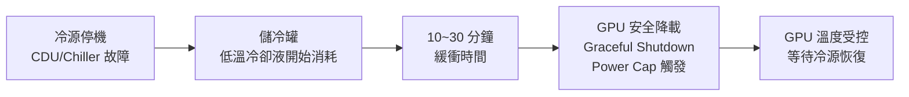

沒有緩衝時間：CDU 停機 → GPU 繼續滿載 → 幾分鐘內過熱 → **Thermal Shutdown 或硬體損壞**。

---

### ⓶ 穩壓穩流

液冷管路中產生壓力衝擊的場景：

| 事件 | 衝擊原因 |
|-----|---------|
| 快速接頭帶壓插拔 | 瞬間阻力突變，水柱動量改變 |
| VFD 泵轉速快速調整 | 流速瞬間升降，管路壓力波 |
| 多台伺服器同時開/關流量閥 | 並聯迴路阻力分佈突變 |

**水錘（Water Hammer）不緩衝的後果：**
- Cold Plate 內 0.5~2 mm 微流道因衝擊變形或裂縫
- 快速接頭密封件加速磨損 → 滴漏
- 管路振動 → 接頭逐漸鬆動

**緩衝機制：** 儲冷罐液面上方保留氮氣（N₂）氣層或橡膠氣囊，如同液壓彈簧，吸收壓力波。

---

### ⓷ 排氣補水

**為什麼氣泡危險：**

```
氣泡進入 Cold Plate 微流道
    → 阻塞部分流道，冷卻液無法通過
    → 局部 Dry Spot（乾燒點）
    → GPU Die 局部溫度飆升
    → Thermal Throttling 降頻
    → 嚴重時晶片損壞
```

儲冷罐頂部設置**自動排氣閥（Automatic Air Vent）**：

- 氣泡比水輕，自然上浮到罐頂
- 排氣閥感測到氣體自動開閥排出
- 排出後水位略降 → 補水閥自動補充去離子水

> 新系統安裝或維修後必須先手動**排氣充液（Purging）**，讓整個迴路完全充滿冷卻液再開機。

---

## 容積計算（最重要的設計步驟）

### 公式

```
V_buffer（L）= P_IT（kW）× t_buffer（min）× 60
              ─────────────────────────────────────
               ρ（kg/L）× Cp（kJ/kg·°C）× ΔT_允許（°C）

P_IT   = GPU 滿載功耗（kW）
t      = 目標緩衝時間（分鐘，AIDC 標準 ≥ 10 min）
ρ      = 冷卻液密度，純水 1.0 kg/L
Cp     = 比熱，純水 4.186 kJ/(kg·°C)
ΔT     = 允許水溫上升量（°C），通常取 5~10°C
```

### 範例計算

GB200 NVL72 機架，IT 負載 132 kW，目標緩衝 10 分鐘，允許水溫上升 8°C：

```
V = 132 × 10 × 60
    ─────────────────
    1.0 × 4.186 × 8

V = 79,200 / 33.5 ≈ 2,364 L ≈ 2.4 m³
```

加上 20% 安全裕度 → **設計選用 ~2,900 L（≈3 m³）的儲冷罐**。

> ΔT 允許值越小（對溫度越敏感），需要的罐體越大、越重。GB200 供水上限 17°C，實際設計時 ΔT 通常取 5~6°C，儲冷罐體積會更大。

---

## 設計規格參考

| 參數 | 典型值 |
|------|-------|
| 容積（中型 AIDC，單 CDU）| 500~3,000 L |
| 材質 | 304/316L 不鏽鋼（純水環境）|
| 工作壓力 | 6~10 bar（與二次側管路相同）|
| 緩衝時間目標 | **≥ 10 分鐘**（Graceful Shutdown 最低需求）|
| 安裝位置 | 回水側，靠近泵入口，高點設排氣閥 |
| 氣層 / 氣囊預壓 | 1.0~1.5 bar N₂（穩壓用）|
| 二次側水量比例 | 儲冷罐容積 ≈ 迴路總水量的 10~20% |

---

## Cross-References

- 上層系統：[[CDU 架構與選型]]（儲冷罐是 CDU 內建或外掛的標配）
- 功能類比：[[UPS]]（儲冷罐之於液冷 = UPS 之於電力）
- 壓力衝擊來源：[[快速接頭]]（帶壓插拔是主要水錘來源）
- 氣泡的受害者：[[Cold Plate]]（微流道最怕乾燒）
- 水頭缸（不同概念）：[[冷卻水泵浦系統]]（Chiller 一次/二次側解耦用）
- 蓄冷槽 TES（不同概念）：[[Chiller Plant]]（大規模電力尖峰移載）
- 液冷架構：[[Module 04 - 液冷系統深度解析]]


## ================================================================================
## DOCUMENT: C:\Users\user\Obsidian\Engineering-Wiki\wiki\concepts\04_cooling_sources\Chiller Plant.md
## ================================================================================
---
tags: [concept, chiller, cooling-plant, primary-loop, water-treatment, three-loop]
sources: ["[[AIDC HVAC 學習基地 - Notion]]"]
created: 2026-05-20
updated: 2026-06-06
---

# Chiller Plant

**Chiller Plant（冷凍機房）** 是 AIDC 一次側冷源系統，負責產生冷凍水供給整棟建築冷卻需求。是 HVAC 工程師的「後台主機房」。

## 冷凍機（Chiller）類型比較

| 類型 | 容量範圍 | 特點 | AIDC 適用性 |
|------|---------|------|------------|
| **離心式（Centrifugal）**| 500~5,000 RT | 大容量，可 VFD 變頻 | ✅ 大型 AIDC 主流 |
| 螺桿式（Screw）| 100~1,500 RT | 維護簡單，部分負載效能差 | 中型或備用 |
| **磁浮式（Magnetic Bearing）**| 200~2,000 RT | 零摩擦，部分負載 COP 卓越 | ✅ AIDC 首選 |
| 吸收式（Absorption）| — | 廢熱驅動，無壓縮機電耗 | 特殊場景（熱電聯產）|

## COP 與效率

**COP = 冷卻輸出（kW）÷ 輸入電力（kW）**

磁浮式 vs 傳統離心式部分負載 COP：

| 負載率 | 傳統離心式 | 磁浮式 |
|-------|----------|------|
| 100% | 6.0 | 6.5 |
| 75% | 5.0 | 7.0 |
| **50%** | **3.5** | **8.0** |
| 25% | 2.0 | 7.5 |

> 磁浮的是**轉軸軸承**（消除摩擦），50% 負載時 COP 是傳統的 2 倍以上。

## 台數計算（必背流程）

```
設計冷卻容量（kW）× 設計裕度（1.2）
↓ ÷ 3.517
所需 RT
↓ ÷ 單台容量（RT）
台數 → 無條件進位
↓ + N+1 備援
最終台數
```

> ⚠️ **永遠無條件進位**——少一台 = 設計容量不足 = 機房過熱

## 冷凍水分配系統

- **一次側（Primary Loop）**：冷凍機 → 熱交換器 → 冷凍機，6/12°C
- **二次側（Secondary Loop）**：熱交換器 → CRAH 盤管 → 熱交換器，7/14°C
- 熱交換器隔離：保護冷凍機側水質不被機房側污染

## 冷卻塔設計

**AIDC 主流：開放式冷卻塔**（效率高，配合水質管理保護）

- 設計接近溫度（Approach）：3~5°C
- **出水溫度下限 = 濕球溫度 + 接近溫度**
- 台灣夏季濕球 26~28°C → 出水最低 29~33°C → GB200 供水 ≤ 17°C 無法靠冷卻塔達成

水質管理（防軍團菌）：殺菌劑、防垢劑，依 ASHRAE Guideline 12-2020 定期清洗

## 備援架構

| 架構 | 說明 | 鴻海 AIDC |
|------|------|---------|
| N+1 | 任一故障，剩餘機組仍可滿載 | ✅ 標準配置 |
| 2N | 完全雙路備援 | Tier IV 要求 |

- 緊急情況：蓄冷槽（Thermal Energy Storage）提供 10~30 分鐘緩衝

## 冷凍水系統的三側水路架構

大型 AIDC 通常採用**三側（三次側）水路**，以最大化靈活性與水質隔離：

```
一次側（Primary Loop）：
  冷凍機（Chiller）↔ 一次側定流泵 ↔ [水頭缸 Buffer Tank]
  典型溫度：6°C 供 / 12°C 回

二次側（Secondary Loop）：
  [水頭缸] ↔ 二次側變流泵（VFD）↔ CRAH 盤管 / PHE
  典型溫度：7°C 供 / 14°C 回
  作用：依各樓層/區域負載調節流量，與一次側流量解耦

三次側（Tertiary Loop / IT Coolant Loop）：
  CDU 內 PHE ↔ 二次側 VFD 泵 ↔ GPU Cold Plates
  典型溫度：15°C 供 / 23°C 回（GB200 標準）
  作用：高純度去離子水與廠務冰水完全隔離
```

**為何需要三側？**
- 一次側：定流量保護 Chiller 穩定運行
- 二次側：變流量配合機房各區不等負載，節省泵功耗
- 三次側：高純度 DI 水保護 GPU 冷板，物理隔離廠務側水質

## 冷凍水化學水處理

開放式冷卻塔系統（冷卻水側）與密閉式冷凍水系統（冷凍水側）各有不同處理需求：

### 冷卻水側（開放式，與冷卻塔循環）

| 處理項目 | 目的 | 藥劑類型 |
|:---|:---|:---|
| **阻垢劑（Scale Inhibitor）** | 防止碳酸鈣在熱表面結垢，降低換熱效率 | 有機磷酸鹽 |
| **緩蝕劑（Corrosion Inhibitor）** | 保護銅管（冷凝器）與鋼管免受腐蝕 | BTA + 鉬酸鈉 |
| **殺菌劑（Biocide）** | 防止軍團菌（Legionella pneumophila）繁殖 | 次氯酸鈉（氧化性）+ 異噻唑啉酮（非氧化性，交替使用）|
| **排汙控制（Blowdown）** | 濃縮倍數（CoC）控制在 3~5 倍 | 依水質分析定期手動/自動排汙 |

### 冷凍水側（密閉式）

- 主要風險：**腐蝕**（密閉系統無礦化，但異金屬接觸問題）
- 處理：添加緩蝕劑（鉬酸鹽 + BTA）+ pH 調整（維持 7.5~9.0）
- **不需殺菌劑**（密閉系統，陽光無法進入，Legionella 無法繁殖）

## 代表廠商

- **Carrier**（開利）— 全球最大 Chiller 品牌，AquaForce Vision（R-1234ze）
- **Trane**（特靈）— CVHE 超低壓離心機，模組化冷凍機房
- **Daikin**（大金）— Turbocor 磁浮技術，部分負載 COP 最佳
- **Johnson Controls（York）** — Turbocor 技術前身，YZ 系列磁浮機
- 三菱重工（Mitsubishi Heavy Industries）— 日系高穩定性

## Cross-References

- 冷媒選型：[[冷媒知識]]（R-1234ze 趨勢）
- Free Cooling 整合：[[Free Cooling]]、[[乾冷器]]
- 效率指標：[[PUE 計算]]、[[LMTD 計算]]
- 設備詳解：[[磁浮式冷凍機]]、[[冷卻水塔]]、[[氣冷式冰機]]、[[吸收式冰機]]
- 液冷連接：[[CDU 架構與選型]]
- 水質隔離：[[電化學腐蝕與接地]]
- 計算：[[Module 05 - 冷源與冷凍機房]]、[[Module 07 - 設計計算實務]]
- 廠商：[[Carrier]]、[[Daikin]]、[[Trane]]、[[Module 08 - 廠商生態系統]]


## ================================================================================
## DOCUMENT: C:\Users\user\Obsidian\Engineering-Wiki\wiki\concepts\04_cooling_sources\Free Cooling.md
## ================================================================================
---
tags: [concept, free-cooling, economizer, energy, dry-cooler]
sources: ["[[AIDC HVAC 學習基地 - Notion]]"]
created: 2026-05-20
updated: 2026-06-06
---

# Free Cooling

**Free Cooling（自然冷卻）** 是利用戶外低溫直接或間接帶走機房熱量，使冷凍機停機或部分運轉，是降低 AIDC 運營電費最有效的手段之一。

## 三種主要形式

| 類型 | 原理 | 適用條件 | 效益 |
|------|------|---------|------|
| 直接空氣自然冷卻 | 戶外冷空氣直接送入機房 | 戶外溫度 < 18°C 且無污染 | PUE 最低，但受地點限制 |
| 間接蒸發冷卻（IEC）| 戶外空氣冷卻冷凍水，不直接接觸 IT | 戶外濕球溫度 < 16°C | 水質可控，適合大部分地點 |
| **冷凍水側（Waterside Economizer）**| 冷卻塔直接供冷凍水 | 戶外濕球 < 10°C | 最常見，台灣冬季可部分使用 |

## 關鍵公式

**冷卻塔出水溫度下限 = 當地濕球溫度 + 接近溫度（3~5°C）**

→ 這個溫度決定 Free Cooling 是否可行，**瓶頸在冷卻塔，不在 Chiller**。

## 全球各地 Free Cooling 可用時數

| 地點 | 濕球溫度 | Free Cooling 可用時數 | GB200 供水可行性 |
|------|---------|-------------------|----------------|
| 北歐（瑞典、芬蘭）| 年均 < 10°C | **> 6,000 hr/yr** | ✅ 冬季完全可行 |
| 台灣北部 | 夏 26~28°C / 冬 12~16°C | **1,000~2,000 hr/yr** | ⚠️ 僅冬季部分 |
| 新加坡 | 全年 25~27°C | **< 500 hr/yr** | ❌ 幾乎不可行 |

> Meta、Google 選址北歐的核心原因就是 Free Cooling 時數極長，年省電費以億計。

## 台灣策略

- 夏季：Chiller 全力運轉，Free Cooling 無法使用
- 冬季（12~2月）：加裝 Waterside Economizer，Chiller 部分停機，可節省 **15~25%** 電費
- GB200 供水 ≤ 17°C：台灣氣候全年均需 Chiller 輔助

## Free Cooling 不是開關，是光譜

冷卻塔出水越低 → Chiller 工作越輕鬆 → COP 越高 → PUE 越低。即使無法完全停 Chiller，低溫天氣仍可大幅提升 Chiller 效率。

## 乾冷器（Dry Cooler）— 溫水液冷時代的 Free Cooling 主力

傳統 Free Cooling（Waterside Economizer）仍需要冷卻塔，出水溫度受**濕球溫度**限制，台灣夏季仍無法免除 Chiller。

**Vera Rubin 平台 45°C 溫水方案的突破**：

- 供水溫度限制放寬至 45°C，回水最高 65°C
- 此時可改用**乾冷器（Dry Cooler）**取代冷卻水塔 + Chiller 的組合
- 乾冷器出水溫度受**乾球溫度**限制，台灣夏季 DBT = 35°C → 乾冷器出水 38~40°C，**仍低於 45°C 的供水要求**
- 全球任何氣候區均可 **100% Chiller-Free**，WUE = 0

| 冷源方案 | Free Cooling 可行溫度限制 | 台灣夏季 | WUE |
|:---|:---:|:---:|:---:|
| 冷卻塔 + Waterside Economizer | 需達到 ≤ 設計供水溫度 | ❌（GB200 ≤17°C 需求）| 高 |
| **乾冷器（Dry Cooler）**| 環境 DBT + 接近溫度 ≤ 45°C | ✅（Vera Rubin 可行）| **= 0** |

詳細說明見 [[乾冷器]]、[[Dry Cooler vs. 密閉式冷卻水塔]]。

## Economizer Mode 控制邏輯

以 **Waterside Economizer（冷凍水側自然冷卻）** 為例，完整的控制模式：

```
模式 A：全機械冷卻（Pure Mechanical Cooling）
  條件：WBT > 12°C（台灣春夏秋）
  → Chiller 全開，冷卻塔輔助散熱

模式 B：部分 Free Cooling（Partial Economizer）
  條件：5°C < WBT < 12°C（台灣冬季）
  → Chiller 低負載 + Waterside Economizer 補助
  → 三通閥調節冷凍水比例

模式 C：全 Free Cooling（Full Economizer）
  條件：WBT < 5°C（台灣幾乎不出現，北歐常態）
  → Chiller 完全停機，冷卻塔直接供冷凍水
```

**控制關鍵參數：**
- 切換觸發條件：依「冷卻塔出水溫度」（而非 WBT），避免延遲
- 防結露保護：當 Free Cooling 供水溫度低於機房露點溫度時，三通閥限制最低供水溫度（通常 ≥ 13°C）

## Cross-References

- 相關：[[Chiller Plant]]、[[PUE 計算]]、[[LMTD 計算]]
- 乾冷器詳解：[[乾冷器]]（Vera Rubin 45°C 溫水方案核心）
- 高溫冷卻液完整技術解析：[[高溫冷卻液與溫水冷卻技術]]
- 比較：[[Dry Cooler vs. 密閉式冷卻水塔]]
- 應用：[[Module 05 - 冷源與冷凍機房]]
- 設計：[[Module 07 - 設計計算實務]]
- 供水溫度限制：[[GB200 NVL72 冷卻需求]]、[[Vera Rubin 機櫃物理與電力架構]]


## ================================================================================
## DOCUMENT: C:\Users\user\Obsidian\Engineering-Wiki\wiki\concepts\04_cooling_sources\冷卻水泵浦系統.md
## ================================================================================
---
tags: [equipment, pump, chilled-water, VFD, primary-secondary, cooling-source]
sources: ["[[AIDC HVAC 學習基地 - Notion]]"]
created: 2026-06-17
updated: 2026-06-17
---

# 冷卻水泵浦系統（Cooling Water Pump System）

AIDC 冷卻水路裡有三種主要泵浦迴路，各自服務不同的水系統。泵浦是唯一讓冷卻水持續流動的動力來源，選型與控制邏輯直接影響 PUE。

| 泵浦類型 | 服務迴路 | 控制方式 | 典型揚程 |
|---------|---------|---------|---------|
| **冷凍水一次側泵（CHWP-P）** | Chiller ↔ 水頭缸 | 定速（與冰機連動）| 15~25 m |
| **冷凍水二次側泵（CHWP-S）** | 水頭缸 ↔ CRAH/CDU | VFD 差壓控制 | 20~35 m |
| **冷卻水泵（CWP）** | Chiller 冷凝器 ↔ 冷卻水塔 | 定速或 VFD | 15~25 m |
| **CDU 二次側泵（TCS Pump）** | CDU PHE ↔ 伺服器冷板 | VFD 差壓控制 | 25~35 m |

---

## 泵浦基礎參數

### 流量（Q）

單位：m³/h、L/min、GPM（US gallons per minute）

```
Q = P_cooling / (ρ × Cp × ΔT)

P_cooling = 冷卻需求（kW）
ρ = 密度，純水 ~1,000 kg/m³
Cp = 比熱，純水 4.186 kJ/(kg·°C)
ΔT = 供回水溫差（°C）
```

範例：冷凍水 6/12°C（ΔT = 6°C），冷卻 1,000 kW：
Q = 1,000 / (1,000 × 4.186/3600 × 6) = **40.1 m³/h（668 L/min）**

### 揚程（H）

泵浦克服管路所有阻力所需的壓差，以「米水柱（m）」表示：

```
ΔP（Pa）= H（m）× ρ × g = H × 1,000 × 9.81

例：25 m 揚程 = 25 × 1,000 × 9.81 = 245,250 Pa ≈ 2.45 bar
```

管路阻力來源：直管摩擦（Darcy-Weisbach）+ 局部阻力（彎頭、閥門、換熱器）。

### 功率（P）與效率（η）

```
P_水力（kW）= ρ × g × Q × H / 1,000
           = (1,000 × 9.81 × Q[m³/s] × H[m]) / 1,000

P_軸功率（kW）= P_水力 / η_pump

P_電功率（kW）= P_軸功率 / η_motor

η_pump（優良）= 75~88%
η_motor（IE3/IE4）= 92~96%
```

---

## 泵浦特性曲線與系統曲線

### 泵浦曲線、系統曲線與 VFD 工作點

下圖同時顯示三條曲線：全速泵浦曲線（100% N）、VFD 降速後的泵浦曲線（80% N）、以及系統阻力曲線（ΔP = R × Q²）。**兩條曲線的交叉點就是實際運行工作點。**

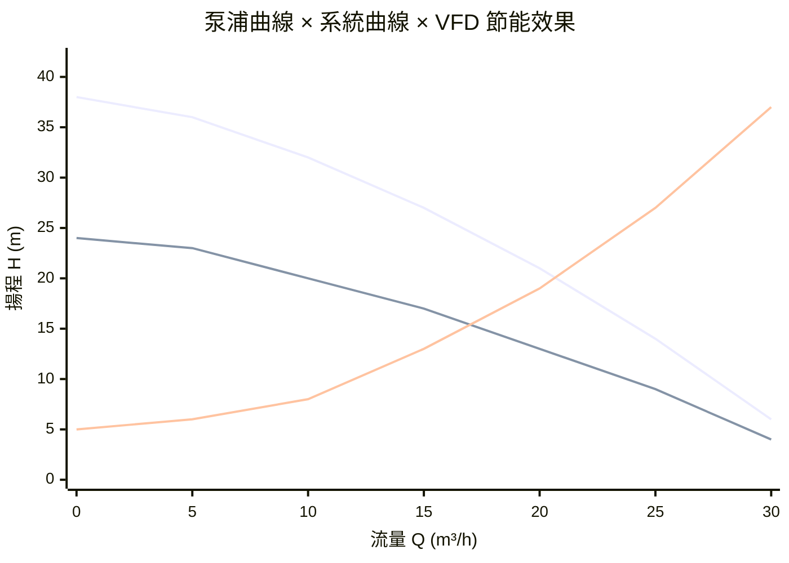

| 工作點 | 流量 Q | 揚程 H | 相對功耗 |
|-------|-------|-------|---------|
| 全速（100% N）| ~19 m³/h | ~18 m | 100% |
| VFD 降速（80% N）| ~14 m³/h | ~12 m | **~51%** |

> 泵浦選型目標：工作點落在泵浦曲線的高效率區間（Best Efficiency Point, BEP）附近。偏離 BEP 過遠 → 效率下降 → 能耗增加 → 軸承磨損加速。

---

## VFD 變頻控制與相似律（Affinity Laws）

### 相似律（最重要！）

泵浦轉速改變時，Q、H、P 的關係：

```
Q₂/Q₁ = N₂/N₁           （流量與轉速成正比）
H₂/H₁ = (N₂/N₁)²        （揚程與轉速平方成正比）
P₂/P₁ = (N₂/N₁)³        （功率與轉速三次方成正比）
```

**關鍵在三次方律：轉速降低 20%，功耗降至 51%：**

```
N₂/N₁ = 0.8
P₂/P₁ = 0.8³ = 0.512  → 省電 48.8%
```

| 轉速比（N₂/N₁）| 流量比 Q | 揚程比 H | 功耗比 P |
|--------------|---------|---------|---------|
| 100%（全速）| 100% | 100% | 100% |
| 90% | 90% | 81% | 73% |
| 80% | 80% | 64% | **51%** |
| 70% | 70% | 49% | **34%** |
| 60% | 60% | 36% | **22%** |

> 這就是二次側泵安裝 VFD 的最大理由：AIDC 大多時間在部分負載，泵浦轉速只需 70~80%，功耗直接砍半以上。

### VFD 控制邏輯（恆壓差控制）

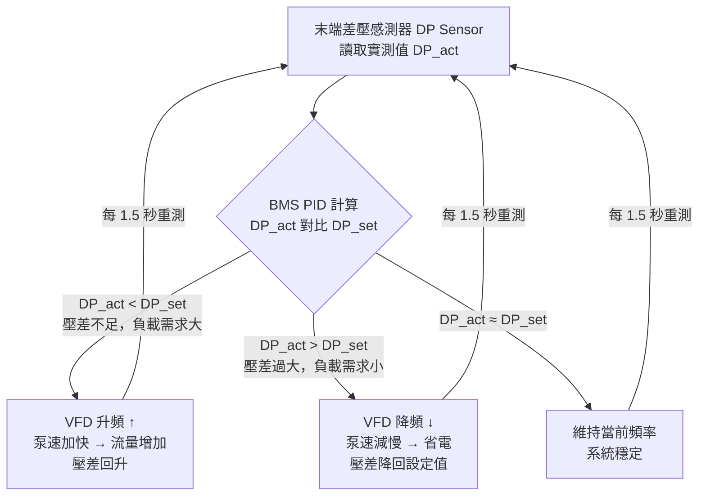

設定差壓（DP_set）通常取最不利迴路（末端機櫃）的設計壓差，約 **0.8~1.5 bar**。

---

## 一次 / 二次側解耦架構（Primary-Secondary Decoupling）

這是 AIDC 冷凍水系統最重要的水路設計概念。

### 為什麼需要解耦？

冰機（Chiller）有固定流量要求——流量太低會導致蒸發器結冰，太高則無意義浪費泵功。但機房側的負載是動態變化的，流量需求隨 IT 負載波動。

**解決方案：用水頭缸（Buffer Tank）或旁路管（Common Pipe）隔開兩個迴路。**

### 架構圖

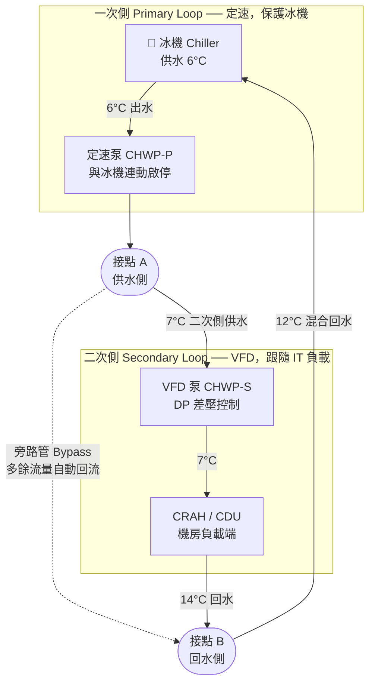

### 旁路管的關鍵作用

| 情況 | 旁路管流向 | 說明 |
|-----|----------|------|
| 機房負載小，二次側需求 < 一次側供應 | 一次側多餘流量→旁路管→回到冰機 | 冰機流量維持穩定，不會空轉 |
| 機房負載大，二次側需求 > 一次側供應 | 回水部分從旁路管補入 | 供水溫度略升，但冰機不超載 |
| 滿負載，兩側流量相等 | 旁路管無流動 | 理想設計工況 |

> ⚠️ 旁路管若設計過短（阻力過小）會造成「短路」：一次側冷水未進機房就直接回流，供水溫度上升，冷卻效果大降。正確設計是讓旁路管阻力僅略低於末端迴路。

---

## NPSH 與空蝕（Cavitation）

### 什麼是空蝕？

泵浦葉輪入口若壓力低於該溫度下的水蒸氣壓，水會局部沸騰形成氣泡。氣泡在高壓區瞬間崩潰，產生微型衝擊波，侵蝕葉輪表面，最終導致葉輪蜂窩狀損壞。

### NPSH 定義

```
NPSHa（有效汽蝕餘量）= 泵浦入口絕對壓力 - 該溫度水蒸氣壓（均以m換算）
NPSHr（必須汽蝕餘量）= 泵浦廠商規定的最小值（由葉輪設計決定）

安全條件：NPSHa > NPSHr + 1 m（安全裕度）
```

### AIDC 常見空蝕原因與對策

| 原因 | 場景 | 對策 |
|-----|------|------|
| 入口靜壓不足 | 泵浦安裝位置過高，吸水管路過長 | 泵浦盡量靠近水頭缸（低位安裝）|
| 水溫偏高 | 回水溫度高（如 CDU 回水 35°C+）| 提高系統靜壓（膨脹罐預壓）|
| 入口過濾器堵塞 | Y 型濾網積垢，壓差上升 | 定期清洗，設差壓告警 |
| 流量過大（超設計點）| 並聯冰機分台運行後流量重分配 | 設流量保護上限 |

> **CDU 液冷系統的膨脹罐預壓設計（1.0~1.5 bar）**就是為了確保在高回水溫度下 NPSHa 仍大於 NPSHr，防止空蝕。

---

## AIDC 各迴路泵浦類型

### 冷凍水側（CHW 迴路）

- **臥式單吸離心泵（End Suction Centrifugal Pump）**：最常見，流量 50~500 m³/h，維護方便
- **臥式雙吸離心泵（Double Suction Split Case Pump）**：大流量場景（>500 m³/h），軸向力平衡，壽命長

### CDU 二次側（TCS 迴路）

- **無軸封屏蔽泵（Canned Motor Pump）**：轉子在冷卻液中旋轉，無機械密封，**零洩漏風險**，AIDC 首選
- **磁力驅動泵（Magnetic Drive Pump）**：磁力隔離驅動，同樣無軸封，適合純水或腐蝕性液體

> **AIDC CDU 絕對不用有機械密封的泵浦。** 機械密封磨損後會滴漏，在伺服器機架旁發生漏液是一級事故。

### 泵浦備援

| 備援模式 | 說明 | AIDC 標準 |
|---------|------|---------|
| N+1（互備）| 每組系統多配一台備用泵，故障自動切換 | ✅ 冷凍水側標準 |
| 雙泵各 100%| 兩台各自能承擔 100% 流量，平時一用一備 | ✅ CDU 二次側標準 |
| 並聯擴容 | 多台同型泵並聯，共同承擔流量（但不計為備援）| 大流量場景 |

---

## 並聯泵運行原理

兩台相同泵並聯運行時，**理論上流量加倍，揚程不變**，但實際工作點受系統曲線陡峭程度影響：

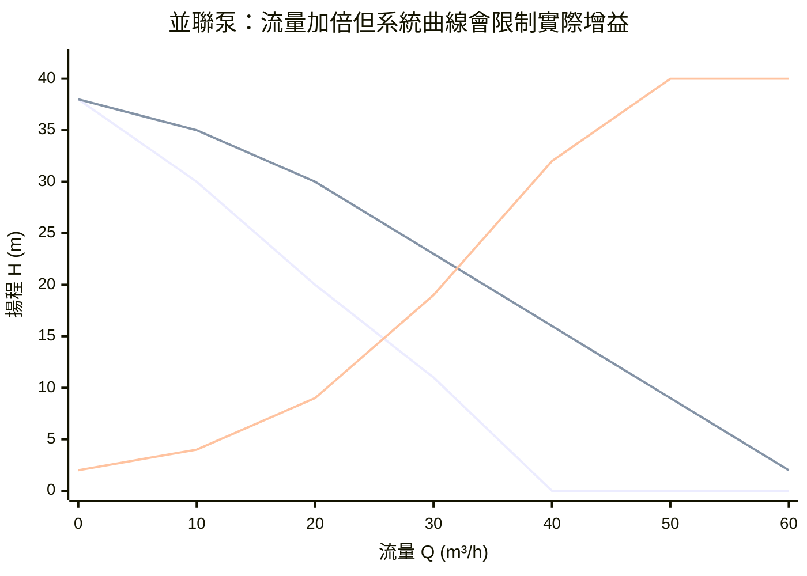

| 運行狀態 | 工作點流量 | 說明 |
|---------|----------|------|
| 單泵 | ~21 m³/h | 單泵曲線 × 系統曲線交叉 |
| 並聯 2 台 | ~34 m³/h | 並非 2 倍（42 m³/h），系統阻力限制了增益 |

> ⚠️ **並聯陷阱：** 系統曲線越陡（高阻力管路），並聯增益越小。極端情況下第二台泵幾乎無法出力。並聯適合**低揚程、高流量、系統曲線平緩**的場景。

---

## Cross-References

- 冷凍水系統架構：[[Chiller Plant]]（一次/二次/三次側水路完整架構）
- CDU 泵選型計算：[[CDU 架構與選型]]（揚程計算、無軸封泵規格）
- VFD 差壓控制邏輯：[[BMS與DCIM序列控制邏輯]]（PID 控制序列、設定值調整）
- 系統靜壓與防空蝕：[[CDU 架構與選型]]（膨脹罐預壓設計）
- 乙二醇對泵浦的影響：[[TCS 二次側與冷卻水化學管理]]（黏度升高導致壓降增加 20%）
- 效率計算：[[PUE 計算]]（泵浦功耗佔冷卻總功耗 10~20%）
- 空蝕與漏液防護：[[漏液偵測系統]]、[[AIDC FMEA 故障模式與效應分析]]


## ================================================================================
## DOCUMENT: C:\Users\user\Obsidian\Engineering-Wiki\wiki\concepts\04_cooling_sources\冷卻水塔.md
## ================================================================================
---
tags: [equipment, cooling-tower, chiller-plant, water-quality]
sources: ["[[AIDC HVAC 學習基地 - Notion]]"]
created: 2026-05-20
updated: 2026-05-20
---

# 冷卻水塔（Cooling Tower）

**冷卻水塔**是 Chiller Plant 的散熱端，負責把冷凍機產生的廢熱排到大氣中。冷卻塔的出水溫度下限決定了整個冷源系統能達到的最低供水溫度，是 Free Cooling 可行性的關鍵瓶頸。

> **核心觀念：瓶頸永遠在冷卻塔，不在冰機。** 冰機要多冷都可以，但冷卻水溫度下限被冷卻塔的濕球溫度綁死。

## 工作原理

冷卻塔利用水蒸發帶走熱量（蒸發冷卻）：
1. 熱冷卻水（Chiller 排熱後）進入冷卻塔頂部噴灑
2. 空氣從下方或側面流入，與水接觸
3. 部分水蒸發（每蒸發 1 kg 水帶走 2,442 kJ 熱量）
4. 冷卻後的水回流至 Chiller 冷凝器

## 開放式 vs 密閉式

| 比較項目 | 開放式（Open Circuit）| 密閉式（Closed Circuit）|
|---------|---------------------|----------------------|
| 冷卻效率 | 高（水直接蒸發）| 較低（多一層盤管熱阻）|
| 水質管理 | 複雜（需加藥、防軍團菌）| 簡單（封閉循環）|
| 維護需求 | 定期清洗、補充水量大 | 較低 |
| **AIDC 使用** | **✅ 主流選擇** | 小型或特殊場景 |

> ⚠️ AIDC 主流用開放式冷卻塔，因效率高，水質管理問題用加藥解決。

## 關鍵設計參數

### 濕球溫度（Wet-Bulb Temperature）

冷卻塔出水溫度的**物理下限**由當地**濕球溫度**決定，無法突破。

$$T_{出水} \geq T_{濕球} + \Delta T_{接近}$$

| 參數 | 說明 | 典型值 |
|------|------|-------|
| **接近溫度（Approach）**| 出水溫度與濕球溫度的差值 | 3~5°C |
| 冷卻幅度（Range）| 進水溫度 - 出水溫度 | 5~8°C |

### 各地氣候對冷卻塔的影響

| 地點 | 夏季濕球 | 冷卻塔出水下限 | GB200 供水（≤17°C）可行性 |
|------|---------|--------------|------------------------|
| 台灣（夏）| 26~28°C | 29~33°C | ❌ 完全不行，需 Chiller |
| 台灣（冬）| 12~16°C | 15~21°C | ⚠️ 部分冬季可行 |
| 新加坡（全年）| 25~27°C | 28~32°C | ❌ 幾乎不行 |
| 北歐（全年）| < 10°C | 13~15°C | ✅ 大部分時間可行 |

## 冷卻塔台數配置

| 設計原則 | 說明 |
|---------|------|
| 單台容量 | 通常 500~3,000 RT/台 |
| 備援架構 | N+1（與 Chiller 台數對應）|
| Cell 分區 | 多 Cell 設計，可部分停機維修 |
| 位置要求 | 遠離發電機排氣口（≥15~20m，需 CFD 驗證）|

## 水質管理

AIDC 冷卻塔水質管理依 **ASHRAE Guideline 12-2020** 執行。

| 管理項目 | 說明 | 目的 |
|---------|------|------|
| 殺菌劑（Biocide）| 定期加藥 | 防止軍團菌（Legionella）滋生 |
| 防垢劑（Scale Inhibitor）| 持續加藥 | 防止碳酸鈣結垢影響換熱效率 |
| 腐蝕抑制劑 | 持續加藥 | 保護銅管、鋼鐵件不腐蝕 |
| 濃縮循環比率 | 3~5 | 控制水質濃度，定期排放補充新水 |
| 定期清洗 | 每年至少 1~2 次 | 物理清除生物膜、水垢 |

## Cross-References

- 系統：[[Chiller Plant]]
- 節能：[[Free Cooling]]（冷卻塔出水溫度決定 Free Cooling 可行性）
- 計算：[[LMTD 計算]]、[[Module 05 - 冷源與冷凍機房]]
- 電力協調：[[發電機]]（排氣方向不能朝向冷卻塔進風面）
- 設計驗證：[[CFD 模擬]]（外流場確認發電機排氣影響）


## ================================================================================
## DOCUMENT: C:\Users\user\Obsidian\Engineering-Wiki\wiki\concepts\04_cooling_sources\冷媒知識.md
## ================================================================================
---
tags: [concept, refrigerant, chiller, GWP, F-gas, environmental, refrigeration]
sources: ["[[Chiller Plant]]", "[[磁浮式冷凍機]]", "[[Module 05 - 冷源與冷凍機房]]"]
created: 2026-06-06
updated: 2026-06-06
---

# 冷媒知識 (Refrigerant Knowledge)

**冷媒（Refrigerant）** 是冷凍機（Chiller）壓縮式製冷循環的工作介質，透過液化（放熱）和蒸發（吸熱）的相變過程，將熱量從低溫處（冷凍水）搬運至高溫處（冷卻水塔）。冷媒的選擇直接影響 Chiller 的效率（COP）、環境合規性（GWP/ODP）及未來採購成本。

---

## 1. 冷媒的四代演化

### 第一代（1930s~1970s）：CFC（氯氟碳化物）
- 代表：R-11（CCl₃F）、R-12（CCl₂F₂）
- **問題：ODP（臭氧層破壞潛勢）極高**，1987 年蒙特婁議定書全面禁止
- **AIDC 狀態：** 完全淘汰，不在討論範圍

### 第二代（1990s~2010s）：HCFC（氫氯氟碳化物）
- 代表：R-22（CHClF₂）
- ODP 較低但不為零，GWP = 1,810
- 已於 2030 年在開發中國家全面禁止（台灣已基本禁用於新設備）

### 第三代（2000s~現在）：HFC（氫氟碳化物）
- **代表：R-134a（GWP = 1,430）、R-410A（GWP = 2,088）、R-407C**
- ODP = 0（不破壞臭氧層）
- 但 GWP 仍高，是現行氣候法規的主要規範對象
- **目前 AIDC Chiller 的主流冷媒**

### 第四代（2010s~）：HFO（氫氟烯烴）與混合物
- **代表：R-1234ze(E)（GWP = 7）、R-1234yf（GWP = 4）**
- ODP = 0，GWP 接近於零
- 分子含雙鍵（C=C），大氣壽命僅數天（HFC 壽命 > 50 年）
- **趨勢：大型 AIDC 新購 Chiller 的主流方向**

---

## 2. AIDC 主流冷媒對比

| 冷媒 | 類型 | GWP | 大氣壽命 | 典型應用 | AIDC 趨勢 |
|:---|:---:|:---:|:---:|:---|:---:|
| **R-134a** | HFC | 1,430 | 14 年 | 大型離心式 Chiller（Trane、Carrier）| 🟡 逐漸被取代 |
| **R-410A** | HFC | 2,088 | 2.9 年 | CRAC 直膨系統 | 🔴 新設備受 EU 法規限制 |
| **R-1234ze(E)** | HFO | **7** | 18 天 | **Daikin 新型 Turbocor、Carrier AquaEdge**| ✅ **主流趨勢** |
| **R-1234yf** | HFO | 4 | 11 天 | 汽車空調、小型精密空調 | 🔵 逐漸引入 |
| **R-32** | HFC | 675 | 5.2 年 | 高效分離式空調 | 🟡 CRAC 替代 R-410A |
| **CO₂（R-744）** | 天然 | **1** | 自然 | 跨臨界 CO₂ 系統（歐洲超市、Nordic DC）| 🔵 實驗性導入 |

> **台灣 AIDC 採購建議：** 新設冷凍機房，優先選擇 **R-1234ze(E) 機型**（如 Daikin EWWD-G 系列、Carrier AquaForce Vision）。在 EU F-Gas Phase-Down 時程壓力下，R-134a 機型 2030 年後的維修冷媒採購成本將顯著上升。

---

## 3. GWP 法規：EU F-Gas Regulation（F-氣體法規）

### EU F-Gas Regulation 2024 修訂版（Regulation 2024/573）

| 時程 | 措施 |
|:---|:---|
| 2025 | GWP > 2,500 的 HFC 新設備禁止銷售 |
| 2027 | 空調、冷凍設備：GWP > 750 的 HFC 逐步退出 |
| 2030 | 工業 Chiller：R-134a（GWP 1,430）逐步禁止充填 |
| 2035 | 幾乎所有高 GWP HFC 於歐洲市場終止 |
| **2050** | 目標：歐洲建築設備零 GWP 排放 |

**對台灣 AIDC 的影響：**
- 鴻海、廣達等台廠供貨給歐美 Hyperscale 客戶（AWS、Meta、Google）時，其設施必須符合客戶「零碳承諾」的設備規範
- 台灣環保署已於 2024 年修訂《氫氟碳化物管理辦法》，跟進 GWP 階段管制時程

---

## 4. 冷媒特性如何影響 Chiller 的 COP

### 熱力學特性的影響

1. **蒸發潛熱（Latent Heat of Vaporization, $h_{fg}$）：**
   - 越高 → 每 kg 冷媒吸熱能力越強 → 冷媒循環流量越小 → 壓縮機功耗越低 → COP 越高
   - R-1234ze(E) 的 $h_{fg}$ 比 R-134a 低約 10%，需要更大流量補償

2. **工作壓力（Operating Pressure）：**
   - 較高的低壓端壓力 → 壓縮機吸氣比容較小 → 需要較大排量 → 設備尺寸
   - R-410A 工作壓力是 R-22 的 1.6 倍 → 需要更厚管壁，成本較高

3. **VFD 變頻控制的冷媒適配：**
   - 磁浮式冷凍機（Turbocor）的離心壓縮機設計與冷媒特性高度相關
   - Daikin 的新型 Turbocor 系列（EWAD-BZSS）專為 R-1234ze(E) 優化
   - 在 50% 部分負載下，R-1234ze(E) 機型 COP 可達 9.5~11，優於 R-134a 的 8~9

---

## 5. 冷媒管理與作業規範

### 充填與回收

台灣《公共危險物品及可燃性高壓氣體管理辦法》與《臭氧層保護法》規定：
- 所有含冷媒超過 3 kg 的空調設備，維修拆卸時**必須回收冷媒**，不得排放大氣
- 須由持有「冷凍空調技術士」證照的人員操作
- 回收的廢冷媒需交由環保署認可的回收商處理

### 洩漏偵測

| 偵測方法 | 靈敏度 | 適用場景 |
|:---|:---:|:---|
| 電子式偵漏儀 | ppm 級 | 維修確認 |
| 超音波偵漏 | 微量 | 加壓管路快速普查 |
| 螢光劑追蹤 | 痕量 | 微洩漏定位 |
| 固定式多點偵測系統 | ppm 級，連續 | Chiller 機房常態監控（大量冷媒場所法規要求）|

---

## 6. Cross-References

- Chiller 冷凍循環架構：[[Chiller Plant]]
- 磁浮冷凍機與 R-1234ze 的關係：[[磁浮式冷凍機]]
- 系統效率計算：[[Module 05 - 冷源與冷凍機房]]
- 歐洲 GWP 法規影響：[[Module 08 - 廠商生態系統]]（廠商策略）


## ================================================================================
## DOCUMENT: C:\Users\user\Obsidian\Engineering-Wiki\wiki\concepts\04_cooling_sources\吸收式冰機.md
## ================================================================================
---
tags: [equipment, chiller, absorption-chiller, waste-heat, CHP, cooling-source]
sources: ["[[AIDC HVAC 學習基地 - Notion]]"]
created: 2026-06-17
updated: 2026-06-17
---

# 吸收式冰機（Absorption Chiller）

**吸收式冰機**以**熱能（蒸汽／熱水／廢熱）**驅動製冷循環，取代壓縮機的機械功。無旋轉壓縮機，幾乎無電耗（僅溶液泵與控制），特別適合有廢熱可回收的場景（CHP 熱電聯產、工業餘熱）。

最常見配對：**溴化鋰（LiBr）＋水**（水為冷媒）。LiBr 對水蒸氣具有強烈的化學吸附力，以此取代機械壓縮。

> ⚠️ LiBr 系統製冷溫度下限約 **5°C**，冷凍水供水溫度不能低於此。氨（NH₃）＋水的配對可達 0°C 以下，但腐蝕性強，主要用於工業製程，不用於 AIDC。

## 製冷原理（LiBr 系統）

### 四大核心元件

| 元件 | 所在壓力側 | 功能 | 連接的外部迴路 |
|-----|---------|------|-------------|
| **發生器 Generator** | 高壓側 ~7,000 Pa | 熱源蒸煮稀 LiBr 溶液，逼出水蒸氣（冷媒）；LiBr 濃縮 | 熱源輸入（蒸汽/廢熱）|
| **冷凝器 Condenser** | 高壓側 ~7,000 Pa | 水蒸氣液化成液態水，排熱 | 冷卻水塔（排熱）|
| **蒸發器 Evaporator** | 低壓側 ~700 Pa | 液態水在超低壓下蒸發（~5°C），吸收冷凍水熱量 | 冷凍水迴路（製冷目的）|
| **吸收器 Absorber** | 低壓側 ~700 Pa | 濃 LiBr 化學吸收水蒸氣，放熱；LiBr 稀化 | 冷卻水塔（排熱）|

> **為何 700 Pa 下水就能在 5°C 蒸發？** 水的沸點隨壓力降低而下降。大氣壓（101,325 Pa）下 100°C 沸騰；在 700 Pa 超低壓真空下，水只需 ~5°C 即可沸騰。整個低壓側就是一個高真空環境。

---

### 系統全貌圖

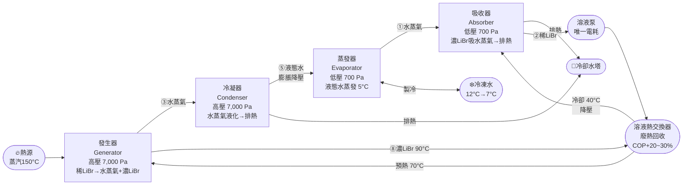

---

### 冷媒循環（水的路徑）

水是這台機器的「冷媒」，全程只有液態 ↔ 氣態兩種狀態切換：

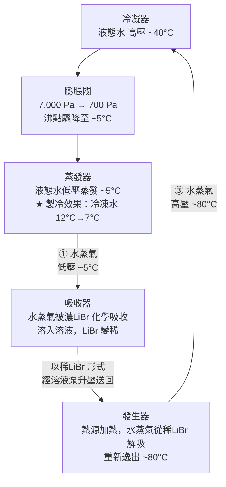

---

### 溶液循環（LiBr 的路徑）

LiBr 是「吸收劑」，在濃 ↔ 稀之間切換，扮演「化學壓縮機」的角色：

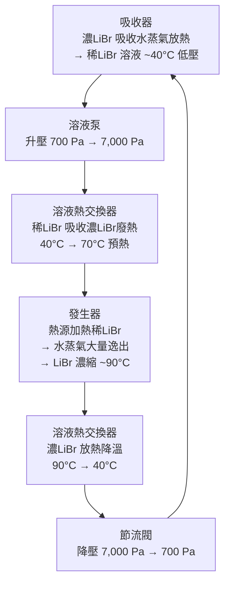

---

### 溶液熱交換器的作用（為什麼重要）

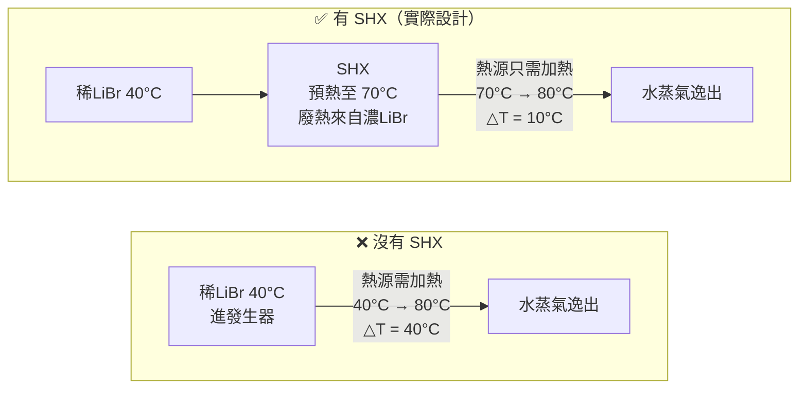

有 SHX：熱源負荷降低 75%（△T 從 40°C 縮為 10°C）→ **COP 提升約 20~30%**。

---

### 各點壓力與溫度

| 位置 | 壓力 | 溫度 | 說明 |
|-----|------|------|------|
| 蒸發器 | ~700 Pa（0.007 bar）| ~5°C | 水在超低壓下沸騰 |
| 吸收器 | ~700 Pa | ~35~40°C | 吸收水蒸氣，放熱至冷卻水 |
| 發生器（雙效）| ~7,000 Pa（0.07 bar）| ~80~90°C | 熱源蒸煮稀LiBr |
| 冷凝器 | ~7,000 Pa | ~38~42°C | 水蒸氣液化，排熱至冷卻水 |
| 冷凍水（進/出）| — | 12°C / 7°C | 機房側冷卻需求 |
| 冷卻水（進/出）| — | 29°C / 34°C | 冷卻水塔排熱 |

---

### 熱量守恆（能量哪裡來、哪裡去）

```
輸入：
  Q_gen  = 熱源投入（蒸汽/廢熱）→ 發生器
  Q_evap = 冷凍水帶入的熱量    → 蒸發器（這是「製冷」吸收的熱）
  W_pump = 溶液泵電力          → 極小，可忽略

輸出（排至冷卻水塔）：
  Q_cond = 冷凝器排熱
  Q_abs  = 吸收器排熱

守恆：Q_gen + Q_evap + W_pump = Q_cond + Q_abs

COP（冷卻）= Q_evap / Q_gen
雙效約 1.1~1.4，意思是每投入 1 kW 廢熱，可製造 1.1~1.4 kW 冷卻量
```

> ⚠️ 吸收式冰機同樣**需要冷卻水塔**，而且冷卻水塔負荷比壓縮式更大（要排走吸收器＋冷凝器兩個熱源），冷卻水塔容量約為壓縮式的 1.5~2 倍。

## 單效 vs 雙效 vs 三效

| 類型 | 熱源要求 | COP（冷卻）| 適用熱源 |
|-----|---------|-----------|---------|
| **單效（Single-Effect）** | 蒸汽 0.05~0.1 MPa（100°C），熱水 75~95°C | **0.6~0.8** | 低品位廢熱（工廠排熱、地熱）|
| **雙效（Double-Effect）** | 蒸汽 0.4~0.8 MPa（150~170°C），天然氣直燃 | **1.1~1.4** | 中高壓蒸汽、CHP 排氣餘熱 |
| **三效（Triple-Effect）** | 蒸汽 ≥ 1.0 MPa（≥180°C）| **1.5~1.8** | 高壓蒸汽，工業場景為主，較少見 |

> **COP < 1 不代表違反熱力學**——驅動能源是熱能，不是電能。雙效 COP 1.2 意思是：輸入 1 kW 熱能，產生 1.2 kW 冷卻量，差額來自冷凝熱（環境熱）的提升。

## 吸收式 vs 壓縮式比較

| 比較項目 | 吸收式冰機 | 壓縮式冰機（水冷）|
|---------|---------|----------------|
| **驅動能源** | 熱能（蒸汽/熱水/廢熱）| 電力 |
| **電力消耗** | 極低（僅泵，< 5% 同容量壓縮式）| 高（壓縮機主功耗）|
| **COP（熱源基準）** | 0.7~1.4（雙效）| — |
| **機械震動/噪音** | **極低**（無壓縮機）| 中~高 |
| **維護複雜度** | 高（LiBr 結晶、腐蝕、真空管理）| 中（冷凍油、機械保養）|
| **啟動時間** | 慢（15~30 分鐘暖機）| 快（數分鐘）|
| **容量調節** | 慢，範圍 25~100% | 快，VFD 靈活 |
| **冷凍水溫下限** | 5°C（LiBr 系統）| 可達 0°C 以下 |
| **廢熱回收能力** | **核心優勢** | 無 |
| **需要冷卻水塔** | ✅ 是（吸收器 + 冷凝器均需排熱）| ✅ 是 |

## AIDC 應用場景

吸收式冰機在 AIDC 是**小眾應用**，主要出現在有廢熱可用的系統整合情境：

### 1. 熱電聯產（CHP / Cogeneration）

資料中心若自建燃氣渦輪發電機，排氣溫度 400~600°C，可透過餘熱鍋爐（HRSG）產生蒸汽，驅動雙效吸收式冰機：

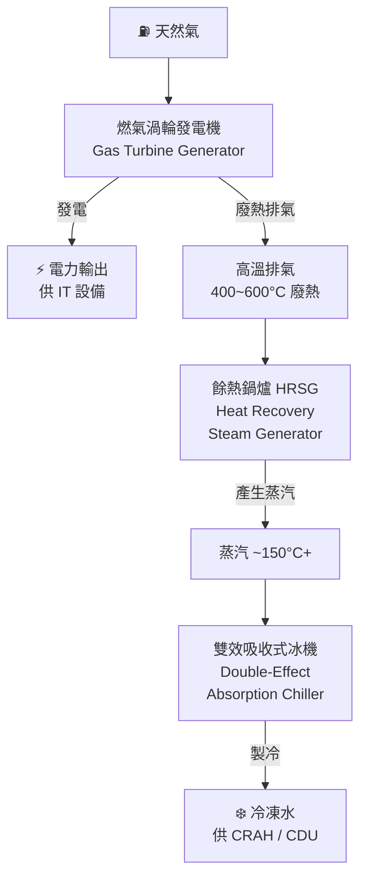

電費與冷卻費均降低，綜合能源效率（Site PUE）可顯著改善。這種架構又稱 **CCHP（Combined Cooling, Heat and Power，冷熱電三聯產）**。

### 2. 工業區廢熱利用

鄰近工廠、煉油廠、焚化爐等大量低品位廢熱來源，以廢熱驅動單效吸收式冰機可近乎零成本製冷。

> ⚠️ **AIDC 限制：** 吸收式冰機響應速度慢、容量調節不靈活，**不能作為主要冷源**，通常與電動壓縮式冰機並聯，在廢熱充足時承擔基礎負載（Base Load），壓縮式承擔尖峰與調節。

## LiBr 系統維護重點

| 風險 | 原因 | 防護方式 |
|-----|------|---------|
| **LiBr 結晶（Crystallization）** | 冷卻水溫過低，LiBr 濃度超過飽和 | 控制冷卻水溫 ≥ 24°C，設置防結晶溫度保護與自動稀釋 |
| **腐蝕** | LiBr 溶液具強腐蝕性（尤其對鋼鐵）| 添加鉬酸鋰（Li₂MoO₄）緩蝕劑，維持 pH 9.5~10.5 |
| **真空洩漏** | LiBr 系統在真空（~700 Pa）下運行，微量空氣洩入即降低性能 | 定期抽真空（Purging），設置氙氣偵漏 |
| **銅管腐蝕** | 溴離子對銅管點蝕 | 定期水質分析，必要時化學清洗 |

## 代表廠商

- **荏原（Ebara）** — 日系雙效吸收式，工業與區域能源應用
- **矢崎（Yazaki）** — 小型單效，廢熱回收專用，太陽熱能驅動
- **Carrier**（開利）— 16JB/17WB 系列
- **Trane**（特靈）— ABSC 系列雙效吸收式
- **遠大空調（BROAD）** — 中國最大吸收式冰機廠商，天然氣直燃型雙效
- **三洋 / Panasonic** — 中小型單效與雙效

## Cross-References

- 所屬系統：[[Chiller Plant]]
- 對比機型：[[磁浮式冷凍機]]、[[離心式 vs 螺桿式冷凍機]]
- 氣冷替代（免電力冷凝）：[[氣冷式冰機]]
- 效率指標：[[PUE 計算]]（CHP 對 Site PUE 計算的影響）
- 冷卻水系統：[[冷卻水塔]]（吸收器與冷凝器均需排熱至冷卻塔）
- 換熱計算：[[LMTD 計算]]
- 標準參考：[[Module 05 - 冷源與冷凍機房]]


## ================================================================================
## DOCUMENT: C:\Users\user\Obsidian\Engineering-Wiki\wiki\concepts\04_cooling_sources\氣冷式冰機.md
## ================================================================================
---
tags: [equipment, chiller, air-cooled, cooling-source]
sources: ["[[AIDC HVAC 學習基地 - Notion]]"]
created: 2026-06-17
updated: 2026-06-17
---

# 氣冷式冰機（Air-Cooled Chiller）

**氣冷式冰機**直接以戶外空氣冷卻冷凝器，不需冷卻水塔與冷卻水管路。冷媒在壓縮後進入空冷式冷凝器（Air-Cooled Condenser），風扇將空氣吹過盤管帶走熱量，再膨脹進入蒸發器產生冷凍水。

與水冷式冰機相比，系統更簡單、免水處理，但因冷凝溫度受環境溫度直接控制，COP 通常低 1.5~2.5。

## 系統架構

```
壓縮機（Compressor）
    ↓ 高溫高壓冷媒氣體
空冷式冷凝器（Air-Cooled Condenser）
    → 戶外風扇強制對流，熱量排至大氣
    ↓ 液態冷媒
膨脹閥（Expansion Valve）
    ↓ 低溫低壓兩相冷媒
蒸發器（Evaporator / Chiller Barrel）
    → 吸收冷凍水熱量，產生冷凍水
    ↓ 供冷凍水至 AHU / CRAH
```

**與水冷式的最大差異：** 移除冷卻水塔 + 冷卻水泵 + 冷卻水管路，冷凝熱直接排至大氣。

## 能效與環境溫度的關係

冷凝溫度 ≈ 環境乾球溫度 + 接近溫差（Approach，約 10~15°C）

氣冷式 COP 受環境溫度影響極大：

| 環境溫度（°C） | 冷凝溫度（°C） | 典型 COP |
|-------------|--------------|---------|
| 20°C | 30~35°C | 3.8~4.5 |
| 30°C | 40~45°C | 3.0~3.8 |
| 35°C | 45~50°C | 2.5~3.2 |
| 40°C | 50~55°C | 2.0~2.8 |

> 台灣夏季 35°C 高溫時，氣冷式 COP 約 2.5~3.2，遠低於水冷磁浮式（COP 7~9）。
> 環境溫度每上升 1°C，容量約下降 1~2%，COP 約下降 2~3%。

水冷式冷凝器以冷卻塔出水（29~33°C）冷卻，冷凝溫度約 35~38°C，始終優於氣冷式。

## 氣冷式 vs 水冷式比較

| 比較項目 | 氣冷式冰機 | 水冷式冰機 |
|---------|----------|----------|
| **冷凝方式** | 風扇強制空氣對流 | 冷卻水塔蒸發散熱 |
| **COP（設計點）** | 2.5~4.5 | 5.5~9.0（磁浮式）|
| **系統複雜度** | 低（無塔、無冷卻水迴路）| 高（冷卻塔、水泵、藥劑）|
| **初設成本（CAPEX）** | 低 | 高 |
| **耗水量（WUE）** | **零** | 高（蒸發損耗）|
| **維護** | 低（清洗風扇盤管即可）| 高（水質管理、Legionella 防控）|
| **噪音** | 高（多台風扇）| 低~中 |
| **最大單機容量** | ~800 RT | 5000+ RT |
| **AIDC 適用性** | ⚠️ 邊緣 / 小型機房 | ✅ 大型 AIDC 主流 |

## AIDC 應用場景

氣冷式冰機在大型 Hyperscale AIDC 幾乎不用，主要出現在：

1. **邊緣資料中心（Edge DC）**：容量 50~200 RT，無法設置冷卻塔（建築限制或用水許可）
2. **小型機房（IT 負載 < 1 MW）**：系統簡單，無需水處理專業人員
3. **缺水地區**：WUE 指標受限，氣冷式 WUE = 0（完全不耗水）
4. **緊急備援**：部分場景以氣冷式作為水冷系統故障時的降載備援

> **WUE = 0**：氣冷式不消耗水，在水資源受限地區（美國西部、中東、沙漠地區）具有競爭力，儘管 PUE 代價較高。

## 壓縮機類型

| 壓縮機 | 容量範圍 | 典型 COP | 備註 |
|-------|---------|---------|------|
| 渦旋式（Scroll）| 10~80 RT | 3.0~4.0 | 小型機型，可靠度高，多壓縮機並聯 |
| 螺桿式（Screw）| 80~500 RT | 2.8~3.8 | 中型，可 VFD 調速，市場主流 |
| 離心式（Centrifugal）| 200~800 RT | 3.2~4.5 | 大型氣冷機，較少見 |

## 代表廠商

- **Carrier**（開利）— 30XA 系列大型氣冷螺桿/離心機
- **Trane**（特靈）— CGAX 系列氣冷螺桿機
- **Daikin**（大金）— EWAD 系列，含 Turbocor 氣冷磁浮機型，部分負載效率優
- **York（JCI）**— YVAA 系列氣冷磁浮
- **Mitsubishi Heavy Industries**（三菱重工）— 日系中型氣冷機

## Cross-References

- 水冷冷源系統：[[Chiller Plant]]
- 同樣 WUE=0 的替代方案：[[乾冷器]]（不製冷凍水，僅為 Free Cooling）
- 效率指標：[[WUE 計算]]、[[PUE 計算]]
- 冷媒選型：[[冷媒知識]]（氣冷式常用 R-410A、R-32、R-1234yf）
- Free Cooling 整合：[[Free Cooling]]
- 吸收式比較：[[吸收式冰機]]
- 廠商：[[Carrier]]、[[Daikin]]、[[Trane]]


## ================================================================================
## DOCUMENT: C:\Users\user\Obsidian\Engineering-Wiki\wiki\concepts\04_cooling_sources\乾冷器.md
## ================================================================================
---
tags: [concept, free-cooling, dry-cooler, fluid-cooler, heat-rejection, energy]
sources: ["[[Free Cooling]]", "[[Chiller Plant]]", "[[Vera Rubin 機櫃物理與電力架構]]"]
created: 2026-06-06
updated: 2026-06-06
---

# 乾冷器 (Dry Cooler / Fluid Cooler)

**乾冷器（Dry Cooler，又稱 Fluid Cooler）** 是利用**環境空氣的顯熱換熱**，將封閉管路中的冷卻液熱量排入大氣的散熱設備。與冷卻水塔最大的本質差異在於：**全程無蒸發**，零耗水量（WUE = 0）。

在 Vera Rubin 平台 45°C 溫水冷卻方案中，乾冷器取代了傳統冷凍機（Chiller），成為全球首款能在任何氣候區實現 **Chiller-Free 全年自然冷卻** 的超算機房方案。

---

## 0. 外觀印象與常見誤解（與密閉式冷卻塔的差異）

乾冷器的外觀就是一個**方型鋼箱 + 大風扇**，內部塞滿像汽車水箱放大版的翅片管，**箱子裡完全沒有水噴出來**，純粹靠風扇吹過翅片帶走熱量。

最容易搞混的對象是**密閉式冷卻塔（Closed-Circuit Cooling Tower）**——兩者外觀都是「方箱+風扇」，且裡面流動的水都是封閉迴路、不直接接觸大氣，但密閉式冷卻塔在盤管外側**還會額外噴水**輔助蒸發降溫，箱底會有積水盤、運轉時排氣口常見白霧（水蒸氣）；乾冷器則完全沒有這套噴淋機構，零耗水。詳細辨識方式與對照表見 [[Dry Cooler vs. 密閉式冷卻水塔]] 第 0 節。

---

## 1. 工作原理

### A. 顯熱換熱（Sensible Heat Exchange）

乾冷器工作流程極為簡單：

```
熱水進 (Hot Supply) → 翅片管盤管 (Finned Coil) → 冷水出 (Cool Return)
                              ↑ ↓
                         風扇驅動的環境空氣吹過翅片，帶走顯熱
```

- 冷卻液（通常為水或水 / 乙二醇溶液）在密閉管路中循環，**不與空氣直接接觸**。
- 沒有蒸發、沒有補水需求、沒有軍團菌（Legionella）風險。
- 換熱量完全由**乾球溫度（Dry-Bulb Temperature, DBT）** 決定，與濕球溫度無關。

### B. 接近溫度（Approach Temperature）

$$T_{outlet} = T_{ambient, DBT} + \Delta T_{approach}$$

- 乾冷器出水溫度永遠**高於**當地環境乾球溫度。
- 典型接近溫度：**3°C ~ 8°C**（視翅片面積、風扇能耗而定）。
- 接近溫度越小 → 翅片面積越大 → 設備越貴，但換熱效果越好。

> 與冷卻水塔的本質差異：冷卻塔的出水下限受**濕球溫度**約束（DBT > WBT），因此在高濕環境（台灣夏季）仍有一定冷卻能力；但乾冷器的出水下限受**乾球溫度**約束，熱帶環境夏季 DBT 高達 35°C，出水約 38~43°C，故只有乾冷器**出水溫度已足夠高**的系統才能使用。

---

## 2. 乾冷器在 AIDC 的革命性突破

### A. 傳統空冷機房的冷源限制

傳統 CRAC/CRAH 空冷機房，供水溫度需達 7~12°C，冷卻塔出水（台灣夏季 29~33°C）遠高於此限制，**全年均需 Chiller 運轉**。

### B. 從 GB300 到 Vera Rubin，溫水方案如何逐步解放乾冷器

業界並非一步跳到 45°C，而是分兩階段解放乾冷器：**GB300（Blackwell Ultra）已支援 40~45°C 供水**（詳見 [[GB300與Blackwell Ultra機櫃架構]]，廠商實作不一），**Vera Rubin 則官方標準化為 45°C 供水 / 65°C 回水**並訴求 100% Chiller-Free：

| 氣候條件 | 環境 DBT | 乾冷器出水（接近溫度 5°C）| GB200 需求（≤17°C）| GB300 需求（40~45°C）| Vera Rubin 需求（≤45°C）|
|:---|:---:|:---:|:---:|:---:|:---:|
| 北歐冬季 | 5°C | 10°C | ✅ 可行 | ✅ 可行 | ✅ 可行 |
| 台灣冬季 | 15°C | 20°C | ❌ 需 Chiller | ✅ 可行 | ✅ 可行 |
| 台灣夏季 | 35°C | 40°C | ❌ 需 Chiller | ⚠️ 接近上限，視廠商接近溫度設計 | ✅ **仍可行！** |
| 新加坡全年 | 33°C | 38°C | ❌ 需 Chiller | ✅ 可行 | ✅ **仍可行！** |

> **工程結論**：當 MCCP 液冷可接受 45°C 供水時，乾冷器在全球所有氣候區均能獨立完成散熱工作，**徹底消滅 Chiller 的電耗，PUE ≤ 1.10，WUE = 0**。

---

## 3. 設計計算

### A. 基礎換熱公式

$$Q = \dot{m} \times C_p \times \Delta T_{water} = U \times A \times \Delta T_{lm}$$

| 符號 | 意義 |
|------|------|
| $Q$ | 散熱量 (kW) |
| $\dot{m}$ | 水流量 (kg/s) |
| $C_p$ | 水比熱 4.186 kJ/kg·K（純水）|
| $\Delta T_{water}$ | 進出水溫差 (K) |
| $U$ | 整體傳熱係數 (W/m²·K) |
| $A$ | 翅片換熱面積 (m²) |
| $\Delta T_{lm}$ | 對數平均溫差 (K) → [[LMTD 計算]] |

### B. 乙二醇溶液的比熱修正

在台灣冬季防凍或高緯度地區，冷卻液需混合**乙二醇（Ethylene Glycol, EG）**：

| EG 濃度 | 冰點 | 比熱（相對純水）| 換熱能力損失 |
|:---:|:---:|:---:|:---:|
| 0%（純水）| 0°C | 4.186 kJ/kg·K | 0% |
| 20% EG | -8°C | 3.95 kJ/kg·K | -5.6% |
| 35% EG | -20°C | 3.68 kJ/kg·K | -12% |

> ⚠️ 使用乙二醇時，換熱能力下降，需同步加大流量或換熱面積來補償。台灣平地 AIDC 通常使用純水或低濃度 EG（< 10%）。

### C. 快速容量估算

以 Vera Rubin 單機架 200 kW、供 / 回水 45°C / 65°C（ΔT = 20°C）為例：

$$\dot{m} = \frac{200 \text{ kW}}{4.186 \times 20} = 2.39 \text{ L/s} \approx 8.6 \text{ m}^3/\text{hr}$$

1,000 台 Vera Rubin 機架 → 200 MW 散熱量 → 需選型約 **20,000 kW 總容量的乾冷器群組**。

---

## 4. 與冷卻水塔的系統定位比較

| 項目 | 乾冷器（Dry Cooler）| 冷卻水塔（Cooling Tower）|
|:---|:---|:---|
| **換熱原理** | 空氣顯熱 | 蒸發潛熱 + 顯熱 |
| **冷卻下限** | 環境乾球溫度 + 接近溫度 | 環境濕球溫度 + 接近溫度 |
| **耗水量 (WUE)** | **= 0（零耗水）** | 高（蒸發 + 排污，約 1~3 L/kWh）|
| **適用供水溫度** | **≥ 35°C（高溫液冷首選）** | ≤ 30°C（傳統空冷 / 低溫液冷）|
| **Legionella 風險** | 無 | 有（需定期殺菌，[[冷卻水塔]]）|
| **佔地面積** | 較小（設備緊湊）| 較大（需設水盤、集水槽）|
| **維護複雜度** | 低（翅片定期清洗）| 高（水質管理、藻類處理）|
| **台灣夏季可行性（GB200 ≤17°C）** | ❌ 無法達到 | ❌ 同樣無法達到（需 Chiller）|
| **台灣夏季可行性（Vera Rubin ≤45°C）** | ✅ **直接可行** | ⚠️ 出水 29~33°C，勉強可行 |

---

## 5. 乾冷器系統架構

典型的 Vera Rubin 乾冷器 Free Cooling 迴路：

```
[Vera Rubin 機架 MCCP]
     ↑ 供水 45°C
     │
[乾冷器一次側泵組 (VFD)]
     │
[乾冷器 (Dry Cooler Array)]──── 戶外環境空氣
     │
     ↓ 回水 65°C（排熱後降至 40~42°C）
[儲冷罐 / Expansion Tank]
```

當環境溫度過高（如台灣熱浪 DBT > 40°C），乾冷器無法將出水降至 45°C 以下時：
- **備援模式**：啟動輔助冷卻裝置（小型 Chiller 或混合冷卻）
- 現代設計通常加入 **Pre-cooling 霧化裝置**（Adiabatic Cooler，噴霧預冷進氣），在極端天氣短暫降低進氣乾球溫度 3~5°C。

---

## 6. Cross-References

- 本質差異詳比：[[Dry Cooler vs. 密閉式冷卻水塔]]（比較頁面）
- 在 Free Cooling 中的角色：[[Free Cooling]]
- 最大受益平台：[[Vera Rubin 機櫃物理與電力架構]]（45°C 溫水冷卻）、[[GB300與Blackwell Ultra機櫃架構]]（40~45°C 溫水起點）
- 水路換熱計算：[[LMTD 計算]]
- 耗水效率指標：[[WUE 計算]]
- 一次側冷源系統：[[Chiller Plant]]

## Sources

- GB300 供水溫度規格：[GB300 Liquid Cooling Requirements 2026 - ToneCooling](https://tonecooling.com/gb300-liquid-cooling-requirements-2026/)


## ================================================================================
## DOCUMENT: C:\Users\user\Obsidian\Engineering-Wiki\wiki\concepts\04_cooling_sources\磁浮式冷凍機.md
## ================================================================================
---
tags: [equipment, chiller, magnetic-bearing, energy-efficiency]
sources: ["[[AIDC HVAC 學習基地 - Notion]]"]
created: 2026-05-20
updated: 2026-05-20
---

# 磁浮式冷凍機（Magnetic Bearing Chiller）

**磁浮式冷凍機**是以**磁浮軸承（Magnetic Bearing）**取代傳統滾珠/滑動軸承的離心式冷凍機。消除軸承摩擦損耗後，在 AIDC 典型的部分負載工況下（50~75%），COP 比傳統離心式高出 50~100%，是目前 AIDC 冷源的首選機型。

> ⚠️ **常見誤解：** 磁浮的是**轉軸軸承**，不是螺桿或葉輪。壓縮機仍是離心式葉輪，改變的只是轉軸懸浮方式。

## 為什麼磁浮在部分負載時特別省電？

傳統軸承在全速與部分負載下摩擦損耗相近（損耗是固定的機械摩擦）。磁浮軸承無接觸，摩擦損耗幾乎為零。

| 負載率 | 傳統離心式 COP | 磁浮式 COP | 差距 |
|-------|--------------|----------|------|
| 100% | 6.0 | 6.5 | +8% |
| 75% | 5.0 | 7.0 | +40% |
| **50%** | **3.5** | **8.0** | **+129%** |
| 25% | 2.0 | 7.5 | +275% |

**AIDC 為何大多在 50~75% 負載運行？**
- Chiller 台數設計帶 N+1 備援 → 正常運行時每台平均負載率 ≤ 83%
- 外氣溫度較低時（冬季），Chiller 負載進一步降低
- 機房擴充期間（未滿載）也長期在低負載區間

→ **磁浮式的 COP 優勢，在 AIDC 實際運行中幾乎全年都能體現。**

## 技術原理

```
壓縮機轉軸
    ↓
電磁鐵陣列（定子）產生磁場
    ↓
轉軸「懸浮」在磁場中，不接觸任何機械軸承
    ↓
轉速感測器持續偵測位置 → 微調電磁場維持懸浮
    ↓
轉速可精確調控（無齒輪箱），VFD 調速範圍更廣
```

## 磁浮式 vs 傳統離心式

| 比較項目 | 傳統離心式 | 磁浮式 |
|---------|----------|------|
| 軸承類型 | 滾珠軸承 / 油膜軸承 | 磁浮（無接觸）|
| 潤滑系統 | 需要潤滑油系統 | **無需潤滑油** |
| 摩擦損耗 | 有（固定損耗）| 幾乎為零 |
| 部分負載 COP | 50% 負載時 COP ~3.5 | 50% 負載時 COP ~8.0 |
| 噪音 / 震動 | 較高 | **極低** |
| 維護需求 | 定期換油、軸承檢查 | **免換油，維護簡單** |
| 啟動電流 | 高（直接啟動）| 低（軟啟動）|
| 設備成本 | 低 | **高（約高 20~40%）**|
| AIDC 適用性 | ✅ 大型場景仍可用 | ✅ **AIDC 首選** |

## 無潤滑油的額外優點

傳統離心式需要潤滑油，油膜可能進入製冷循環污染：
- 油膜附著在熱交換器（蒸發器/冷凝器）管壁，增加熱阻
- 長期運行導致換熱效率下降 2~5%
- 定期需要「回油」保養程序

磁浮式完全無油 → **換熱效率長期穩定，不需回油保養。**

## 容量範圍與適用場景

| 容量範圍 | 機型 | 適用場景 |
|---------|------|---------|
| 200~500 RT | 中小型磁浮機 | 中型 AIDC 或機電區空間有限 |
| 500~1,500 RT | 主流 AIDC 機型 | **大型 AIDC 標配** |
| 1,500~2,000 RT | 大型磁浮機 | 超大型 AIDC、Hyperscaler |

## 代表廠商與機型

| 廠商 | 機型 | 特點 |
|------|------|------|
| **Daikin（大金）**| Turbocor / Applied Magnetic Bearing | Turbocor 技術授權給多家廠商 |
| **Johnson Controls（York）**| YMC² 系列 | 磁浮 + VFD，AIDC 大量部署 |
| **Carrier** | AquaEdge 19DV | 油冷媒混合磁浮 |
| Trane | CGAN 系列 | 高效磁浮機 |

> Turbocor（原 Danfoss Turbocor）的磁浮壓縮機技術是業界基礎，Daikin 收購後被多家品牌採用。

## Cross-References

- 所屬系統：[[Chiller Plant]]
- 效率指標：[[PUE 計算]]（磁浮式 COP 提升直接降低 PUE）
- 節能策略：[[Free Cooling]]（冷卻塔出水越低，磁浮式效益越大）
- 計算實務：[[Module 05 - 冷源與冷凍機房]]
- 廠商：[[Module 08 - 廠商生態系統]]


## ================================================================================
## DOCUMENT: C:\Users\user\Obsidian\Engineering-Wiki\wiki\concepts\05_power_systems\800VDC 直流配電.md
## ================================================================================
---
tags: [concept, AIDC, power-distribution, 800VDC, busbar, DC-arcing, electrical-engineering]
sources: ["[[AIDC HVAC 學習基地 - Notion]]"]
created: 2026-06-06
updated: 2026-06-06
---

# 800VDC 直流配電

在 AI 超級電腦（如 NVIDIA Blackwell NVL72 / NVL576）帶來的極限高密度算力時代，傳統的交流配電（AC）與低壓直流配電（如 12VDC 或 54VDC）在輸電距離、銅材用量與轉換損耗上均已觸及物理瓶頸。**800VDC 高壓直流配電（HVDC）** 已成為下世代 AIDC 機電架構的關鍵前沿技術。

---

## 1. 為什麼需要 800VDC 直流配電？

### 傳統 AC 配電的缺點
傳統資料中心電力需經歷多次「AC-DC」與「DC-AC」轉換：
$$\text{台電中壓 AC} \rightarrow \text{變壓器低壓 AC} \rightarrow \text{UPS 整流 DC} \rightarrow \text{UPS 逆變 AC} \rightarrow \text{PDU AC} \rightarrow \text{伺服器電源 PSU DC}$$
每次轉換均伴隨 $2\% \sim 5\%$ 的熱能損耗。

### 54VDC 低壓直流輸電的物理極限（電流與發熱）
以單個功率為 **$120\text{ kW}$** 的 GB200 NVL72 機櫃為例，如果從機房配電盤直接傳輸 54VDC 直流電到機櫃，其電流與銅導體用量將達到極端數值：

#### 💡 物理推導：54VDC vs 800VDC 銅排尺寸與重量計算

設輸電距離 $L = 10 \text{ 米}$，採用紫銅導體（電阻率 $\rho = 1.72 \times 10^{-8} \ \Omega\cdot\text{m}$，密度 $D = 8.96 \times 10^3 \text{ kg/m}^3$），安全電流密度取 $J = 3 \text{ A/mm}^2$。

**1. 採用 54VDC 輸電時：**
*   **傳輸電流**：
    $$I = \frac{P}{V} = \frac{120,000\text{ W}}{54\text{ V}} \approx 2,222\text{ A}$$
*   **所需銅排截面積 ($A$)**：
    $$A = \frac{I}{J} = \frac{2,222\text{ A}}{3\text{ A/mm}^2} \approx 740\text{ mm}^2$$
*   **單根銅排重量 (10米)**：
    $$\text{Volume} = 740 \times 10^{-6}\text{ m}^2 \times 10\text{ m} = 0.0074\text{ m}^3$$
    $$\text{Weight} = 0.0074\text{ m}^3 \times 8,960\text{ kg/m}^3 \approx 66.3\text{ kg} \ (\text{正負極兩根共 } 132.6\text{ kg})$$
*   **傳輸損耗 ($I^2R$)**：若銅排電阻 $R = \rho \frac{L}{A} \approx 2.32 \times 10^{-4} \ \Omega$：
    $$P_{\text{loss}} = I^2 R = (2,222)^2 \times (2.32 \times 10^{-4}) \approx 1,145\text{ W} \ (\text{單櫃輸電損耗})$$

**2. 採用 800VDC 輸電時：**
*   **傳輸電流**：
    $$I = \frac{P}{V} = \frac{120,000\text{ W}}{800\text{ V}} = 150\text{ A}$$
*   **所需銅排截面積 ($A$)**：
    $$A = \frac{I}{J} = \frac{150\text{ A}}{3\text{ A/mm}^2} = 50\text{ mm}^2$$
*   **單根銅排重量 (10米)**：
    $$\text{Volume} = 50 \times 10^{-6}\text{ m}^2 \times 10\text{ m} = 0.0005\text{ m}^3$$
    $$\text{Weight} = 0.0005\text{ m}^3 \times 8,960\text{ kg/m}^3 \approx 4.5\text{ kg} \ (\text{正負極兩根共 } 9\text{ kg})$$
*   **傳輸損耗 ($I^2R$)**：若採用相同截面積的 $50\text{ mm}^2$ 導體，電阻 $R = 3.44 \times 10^{-3} \ \Omega$：
    $$P_{\text{loss}} = I^2 R = (150)^2 \times (3.44 \times 10^{-3}) \approx 77.4\text{ W}$$

> **📌 結論**：從 54VDC 提升至 800VDC，**輸電銅排重量減輕了 93.2%**，同時**線路電能損耗降低了 93.2%**。這在具有數百個機櫃的 AIDC 中，能節省數百噸的銅材，並大幅釋放高架地板下的氣流空間！

---

## 2. 800VDC 系統配電架構

800VDC 系統將整流與備援集中在廠務灰區，簡化了機房白區的架構：

```
 [ 台電中壓 AC 22kV ]
         |
  [ 集中式整流器 ] <---> [ 800VDC 集中儲能電池架 ] (省去單機櫃 UPS)
         |
  [ 800VDC 直流母線槽 (Busway) ]
         | (150A 低電流輸送直達機櫃)
  [ 機櫃電力架 (Power Shelf) ]
         | (內置高效率 DC-DC 降壓模組，降至 54VDC)
 [ 54VDC 直流銅排 (Busbar) ] ---> [ GPU 伺服器 Tray ]
```

*   **集中整流與儲能**：將交流變直流（AC-DC）的整流室集中在電力灰區，並與高壓直流蓄電池直接併網。這省去了伺服器內部的大型變壓器，機櫃內部空間使用率提升 $15\% \sim 20\%$。
*   **機櫃內降壓拓撲**：利用高功率密度的 **LLC 諧振變換器** 或 **移相全橋（PSFB）** 降壓模組，將 800VDC 降至 54V/48VDC，效率可高達 **$97\% \sim 98.2\%$**。

---

## 3. 衍伸技術：800VDC 的安全防護與物理挑戰

高壓直流配電雖然效率極高，但在工程上必須解決以下兩大物理難題：

### 挑戰一：直流電弧（DC Arcing）熄弧難度
與交流電（AC，波形每秒有 100~120 次經過零點）不同，直流電的電壓與電流是恆定的，**沒有電流過零點**。
*   **危害**：當 800VDC 斷路器斷開或接頭意外鬆脫時，兩端空氣會瞬間被高壓電離，產生高達 **$5000^\circ\text{C}$ 以上的持續電弧**。此電弧不會像交流電一樣自動熄滅，會持續燃燒直至燒毀設備。
*   **對策**：
    1.  **磁吹熄弧技術（Magnetic Arc Blowout）**：利用永久磁鐵產生的洛倫茲力，將電弧強行拉長並吹入陶瓷滅弧室（Arc Chute）冷卻熄滅。
    2.  **固態斷路器（SSCB, Solid-State Circuit Breaker）**：採用 SiC MOSFET 等半導體器件，在 **$1 \sim 10 \mu\text{s}$ 內**切斷電流，在電弧尚未形成前即完成斷路。

### 挑戰二：直流接地系統（DC Grounding）與絕緣監測
800VDC 直流配電通常採用**浮地系統（IT 接地系統）**，即正負極均不與大地直接連接。
*   **優點**：當正極或負極發生單點對地短路時，不會形成短路迴路，系統可以不跳閘繼續運行，保障算力中斷時間為零。
*   **對策**：必須在母線上加裝**絕緣監測儀（IMD, Insulation Monitoring Device）**。IMD 會向系統注入一個低頻交流信號，持續計算正負極對地的絕緣電阻。一旦絕緣阻值低於安全閥值（例如 $100 \ \Omega/\text{V}$），會立刻向 DCIM 系統發出告警，安排預防性維護。

---

## Cross-References

*   機櫃內部配電：[[PDU與電力引線]]
*   機櫃物理結構：[[Vera Rubin 機櫃物理與電力架構]]
*   中壓變電站引入：[[中壓電力引入]]
*   廠務微電網調度：[[AIDC 微電網架構]]


## ================================================================================
## DOCUMENT: C:\Users\user\Obsidian\Engineering-Wiki\wiki\concepts\05_power_systems\AIDC 微電網架構.md
## ================================================================================
---
tags: [concept, AIDC, microgrid, BESS, peak-shaving, SOFC, absorption-chiller, EMS]
sources: ["[[AIDC HVAC 學習基地 - Notion]]"]
created: 2026-06-06
updated: 2026-06-06
---

# AIDC 微電網架構

隨著 AIDC（人工智慧資料中心）的規模爆炸性增長，單一園區的電力需求已達 $100\text{ MW} \sim 500\text{ MW}+$。這導致 AIDC 面臨兩大電網實務困境：第一，**電網饋線建設延遲**（變電所新建需 18~36 個月）；第二，**電網不穩定與 GPU 突波造成的斷電風險**。

導入 **AIDC 微電網（Microgrid）架構**，結合自備分布式能源、大容量儲能系統與智慧能源調度，已成為解決 AIDC 電力瓶頸的終極方案。

---

## 1. AIDC 微電網的核心組件

AIDC 微電網是一套能夠與公共電網併網運行，也能在電網斷電時獨立進行「孤島運行（Islanding Mode）」的區域電力系統：

```
 [ 台電中壓電網 (Grid) ]
         |
    [ 靜態轉換開關 (STS) ]
         |
         +=========[ AIDC 內部高壓直流/交流母線 ]=========+
         |                       |                       |
  [ 分布式電源 (DER) ]     [ 儲能系統 (BESS) ]     [ AIDC 運算負載 ]
  * 太陽能光電 (PV)        * 鋰電池/鈉電池貨櫃     * GPU 機櫃 (GB200)
  * 燃料電池 (SOFC)        * 飛輪/超電容           * 液冷 CDU 系統
  * 天然氣發電機組
```

*   **分布式電源（DER, Distributed Energy Resources）**：包括太陽能光電、天然氣往復式發電機，以及高效率的**固態氧化物燃料電池（SOFC）**。
*   **電池儲能系統（BESS, Battery Energy Storage System）**：由數個集裝箱式鋰電池或鈉離子電池組成，提供百萬瓦（MW）級別的毫秒響應電力。
*   **智慧微電網控制器 / EMS（Energy Management System）**：微電網的「大腦」，實時採集電網電價、氣象預報與 GPU 負載波形，進行最優化調度。

---

## 2. 💡 物理與工程計算：動態削峰（Dynamic Peak Shaving）與 BESS 容量配比

AI 工作負載（尤其是大語言模型 LLM 訓練）具有劇烈的**功率突波（Power Spike）**特徵。當數萬顆 GPU 同時開始梯度對齊計算時，機房負載會在幾毫秒內飆升 $1.2 \sim 1.3$ 倍。
*   **問題**：這會導致變壓器過載跳脫，或超出向台電申請的「契約容量」上限引發天價罰款。
*   **解決方案**：利用 BESS 進行毫秒級的放電補償（削峰）。

#### 💡 工程計算範例：
設某 AIDC 園區基礎負載為 **$100\text{ MW}$**。在 LLM 訓練開始時，會產生一個幅度為 **$\Delta P = 10\text{ MW}$**、持續時間為 **$t = 60 \text{ 秒}$** 的瞬態功率突波。我們該如何設計 BESS 的最小容量？

**1. 計算所需的純能量值 ($E$)**：
   $$E = \Delta P \times t = 10,000\text{ kW} \times \frac{60}{3600}\text{ 小時} \approx 166.7\text{ kWh}$$

**2. 考量電池物理裕度**：
   為了延長電池壽命，最大放電深度（DoD, Depth of Discharge）設定為 $80\%$；雙向逆變器（PCS）轉換效率設定為 $\eta = 92\%$。
   $$\text{BESS 最小標稱容量} = \frac{E}{\text{DoD} \times \eta} = \frac{166.7\text{ kWh}}{0.80 \times 0.92} \approx 226.5\text{ kWh}$$

**3. 計算放電倍率 (C-rate)**：
   電池必須在 1 分鐘內（1/60 小時）放完這部分能量：
   $$\text{C-rate} = \frac{1}{\text{放電時間 (小時)}} = 60\text{C}$$

> ⚠️ **工程挑戰**：傳統化學鋰電池的放電倍率通常僅為 $1\text{C} \sim 4\text{C}$，無法承受 $60\text{C}$ 的極限瞬間拉載。因此，AIDC 微電網實務上會採用 **混合儲能系統** —— 用 **鋰離子電容器（LIC）** 或 **超級電容** 來應付前 15 秒的極速尖峰，再由高倍率鋰電池接手後續的放電。

---

## 3. 衍伸技術：SOFC 餘熱回收與熱電冷三聯產（CCHP）

**固態氧化物燃料電池（SOFC）**（如 Bloom Energy 方案）是 AIDC 自備微電網的首選，因為它能以天然氣或氫氣發電，發電效率高達 $50\% \sim 60\%$。更關鍵的是，SOFC 可以進行**熱電冷三聯產（Combined Cooling, Heating and Power, CCHP）**：

```
                      [ 天然氣 / 氫氣 ]
                             |
                   [ SOFC 燃料電池發電 ] ---> [ 50 ~ 60% 電能 ] ---> [ 供應 AIDC 伺服器 ]
                             |
                  [ 650°C ~ 800°C 高溫排氣 ]
                             |
                    [ 熱回收熱交換器 ]
                             |
     [ 溴化鋰吸收式冰水機 (Absorption Chiller) ] ---> [ 7°C ~ 12°C 冷凍水 ] ---> [ 供應 CDU 一次側 / CRAH ]
```

*   **物理機制**：SOFC 工作溫度高達 $650^\circ\text{C} \sim 800^\circ\text{C}$，排出的廢熱氣體透過熱回收換熱器，驅動**溴化鋰吸收式冰水機（Absorption Chiller）**。
*   **吸附式製冷原理**：利用溴化鋰溶液（吸水劑）與水（冷媒）在高溫廢熱驅動下的蒸發吸熱效能，直接生產 **$7^\circ\text{C} \sim 12^\circ\text{C}$ 的冷凍水**送回機房冷卻系統。
*   **工程價值**：將自備發電廠的總體能源利用效率從 $60\%$ 大幅提升至 **$85\% \sim 90\%$**，且在不消耗額外電力的情況下，為 CDU 提供冷源，極大程度降低了系統 PUE。

---

## 4. 孤島切換與無縫併網（Seamless Islanding）

當電網因地震、雷擊或颱風瞬間斷電時，微電網控制器必須在毫秒級別內將 AIDC 切換至孤島運行模式。

*   **靜態轉換開關（STS, Static Transfer Switch）**：採用大功率可控矽（SCR）半導體，切換時間小於 **$4\text{ ms}$**。
*   **伺服器 Hold-up Time 限制**：伺服器電源供應器（PSU）內部的電容蓄能維持時間（Hold-up Time）通常僅有 **$10\text{ ms} \sim 20\text{ ms}$**。
*   **工程防線**：STS 的超高速切換配合 BESS 的瞬時補償，確保在切換發電機期間，直流母線電壓不會低於伺服器工作閥值，保證算力運行完全不中斷。

---

## Cross-References

*   瞬態負載特徵：[[AI 工作負載熱特性]]
*   機房冷凍系統：[[Chiller Plant]]
*   廠務配電鏈接：[[UPS]]、[[發電機]]
*   直流輸電配合：[[800VDC 直流配電]]


## ================================================================================
## DOCUMENT: C:\Users\user\Obsidian\Engineering-Wiki\wiki\concepts\05_power_systems\Busbar 匯流排.md
## ================================================================================
---
tags: [equipment, power, busbar, electrical, high-density]
sources: ["[[AIDC HVAC 學習基地 - Notion]]"]
created: 2026-05-20
updated: 2026-05-20
---

# Busbar 匯流排

**Busbar（匯流排）** 是以裸露或絕緣導體棒（銅排/鋁排）取代傳統多芯電纜的大電流配電系統。在 GB200 等高密度 AI 機架（120 kW/rack）中，傳統電纜截面積不足以承載所需電流，Busbar 是唯一可行的配電方式。

> ⚠️ **HVAC 重點：Busbar I²R 發熱是 IT 熱負荷以外的額外熱源，佔 2~5%，CFD 模型必須納入計算。**

## 為什麼高密度機架必須用 Busbar？

**電流計算（GB200 × 120 kW，三相 480V）：**

$$I = \frac{P}{\sqrt{3} \times V} = \frac{120{,}000}{1.732 \times 480} \approx 144\ A$$

| 比較項目 | 傳統 DC（10 kW/rack）| AIDC（120 kW/rack）|
|---------|---------------------|-------------------|
| 電流 | ~20 A | **~250 A（含 A/B Feed 各一路）**|
| 配電方式 | 一般多芯電纜 | **Busbar 為主** |
| 單根電纜截面積 | 4~6 mm² | 需要 150~240 mm²，不現實 |
| 佈線彈性 | 高 | Busbar 需預先規劃路由 |

> 傳統電纜在 250A 下需用多根並聯或超大截面積電纜，重量、成本、施工難度均不可行。

## 系統架構

```
MSB（主配電盤）
↓
UPS
↓
【Busbar Trunking System（BTS）】
主幹匯流排沿機房走道天花板或地板下敷設
↓
插接箱（Tap-off Box）← 每個機架位置各一個
↓
PDU（電源分配單元）→ Rack
```

Busbar 的核心優勢是**插接箱（Tap-off Box）**：在主幹任意位置插入取電，機架位置調整時只需移動插接箱，不需重新拉電纜。

## I²R 發熱與 HVAC 的關係

Busbar 並非完美導體，電流通過時產生電阻熱：

$$P_{loss} = I^2 \times R$$

| 場景 | 主幹電流 | 估計發熱損耗 |
|------|---------|-----------|
| 100 台 GB200（12 MW IT）| 數千安培 | **240~600 kW 額外熱負荷** |
| 佔 IT 熱負荷比例 | — | **2~5%** |

**對 HVAC 的影響：**
- Busbar 通常沿走道敷設，發熱集中在走道天花板或地板下
- 若 CFD 模型未納入 Busbar 熱源，會低估走道局部熱量，可能出現設計外的 Hot Spot
- 設計冷卻容量時應在 IT Load 基礎上加 2~5% 作為 Busbar 熱補償

## 銅排 vs 鋁排

| 比較項目 | 銅排（Copper）| 鋁排（Aluminium）|
|---------|-------------|----------------|
| 導電率 | 100%（基準）| ~61% |
| 重量 | 重 | **輕 50~60%**（大截面積時優勢顯著）|
| 截面積需求 | 小 | 較大（同電流下）|
| 成本 | 高 | 低 |
| AIDC 使用 | 主幹段常用 | 長距離主幹（減輕建築荷重）|

## 代表廠商

- **Schneider Electric**（Canalis 系列，AIDC 市場主流）
- **ABB**（Zucchini 系列）
- **Siemens**（BD2 系列）
- Eaton（Pow-R-Way）

## Cross-References

- 電力系統：[[Module 06 - 電力架構與機電整合]]
- 上游設備：[[UPS]]（UPS 輸出接 Busbar 主幹）
- 末端設備：GB200 NVL72 雙 PSU → [[GB200 NVL72 冷卻需求]]
- HVAC 關聯：[[CFD 模擬]]（Busbar 熱源需納入 CFD 熱場分析）
- 廠商：[[Module 08 - 廠商生態系統]]


## ================================================================================
## DOCUMENT: C:\Users\user\Obsidian\Engineering-Wiki\wiki\concepts\05_power_systems\PDU與電力引線.md
## ================================================================================
---
tags: [concept, power, PDU, whip, busbar, tap-off, MEP]
sources: ["[[Module 06 - 電力架構與機電整合]]"]
created: 2026-06-06
updated: 2026-06-06
---

# PDU 與電力引線

在 AIDC 廠務機電（MEP）與白區機櫃（Rack）的介面之間，**電力分配單元（PDU, Power Distribution Unit）**、**電力引線（Power Whip）** 與 **母線槽插接箱（Busbar Tap-off Unit）** 是確保高電壓、大電流電力安全、平穩、高彈性輸送至 IT 負載的核心基礎組件。

---

## 1. PDU (Power Distribution Unit) 的分級與選型

在資料中心電力路徑中，PDU 依據物理安裝位置與分配層級，分為以下兩類：

### A. 落地式 PDU 與 RPP (Remote Power Panel, 列頭櫃)
*   **物理形式**：安裝在伺服器排（Row）的排頭或白區集中區域的獨立機櫃式配電箱。
*   **工作原理**：將來自 UPS 輸出配電櫃（通常為大容量，如 $400\text{A} \sim 800\text{A}$）的幹線接入，內部設有隔離變壓器及幾十個支路斷路器（Breakers），將电力分流為單相或三相分路（通常為 $16\text{A} \sim 63\text{A}$）分配至各機架。

### B. 機架式 PDU (rPDU / Rack PDU)
垂直或水平安裝於 IT 機櫃內側的電源分配條，是 IT 設備取電的終端介面。依功能分級如下：

| rPDU 級別 | 遙測與監控能力 | 遠端控制能力 | 實務工程應用 |
| :--- | :--- | :--- | :--- |
| **基本型 (Basic)** | 無任何計量與通訊功能。 | 無。 | 僅供純分電，CAPEX 最低。不建議用於 AI 高密度機房。 |
| **監測型 (Metered)** | 具備 LCD 螢幕，可監測總輸入電流、電壓與功率（kW）。 | 無。 | 能防止現場運維人員在熱插拔擴充設備時引發支路斷路器過載跳脫。 |
| **開關型 (Switched)** | 具備總量監測，並能提供通訊接口（Modbus/BACnet）。 | **可遠端獨立控制單個插座（Outlet）的啟閉。** | 運維人員不需進機房，即可在遠端對當機的伺服器進行斷電重啟（Cold Boot）。 |
| **智慧/直讀型 (Intelligent / Smart)** | **插座級精確量測**（Outlet-level metering，精度達 $\pm 1\%$），支援電壓波形、諧波監測。 | 可遠端控制單口，並支援級聯溫濕度、漏水感測器。 | **高密度 AIDC 的標配**。結合 DCIM 軟體可進行精確的機架級 PUE 計算、相位平衡分析與熱點警報。 |

---

## 2. Power Whip (電力引線 / 下投電纜)

*   **定義**：連接落地式 PDU/RPP（或架空插接箱）與機架 PDU 輸入端之間的重型、具備高柔韌性的分支電纜（通常配置防脫扣的工業連接器，如 IEC 60309 或 NEMA 規格）。
*   **物理配線形式**：
    *   **地板下配線（Under-floor Whips）**：傳統機房配線方式，電纜隱藏在高架地板下方。
    *   **架空配線（Overhead Whips）**：電纜置於機架上方的網狀網格橋架（Cable Tray）中。

### ⚠️ 暖通工程致命隱患：阻礙地板下送風
在採用「高架地板下送風（Under-floor Plenum Air Delivery）」的空冷資料中心裡，若每個機架都拉 2~4 條粗重的 Power Whips，幾百條電纜在地板下縱橫交錯，會形成一道**「物理風阻牆」**。
*   這會導致冷風風速驟降、送風不均，逼迫廠務調高精密空調（CRAH）風扇轉速，**直接拉高風扇電耗，導致 PUE 惡化**。因此，現代高密度機房多已禁止地板下配線，全面強制改採**架空母線槽（Busway）**。

---

## 3. Busbar Tap-off Unit (匯流排插接箱 / 分接箱)

為了徹底消除繁瑣且阻礙風道的 Power Whips 電纜，現代高功率 AIDC 廣泛採用**架空母線槽系統（Overhead Busway / Busbar）**。而 **Tap-off Unit（插接箱）** 則是該系統隨插即用的關鍵。

```
       [架空三相 AC 匯流排母線槽 (Busway Run)]
=======================||=======================
                       || 帶電卡入 (Clip-on)
                  +----+----+
                  | Tap-off | ← 內建分支斷路器 (Breaker)
                  | 插接箱  |   與電力量測模組
                  +----+----+
                       |
                       | 短電纜 (Drop Cord / Whip)
                       ↓
              [機架式 PDU (rPDU)]
```

### A. 運作與安裝機制
*   **帶電插拔（Hot-swappable / Clip-on）**：架空母線槽表面設有定期開孔。插接箱底座設有特殊導電銅觸頭，廠務工程師在母線槽**完全帶電運轉（Live）**的情況下，將插接箱對準軌道卡入鎖緊，即可立刻引出電力。
*   **內部構造**：插接箱內建過載與短路保護斷路器（如 $32\text{A}$ 或 $63\text{A}$），並配置智慧電力量測儀表（透過 Wi-Fi 或 Modbus 串接回傳數據）。

### B. 工程價值與優勢
1.  **無電纜雜亂**：高架地板下與機櫃上方完全淨空，最大化空冷風道流暢度，優化暖通效率。
2.  **彈性極佳（Scalability）**：當白區要擴建新機架或變更機櫃功率（例如從 $10\text{ kW}$ 升級至 $30\text{ kW}$），只需購買對應規格的 Tap-off 箱直接卡入即可，**零工期、免停電**，極大縮短建置週期。

---

## 4. Cross-References

*   系統實務應用：[[Vera Rubin 機櫃物理與電力架構]] (直流配電革命)
*   電力上層架構：[[Module 06 - 電力架構與機電整合]]、[[UPS]]、[[Busbar 匯流排]]
*   發包矩陣與標準：[[設備與廠商選型對照矩陣]]
*   基礎設施管理：[[DCIM]] (PDU 數據整合平台)


## ================================================================================
## DOCUMENT: C:\Users\user\Obsidian\Engineering-Wiki\wiki\concepts\05_power_systems\UPS.md
## ================================================================================
---
tags: [equipment, power, UPS, electrical, reliability, modular-UPS, STS, eco-mode]
sources: ["[[AIDC HVAC 學習基地 - Notion]]"]
created: 2026-05-20
updated: 2026-06-06
---

# UPS（不斷電系統）

**UPS（Uninterruptible Power Supply，不斷電系統）** 是 AIDC 電力路徑中位於市電與 IT 設備之間的緩衝保護設備，在市電中斷時維持供電，直到發電機接手。

## 三種 UPS 類型

| 類型 | 切換時間 | 運作原理 | AIDC 適用性 |
|------|---------|---------|------------|
| **Online Double Conversion** | **0 ms（真正零中斷）**| 市電 → AC/DC → 電池 → DC/AC → 負載，始終走電池路徑 | ✅ **唯一選擇** |
| Line Interactive | 2~4 ms | 平時旁路供電，市電異常才切換 | ⚠️ 有中斷風險 |
| Offline（Standby）| 10~20 ms | 平時旁路，中斷後才接上 UPS | ❌ 伺服器 PSU 電容撐不住 |

> **為什麼只能選 Online Double Conversion？** 伺服器 PSU 內部電容只能撐住 8~20 ms，Line Interactive 的 2~4 ms 切換仍有部分設備當機風險；Offline 的 10~20 ms 基本確定讓設備重啟。

## 容量計算

$$UPS_{kVA} = \frac{IT\ Load\ (kW)}{UPS\ 輸出\ PF}$$

> ⚠️ 分母使用 **UPS 輸出 PF（通常 0.9）**，不是伺服器的 PF（0.92~0.95）！

| IT Load | UPS 輸出 PF | UPS 需求容量 |
|---------|-----------|------------|
| 1 MW | 0.9 | **1.11 MVA** |
| 10 MW | 0.9 | 11.1 MVA |
| 100 MW | 0.9 | 111 MVA |

## 電池技術比較

| 技術 | 體積（相對）| 壽命 | 充電時間 | 重量 | TCO |
|------|-----------|------|---------|------|-----|
| 鉛酸（VRLA）| 基準（100%）| 3~5 年 | 8~12 小時 | 重 | 高 |
| **鋰電池（LiFePO4）**| **小 40%** | **10~15 年** | **1~2 小時** | 輕 40% | 低 |

**工程意涵（100 MW AIDC 為例）：**
- 鉛酸：約 800 噸電池重量
- 鋰電池：約 320 噸，少 480 噸 → 建築結構荷重節省數千萬元
- LiFePO4 無熱失控風險（相比 NMC 鋰電池），安全性高

## 在電力路徑中的位置

```
台電高壓（161kV/69kV）
↓
高壓變電站 → 降壓變壓器
↓
主配電盤（MSB）
↓
【UPS】← 電池（Buffer）
↓
PDU / RPP
↓
Rack（IT Load）
```

## 備援架構

| 架構 | 說明 | 對應 Tier |
|------|------|---------|
| N+1 | 多一台備援，任一故障不影響供電 | Tier II~III |
| **2N（A/B Feed）**| 兩套完全獨立 UPS，各自承載 100% | **Tier III~IV** |

GB200 NVL72 機架內建雙 PSU，同時接 A Feed UPS 與 B Feed UPS，任一路中斷設備不停機。

## 與冷卻系統的關係

- Chiller 也需要 UPS 或緊急電源（備用電路），確保市電中斷時 Chiller 不立即停機
- UPS 切換那 30 秒（到發電機接手），Chiller 的冷卻慣性（蓄冷槽）必須能撐住
- CDU 二次側儲冷罐提供額外 10~30 分鐘緩衝

## 代表廠商

- **Schneider Electric**（APC Smart-UPS、Symmetra 系列）
- **Vertiv**（Liebert EXL S1、APM 系列）
- **Eaton**（9395、93PM 系列）
- ABB（PowerWave 系列）

## 模組化 UPS（Modular UPS）架構

傳統大型 UPS（如 500 kVA 一體機）的缺點：
- 整機故障 → 整個 UPS 系統當機
- 擴容需購買更大容量新機，舊機報廢

**模組化 UPS** 的設計哲學：

```
[UPS 機架（Empty Frame，1~2U 管理模組）]
   ├─ Power Module 1（25 kVA / 50 kVA）
   ├─ Power Module 2
   ├─ Power Module 3
   ├─ ...（按需插入，最多 N 個）
   └─ Power Module N+1（備援模組）
```

- 每個 Power Module 可熱插拔（Hot-swappable）
- 任一模組故障，其餘模組繼續供電，不停機更換
- 擴容只需購買額外模組，舊框架繼續使用
- **代表產品：** Delta Modulon DPH、Vertiv Liebert APM、Schneider Galaxy VM

## 靜態轉換開關（STS, Static Transfer Switch）

**STS** 位於 A/B Feed 雙路電源的末端，確保負載能在 < 4 ms 內（甚至 < 1 ms）無感切換至備援電源路徑：

```
[UPS A Output]──┐
                ├──[STS]──→ [PDU / IT 設備]
[UPS B Output]──┘
（STS 持續監測兩路電源品質，品質差的路切換至品質好的路）
```

與 ATS（機械式）的差異：
| 項目 | ATS（機械接觸器）| STS（SCR 電子開關）|
|:---|:---:|:---:|
| 切換時間 | 20~100 ms | **< 4 ms（一般）< 1 ms（高速）**|
| 切換衝擊 | 有電弧、機械磨損 | 無機械接觸，無電弧 |
| 成本 | 低 | 高 |
| 適用場景 | 市電 / 發電機切換 | **A/B Feed UPS 末端切換** |

## Eco-Mode（節能旁路模式）的折衷分析

大型 UPS 提供 **Eco-Mode** 選項，讓負載旁路市電直接供電，省去整流器 / 逆變器的電力損耗（效率提升 2~5%）：

| 項目 | Online Double Conversion | Eco-Mode（旁路）|
|:---|:---:|:---:|
| 效率 | 94~97% | **98~99%** |
| 切換至電池時間 | **0 ms** | 2~8 ms（需切換）|
| 諧波隔離 | **完全隔離** | 無隔離，市電諧波直通 |
| 電壓失真保護 | **完全保護** | 無保護 |

> **AIDC 工程建議：** 高密度 GPU 機房不建議使用 Eco-Mode。伺服器 PSU 雖然電容可支撐 2~8 ms，但在大型叢集中，即便微小的電壓下垂也可能觸發部分 PSU 過流保護，導致節點暫時下線，影響訓練任務。Eco-Mode 適合電力品質穩定、對 IT 設備保護要求較低的非關鍵負載區域。

## Cross-References

- 電力系統：[[Module 06 - 電力架構與機電整合]]
- 電力品質：[[電力品質與諧波]]（Online Double Conversion 的諧波隔離）
- 備援切換：[[發電機]]（發電機在 UPS 供電期間啟動）
- 液冷緩衝：[[CDU 架構與選型]]（儲冷罐配合 UPS 供電中斷）
- 中壓電力引入：[[中壓電力引入]]（UPS 上游架構）
- 備援架構選型：[[N+1 vs 2N vs N+2 備援架構]]
- 效率計算：[[PUE 計算]]（UPS 損耗納入 PUE）
- 廠商：[[Schneider]]、[[Vertiv]]、[[Delta]]


## ================================================================================
## DOCUMENT: C:\Users\user\Obsidian\Engineering-Wiki\wiki\concepts\05_power_systems\中壓電力引入.md
## ================================================================================
---
tags: [concept, power, medium-voltage, transformer, switchgear, electrical, taipower]
sources: ["[[UPS]]", "[[Module 06 - 電力架構與機電整合]]", "[[發電機]]"]
created: 2026-06-06
updated: 2026-06-06
---

# 中壓電力引入 (Medium Voltage Distribution)

大型 AIDC（> 10 MW）不可能以傳統低壓（380V/480V）直接從台電配電網取電——光是供應 100 MW 負載，以 380V 計算所需電流高達 **152,000 A**，完全不可行。因此，大型 AIDC 必須以**中壓（11kV / 22kV）甚至超高壓（161kV）**引入電力，在廠區內自建降壓系統。

---

## 1. 台電供電架構與 AIDC 電力引入層級

```
[台電超高壓系統 345kV / 161kV]
         ↓ 台電輸電鐵塔
[台電一次變電所（161kV → 69kV）]
         ↓
[台電二次變電所（69kV → 22kV）]
         ↓ ← 大型 AIDC (> 20 MW) 直接在此引入 22kV 專線
[用戶端受電室（22kV）]
         ↓ 用戶端主變壓器
[一次配電（11kV 或 6.6kV）]
         ↓ 饋線分路
[廠房 Unit Substation（11kV → 380V/480V）]
         ↓
[MSB 主低壓配電盤 → UPS → PDU → IT 負載]
```

> **台灣大型 AIDC 工程實務：**
> - 20~100 MW 級：通常向台電申請 **22kV 專線引入**
> - > 100 MW（如 Foxconn 大型 AIDC 園區）：可能直接在園區內建 **161kV/69kV 超高壓受電站**

---

## 2. 中壓配電的核心組件

### A. 受電室（Primary Substation）

用戶端的第一個電力轉換點，包含：
- **高壓斷路器（VCB, Vacuum Circuit Breaker）**：常態導通，故障時極快切斷（< 3 個週期 = 60 ms）
- **電壓互感器（VT/PT）**與**電流互感器（CT）**：量測與保護用
- **保護繼電器（Protection Relay）**：偵測短路、接地、過電流，觸發 VCB 跳脫

### B. 氣體絕緣開關設備（GIS, Gas Insulated Switchgear）

適用於空間受限的都市型 AIDC：
- 以 **SF₆ 氣體**（六氟化硫，絕緣性能是空氣的 2.5 倍）填充的密封金屬外殼
- 體積僅為傳統 AIS（Air Insulated Switchgear）的 **1/5~1/10**
- 密封免維護，可靠性高，但初期投資較高
- **台灣 AIDC 密集選用 GIS** 的原因：新竹、台中工業區土地成本昂貴

### C. 乾式變壓器 vs. 油浸式變壓器

| 項目 | 乾式變壓器（Dry-type）| 油浸式變壓器（Oil-immersed）|
|:---|:---|:---|
| **冷卻介質** | 空氣（自然對流或強制風冷）| 變壓器油（礦物油或酯油）|
| **容量範圍** | ≤ 10 MVA（主流）| 1~100+ MVA（大容量主力）|
| **安裝環境** | **室內（AIDC 廠房內建議選擇）**| 室外或有油坑的室內 |
| **防火性** | **優（無油，不易燃）** | 差（變壓器油易燃，需設油坑）|
| **維護需求** | 低 | 中（需定期油品化驗）|
| **效率** | 略低（~98.5%）| 略高（~99%）|
| **AIDC 選擇** | **白區附近的小型降壓變壓器** | **主變電站的大容量主變** |

---

## 3. 台電大容量用電申請流程

AIDC 建置大量電力引入是高度受管制的程序，與台電的協商通常需要 **18~36 個月**：

| 階段 | 內容 | 時間 |
|:---:|:---|:---:|
| 1. 用電規劃確認 | 確認廠區用電量（MW）、供電時程、備援需求 | 規劃期 |
| 2. 向台電申請評估 | 提出「電力需求評估申請書」，台電確認饋線可用容量 | 3~6 個月 |
| 3. 簽訂供電合約 | 確認供電電壓等級、容量、饋線路由 | 合約協商 3~6 個月 |
| 4. 用戶端受電設備建置 | 受電室、GIS/AIS、變壓器、進線電纜工程 | 12~18 個月 |
| 5. 台電側工程 | 台電配合興建新饋線、變電所擴充（若需要）| 12~24 個月（獨立進行）|
| 6. 驗收測試 | 台電檢驗、用電設備竣工檢查、竣工試運轉 | 3~6 個月 |

> ⚠️ **台灣電力供應瓶頸（2024~2030）：** 台灣中北部電網容量緊張，部分縣市的 22kV 饋線出線容量已接近飽和。大型 AIDC 的電力需求申請可能面臨數年等待，或需配合台電新建電力基礎設施。鴻海、廣達等廠商已提前數年佈局電力。

---

## 4. A/B Feed 雙路電源的中壓層設計

為實現 [[Tier 分級深度解析]] 中的 Tier III 以上可靠性，中壓電力引入必須設計雙路：

```
[台電變電所 A 路饋線]  [台電變電所 B 路饋線]
         ↓                      ↓
[受電室 A（GIS + VCB）]  [受電室 B（GIS + VCB）]
         ↓                      ↓
[主變壓器 A（22kV→480V）]  [主變壓器 B（22kV→480V）]
         ↓                      ↓
[MSB-A 主配電盤]         [MSB-B 主配電盤]
         ↓                      ↓
[UPS A]                  [UPS B]
         ↓                      ↓
         └──────────────────────┘
                    ↓
           IT 設備（雙 PSU，A/B Feed）
```

> **Tier IV 要求：** A/B 兩路電源需來自**不同台電變電站**（或不同出線路由），避免單一台電設施故障造成雙路同時失電。

---

## 5. 備用發電機組的中壓整合

大型 AIDC 的柴油發電機通常為 **中壓型（11kV 輸出）**，而非低壓型：

- 1,250 kVA @11kV → 輸出電流 **65 A**（可管理）
- 同等容量 @480V → 輸出電流 **1,506 A**（電纜截面積巨大）
- **N+1 配置**：10 MW 機房需 ~8 台 1,500 kVA 發電機 + 1 台備援

發電機組透過**自動轉換開關（ATS, Automatic Transfer Switch）** 或 **靜態轉換開關（STS, Static Transfer Switch）** 在市電中斷後 10~15 秒內完成切換。

---

## 6. Cross-References

- 電力路徑從中壓到 IT 設備：[[UPS]]、[[PDU與電力引線]]
- 備援架構設計：[[N+1 vs 2N vs N+2 備援架構]]、[[Tier 分級深度解析]]
- 發電機組備援：[[發電機]]
- 電力品質問題：[[電力品質與諧波]]
- 完整機電設計：[[Module 06 - 電力架構與機電整合]]


## ================================================================================
## DOCUMENT: C:\Users\user\Obsidian\Engineering-Wiki\wiki\concepts\05_power_systems\發電機.md
## ================================================================================
---
tags: [equipment, power, generator, backup-power, MEP]
sources: ["[[AIDC HVAC 學習基地 - Notion]]"]
created: 2026-05-20
updated: 2026-05-20
---

# 發電機（Emergency Generator）

**緊急發電機（Emergency/Standby Generator）** 是 AIDC 最後一道電力防線，在市電長時間中斷時接替 UPS 維持供電。AIDC 標準使用柴油發電機（Diesel Generator），部分新建設施考慮天然氣發電機。

## 市電中斷時的備援時序

```
市電中斷（T = 0 ms）
    ↓
UPS 電池即時接手（0 ms，Zero Transfer）
    ↓
發電機收到啟動信號 → 引擎暖機（T = 10~30 秒）
    ↓
ATS（Automatic Transfer Switch）確認發電機頻率/電壓穩定
    ↓
ATS 切換 → 發電機供電（T ≈ 15~30 秒）
    ↓
市電恢復 → ATS 切回市電 → 發電機冷卻停機
```

> **關鍵：** 發電機啟動期間由 UPS 電池維持供電。電池備援時間（通常 10~15 分鐘）必須大於發電機啟動時間。

## 規格要求

| 規格項目 | 行業標準 | 鴻海 AIDC 目標 |
|---------|---------|--------------|
| 啟動時間 | < 30 秒 | **< 15 秒** |
| 柴油儲量 | ≥ 12 小時 | **48~72 小時** |
| 備援架構 | N+1 | N+1 或 2N |
| 定期測試 | 每月 | 每月，帶載測試 |
| 排放標準 | EPA Tier 4 Final（美國）| 因地依法 |

## 容量計算

$$Generator_{kVA} \geq \frac{IT\ Load + HVAC\ Load + Lighting + Fire\ Safety}{PF_{gen}}$$

> ⚠️ 發電機必須同時供應 IT 負載 **AND** Chiller、水泵、冷卻塔等 HVAC 設備電力。純以 IT Load 計算會嚴重低估容量需求。

## 最常見的新人錯誤：排氣方向

> ⚠️ **發電機排氣口不能朝向冷卻塔進風面。**

柴油發電機排氣含：高溫廢氣（300~600°C）、NOx、SOx、碳粒

若廢氣進入冷卻塔：
1. 高溫廢氣提高冷卻塔進氣溫球溫度 → 冷卻效率大幅下降
2. 有害成分溶入冷卻水 → 水質惡化，設備腐蝕

**設計要求：**
- 發電機排氣口與冷卻塔進風面距離 ≥ 15~20 m
- 排氣方向需透過 **[[CFD 模擬]]** 驗證（外流場分析）
- 排氣管通常導向屋頂或遠離冷卻塔的方向

## 柴油 vs 天然氣發電機

| 比較項目 | 柴油發電機 | 天然氣發電機 |
|---------|----------|------------|
| 燃料儲存 | 廠區儲油槽，供應自主 | 需天然氣管線，供應依賴管網 |
| 啟動時間 | 快（10~30 秒）| 相當 |
| 緊急供油 | 可緊急訂購補充 | 管線中斷即失效 |
| 排放 | 較高（NOx、碳粒）| 較清潔 |
| AIDC 現況 | ✅ 主流 | 部分新廠考慮（碳排政策）|
| 儲存風險 | 需防洩漏、防火 | 爆炸風險較高 |

## 備援架構設計

| 架構 | 說明 | Tier |
|------|------|------|
| N+1 | N 台滿足負載，1 台備援 | Tier II~III |
| **2N** | 兩套完全獨立發電機系統 | **Tier III~IV** |

- 每套發電機系統電氣路徑必須完全隔離（不同物理位置、不同配電路徑）
- GB200 機架的 A/B Feed 各自由獨立發電機系統供電

## 代表廠商

- **Cummins**（C 系列，最廣泛使用）
- **Caterpillar（CAT）**（高可靠度，大型機組）
- **MTU（Rolls-Royce Power Systems）**（高效能，歐系）

## Cross-References

- 電力系統：[[Module 06 - 電力架構與機電整合]]
- 配合設備：[[UPS]]（發電機接替 UPS 供電）
- 關鍵位置限制：[[冷卻水塔]]（排氣不能朝向冷卻塔）
- 設計驗證：[[CFD 模擬]]（外流場分析，確認排氣方向）
- 廠商：[[Module 08 - 廠商生態系統]]


## ================================================================================
## DOCUMENT: C:\Users\user\Obsidian\Engineering-Wiki\wiki\concepts\05_power_systems\電力品質與諧波.md
## ================================================================================
---
tags: [concept, power-quality, harmonics, THD, power-factor, UPS, electrical]
sources: ["[[UPS]]", "[[Module 06 - 電力架構與機電整合]]", "[[Busbar 匯流排]]"]
created: 2026-06-06
updated: 2026-06-06
---

# 電力品質與諧波 (Power Quality & Harmonics)

**電力品質（Power Quality）** 是指供電系統中電壓與電流波形的「純淨程度」。AIDC 是電力品質問題的**主要製造者**（大量非線性負載）又是**最大受害者**（精密設備對電壓失真敏感），理解諧波機制是 AIDC 電力系統設計的基礎知識。

---

## 1. 諧波（Harmonics）的成因

### 線性負載 vs. 非線性負載

| 負載類型 | 代表設備 | 電流波形 | 諧波產生 |
|:---|:---|:---:|:---:|
| **線性負載** | 白熾燈、電阻加熱 | 純正弦波 | 無 |
| **非線性負載** | **伺服器 SMPS（交換式電源供應器）**、UPS、VFD 變頻器 | **畸變（非正弦）** | **大量奇次諧波** |

### 為什麼 SMPS 產生諧波？

伺服器的 SMPS 內部整流電路（二極體橋式整流）只在電壓波峰附近導通（每半週期約 60~90°），造成電流呈**脈衝狀**而非正弦波：

```
理想正弦波電流：
  ∿∿∿∿∿∿∿∿∿∿∿∿∿∿∿∿∿∿∿

SMPS 實際電流波形：
  ⌐  ⌐  ⌐  ⌐  ⌐  ⌐  ⌐  ← 脈衝集中在波峰
（大量 3rd、5th、7th 次諧波成分）
```

透過傅立葉分析，這個畸變電流可分解為：
- **基頻分量**（50 Hz, 1st harmonic）
- **3次諧波**（150 Hz）
- **5次諧波**（250 Hz）
- **7次諧波**（350 Hz）
- ……

---

## 2. THD（總諧波失真）

### 定義

$$\text{THD}_I = \frac{\sqrt{I_3^2 + I_5^2 + I_7^2 + \cdots}}{I_1} \times 100\%$$

其中 $I_n$ 為第 n 次諧波電流有效值，$I_1$ 為基頻電流有效值。

### IEEE 519-2014 限制標準

在 **PCC（Point of Common Coupling，公共耦合點）** — 即用戶端與台電系統的接口：

| 短路比（$I_{SC}/I_L$）| 奇次諧波 3~11 次 THD 限制 | 總 THD 限制 |
|:---:|:---:|:---:|
| < 20 | 4.0% | 5.0% |
| 20~50 | 7.0% | 8.0% |
| > 1000 | 15.0% | 20.0% |

> **AIDC 工程意義：** 大型 AIDC 通常 $I_{SC}/I_L$ > 100，代表台電允許 PCC 的 THD 到 12~15%；但 **AIDC 內部** 由於大量伺服器同時運行，UPS 輸入端的 THD 常達 30~40%，超過允許值。

---

## 3. 諧波的危害

### A. 變壓器過熱（K-Factor 問題）

- 諧波電流在變壓器鐵心中產生**渦流損失（Eddy Current Loss）**
- 渦流損失 ∝ $f^2$（頻率平方），高次諧波的損失遠高於基頻
- **K-Factor 變壓器**：為含有大量諧波負載的 AIDC 設計的特殊變壓器，鐵心與繞組材質可承受 K=4, K=9, K=13 等不同諧波等級

### B. 三次諧波在中性線（Neutral）積累

三相平衡系統中，各相的基頻電流（1, 5, 7, 11 次諧波）相互抵消，中性線理論上無電流。
但 **3 次諧波是「零序分量」（Zero-sequence）**，三相同相位，在中性線中**疊加而非抵消**：

$$I_{neutral} = 3 \times I_3$$

→ 三相電路中大量伺服器導致中性線電流可達相電流的 **150~180%**！
→ 傳統 50A 中性線電纜燒毀，是機房電氣事故的常見原因

> **設計對策：** AIDC 的中性線電纜截面積必須選擇與相線**相同或更大**，且配電箱中性線斷路器不得斷開。

### C. 電壓失真（Voltage Distortion）

諧波電流流經線路阻抗（電纜電阻 + 電感），在阻抗上產生諧波電壓降，疊加在電壓波形上，造成 **電壓 THD 上升**：
- 精密儀器、PLC 控制器在電壓 THD > 8% 時可能誤動作
- VFD 變頻器的 DC Bus 充電二極體在畸變電壓下提前損壞

---

## 4. Online Double Conversion UPS 的天然諧波隔離作用

[[UPS]] 頁面提到 AIDC 唯一選擇是 Online Double Conversion UPS，其中一個重要原因是**天然諧波隔離**：

```
[市電（含諧波）] → [AC/DC 整流器] → [DC Bus] → [DC/AC 逆變器] → [純淨正弦波輸出]
                        ↑
                   整流器側諧波留在市電側，不傳遞至輸出側
```

- UPS 輸出端電壓 THD 通常 **< 2~3%**（純淨正弦波）
- 對下游 IT 設備提供完美的電力品質保護
- 但 UPS **輸入側**仍對市電注入諧波（需在輸入端加裝諧波處理）

---

## 5. 諧波治理方案

### A. 主動電力濾波器（APF, Active Power Filter）

- 測量負載端的諧波電流，即時生成**反向諧波電流**注入電路，使兩者疊加後相互抵消
- 響應時間 < 20 μs，可補償 2~51 次諧波
- 安裝在配電箱（MSB/MDB）母排上，為多台設備提供群組補償

### B. 被動濾波器（Passive Harmonic Filter）

- 針對特定次諧波（如 5 次、7 次）設計 LC 諧振陷波電路
- 成本低，但只能針對設計頻率，無法適應負載變動

### C. 12 脈波整流（12-Pulse Rectifier）

- 大型 UPS 採用雙三相整流器（相位差 30°），使 5、7 次諧波相互抵消
- 輸入 THD 從 30% 降至 **< 8%**

### D. 功率因數矯正（PFC）

**功率因數（Power Factor, PF）** 包含兩個分量：
$$PF = \cos\phi \times \frac{I_1}{I_{total}} = \text{位移PF} \times \text{畸變PF}$$

- 現代伺服器 SMPS 內建主動 PFC（Active PFC），使位移 PF > 0.99，但不消除諧波
- 真正的「高功率因數」需要同時控制位移 + 諧波（畸變）

---

## 6. 台灣台電電能品質要求

| 項目 | 台電要求（高壓用戶）|
|:---|:---|
| 電壓 THD | < 5%（PCC 量測）|
| 電流 THD | 依 IEEE 519 短路比計算 |
| 功率因數 | 月平均值 ≥ 0.85（否則加收罰款）|
| 諧波超標 | 可要求用戶自行加裝諧波治理設備 |

> **AIDC 工程實務：** 大型 AIDC（> 10 MW）通常需在高壓主配電室設置 **APF 群組** 或 **SVC（靜態無效功率補償器）**，並在竣工後委托台電進行 **電能品質量測**，確認符合規範。

---

## 7. Cross-References

- UPS 諧波隔離與 PF 計算：[[UPS]]
- 電力路徑全覽：[[Module 06 - 電力架構與機電整合]]
- 中性線電流問題：[[PDU與電力引線]]（電力引線電纜截面積選型）
- Busbar 母線槽的諧波熱效應：[[Busbar 匯流排]]（I²R 計算需含諧波 RMS 電流）


## ================================================================================
## DOCUMENT: C:\Users\user\Obsidian\Engineering-Wiki\wiki\concepts\06_standards_calculations\AIDC TCO 成本模型與決策模板.md
## ================================================================================
---
tags: [concept, AIDC, TCO, CAPEX, OPEX, cost-model, PUE, WUE]
sources: ["[[AIDC 核心標準與規範指引]]", "[[空冷 vs 液冷]]", "[[Tier 分級深度解析]]"]
created: 2026-06-06
updated: 2026-06-06
---

# AIDC TCO 成本模型與決策模板

在 AIDC 廠務機電項目的評估與發包中，工程師不能僅考慮技術指標，還必須具備商業財務思維。如何平衡前期建設成本（CAPEX）與後期營運成本（OPEX），建立 **5 年總擁有成本（TCO, Total Cost of Ownership）模型**，是架構選型決策的根本依據。

---

## 1. 5 年 TCO 成本模型公式與架構

AIDC TCO 估算模型公式如下：

$$\text{TCO}_{5\text{-Year}} = \text{CAPEX} + \sum_{t=1}^{5} \frac{\text{OPEX}_t}{(1 + r)^t}$$

其中 $r$ 為折現率（一般取 $6\% \sim 8\%$），$t$ 為年份。

### CAPEX（建設支出）核心構成
1.  **IT 白區機電**：液冷 CDU、機櫃配電（rPDU, DC Busway）、盲插快接與歧管。
2.  **廠務動力（Gray Space）**：中壓 GIS 變電站、發電機組、大容量模組化 UPS 與電池艙。
3.  **廠務暖通（Mechanical Space）**：冷凍機組（Chillers）、冷卻水塔、乾冷器、一次側水泵管路。
4.  **消防與結構土建**：氣體消防系統、高架地板、防震阻尼器。

### OPEX（營運支出）核心構成
1.  **電費（Power Cost）**：主要由 IT 設備用電與冷卻能耗決定。
2.  **水費（Water Cost）**：主要由冷卻塔蒸發與排污耗水量決定。
3.  **維護保養費（M&O Cost）**：DI 濾芯更換、水處理藥劑、設備保固合約（CDU、Chiller、UPS）、閥件年度大修。

---

## 2. 💡 決策天平：PUE 與 WUE 的 Tradeoff（耗電與耗水邊際成本平衡）

在暖通設計中，**降低 PUE 通常會導致 WUE 升高**，這是一個經典的「耗水與耗電」物理折衷。

*   **冰水主機 + 開放式冷卻塔（PUE 低，WUE 高）**：
    *   *原理*：利用水的汽化潛熱進行蒸發散熱，冷凍機回水溫度可接近濕球溫度，冰機效率極高（PUE 可壓至 1.25）。
    *   *代價*：每消耗 1 kWh 的 IT 電力，冷卻塔需蒸發排污消耗 **$1.5 \sim 2.5 \text{ 升}$ 的水** (WUE 高)。
*   **乾冷器 + Free Cooling（PUE 略高，WUE = 0）**：
    *   *原理*：完全依靠顯熱熱交換，不消耗任何水資源 (WUE = 0)。
    *   *代價*：由於台灣夏季濕熱，乾冷器逼近溫差大，夏季時冰機必須 100% 滿載運轉，無法使用 Free Cooling，導致年均 PUE 上升約 $0.05 \sim 0.08$。

#### 💡 工程決策模板與邊際成本計算：
設一個 **$10\text{ MW}$** 的 AIDC 項目。我們面臨兩個方案選型：

*   **方案一（水塔系統）**：PUE = 1.25，WUE = 2.0 L/kWh。
*   **方案二（乾冷器系統）**：PUE = 1.32，WUE = 0.05 L/kWh。
*   **經濟參數**：電價 = 4.0 元/kWh；水價（含自來水、水處理、純化與排污費）= 50 元/噸（0.05元/L）。一年運轉 8,760 小時。

**方案一（水塔系統）年度 OPEX：**
*   **電費**：
    $$\text{Power} = 10\text{ MW} \times 1.25 \times 8,760\text{ hr} = 109,500,000\text{ kWh}$$
    $$\text{Electricity Cost} = 109,500,000 \times 4.0 = 438,000,000 \text{ 元}$$
*   **水費**：
    $$\text{Water} = 10\text{ MW} \times 1,000\text{ kW/MW} \times 8,760\text{ hr} \times 2.0\text{ L/kWh} = 175,200,000\text{ L} = 175,200\text{ 噸}$$
    $$\text{Water Cost} = 175,200 \times 50.0 = 8,760,000\text{ 元}$$
*   **小計**：$446,760,000 \text{ 元}$

**方案二（乾冷器系統）年度 OPEX：**
*   **電費**：
    $$\text{Power} = 10\text{ MW} \times 1.32 \times 8,760\text{ hr} = 115,620,000\text{ kWh}$$
    $$\text{Electricity Cost} = 115,620,000 \times 4.0 = 462,480,000 \text{ 元}$$
*   **水費**：
    $$\text{Water} = 10\text{ MW} \times 1,000 \times 8,760 \times 0.05 = 4,380,000\text{ L} = 4,380\text{ 噸}$$
    $$\text{Water Cost} = 4,380 \times 50.0 = 219,000\text{ 元}$$
*   **小計**：$462,699,000 \text{ 元}$

> **📌 決策結論**：在電價 4.0 元與水價 50 元的前提下，方案一即使耗水，其**省電帶來的財務效益遠大於方案二的水費節省（每年省下約 1,593 萬元）**。因此在水資源無匱乏風險、合規許可的前提下，應優先選用冷卻塔系統。

---

## 3. N+1 與 2N 備援架構在低負載率下的成本曲線

AIDC 上線第一年，伺服器上架率（IT Load）通常只有 $20\% \sim 30\%$，隨後逐年提升。這會引發**低負載率下的效率懲罰**：

```
  設備能效 (COP) / UPS 效率
    ^
    |                      /===================== 2N 架構 (2台半載, 單台 15% 負載運作, 效率極低)
    |                     /
    |                    /======================= N+1 架構 (負載率較高, 效率維持在甜點區)
    |                   /
    +-------------------------------------------> 系統實際 IT 負載率
                       20%          50%         100%
```

*   **2N 架構的雙重懲罰**：
    1.  **CAPEX 懲罰**：採購兩套 100% 容量設備，CAPEX 是 N+1（如 3 台 50% 設備）的 **1.3 ~ 1.5 倍**。
    2.  **OPEX 輕載效率懲罰**：在 IT 負載為 20% 時，2N 架構中的每一路 UPS 與 Chiller 僅在 **$10\%$ 負載**下運行。UPS 在此低負載下的效率會從 $96\%$ 暴跌至 **$88\%$**，Chiller 的 COP 亦會大幅惡化，導致第一年的營運 PUE 居高不下。
*   **決策建議**：應評估引進**模組化 UPS** 與**多台小容量 CDU/Chiller 並聯架構**。在初期負載低時關閉部分模組，使運行中的設備始終維持在 $>60\%$ 的能效甜點區。

---

## 4. 供應鏈交期風險與決策模型

目前全球 AI 熱潮導致液冷關鍵組件（特別是大容量 CDU 與快速接頭）供應鏈極度緊張：

*   **CDU 交期風險**：Vertiv / CoolIT 的大容量 CDU（如 $1\text{ MW}+$ 液-液 CDU）交期長達 **$40 \sim 60 \text{ 週}$**。
*   **決策決策樹（Decision Tree）**：

```
                          [ 專案時間要求 (上線期限) ]
                                      |
                  +-------------------+-------------------+
                  | < 30 週                               | > 50 週
                  |                                       |
        [ 方案 A: 台廠自研/代理 ]                 [ 方案 B: 一線美廠 (Vertiv) ]
        * 優勢：交期短 (20-30週)                 * 優勢：GB200 原廠認證無爭議
        * 劣勢：缺少大規模運維實績               * 劣勢：交期極長，可能延誤上線
```

*   **風險成本化（Risk Monetization）**：延遲一個月上線的算力損失成本，通常遠高於設備本身的溢價。在審標時，應對交期進行扣分折現，將交期延誤天數乘以日算力收益折入 TCO 模型中。

---

## Cross-References

*   備援架構定義：[[N+1 vs 2N vs N+2 備援架構]]、[[Tier 分級深度解析]]
*   空冷液冷成本對比：[[空冷 vs 液冷]]
*   設備與廠商選型：[[設備與廠商選型對照矩陣]]
*   驗收測試進程：[[AIDC 驗收測試與調試實務]]


## ================================================================================
## DOCUMENT: C:\Users\user\Obsidian\Engineering-Wiki\wiki\concepts\06_standards_calculations\AIDC 核心標準與規範指引.md
## ================================================================================
---
tags: [concept, AIDC, standards, compliance, ASHRAE, NFPA, IEEE, OCP, Uptime]
sources: ["[[AIDC HVAC 學習基地 - Notion]]"]
created: 2026-06-06
updated: 2026-06-06
---

# AIDC 核心標準與規範指引

在 AIDC（人工智慧資料中心）的設計、發包、驗收與運維實務中，國際標準與規範是建立「工程證據鏈」的最核心依據。任何系統設計與廠務規範如果缺少這些標準的背書，便無法通過 Tier 認證或業主審標。

本指引彙整了 AIDC 暖通、液冷、消防、電力與架構中，最權威且必須引用的一手國際官方標準規範。

---

## 1. 暖通與冷卻標準

### ASHRAE TC 9.9 (Thermal Guidelines for Data Processing Environments)
*   **權威地位**：全球資料中心進氣端溫濕度控制的唯一聖經。
*   **關鍵內容**：
    *   **Class A1 ~ A4 溫濕度範圍定義**：明確規範伺服器進氣端溫度（推薦 $18^\circ\text{C} \sim 27^\circ\text{C}$，容許 $15^\circ\text{C} \sim 32^\circ\text{C}$ / $35^\circ\text{C}$ / $40^\circ\text{C}$ / $45^\circ\text{C}$）。
    *   **液冷標準變更（Liquid Cooling Classes，舊制 W1~W5，2022 年第五版已更名為 W17/W27/W32/W40/W45/W+，名稱直接對應進水溫度上限）**：
        *   **W17（舊 W1，$\le 17^\circ\text{C}$）/ W27（舊 W2，$\le 27^\circ\text{C}$）**：典型仍需 Chiller。
        *   **W32（舊 W3，$\le 32^\circ\text{C}$）/ W40（第五版新增，$\le 40^\circ\text{C}$）**：多數地點可不用 Chiller，但受當地氣候限制（如台灣夏季濕球/乾球溫度仍可能不足）。
        *   **W45（舊 W4，$\le 45^\circ\text{C}$）/ W+（舊 W5，$> 45^\circ\text{C}$ 無固定上限）**：典型可不用 Chiller，追求最大能效。**Vera Rubin 平台 $45^\circ\text{C}$ 供水 / $65^\circ\text{C}$ 回水即符合 W45 標準**；GB300（Blackwell Ultra）冷板設計基準供水 $40^\circ\text{C}$、允許上限 $45^\circ\text{C}$，落在 **W40/W45** 區間，是業界第一個導入溫水冷卻的量產機架平台。完整解析見 [[高溫冷卻液與溫水冷卻技術]]。
*   **相關頁面**：[[ASHRAE TC 9.9 Data Center 溫濕度標準]]、[[GB200 NVL72 冷卻需求]]、[[Vera Rubin 機櫃物理與電力架構]]

### ASHRAE Guideline 12-2020 (Managing the Risk of Legionellosis Associated with Building Water Systems)
*   **權威地位**：控制冷卻水塔與蒸發散熱系統中**退伍軍人菌（Legionella）**滋生風險的核心指南。
*   **關鍵內容**：
    *   規範了冷卻水塔的水質採樣頻率（至少每季一次）、化學殺菌劑投藥程序（維持游離氯 $0.5 \sim 1.0 \text{ ppm}$），以及水霧擴散物理阻隔器的設計規格。
*   **相關頁面**：[[冷卻水塔]]、[[開放式冷卻塔 vs 閉式冷卻塔]]

---

## 2. 消防與結構安全標準

### NFPA 75 (Standard for the Fire Protection of Information Technology Equipment)
*   **權威地位**：資訊科技設備防火保護的最高標準。
*   **關鍵內容**：
    *   **氣體消防聯鎖**：規範了高靈敏度早期煙霧偵測系統（VESDA）與氣體滅火（FM-200 / Novec 1230）的氣密與噴放延遲邏輯。
    *   **液冷安全聯鎖（ESD）**：要求液冷漏液偵測系統必須與 UPS 電力及消防系統進行邏輯聯鎖，在發生嚴重漏水或火警時在 2 秒內關閉閥門，切斷伺服器電力，避免電弧擴大。
*   **相關頁面**：[[消防系統]]、[[漏液偵測系統]]

### NFPA 76 (Standard for the Fire Protection of Telecommunications Facilities)
*   **權威地位**：電信與高速網絡交換中心機房的防火保護專項標準。
*   **關鍵內容**：
    *   針對高速 NVLink Switch 網路白區與光通訊機房，要求採取非導電性防火氣體（潔淨氣體）防護，且氣體鋼瓶儲存區需與發熱區進行防火牆物理隔離。
*   **相關頁面**：[[HBM與晶片級光通訊熱管理]]

### NFPA 2001 (Standard on Clean Agent Fire Extinguishing Systems)
*   **權威地位**：潔淨氣體滅火系統設計的標準依據。
*   **關鍵內容**：
    *   規範了氣體最低設計濃度（Novec 1230 一般為 4.5%~5.3%），放熱性測試，以及為期至少 10 分鐘的氣體保持時間（Hold Time）要求。
*   **相關頁面**：[[消防系統]]

### IEC 61508 (Functional Safety of Electrical/Electronic/Programmable Electronic Safety-related Systems)
*   **權威地位**：功能安全國際標準，常用於評估 DCIM 與 BMS 的安全完整性等級（SIL1 ~ SIL4）。
*   **關鍵內容**：
    *   要求 CDU 漏液截止閥、發電機 STS 切換等關鍵邏輯必須通過 SIL2 以上認證，計算其隨機硬體失效機率（PFD）。
*   **相關頁面**：[[液冷系統 - CDU 架構]]、[[AIDC 微電網架構]]

---

## 3. 電力與諧波標準

### IEEE 519-2014 (Recommended Practice and Requirements for Harmonic Control in Electric Power Systems)
*   **權威地位**：電力系統諧波控制的唯一公認標準。
*   **關鍵內容**：
    *   AIDC 白區充滿大量伺服器開關電源（SMPS），是非線性負載的主要來源。
    *   標準規定：**公共連接點（PCC）處的電壓總諧波畸變率（THD-V）必須 $\le 5\%$**，電流總諧波畸變率（THD-I）根據系統短路比限制在 $5\% \sim 20\%$ 內，否則需強制安裝主動式電力濾波器（APF）。
*   **相關頁面**：[[電力品質與諧波]]、[[UPS]]

### IEC 60364 (Low-voltage electrical installations)
*   **權威地位**：低壓電氣設備安裝國際標準。
*   **關鍵內容**：
    *   規定了 AIDC 的接地形式：TN-S 系統（PE線與N線嚴格分離）與 IT 浮地系統（適用於 800VDC 配電）的安全與監測防護。
*   **相關頁面**：[[電化學腐蝕與接地]]、[[800VDC 直流配電]]

---

## 4. 液冷快接與系統開源標準

### OCP ACS (Open Compute Project - Advanced Cooling Solutions)
*   **權威地位**：全球開放運算專案下，針對高密度直接液冷（DLC）的硬體規範。
*   **關鍵內容**：
    *   **OCP UQD (Universal Quick Disconnect) 規範**：
        *   定義了快速接頭的平面無滴漏結構（Flat-face）、最小壓力降（Flow vs. Pressure Drop 曲線）、以及在 $1.5\text{ bar}$ 帶壓插拔下的耐用次數（至少 100 次插拔無漏液）。
        *   規定了盲插對準的徑向浮動公差範圍。
*   **相關頁面**：[[快速接頭]]、[[GB300與Blackwell Ultra機櫃架構]]

---

## 5. 可靠度分級標準

### Uptime Institute Tier Standard
*   **權威地位**：資料中心設計、建造與運維可靠性的分級認證。
*   **關鍵內容**：
    *   **Tier I (基本型) $\rightarrow$ Tier IV (容錯型)**。
    *   核心邏輯區分：
        *   **Tier III 可同時維護性 (Concurrently Maintainable)**：任何單一配電盤、UPS、CDU、Chiller 在不停機的情況下均可抽離維護（要求路徑備援如 N+1）。
        *   **Tier IV 容錯性 (Fault Tolerant)**：發生單點故障時，系統能自動隔離故障並自主運行，不影響 IT 端（要求完全獨立的雙路 2N 或 2(N+1) 實體隔離）。
*   **相關頁面**：[[Tier 分級深度解析]]、[[N+1 vs 2N vs N+2 備援架構]]

---

## 官方文檔參考連結列表

1.  **ASHRAE TC 9.9 Publications**: [https://www.ashrae.org/technical-resources/bookstore/ashrae-datacenter-design-books-and-publications](https://www.ashrae.org/technical-resources/bookstore/ashrae-datacenter-design-books-and-publications)
2.  **NFPA Codes (75, 76, 2001)**: [https://www.nfpa.org/Codes-and-Standards](https://www.nfpa.org/Codes-and-Standards)
3.  **IEEE 519 Standard**: [https://ieeexplore.ieee.org/document/6826478](https://ieeexplore.ieee.org/document/6826478)
4.  **Open Compute Project ACS specifications**: [https://www.opencompute.org/projects/advanced-cooling-solutions](https://www.opencompute.org/projects/advanced-cooling-solutions)
5.  **Uptime Institute Tier Standards**: [https://uptimeinstitute.com/tiers](https://uptimeinstitute.com/tiers)


## ================================================================================
## DOCUMENT: C:\Users\user\Obsidian\Engineering-Wiki\wiki\concepts\06_standards_calculations\ASHRAE TC 9.9 Data Center 溫濕度標準.md
## ================================================================================
---
tags: [standard, ASHRAE, thermal, air-cooling]
sources: ["[[AIDC HVAC 學習基地 - Notion]]"]
created: 2026-05-20
updated: 2026-05-20
---

# ASHRAE TC 9.9 Data Center 溫濕度標準

**ASHRAE TC 9.9** 制定資料中心 IT 設備熱環境溫度窗口（Thermal Guidelines for Data Processing Environments），是 AIDC 設計的核心溫度規範。

## A1~A4 等級（機架進氣口溫度）

| 等級 | 進氣溫度範圍 | 說明 | 節能機會 |
|------|-----------|------|---------|
| A1 | 15~32°C | 最嚴格，舊式伺服器 | 低 |
| **A2** | **10~35°C** | 標準等級，大多數現代伺服器 | 中 |
| A3 | 5~40°C | 高容忍，可大量引入 Free Cooling | 高 |
| A4 | 5~45°C | 最寬鬆，需 IT 廠商特別認證 | 最高 |

**鴻海 AIDC 標準設計目標：A2 等級（< 35°C 進氣）**

## 重要：量測點在哪裡？

> ⚠️ **ASHRAE 量測點在機架「進氣口」，不是排氣口，也不是 CRAH 出風口！**

```
CRAH 送風 22°C
↓
機架「進氣口」≈ 22°C  ← ASHRAE 在這裡量，符合 A2（上限 35°C）✅
↓
空氣穿過 GPU 被加熱
↓
機架「排氣口」≈ 50~60°C（GB200）← 不是量測點
```

## 其他重要指標

| 指標 | 設計範圍 |
|------|---------|
| 相對濕度 | 8~80% RH |
| 露點溫度 | 需高於冷凍水供水溫度，防止結露 |

> 台灣夏天露點溫度可達 24~26°C，液冷系統供水 15°C 需注意防結露設計！

## 提升等級的節能效益

**進氣溫度每提升 1°C ≈ 冷凍機能耗降低 2~3%**

| ASHRAE 等級 | 進氣溫度上限 | 節能效益 |
|------------|-----------|---------|
| A1 | 32°C | 低 |
| A2 | 35°C | 中 |
| A3 | 40°C | 高 |
| A4 | 45°C | 最高 |

→ 提升 ASHRAE 等級是最直接的冷凍機節能手段。

## 與 Free Cooling 的關係

ASHRAE 等級越高（進氣溫度越高）→ 冷凍水供水溫度可以越高 → Free Cooling 可用時數越長 → PUE 越低

## Cross-References

- 應用：[[CRAH]]、[[Module 03 - 空冷系統架構]]
- 節能：[[Free Cooling]]、[[PUE 計算]]
- 液冷結露問題：[[GB200 NVL72 冷卻需求]]、[[CDU 架構與選型]]


## ================================================================================
## DOCUMENT: C:\Users\user\Obsidian\Engineering-Wiki\wiki\concepts\06_standards_calculations\LMTD 計算.md
## ================================================================================
---
tags: [concept, calculation, LMTD, heat-exchanger]
sources: ["[[AIDC HVAC 學習基地 - Notion]]"]
created: 2026-05-20
updated: 2026-05-20
---

# LMTD 計算

**LMTD（Log Mean Temperature Difference，對數平均溫差）** 是熱交換器（PHE, 板式熱交換器）設計的核心物理指標。它代表了熱交換器中「熱側流體」與「冷側流體」在整個換熱流道中的**對數平均溫差驅動力**。

---

## 1. 核心物理公式

$$LMTD = \frac{\Delta T_1 - \Delta T_2}{\ln(\Delta T_1 / \Delta T_2)}$$

在 AIDC 實務中，為達到最高熱交換效率，熱交換器一律採用**逆流配置（Counterflow）**：
*   **$\Delta T_1$（熱端溫差）** = 二次側熱液回水溫度（進 CDU） - 一次側冷水回水溫度（出 CDU 去 Chiller）
*   **$\Delta T_2$（冷端溫差）** = 二次側冷液供水溫度（出 CDU 去 GPU） - 一次側冷水供水溫度（進 CDU 從 Chiller 來）

### 物理意義：傳熱基本公式

$$Q = U \times A \times LMTD$$

*   **$Q$**：總散熱量（kW），例如 NVIDIA GB200 單機櫃為 $120 \text{ kW}$。
*   **$U$**：總傳熱係數（$\text{kW/m}^2\cdot\text{K}$），由板片材質、波紋形狀及流速決定，屬於製造商專利參數。
*   **$A$**：所需換熱面積（$\text{m}^2$），直接決定了熱交換器的**體積大小、重量與成本（CAPEX）**。
*   **LMTD**：溫差驅動力。**LMTD 與 換熱面積 $A$ 成絕對反比。**
    *   LMTD 越大 $\rightarrow$ 傳熱動力極強 $\rightarrow$ 換熱面積 $A$ 可以很小 $\rightarrow$ 設備便宜、體積小。
    *   LMTD 越小 $\rightarrow$ 傳熱動力極弱 $\rightarrow$ 需要極大的面積 $A$ $\rightarrow$ 設備巨大、極貴，且水阻壓降會飆升。

---

## 2. 數字大小的實務工程概念（建立直覺）

在進行 AIDC HVAC 設計時，工程師算出 LMTD 數字後，必須立刻判斷這個數值在工程實務上的可行性與預算影響：

| LMTD 數值範圍 | 工程分級 | 實務物理狀態與設備影響 | AIDC 應用場景與實務判定 |
| :--- | :---: | :--- | :--- |
| **$< 2.5^\circ\text{C}$** | **紅色警戒區**<br>(極度嚴苛) | 溫差極小，傳熱極為困難。熱交換器必須設計得**極度龐大**，板片數量翻倍，會佔滿整個 CDU 空間。此外，因為流道超長，**水路壓降會飆升，水泵能耗大增**。 | **通常出現在「自然冷卻（Free Cooling）機房」** 或 Waterside Economizer。在此工況下，為了壓榨最後的低溫，必須使用昂貴的「超貼近溫差板式換熱器（Close-Approach PHE）」。 |
| **$2.5^\circ\text{C} \sim 4.0^\circ\text{C}$** | **高難度設計區**<br>(AIDC 液冷主流) | 溫差偏小，對板片製造工藝要求極高，需要極薄的波紋板（如 $0.4\text{ mm}$ 鈦合金或不銹鋼片）以強行拉高傳熱係數 $U$。 | **GB200 高供水溫度（$16^\circ\text{C} \sim 17^\circ\text{C}$）的 CDU 標準配置。** 雖然設備較貴，但能保證一次側冷凍水溫拉高，提升冰機 COP，為系統 PUE 優化的黃金折衷帶。 |
| **$4.0^\circ\text{C} \sim 6.0^\circ\text{C}$** | **綠色安全區**<br>(最推薦) | 溫差舒適，傳熱效率良好。熱交換器尺寸適中，能輕鬆塞入標準 $19$ 吋機櫃式 CDU 中，且成本與水阻表現均衡。 | **中大型 AIDC 液冷系統的標準首選設計。** 屬於廠商最成熟、交期最快、報價最平實的產品區間。 |
| **$> 6.0^\circ\text{C}$** | **輕鬆設計區**<br>(低成本/高能耗) | 溫差極大，傳熱非常輕鬆。熱交換器可以設計得非常小巧便宜。 | **但代價是浪費了「冷源品質」！** 代表您使用了過低的 Chiller 供水（例如用 $7^\circ\text{C}$ 冰水來冷卻 $30^\circ\text{C}$ 的回水），導致 Chiller 壓縮機做功極重，**PUE 能效會嚴重惡化**。 |

---

## 3. 算出 LMTD 後，工程師下一步要做什麼？

工程師算出 LMTD 絕對不是寫在筆記本上就結束了，它是整個 **RFQ（詢價發包書）**、**TBE（技術評標）** 到 **設備採購驗收** 的核心科學依據。以下是標準工程作業流程：

### 第一步：寫入 RFQ 技術數據表 (Datasheet) —「鎖定四溫點」
*   **重要觀念**：**不要**在採購合同中直接指定「我要 LMTD 為 $3.9^\circ\text{C}$ 的設備」，因為廠商無法直接驗收 LMTD。
*   **實務作法**：您必須在 RFQ Technical Datasheet 中明確寫死**「四溫點」**與**「熱負荷 $Q$」**。
    *   例如填寫：一次側供/回水：$14^\circ\text{C} / 24^\circ\text{C}$；二次側供/回水：$16^\circ\text{C} / 26^\circ\text{C}$；散熱容量：$120\text{ kW}$。
    *   這五個數據一旦寫死，**就等於在法律與技術上強制鎖定了 $LMTD = 2.0^\circ\text{C}$** 的硬性指標，製造商必須無條件滿足。

### 第二步：進行 TBE 技術評標 —「審查廠商的 PHE 計算書」
當 Vertiv、CoolIT 或 Delta 等廠商收到您的 RFQ 回標時，他們的工程團隊會運行其專利的 PHE 設計軟體，並提供一份 **PHE 技術規格計算書（PHE Run Sheet）**。作為 Foxconn 的 HVAC 主建工程師，您必須審查以下三項關鍵指標：
1.  **容許壓降（Pressure Drop, $\Delta P$）**：
    *   小 LMTD 會導致廠商使用超多板片或長流道來強行換熱，這會使**壓降飆升**。
    *   **審查標準**：必須強制要求一次側壓降 $\le 0.6 \text{ bar}$，二次側壓降 $\le 0.8 \text{ bar}$。如果廠商的計算書水阻超標，代表他們的 CDU 將會耗用更多水泵電力，必須要求廠商重選板片。
2.  **熱面積裕量（Area Margin / NTU Margin）**：
    *   因為水路運轉久了會結垢（Fouling），導致熱傳效率衰退。
    *   **審查標準**：檢查計算書中的「Area Margin（面積裕度）」是否達到 **`10% ~ 15%`**。如果廠商只給 $2\%$，代表只要有輕微結垢，冷卻液溫度就會失控，必須予以扣分或退件重算。
3.  **材質防蝕等級**：
    *   在高密度 AI 白區中，二次側水質要求電導度 $< 10 \mu\text{m}$。
    *   **審查標準**：要求熱交換器板片必須使用 **SS316L 不銹鋼** 或更高規格的 **鈦合金**，以防長期弱鹼性水質沖刷導致穿孔漏液。

### 第三步：全系統級 PUE 與總擁有成本（TCO）折衷評估
如果您算出的 LMTD 偏小（如 $2.0^\circ\text{C}$），您面臨兩個抉擇，這就是工程師展現架構價值的時刻：

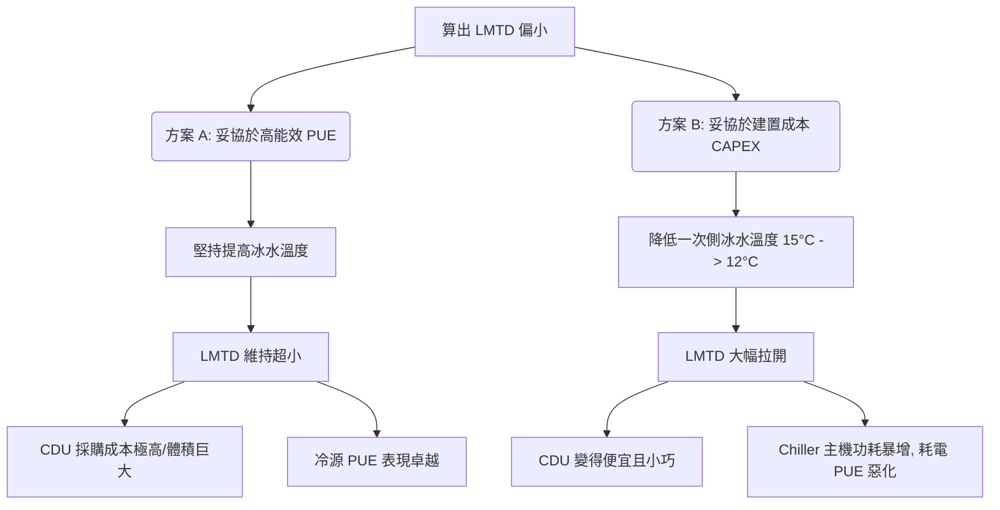

*   **決策下一步**：將這兩種方案的 **CAPEX（CDU 採購溢價）** 與 **OPEX（5 年冰電費差額）** 寫成報告，向專案主管（Boss）回報，決定整座 AIDC 的最優平衡點。

---

## 4. ε-NTU 換熱有效度法（補充）

在評估**現有熱交換器**的實際性能（而非設計新設備）時，工程師更常用 **ε-NTU（Effectiveness - Number of Transfer Units）** 方法，避免 LMTD 需要知道出口溫度的循環計算問題。

### 核心參數

$$NTU = \frac{U \times A}{\dot{m}_{min} \times C_p}$$

$$\varepsilon = \frac{Q_{actual}}{Q_{max}} = \frac{\text{實際換熱量}}{\text{理論最大換熱量}}$$

其中：
- $\dot{m}_{min}$：熱容量較小一側的質量流量
- $Q_{max} = \dot{m}_{min} \times C_p \times (T_{hot,in} - T_{cold,in})$：兩側進口最大溫差可達到的最大傳熱量

### 逆流換熱器的 ε-NTU 關係（最常用）

$$\varepsilon = \frac{1 - e^{-NTU(1-C^*)}}{1 - C^* \cdot e^{-NTU(1-C^*)}}$$

其中 $C^* = \dot{m}_{min} C_p / \dot{m}_{max} C_p$（容量比）

| NTU | $C^*=0.5$（典型 CDU PHE）| $C^*=1.0$ |
|:---:|:---:|:---:|
| 1.0 | 0.58 | 0.50 |
| 2.0 | 0.78 | 0.67 |
| 3.0 | 0.89 | 0.75 |
| **4.0** | **0.94** | **0.80** |

> **工程應用：** 當 CDU 一次側流量減少（Chiller 部分負載）、導致四溫點偏移時，用 ε-NTU 法快速估算新的出口溫度，判斷是否仍滿足 GPU 供水 ≤ 17°C 的要求。

## 5. Cross-References

*   系統級選型決策：[[CDU 架構與選型]]
*   冷凍機房冷源配合：[[Chiller Plant]]、[[Module 05 - 冷源與冷凍機房]]
*   廠商發包配合：[[設備與廠商選型對照矩陣]]（RFQ 技術要點）、[[Module 08 - 廠商生態系統]]
*   IT 側源頭冷卻需求：[[GB200 NVL72 冷卻需求]]


## ================================================================================
## DOCUMENT: C:\Users\user\Obsidian\Engineering-Wiki\wiki\concepts\06_standards_calculations\PUE 計算.md
## ================================================================================
---
tags: [concept, metrics, PUE, efficiency]
sources: ["[[AIDC HVAC 學習基地 - Notion]]"]
created: 2026-05-20
updated: 2026-05-20
---

# PUE 計算

**PUE（Power Usage Effectiveness）** 是評估資料中心能源效率的國際標準指標，由 The Green Grid 組織定義。

## 公式

$$PUE = \frac{\text{資料中心總用電}}{\text{IT 設備用電}}$$

$$\text{冷卻耗電} = IT\ Load \times (PUE - 1)$$

## 各等級意義

| PUE 值 | 等級 | 代表 |
|--------|------|------|
| 1.0 | 理論完美值（不可能達到）| 無任何額外損耗 |
| 1.1~1.2 | 頂尖 | Google、Meta、Microsoft 超大規模 DC |
| 1.3~1.4 | 良好 | 現代設計良好的商業 DC |
| 1.5~2.0 | 一般至老舊 | 傳統 DC |
| > 2.0 | 效率低下 | 需改善 |

**鴻海 AIDC 目標：PUE ≤ 1.2~1.3**

## 計算範例

IT 負載 100 MW，PUE = 1.25：

| 項目 | 計算 | 結果 |
|------|------|------|
| 設施總用電 | 100 × 1.25 | **125 MW** |
| 冷卻耗電 | 100 × (1.25 - 1) | **25 MW** |
| 25 MW 相當於 | | ~8,000 戶台灣家庭用電 |

> ⚠️ 冷卻耗電 = IT Load × **(PUE - 1)**，不是 IT Load 本身！

## 影響 PUE 的因素

冷卻系統通常佔設施總耗電的 **30~40%**，是影響 PUE 最大的單一因素。

| 優化手段 | PUE 改善 | 投資成本 |
|---------|---------|---------|
| 提高冷凍水供水溫度 | 0.05~0.1 | 低 |
| 導入磁浮式冷凍機 | 0.03~0.08 | 高 |
| 加入 Free Cooling | 0.05~0.15 | 中 |
| 冷凍水大溫差設計 | 0.02~0.05 | 低 |
| 液冷取代空冷 | 0.1~0.3 | 高 |

## 延伸指標：[[WUE 計算|WUE]]

**WUE（Water Usage Effectiveness）** 是用以評估資料中心水資源消耗效率的關鍵指標，詳細物理公式、各等級評分標準與水資源優化手段請詳見：**[[WUE 計算]]**。

## Cross-References

- 相關：[[Free Cooling]]、[[Chiller Plant]]、[[Module 02 - AIDC 熱負荷與冷卻需求]]、[[WUE 計算]]
- 計算實務：[[Module 07 - 設計計算實務]]
- 電力架構：[[Module 06 - 電力架構與機電整合]]


## ================================================================================
## DOCUMENT: C:\Users\user\Obsidian\Engineering-Wiki\wiki\concepts\06_standards_calculations\Tier 分級深度解析.md
## ================================================================================
---
tags: [concept, tier, uptime-institute, reliability, redundancy, availability]
sources: ["[[Module 01 - Data Center 基礎概念]]"]
created: 2026-06-06
updated: 2026-06-06
---

# Tier 分級深度解析

**Uptime Institute Tier Standard** 是全球資料中心可靠性與備援設計的權威分級標準，分為 Tier I ~ IV。理解每個 Tier 的**核心技術定義**——尤其是「可同步維護（Concurrently Maintainable）」與「容錯（Fault Tolerant）」的本質差異——是設計 AIDC 電力與冷卻備援架構的基礎。

---

## 1. 四個 Tier 的核心定義與可用性

| Tier | 名稱 | 年停機時間上限 | 年可用性 | 設計哲學 |
|:---:|:---|:---:|:---:|:---|
| **I** | Basic Capacity | 28.8 hr/yr | 99.671% | 單一路徑，無備援 |
| **II** | Redundant Components | 22.0 hr/yr | 99.749% | N+1 組件備援，單一路徑 |
| **III** | Concurrently Maintainable | 1.6 hr/yr | **99.982%** | **雙路徑，可同步維護** |
| **IV** | Fault Tolerant | 0.4 hr/yr | **99.995%** | **雙路徑 + 容錯，任何單故障不中斷** |

---

## 2. Tier 核心概念深解

### A. Tier I / II — 單路徑（Single Path）

- IT 設備到冷源、IT 設備到電源，只有**一條路徑**
- 任何計畫性維護（更換過濾器、測試 UPS、清洗冷卻塔）都**必須停機**
- Tier II 多了 N+1 備用組件，發生意外故障時可切換，但**計畫維護仍需停機**

> ⚠️ 大多數傳統企業機房是 Tier I ~ II，不適合 24/7 要求 99.98%+ 的 AI 訓練工作。

### B. Tier III — 可同步維護（Concurrently Maintainable）

**關鍵定義：** 可在 IT 負載完全不中斷的情況下，對任何**單一**設備、組件或配電/配管路徑進行計畫性維護。

**實現機制：**
- 電力：A Feed + B Feed 雙路電力引入，每條路徑獨立承載 100% 負載
- 冷卻：雙組冷凍機、雙組冷卻塔、雙組 CDU，任一組可獨立離線維護
- 配電：雙組 UPS，雙組 PDU，雙路饋線

```
[市電 A 路] → UPS A → PDU A ─┐
                               ├→ IT 設備（雙 PSU）
[市電 B 路] → UPS B → PDU B ─┘
（任一路可獨立維護，IT 設備始終由另一路供電）
```

**限制：**
- Tier III 只能容忍**計畫性維護**不停機，但**非計畫性故障（意外）**仍可能造成中斷
- 若 A 路 UPS 故障的同時 B 路恰好在維護中，仍會停機（這需要 Tier IV 才能處理）

### C. Tier IV — 容錯（Fault Tolerant）

**關鍵定義：** 任何**單一** Tier III 所需的計畫維護，**加上** 任何**單一**非計畫性故障，均不造成 IT 負載中斷。

**實現機制（2N 全系統雙活）：**
- 電力：**2N** UPS + **2N** PDU，兩套系統同時運行，各承載 100% 負載
- 冷卻：**2N** 冷凍機房（兩套完全獨立）
- 網路：完全雙路獨立的入館光纖路由
- **機械與電氣系統完全獨立，無任何共用元件（Single Point of Failure = 0）**

---

## 3. 各子系統在 Tier III / IV 的具體差異

### 電力系統

| 子系統 | Tier III（可同步維護）| Tier IV（容錯）|
|:---|:---|:---|
| 市電引入 | 雙路電源（可同源）| **雙路電源（須不同路由、不同變電站）** |
| 主變壓器 | N+1 | **2N（兩組完全獨立）** |
| UPS 架構 | A/B Feed，各承 50% 或 100% | **2N，兩套完全獨立，各 100%** |
| 發電機 | N+1 共用母線 | **2N 分組，分接不同母線** |
| PDU/RPP | 雙路引入 | **雙路引入 + 雙 STS（靜態轉換開關）** |

### 冷卻系統

| 子系統 | Tier III | Tier IV |
|:---|:---|:---|
| 冷凍機（Chiller）| N+1，共用管路 | **2N，獨立管路路由** |
| 冷卻塔 | N+1，共用集水槽 | **2N，獨立系統** |
| CDU（液冷）| N+1，雙泵 VFD | **2N，兩套 CDU，分別接不同 Chiller 系統** |
| 泵組 | N+1 | **N+1 × 2 套** |

---

## 4. 建置成本 vs. 可用性分析

| Tier | 相對建置成本 | 年可用性 | 適用場景 |
|:---:|:---:|:---:|:---|
| I | 1.0× | 99.671% | 小型辦公室、非關鍵服務 |
| II | 1.3× | 99.749% | 中型企業機房 |
| **III** | **2.0~2.5×** | **99.982%** | **主流 Hyperscale AIDC 選擇** |
| IV | 3.5~4×+ | 99.995% | 金融核心系統、國防、電信交換節點 |

> **台灣 Foxconn AIDC 的策略：**
> 鴻海大型 AIDC 廠區設計以 **Tier III+** 為目標，即超越 Tier III 但不完全達到 Tier IV 的成本：
> - 電力系統達 Tier IV（2N UPS + 2N 發電機）
> - 冷卻系統採 Tier III（N+1 Chiller，但 CDU 採 2N）
> - 網路：雙路由（Tier IV 要求）
> 此策略在 99.99%+ 可用性與合理建設成本之間取得最佳平衡。

---

## 5. 常見誤解澄清

| 誤解 | 正確理解 |
|:---|:---|
| 「2N 就是 Tier IV」| 2N 是 Tier IV 的**必要條件之一**，但還需要系統獨立路由、無共用 SPOF |
| 「Tier III 可以容忍任何故障」| **Tier III 只能容忍計畫維護不停機**，非計畫故障仍可能停機 |
| 「高 Tier 一定比較好」| Tier IV 建置成本是 Tier I 的 4 倍，**過度設計是工程浪費**，需依 SLA 需求選型 |
| 「Tier 認證永久有效」| 每 3 年需 Uptime Institute 現場 re-certification，設備替換和架構修改後也需重新認證 |

---

## 6. Cross-References

- 電力備援系統：[[UPS]]、[[發電機]]、[[N+1 vs 2N vs N+2 備援架構]]
- 冷卻備援系統：[[Chiller Plant]]、[[CDU 架構與選型]]
- 基礎概念：[[Module 01 - Data Center 基礎概念]]
- 機電整合：[[Module 06 - 電力架構與機電整合]]


## ================================================================================
## DOCUMENT: C:\Users\user\Obsidian\Engineering-Wiki\wiki\concepts\06_standards_calculations\WUE 計算.md
## ================================================================================
---
tags: [concept, metrics, WUE, efficiency, water-consumption, design-standards]
sources: ["[[AIDC HVAC 學習基地 - Notion]]", "[[PUE 計算]]"]
created: 2026-05-21
updated: 2026-05-21
---

# WUE 計算

**WUE（Water Usage Effectiveness，水資源使用效率）** 是評估資料中心（Data Center）水資源消耗效率的國際標準指標，由 **The Green Grid（綠色網格）** 組織定義。

隨著 AI 晶片功率飆升，高密度 AIDC（如 NVIDIA GB200）對冷卻的需求極度依賴「冷卻水塔的蒸發潛熱」來排熱。這導致資料中心成為龐大的**耗水怪獸**。在水資源緊張的地區（如台灣夏季限水、新加坡、美國亞利桑那州），**WUE 的評估與控制與 PUE 同等重要**。

---

## 1. 計算公式

### A. 年度標準公式

$$WUE = \frac{\text{資料中心年度總用水量 (L)}}{\text{IT 設備年度總用電量 (kWh)}}$$

*   **單位**：**$\text{L/kWh}$**（升/度電）。
*   **數值對等**：在國際單位制中，WUE 也常寫作 **$\text{m}^3\text{/MWh}$**（立方米/兆瓦時），數值完全等價（$1 \text{ L/kWh} = 1 \text{ m}^3\text{/MWh}$）。
*   **分子定義**：**年度總用水量**包括冷卻塔蒸發水、系統排污水（Blowdown）、漂水（Drift）、設備清洗水以及辦公生活用水，其中 **95% 以上均耗費在冷卻排熱**。

### B. 瞬時補水流量計算（建廠管徑設計依據）

在 HVAC 工程設計中，我們需要依據瞬時最大耗水量來設計自來水進水管徑：

$$\text{總補水量 (Make-up Water)} = \text{蒸發水量 (Evaporation)} + \text{排污水量 (Blowdown)} + \text{漂水損失 (Drift)}$$

---

## 2. PUE vs. WUE 的物理折衷（Trade-off）

在 HVAC 系統規劃中，**降低 PUE（省電）往往會導致 WUE 上升（費水）**，這是一個經典的物理天平：

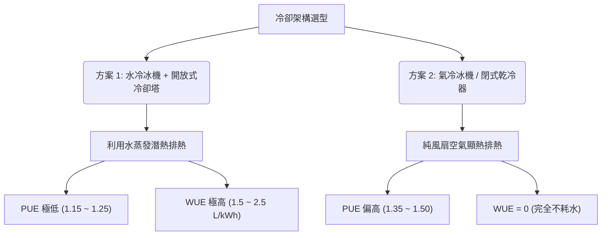

*   **理想結合：液冷（DLC） + 閉式乾冷器（Dry Cooler）**：
    由於液冷二次側供水溫度可拉高至 **$16^\circ\text{C} \sim 22^\circ\text{C}$**，在多數氣候區可直接使用乾冷器進行一次側自然冷卻，**達成 PUE $\le 1.15$ 且 WUE = 0** 的終極綠色目標。

---

## 3. WUE 各等級意義與合規標準

資料中心的 WUE 表現可劃分為以下工程等級：

| WUE 值 ($\text{L/kWh}$) | 耗水評級 | 典型冷卻架構與水路狀態 | 實務工程判定 |
| :--- | :---: | :--- | :--- |
| **$0$** | **零耗水** | 氣冷主機、閉式乾冷器（無蒸發輔助）。 | **水資源限水地區唯一解**。PUE 會稍微犧牲，但免除停水停機風險。 |
| **$< 0.2$** | **極優異** | 採用「間接蒸發冷卻（IEC）」或「噴霧輔助乾冷器（Adiabatic）」，僅在夏季高溫時噴水降溫。 | 高度節水的 AIDC 設計，兼顧了省電與省水。 |
| **$0.2 \sim 0.5$** | **良好** | 水冷系統，但配合高效率冷卻塔、高濃縮倍數（CoC $\ge 6$）及冷凝水回收。 | 現代化、精細化管理的資料中心。 |
| **$0.5 \sim 1.5$** | **一般** | 標準水冷冰機 + 傳統冷卻塔，濃縮倍數在 $3 \sim 5$ 之間。 | 大多數大型商業資料中心的現狀。 |
| **$> 1.5$** | **高耗水** | 水質管理極差，冷卻塔頻繁排污，或濃縮倍數 $< 3.0$。 | 屬於綠能環保黑名單，在台灣夏季或新加坡將面臨高額水費懲罰。 |

*   **新加坡 IMDA 標準 (SS 564)**：超大規模資料中心必須強制進行水資源審計。
*   **台灣經濟部水利署**：資料中心建案必須通過「用水計畫書」審查，評估限水時期（如新竹、台南梅雨季前）的儲水罐（能維持運轉 24~48 小時）容量。

---

## 4. 實務計算範例

### 專案背景：
鴻海規劃在南部建置一座 IT 負載 **$50 \text{ MW}$** 的 AI 算力中心（GB200 NVL72），全年無休運轉（運轉時數 $8,760 \text{ h}$）。冷卻系統採用水冷冰機搭配開放式冷卻塔，設計 **$WUE = 1.6 \text{ L/kWh}$**。

#### 1. 計算年度總用電量：
$$\text{Annual IT Energy} = 50,000 \text{ kW} \times 8,760 \text{ h} = 438,000,000 \text{ kWh (4.38 億度電)}$$

#### 2. 計算年度總消耗水量：
$$\text{Annual Water} = 438,000,000 \text{ kWh} \times 1.6 \text{ L/kWh} = 700,800,000 \text{ L} = 700,800 \text{ m}^3$$

> 💡 **驚人數據**：該 AIDC 每年將消耗 **$70$ 萬噸自來水**，相當於 **$280$ 個奧運標準游泳池** 的水量！

#### 3. 計算瞬時補水流量（設計進水管徑）：
$$\text{瞬時補水量} = \frac{700,800,000 \text{ L}}{8,760 \text{ h}} = 80,000 \text{ L/h} = 80 \text{ m}^3\text{/h} \approx 22.2 \text{ L/s}$$

*   **設計行動**：廠務工程師必須依據 **$22.2 \text{ L/s}$** 的連續補水量來設計自來水引入管徑（通常需選用 **DN150/6吋管**），並規劃至少 **$1,920 \text{ m}^3$ 的儲水罐（Buffer Tank）**，以防市政自來水管爆管限水時，系統能維持至少 $24$ 小時不中斷運轉。

---

## 5. WUE 的工程優化手段

作為 HVAC 設計工程師，要強效拉低 WUE，必須採取以下手段：

1.  **拉高冷卻塔「濃縮循環倍數（Cycle of Concentration, CoC）」**：
    *   CoC 代表冷卻水不斷循環蒸發後，內部雜質被濃縮的倍數。
    *   **優化**：透過導入「高精度自動加藥加排污控制器」與「水磁化防垢處理」，將 CoC 從 $3.0$ 提升至 $6.0$，**可降低 $50\%$ 的排污水路浪費**。
2.  **蒸發冷卻與乾冷（Dry Cooling）智慧自動切換**：
    *   在冬季或春季（戶外濕球溫度 $< 15^\circ\text{C}$ 時），將系統切換為純乾冷（Dry Cooler）運轉，完全關閉冷卻塔噴淋水，實現**冬季耗水量歸零**。
3.  **冷凝水回收系統（Condensate Recovery）**：
    *   收集機房白區空調 CRAH 在夏季除濕時產生的冷凝水（極為純淨，無礦物質），打回冷卻塔作為補水，可省下約 $3 \sim 5\%$ 的進水量。
4.  **雨水收集與中水利用**：
    *   收集廠房大底屋頂雨水，經多介質過濾器後作為冷卻水塔補水。

---

## 6. Cross-References

*   能效核心指標：[[PUE 計算]]
*   耗水核心設備：[[冷卻水塔]]、[[開放式冷卻塔 vs 閉式冷卻塔]]
*   系統水量熱負荷計算：[[Module 02 - AIDC 熱負荷與冷卻需求]]、[[Module 05 - 冷源與冷凍機房]]
*   發包矩陣水質標準：[[設備與廠商選型對照矩陣]]


## ================================================================================
## DOCUMENT: C:\Users\user\Obsidian\Engineering-Wiki\wiki\concepts\07_design_safety\AIDC FMEA 故障模式與效應分析.md
## ================================================================================
---
tags: [concept, AIDC, FMEA, failure-analysis, risk-management, plant-operation, maintenance]
sources: ["[[AIDC 核心標準與規範指引]]", "[[AIDC 驗收測試與調試實務]]"]
created: 2026-06-06
updated: 2026-06-06
---

# AIDC FMEA 故障模式與效應分析

為了確保 AIDC 的高可用性（高可靠度 Tier III/IV 要求），運維團隊必須在設計與運維階段引進**故障模式與效應分析（FMEA, Failure Modes and Effects Analysis）**。本分析針對液冷與配電系統中最致命的 10 大失效事件進行了表格化梳理，劃分了責任界面與系統恢復時間目標（RTO）。

---

## 1. AIDC 核心系統 FMEA 矩陣

| 失效事件 (Failure Event) | 潛在原因 (Root Cause) | 偵測方式 (Detection Method) | 系統聯鎖與保護動作 (Interlock & Protection) | 恢復時間目標 (RTO) | 責任界面 (Interface) |
| :--- | :--- | :--- | :--- | :--- | :--- |
| **1. CDU 二次側變頻水泵故障** | 水泵電機燒毀、軸承卡死、VFD 變頻器故障。 | *   流量計流量歸零<br>*   水泵前後壓差（DP）消失<br>*   BMS 監測電流回饋異常。 | 立即聯鎖啟動備用水泵（N+1），聯鎖開啟備用水泵之電動出口閥，維持二次側水路壓力。 | **$\le 2.0 \text{ 秒}$** | 廠務機電 / CDU 廠商 |
| **2. CDU 板式熱交換器結垢堵塞** | 一次側冷卻水水質不佳結晶、二次側雜質積聚。 | *   二次側供水溫度（$T_{s2}$）持續上升<br>*   板換一次側與二次側壓降（DP）同時升高。 | 動態調節一次側流量閥至 100% 開度；若水溫持續超標，觸發 DCIM 警告，聯鎖 IT 端降低伺服器拉載（降頻）。 | **無瞬時 RTO**<br>(需離線旁路酸洗) | 廠務暖通 / 水處理廠商 |
| **3. 快速接頭 (UQD) 磨損滲漏** | 插拔次數超標、O型密封圈在高溫乙二醇中老化乾裂。 | *   機櫃接頭下方繩式感漏電纜阻抗突降<br>*   CDU 二次側膨脹罐液位持續下降。 | 聯鎖關閉該機櫃 Manifold 分支的電磁截止閥，DCIM 發送告警並定位具體機櫃位置，聯鎖切斷該櫃 PDU。 | **$\le 10 \text{ 分鐘}$**<br>(手動熱插拔更換) | 運維團隊 / 液冷快接廠商 |
| **4. 冷板微通道 (MCCP) 堵塞** | 二次側水質失控產生微生物黏泥、管路沖洗未淨之金屬殘渣。 | *   單張 GPU 節點核心溫度（$T_j$）急遽飆升<br>*   Tray 分支流量計讀數下降。 | 聯鎖觸發該張 GPU 伺服器的保護性熱節流（Throttling）或自動關機，防止晶片燒毀。 | **$\le 24 \text{ 小時}$**<br>(需拆卸更換冷板) | IT 維護 / 散熱模組廠商 |
| **5. 白區二次側主幹管破裂** | 管路水鎚效應（Water Hammer）、管道銲縫疲勞開裂。 | *   二次元供回水流量嚴重失衡（變送器差值 $>10\%$）<br>*   膨脹水箱液位雪崩式下跌。 | **緊急停機（ESD）聯鎖**：關閉 CDU 出口電動總閥及各機櫃總進水閥，停止所有水泵；聯鎖切斷白區該區域所有伺服器電力，避免水災擴大。 | **$\le 4.0 \text{ 小時}$**<br>(需重新銲接壓測) | 廠務暖通 / 施工防護 |
| **6. 露點控制失效導致冷板結露** | 白區精密空調（CRAH）加濕失控、白區門禁未關引入濕氣、CDU 三通閥控制器死機。 | *   白區空氣濕度感測器回報超標<br>*   冷板表面冷凝水偵測電極報警。 | 聯鎖將 CDU 二次側供水溫度目標值強行拉升至 $22^\circ\text{C}$（高於一般露點），同時 CRAH 啟動最大抽濕模式。 | **$\le 5 \text{ 分鐘}$**<br>(露點溫度強行拉離) | 廠務空調 / 自動控制組 |
| **7. 市電中斷時 UPS 切換失敗** | 逆變器故障、靜態開關（STS）卡死、電池組單電芯開路失效。 | *   白區直流/交流配電母線電壓歸零<br>*   IT 伺服器電源 PSU 告警。 | 瞬間聯鎖將雙路 Feed B（或備用旁路路徑）切入，啟動 STS 毫秒級強切。 | **$\le 4 \text{ 毫秒}$** | 廠務電力 / UPS 廠商 |
| **8. 緊急柴油發電機啟動失敗** | 啟動蓄電池電壓不足、燃油管路阻塞、啟動馬達故障。 | *   發電機組控制器輸出「Start Fail」信號<br>*   市電切斷後 15 秒內無電壓輸入。 | 啟動第二順位備用發電機（N+1），同時聯鎖 DCIM 發出指令，開始對白區進行非關鍵負載（Non-critical load）逐級卸載（Load Shedding），延長 UPS 電池支撐時間。 | **$\le 15 \text{ 秒}$**<br>(備用機組投切) | 廠務電力 / 發電機廠商 |
| **9. 冷卻水塔水質失控與藻類滋生** | 自動化加藥系統藥劑耗盡、水塔水溫適宜（$25\sim 35^\circ\text{C}$）光照充足。 | *   水塔出水濁度升高<br>*   板式換熱器一次側壓降升高。 | 手動加入衝擊劑量的非氧化性殺菌劑，啟動水塔物理除藻排污閥。 | **$\le 12 \text{ 小時}$** | 廠務水處理 / 運維組 |
| **10. BMS 壓力/溫度感測器漂移失真** | 感測器老化、電磁干擾、校正週期過期。 | *   送回水溫差與熱負荷計算出現不合理偏差（如溫差負值）<br>*   與鄰近冗餘感測器數值對比偏差 $>10\%$。 | 控制系統自動屏蔽該壞點資料，切換至冗餘（Redundant）感測器作為反饋來源，並向 BMS 發送儀器校正警告。 | **無瞬時影響**<br>(冗餘保護自動切換) | 自動控制 / 儀表工程師 |

---

## 2. 核心失效的緩解與防範機制（Mitigation Checklist）

為避免上述致命失效在現場發生，運維團隊應落實以下防線：

### A. 水鎚效應防範（防範第 5 項失效）
*   **物理緩解**：在 CDU 出口與二次側主幹管的末端，安裝**氣囊式水鎚吸收器**（Water Hammer Arrestor）。
*   **控制緩解**：所有電動隔離閥的關閉/開啟時間必須設定為**緩慢型（$\ge 10 \text{ 秒}$）**，嚴禁電磁閥瞬時截止，防止動能轉化為衝擊壓波。

### B. 露點防禦天平（防範第 6 項失效）
*   白區進氣濕度應嚴格維持在 **$40\% \sim 55\% \text{ RH}$** 之間。
*   CDU 控制器必須有獨立於 BMS 的硬體 PLC，一旦與 DCIM 通訊中斷，應自動將二次側送水溫度拉高至最安全上限（如 $22^\circ\text{C}$），進行保守運行。

### C. 絕緣預警機制（防範第 7 項失效）
*   UPS 電池必須配備 **BMS 電池監測系統**，實時量測每一顆電芯的內阻、電壓與溫度。不允許依靠「定期放電」來發現壞電池。

---

## Cross-References

*   驗收測試方法：[[AIDC 驗收測試與調試實務]]
*   配電失效緩解：[[UPS]]、[[發電機]]、[[800VDC 直流配電]]
*   水路設計安全：[[液冷系統 - CDU 架構]]、[[漏液偵測系統]]
*   水質失控危害：[[TCS 二次側與冷卻水化學管理]]


## ================================================================================
## DOCUMENT: C:\Users\user\Obsidian\Engineering-Wiki\wiki\concepts\07_design_safety\AIDC 驗收測試與調試實務.md
## ================================================================================
---
tags: [concept, AIDC, commissioning, validation, FAT, SAT, IST, white-space, plant-operation]
sources: ["[[AIDC 核心標準與規範指引]]"]
created: 2026-06-06
updated: 2026-06-06
---

# AIDC 驗收測試與調試實務

在 AIDC 的交付生命週期中，設計與設備選型只完成了前半段。決定資料中心是否能如期上線並安全運轉的關鍵，在於**調試驗證流程（Commissioning, Cx）**。特別是面對高達 $100\text{ kW/rack}$ 以上的極限熱負荷與液冷/電力整合系統，驗收調試必須嚴格執行工業級的閉環驗證。

---

## 1. 驗收調試的五大階段 (Level 1 ~ Level 5 Commissioning)

依據 ASHRAE 與 NEBB 的 AIDC 標準調試指南，驗證流程被劃分為五個遞進的關卡：

```
 [ Level 1 (FAT) ] ---> [ Level 2 (SAT) ] ---> [ Level 3 (靜態安裝) ] ---> [ Level 4 (功能測試) ] ---> [ Level 5 (IST 整合測試) ]
 ( 設備工廠驗收 )       ( 現場開箱驗收 )         ( 靜態管線與電控安裝 )     ( 單機開機與迴路控制 )   ( 假負載滿載聯鎖測試 )
```

### Level 1: Factory Acceptance Testing (FAT, 工廠驗收測試)
*   **執行地點**：設備製造商工廠（如 Vertiv 的 CDU 廠、Daikin 的冰機廠）。
*   **測試重點**：確認設備性能符合發包規格書（RFQ）。例如：CDU 在出廠前需在測試台進行最大揚程、流量與壓力降測試，並由第三方認證簽署報告。

### Level 2: Site Acceptance Testing (SAT / Product Receipt, 現場驗收測試)
*   **執行地點**：AIDC 施工工地。
*   **測試重點**：設備運抵現場後開箱檢查。確認運輸過程中無機械損傷、變形，檢查電器元件接頭是否鬆脫，液冷組件（如冷板與快接）無漏壓情形。

### Level 3: Installation Verification (靜態安裝確認)
*   **測試重點**：管線與電氣靜態安裝品質檢查。
    *   **液冷管路**：進行氣密測試（壓降檢漏，以 1.5 倍工作壓力充氮氣保持 24 小時）與管路沖洗（Flushing，除去銲渣與鐵屑），安裝 Y 型過濾器。
    *   **電力配線**：進行絕緣電阻測試（Megger 測試）與 Busbar 扭力校正檢查。

### Level 4: Functional Performance Testing (FPT, 單機功能性能測試)
*   **測試重點**：單機送電開機，驗證單一控制迴路（PID）的反應。
    *   **液冷測試**：CDU 水泵空載與載水運轉，變頻器（VFD）根據壓力差（DP）指令加減速。
    *   **冷源測試**：冰機單機啟動、水閥開關回饋、冷卻塔風扇轉速控制邏輯。
    *   **電力測試**：UPS 單機充放電試驗，確認雙路（A/B Feed）靜態轉換開關（STS）的切換功能。

### Level 5: Integrated Systems Testing (IST, 整合系統測試)
*   **地位**：驗收的「終極畢業考試」。
*   **方法**：使用大容量**假負載（Load Bank）**模擬 GB200 機櫃的發熱與拉載，進行全廠滿載狀態下的電力、液冷、冷源、消防與自動控制系統的聯動大考驗。

---

## 2. IST 階段的核心故障切換測試實務

IST 必須模擬現場最嚴苛的故障場景，確保備援系統（N+1 / 2N）的「無縫切換」能力：

### 測試項目一：斷電切換測試（Blackout & Generator Ride-Through）
*   **目的**：模擬台電電網瞬間斷電，發電機與 UPS 的配合能力。
*   **現場步驟**：
    1.  全 white space 假負載滿載拉載（例如 10MW）。
    2.  手動切斷市電主斷路器（模擬斷電）。
    3.  驗證：
        *   UPS 必須在 0 毫秒內切入電池放電，維持 IT 與 CDU 水泵不中斷。
        *   發電機必須在 **$10 \sim 15 \text{ 秒}$** 內自動啟動並聯送電，STS 自動切換至發電機端。
        *   冰機（Chiller）必須在發電機送電後啟動快速重啟（Fast Start-up）邏輯，在 **$60 \text{ 秒}$** 內恢復提供冷凍水，防止儲冷罐用盡。

### 測試項目二：冷卻失效測試（Cooling Failure Test）
*   **目的**：驗證水泵跳閘或 CDU 停機時的系統容錯與降載邏輯。
*   **現場步驟**：
    1.  模擬運行中的 CDU 主水泵突然跳電故障。
    2.  驗證：
        *   BMS 控制器必須在 **$<1.5 \text{ 秒}$** 內啟動備份水泵（N+1），且二次側變頻器需快速拉升轉速，水阻壓降波動小於 $10\%$。
        *   若整台 CDU 故障，備份 CDU 必須在 5 秒內開啟對應電動隔離閥並併網送水。
        *   監測假負載的溫度回饋，GPU 模擬晶片不能因為這段壓差波動觸發熱節流關機。

### 測試項目三：漏液與消防截止聯鎖測試（Leakage & ESD Interlock）
*   **目的**：驗證發生水災時，系統的自保截止能力。
*   **現場步驟**：
    1.  向冷板周邊的繩式感測漏液電纜滴水。
    2.  驗證：
        *   漏液探測主機必須在 **$<2 \text{ 秒}$** 內將告警上傳至 BMS/DCIM，並自動向該機櫃排 Manifold 的電磁截止閥發出「強制關閉（ESD）」信號。
        *   聯鎖動作：切斷該機櫃的 PDU 電源，啟動白區的抽風防潮邏輯，並在 DCIM 顯示漏液定位偏差小於 $\pm 1 \text{ 米}$。

---

## 3. 二次側（TCS）水質驗收指標與標準

調試階段的最後一步是水質驗收。直接液冷（DLC）的二次側水質一旦不合格，將導致管網在幾週內報廢。

| 檢驗項目 | 標準範圍 | 驗收檢測手段 | 超標危害 |
| :--- | :--- | :--- | :--- |
| **導電度 (Conductivity)** | **$\le 10 \ \mu\text{S/cm}$** (常溫) | 線上電導率儀 | 超標會導致伽凡尼電化學腐蝕加速，引發漏電風險。 |
| **pH 值** | **$6.5 \sim 8.0$** | pH 計 | $<6.5$ 酸性腐蝕銅冷板；$>8.0$ 鹼性加速鋁或銲錫腐蝕。 |
| **過濾精度** | **$\le 5 \ \mu\text{m}$** (旁濾) | 濁度計與濾芯殘渣化驗 | 大顆粒懸浮物會直接堵塞 $80\mu\text{m}$ 的 MCCP 流道，導致 GPU 局部燒毀。 |
| **銅離子濃度** | $< 0.1 \text{ ppm}$ | 原子吸收光譜儀 | 銅離子游離會沉積於不鏽鋼表面，引起孔蝕。 |
| **細菌與微生物** | $< 100 \text{ CFU/mL}$ | 細菌培養皿培養 | 生物膜（Biofilm）滋生會堵塞微流道，阻礙熱傳。 |

---

## 4. BMS / DCIM 告警矩陣（Alarm Matrix）

驗收時，必須逐項觸發以下告警點，驗證控制主機的響應等級：

| 告警觸發源 | 監測閾值 | 響應級別 | BMS/DCIM 聯鎖動作 |
| :--- | :--- | :--- | :--- |
| **二次元送水溫度高** | $\ge 22^\circ\text{C}$ (對應 W4 送水) | **Critical** | 一次側閥門 100% 開啟；若水溫持續上升 $\ge 25^\circ\text{C}$，聯鎖 IT 電源強制降頻。 |
| **Manifold 壓差低** | $< 0.5 \text{ bar}$ | **Major** | 變頻泵立刻加速；若壓差持續低於下限，啟動備用水泵並發出運維警報。 |
| **二次側流量低** | $< 9.6 \text{ L/min}$ (單 Tray) | **Critical** | 觸發該伺服器 Tray 的保護性降載（Throttling），防止 GPU 過熱。 |
| **感漏電纜觸發** | 阻抗下降且持續 $>1.5\text{s}$ | **Emergency** | 關閉該分支機櫃 Manifold 快接截止閥，聯鎖切斷機櫃 rPDU 電力。 |

---

## Cross-References

*   一次側冷源調試：[[Chiller Plant]]
*   消防驗收標準：[[消防系統]]
*   CDU 控制邏輯：[[液冷系統 - CDU 架構]]
*   標準合規依據：[[AIDC 核心標準與規範指引]]
*   水質化學控制細節：[[TCS 二次側與冷卻水化學管理]]


## ================================================================================
## DOCUMENT: C:\Users\user\Obsidian\Engineering-Wiki\wiki\concepts\07_design_safety\BMS與DCIM序列控制邏輯.md
## ================================================================================
---
tags: [concept, AIDC, BMS, DCIM, controls, SOO, dew-point, liquid-cooling, HVAC]
sources: ["[[AIDC 核心標準與規範指引]]", "[[液冷系統 - CDU 架構]]", "[[AIDC 驗收測試與調試實務]]"]
created: 2026-06-06
updated: 2026-06-06
---

# BMS與DCIM序列控制邏輯

在 AIDC 中，暖通與電力硬體的高效運行，完全依賴於 **BMS（Building Management System, 廠務監控系統）** 與 **DCIM（Data Center Infrastructure Management, 資料中心基礎設施管理系統）** 的**序列控制邏輯（Sequence of Operations, SOO）**。對於超高功率密度的直接液冷系統，控制迴路的反應時間與精準度決定了晶片是否會因為瞬間熱量積聚而燒毀。

---

## 1. CDU 二次側（TCS）水路恆壓差（DP）控制

TCS 迴路負責直接帶走 GPU 的熱量，系統水泵必須根據伺服器負載動態調整流量。

```
  [ CDU 供水主幹管 ] -------------------------> [ 機櫃伺服器節點 ]
         |                                           | (閥門開閉改變阻力)
  [ 差壓變送器 (DP Sensor) ]                   [ 差壓變送器 (DP Sensor) ]
         |                                           |
         +-----------------< [ BMS 控制器 ] <---------+
                                 | (PID 計算)
                     [ 變頻器 (VFD) 調整水泵轉速 ]
```

*   **控制目標**：維持機櫃進出口的**壓差（Differential Pressure, DP）恆定**，以確保即使部分伺服器節點拉出維護時，其餘在線運行的節點流量依然穩定。
*   **控制序列**：
    1.  BMS 實時讀取設置於最遠端（末端機櫃）進回水 Manifold 之間的差壓變送器數值。
    2.  將實測差壓 $DP_{act}$ 與設定目標值 $DP_{set}$（例如 $1.2 \text{ bar}$）進行比較。
    3.  透過 **PID 控制演算法**（比例-積分-微分，反應時間需 **$< 1.5 \text{ 秒}$**），輸出 $0 \sim 100\%$ 的頻率信號給二次側循環水泵的變頻器（VFD）：
        *   若 $DP_{act} < DP_{set}$ $\rightarrow$ VFD 頻率拉升 $\rightarrow$ 水泵加速。
        *   若 $DP_{act} > DP_{set}$ $\rightarrow$ VFD 頻率調降 $\rightarrow$ 水泵減速。

---

## 2. CDU 一次側三通調節閥與露點追蹤邏輯（Dew Point Tracking）

這是防止白區結露的核心邏輯防線。CDU 必須根據室內空氣溫度與濕度，動態調整送入伺服器的冷卻水溫 $T_{s2}$：

$$\text{TCS 送水溫度設定值 } T_{s2\_set} = \text{Dew Point } (T_{dew}) + 2^\circ\text{C} \text{ (安全裕度)}$$

```
 [ 白區溫濕度感測器 ] ---> [ BMS 計算露點 T_dew ] ---> [ 設定目標 Ts2_set = T_dew + 2°C ]
                                                               |
 [ 一次側三通電動閥開度 ] <--- [ PID 控制調節 ] <--- [ 比較實測 Ts2 與 Ts2_set ]
```

*   **控制序列**：
    1.  BMS 每 10 秒讀取白區（White Space）回風口的溫度（$T_{air}$）與相對濕度（$RH$），透過 Magnus-Tetens 公式動態計算當前露點溫度 $T_{dew}$。
    2.  CDU 控制器設定二次側供水溫度目標值 $T_{s2\_set} = T_{dew} + 2^\circ\text{C}$。
    3.  實時讀取二次側供水感測器數值 $T_{s2\_act}$。
    4.  PID 調節 CDU 一次側（Chilled Water 側）的**三通電動調節閥**（Modulating Three-Way Valve）：
        *   若 $T_{s2\_act} > T_{s2\_set}$ $\rightarrow$ 電動閥開啟，增加一次側低溫冰水流量，強化熱交換，拉低二次側水溫。
        *   若 $T_{s2\_act} < T_{s2\_set}$（接近露點危險區） $\rightarrow$ 電動閥關小，減少冰水流量，讓二次側水溫自然回升。

---

## 3. 冷源一次側控制邏輯（Chiller Staging & Pump VFD）

冷凍機房（Chiller Plant）的控制邏輯決定了系統整體的 PUE 能效：

### 冰機啟停控制（Chiller Staging）
BMS 根據全廠的**熱負載（Cooling Load）**來決定啟動幾台冰機，而非僅看回水溫度。

$$\text{Cooling Load (kW)} = \dot{m} \text{ (流量, kg/s)} \times C_p \text{ (比熱, 4.18)} \times \Delta T \text{ (溫差, } ^\circ\text{C} )$$

*   **載入序列 (Loading)**：當實測熱負載大於當前運行冰機總容量的 $90\%$，且持續 $10\text{ 分鐘}$ 以上時，BMS 發出指令啟動下一台備用冰機（按等電位循環累計運行時間最短的設備優先啟動）。
*   **卸載序列 (Unloading)**：當熱負載降至當前運行冰機總容量的 $45\%$ 以下時，BMS 關閉一台冰機，並自動將多餘流量旁路。

### 冷水泵變頻控制（Primary/Secondary Pump VFD）
採用**二次泵變頻系統**。一次泵（Chiller 側）維持恆定流量以保護 Chiller 蒸發器不結冰；二次泵（廠務幹管側）則根據廠務供回水主幹管的壓差動態調節轉速，降低泵浦功耗。

---

## 4. 冷卻水塔與冷凝水控制（Tower Fan Control）

*   **控制目標**：控制冷卻塔風扇轉速，將進入 Chiller 冷凝器（Condenser）的冷卻水溫維持在設定點（例如 $26^\circ\text{C}$），或接近環境濕球溫度（Wet Bulb Temperature）。
*   **控制序列**：
    1.  BMS 監測冷卻塔出口（進入 Chiller）的水溫 $T_{cw}$。
    2.  將 $T_{cw}$ 與目標值進行比較。
    3.  PID 控制**冷卻塔風扇的變頻馬達**：
        *   水溫升高時，風扇加速，增加蒸發散热量。
        *   水溫降低或冬季時，風扇減速甚至停轉，改用重力自然冷卻，省下風扇電能。

---

## 5. 緊急停機與安全聯鎖（ESD Interlock Logic）

當發生嚴重故障時，控制系統必須執行硬體防禦動作以阻止災害蔓延：

```
       [ 嚴重事件觸發 ]                               [ 控制器執行防禦動作 ]
  ==========================                  ====================================
  * 感漏電纜漏水報警 (>1.5s)  ====聯鎖動作====> * 關閉該分支 Manifold 電磁閥
  * 液冷管路壓力暴降 (>3.0 bar)                 * 關閉該機櫃 PDU 電源 (IT 降載)
  ==========================                  ====================================
  * 消防系統 VESDA 觸發 (L4) ===聯鎖動作====> * 白區空氣精密空調 (CRAH) 停轉關風機
  * 氣體消防噴放觸發                          * 關閉防火風門 (防止滅火氣體流失)
  ==========================                  ====================================
```

---

## Cross-References

*   露點與水路設計：[[液冷系統 - CDU 架構]]、[[CDU 架構與選型]]
*   驗收聯鎖測試：[[AIDC 驗收測試與調試實務]]
*   故障模式防範：[[AIDC FMEA 故障模式與效應分析]]
*   冰機水路基礎：[[Chiller Plant]]


## ================================================================================
## DOCUMENT: C:\Users\user\Obsidian\Engineering-Wiki\wiki\concepts\07_design_safety\CFD 模擬.md
## ================================================================================
---
tags: [tool, CFD, simulation, airflow, design]
sources: ["[[AIDC HVAC 學習基地 - Notion]]"]
created: 2026-05-20
updated: 2026-05-20
---

# CFD 模擬（Computational Fluid Dynamics）

**CFD 模擬（計算流體力學模擬）** 是 AIDC HVAC 設計流程中不可或缺的驗證工具，用於在設備採購和施工前預測氣流分布、熱場分布、靜壓場，以及外部氣流（如發電機排氣影響）。

> **CFD 必須在設備採購前完成，不是最後的驗收工具。** CFD 發現問題改的是圖，施工後發現是拆牆改管。

## 在設計流程中的位置

```
Step 1~6：IT Load 定義 → 冷卻架構選擇 → 設備初選
↓
【Step 7：CFD 模擬驗證】← 設備採購前
↓
根據 CFD 結果修改設計
↓
Step 8：設備採購 → 施工 → Commissioning
```

## 四大驗證項目

| 驗證項目 | 分析內容 | 常見發現問題 | 對應處理 |
|---------|---------|------------|---------|
| **氣流分布**（內部）| 冷空氣路徑、Bypass 率 | 冷風未過機架直接回風（Bypass）| 調整穿孔磚位置、增加封閉 |
| **熱場分布**（內部）| 機架進氣溫度分布 | Hot Spot（局部超過 ASHRAE 上限）| 調整 CRAH 位置、增加 In-Row Cooling |
| **靜壓場**（架高地板）| 地板下靜壓均勻性 | 遠端機架風量不足 | 調整地板高度、穿孔磚開口率 |
| **外流場**（建築外部）| 發電機排氣、冷卻塔進風 | 排氣影響冷卻塔進氣濕球溫度 | 調整排氣口位置、方向 |

## 關鍵指標

| 指標 | 理想值 | 說明 |
|------|-------|------|
| 機架進氣溫度 | ≤ ASHRAE A2 上限（35°C）| 超出即代表有 Hot Spot |
| 冷通道 Bypass 率 | < 10% | 太高代表封閉不足或穿孔磚位置錯誤 |
| 地板靜壓均勻性 | ±2~3 Pa | 差異過大代表遠端風量不足 |
| 最大機架進氣溫度 | 設計點 +3°C 內 | 超出代表 HAC/CAC 設計失效 |

## 常用 CFD 軟體

| 軟體 | 類型 | 特點 |
|------|------|------|
| **6SigmaRoom / 6SigmaDC** | DC 專用 | 最廣泛使用，含設備資料庫，快速建模 |
| **Future Facilities（2BM）**| DC 專用 | 操作直覺，適合非 CFD 專家 |
| **ANSYS Fluent / CFX** | 通用 CFD | 精度最高，適合外流場與複雜幾何 |
| **OpenFOAM** | 通用 CFD（開源）| 免費，但操作門檻高 |

> AIDC 設計實務中，DC 專用軟體（6SigmaRoom、Future Facilities）佔大多數，ANSYS 系列用於外流場（發電機、建築外部氣流）精確分析。

## CFD 模型建立重點

### 必須包含的元素

- 機架配置（位置、功耗、散熱分布）
- CRAH/CRAC 位置與風量
- 架高地板高度與穿孔磚配置
- HAC/CAC 封閉狀態
- CDU/RDHX 等液冷設備（作為熱源）
- 建築外牆、屋頂開口（外流場）

### 容易遺漏的元素

- **CDU 機體本身是熱源**（效率 ≈ 95%，5% 廢熱散入機房）
- **Busbar 發熱**（I²R 損耗，約 IT Load 的 2~5%，納入熱源計算）
- 人員、照明熱負荷（小型機房不可忽略）
- 電纜孔洞（未封孔的地板開口會形成 Bypass 路徑）

## CFD 結果解讀

**正常設計（OK）：**
- 機架進氣溫度均勻，無 Hot Spot
- 冷通道溫度分布在設計值 ±2°C 內
- Bypass 率低，CRAH 效率高

**需要修改的信號：**
- 任何機架進氣 > ASHRAE 上限 → 找出原因，調整設計
- 機房角落 / 遠端機架進氣明顯偏高 → 靜壓場不均，調整地板
- 發電機排氣羽流（Plume）進入冷卻塔半徑內 → 必須改排氣方向

## 液冷 CFD 的特殊考量

傳統氣冷 CFD 主要分析空氣流場，液冷環境 CFD 的重點和挑戰不同：

### 液冷 CFD 新增的分析目標

| 分析項目 | 目的 | 關鍵輸出 |
|:---|:---|:---|
| **CDU 供回水管路流量分配** | 確認每個機架 Cold Plate 的實際流量是否均等 | 各支路流量 vs. 設計值 |
| **Quick Disconnect 壓降** | 估算大量快接頭造成的管路阻力 | 系統總壓降 → 水泵選型 |
| **CDU 廢熱散入白區** | CDU 效率 95%，5% 廢熱成為機房額外熱源 | 白區空氣溫度分布 |
| **Busbar 發熱對局部溫度影響** | Busbar I²R 損失 2~5% → 局部發熱點 | 電纜橋架附近溫度場 |
| **漏液擴散路徑** | 最壞情況分析：漏液從機架流至地板的路徑 | 用於防洩堤設計 |

### 液冷白區 CFD 的邊界條件設定

- **Cold Plate 熱量分配**：GB200 機架 120 kW 中，DLC 帶走 ~100 kW（83%），剩餘 ~20 kW 仍以空氣對流散入機房（HBM 附近、電源模組、網路晶片）
- **CDU 模型簡化**：CDU 機體建模為一個 5% 效率損失的均勻發熱體（每台 CDU 貢獻約 0.5~1 kW 熱量至白區）
- **機架通風量**：液冷機架仍有伺服器風扇（冷卻非液冷組件），其風量約為空冷機架的 30~50%，需納入氣流模型

## Cross-References

- 設計流程：[[Module 07 - 設計計算實務]]（Step 7，CFD 位置）
- 驗證對象：[[HAC CAC 熱通道冷通道封閉]]（封閉效果驗證）
- 液冷系統管路設計：[[液冷系統 - CDU 架構]]、[[漏液偵測系統]]（防洩堤設計）
- 驗證對象：[[冷卻水塔]]（外流場，發電機排氣影響）
- 驗證對象：[[發電機]]（排氣方向）
- 標準：[[ASHRAE TC 9.9 Data Center 溫濕度標準]]（溫度上限）


## ================================================================================
## DOCUMENT: C:\Users\user\Obsidian\Engineering-Wiki\wiki\concepts\07_design_safety\DCIM.md
## ================================================================================
---
tags: [tool, DCIM, BMS, monitoring, operations]
sources: ["[[AIDC HVAC 學習基地 - Notion]]"]
created: 2026-05-20
updated: 2026-05-20
---

# DCIM / BMS（資料中心基礎設施管理）

**DCIM（Data Center Infrastructure Management）** 和 **BMS（Building Management System）** 是 AIDC 的「神經系統」——把電力、冷卻、IT 三大系統的即時數據整合到單一平台，實現可視化監控、異常告警與能效優化。在 AIDC 生態系分層中屬於 **Layer 5**，決定運維品質。

## DCIM vs BMS 定位

| 項目 | BMS | DCIM |
|------|-----|------|
| 全名 | Building Management System | Data Center Infrastructure Management |
| 監控範圍 | 建築機電設備（HVAC、電力、消防、門禁）| IT 基礎設施（伺服器、機架、PDU）+ 機電設備 |
| 主要用戶 | 設施/機電工程師 | IT 運維 + 設施工程師 |
| 數據精細度 | 系統級（Chiller、AHU）| 設備級（每台伺服器、每個 PDU 插座）|
| 歷史 | 傳統建築管理系統 | AIDC 時代發展，整合 BMS |

> 實務上，現代 DCIM 平台（如 Schneider EcoStruxure、Vertiv Environet）已把 BMS 功能吸收整合。**兩者在 AIDC 語境中常互換使用。**

## 核心功能

### 1. 即時監控儀表板

| 監控對象 | 監控參數 |
|---------|---------|
| Chiller、CDU | 供/回水溫度、流量、COP |
| CRAH / In-Row Cooling | 送/回風溫度、風量、閥位 |
| 機架 | 進氣溫度、功耗（kW）、PDU 電流 |
| UPS | 電池電量、輸出電流、輸入/輸出電壓 |
| 發電機 | 啟動狀態、燃油存量、輸出功率 |
| 冷卻水塔 | 出水溫度、風扇轉速 |

### 2. 告警與事件管理

- 設備參數超出閾值 → 自動告警（Email、SMS、On-call 系統）
- 告警分級（Critical / Warning / Info）
- 歷史事件記錄，供 RCA（Root Cause Analysis）

### 3. PUE 即時計算與趨勢分析

$$PUE_{即時} = \frac{設施總用電（kW）}{IT\ Load（kW）}$$

- 識別 PUE 惡化時段（夏季高溫、節假日低負載）
- 與 Free Cooling 可用性關聯分析
- 長期趨勢報表供業主與 ESG 報告使用

### 4. 容量管理（Capacity Planning）

- 機架層級：哪個機架還有空間/電力/冷卻容量？
- 機房層級：未來 6 個月 IT Load 成長預測
- 預警：在容量耗盡前提醒擴充或遷移

### 5. 能效優化自動化

較先進的 DCIM 平台（含 AI 模組）可：
- 根據 IT Load 動態調整 Chiller 台數與 CRAH 風量
- 預測性維護：偵測設備性能衰退趨勢，在故障前預警
- 冷卻水溫度最佳化：在不超過 ASHRAE 上限的前提下，自動調高供水溫度提升 COP

## AIDC 典型架構

```
感測器層（Sensors）
溫度計、流量計、電表、壓力表
↓
控制層（Controllers）
PLC、BACnet/Modbus 閘道
↓
【DCIM 平台（Server / Cloud）】
數據整合、視覺化、告警、分析
↓
運維人員（Operations）/ 自動化控制迴路
```

## 通訊協定

| 協定 | 主要用途 |
|------|---------|
| **BACnet** | HVAC 設備（Chiller、CRAH、冷卻塔）標準協定 |
| **Modbus TCP/RTU** | UPS、PDU、發電機等電力設備 |
| **SNMP** | IT 設備（伺服器、網路設備）|
| **IPMI / Redfish** | 伺服器 BMC（Board Management Controller）|
| OPC-UA | 工業設備整合 |

## 代表廠商與平台

| 廠商 | 平台 | 特點 |
|------|------|------|
| **Schneider Electric** | EcoStruxure IT | 電力 + 冷卻整合，市場佔有率最高 |
| **Vertiv** | Environet Alert | 強於冷卻設備監控（自家 Liebert 產品）|
| **Siemens** | Desigo CC | 傳統 BMS 領導廠商，大型建築強項 |
| Nlyte（Broadcom）| Nlyte DCIM | IT 容量管理專精 |
| Sunbird | dcTrack | 中小型 AIDC，易部署 |

## Cross-References

- 生態系定位：[[Module 08 - 廠商生態系統]]（Layer 5）
- 監控對象：[[Chiller Plant]]、[[CDU 架構與選型]]、[[UPS]]、[[發電機]]
- 核心指標：[[PUE 計算]]（DCIM 是 PUE 即時計算的數據來源）
- 標準：[[ASHRAE TC 9.9 Data Center 溫濕度標準]]（DCIM 設定溫度告警閾值的依據）


## ================================================================================
## DOCUMENT: C:\Users\user\Obsidian\Engineering-Wiki\wiki\concepts\07_design_safety\地板荷重與機房結構.md
## ================================================================================
---
tags: [concept, structural, floor-loading, seismic, rack, drip-tray, taiwan]
sources: ["[[Vera Rubin 機櫃物理與電力架構]]", "[[Module 06 - 電力架構與機電整合]]"]
created: 2026-06-06
updated: 2026-06-06
---

# 地板荷重與機房結構 (Floor Loading & Structural Engineering)

液冷機架重量是傳統空冷機架的 **3~5 倍**，Vera Rubin NVL72 機架更可能超過 1.5 公噸，且台灣地震頻繁，機房的結構設計必須從一開始就以**重載液冷機架**為假設基準，否則後期改造成本極高。

---

## 1. 液冷機架荷重估算

### NVL72 機架荷重計算

以 NVIDIA Vera Rubin NVL72（單機架 190~230 kW）為例：

| 組件 | 重量估算 |
|:---|:---:|
| 機架框架（42U 重型鋼架）| ~80 kg |
| 18 個 Compute Tray（含 GPU + 冷板）| 18 × 60~80 kg = 1,080~1,440 kg |
| 9 個 NVLink Switch Tray | 9 × 20~30 kg = 180~270 kg |
| 6 個 Power Shelf | 6 × 25 kg = 150 kg |
| 管路冷卻液（在機架內的水量）| ~20~30 kg |
| 電纜、背板、Midplane 等 | ~50 kg |
| **合計（估算）** | **~1,560~2,020 kg** |

> **設計基準：** 通常按 **2,000 kg/機架** 作為最壞情況設計，等效於 **20 kN 集中荷載**。

### GB200 NVL72（Blackwell 世代）

稍輕：約 **1,000~1,200 kg/機架**，但同樣需要強化地板。

---

## 2. 高架地板（Raised Floor）荷載等級

傳統高架地板的主要標準：

| 荷載等級（IEC 61000-6 / EN 12825）| 集中荷重（1 腳輪）| 均布荷重 | 適用場景 |
|:---|:---:|:---:|:---|
| **等級 1（A600）** | 6.0 kN（~600 kg）| 4.8 kN/m² | 傳統 IT 機房（空冷）|
| **等級 2（A1000）** | 10.0 kN（~1,000 kg）| 7.2 kN/m² | 高密度機房、液冷機架 |
| **等級 3（A1500）** | 15.0 kN（~1,500 kg）| 12.0 kN/m² | **液冷超高密度機架（推薦）**|

> ⚠️ **液冷機架大多不符合傳統高架地板的承重**：Vera Rubin 機架 2 噸 ÷ 機架底面積約 1.2 m² = **16.7 kN/m²**，超過 A1500 等級的 12.0 kN/m²。
>
> **解決方案：** 高密度液冷區域改用**直接地板（Slab-on-Grade）**設計，機架固定在結構混凝土樓板上的預埋錨板，高架地板僅作為電纜管道使用（或完全取消）。

---

## 3. 台灣耐震設計要求

台灣是全球地震活躍帶之一（台灣海峽板塊邊界），AIDC 的耐震設計**不可忽略**。

### 建築技術規則（台灣法規）

| 設計地震 | 加速度 | 說明 |
|:---|:---:|:---|
| 中小地震（50 年重現）| 0.1g | 維持建築功能，機架不可倒塌 |
| 設計地震（475 年重現）| 0.4g（台北盆地最高可達 0.6g）| 結構不倒，設備損壞可接受 |

> **關鍵衝擊：** 液冷機架 2 噸 × 0.4g = **800 kgf 水平力**。若機架未固定，地震時將發生滑移、碰撞甚至傾覆。

### 機架防傾覆設計

1. **地板錨固（Floor Anchor）：**
   - 機架底部四角設預鑽孔，以 M16 高強度錨栓（Hilti HIT-Z）固定至結構樓板
   - 拉拔力設計值 ≥ 15 kN / 顆（考慮 1.5 倍安全係數）

2. **頂部橫拉（Top Bracing）：**
   - 機架頂部以水平鋼管（Ø 50×2 mm 鋼管）連接相鄰機架，形成排架整體
   - 排架端部固定至牆面或獨立剪力牆

3. **連排聯鎖設計：**
   - NVIDIA GB200/Vera Rubin 機架原廠設計已包含 Row-level 抗震連接件
   - 每排末端需額外設端部支撐架（End Brace）

---

## 4. 液冷管路的耐震設計

液冷管路在地震中若破裂，冷卻液大量漏出可能引發電氣短路，後果嚴重：

### 柔性補償元件

| 元件 | 功能 | 建議間距 |
|:---|:---|:---:|
| **橡膠撓性接頭（Flexible Joint）** | 吸收管路熱膨脹與振動 | 泵進出口、建築伸縮縫兩側 |
| **不鏽鋼波紋管補償器（Bellows Expansion Joint）** | 軸向位移補償（± 20~30 mm）| 直管段每 15~20 m |
| **彈性吊架（Spring Hanger / Anti-vibration Mount）** | 防止振動傳遞至管路支架 | 泵組、CDU 周邊 |

### 防液體擴散設計

- **防洩堤（Containment Bund）**：CDU、泵組周圍設不滲水的防漏堤（高 150~200 mm），容量 ≥ 系統最大單一設備儲水量
- **機架防滴水盤（Drip Tray）**：[[Vera Rubin 機櫃物理與電力架構]] 提及的 Drip Tray，地震後微量滲漏不擴散至相鄰機架
- **地板洩水設計**：液冷區地板設計 0.5~1% 坡度，洩水口接不鏽鋼地漏，避免積水

---

## 5. 機房樓板結構承重設計

若 AIDC 設於多層樓建築（而非單層廠房），樓板設計需特別加強：

### 活載重設計值

| 空間 | 建議活載重 | 備註 |
|:---|:---:|:---|
| 空冷機房（傳統）| 8~12 kN/m² | 一般 IT 機架 |
| 液冷機房（DLC）| **15~20 kN/m²** | 含 Vera Rubin 級別機架 |
| UPS 電池室（鉛酸）| 12~16 kN/m² | 鉛酸電池極重 |
| UPS 電池室（LFP 鋰電）| 6~10 kN/m² | 較輕 |
| 冷凍機房（Chiller）| 10~15 kN/m² | 視 Chiller 型號 |

### 鋼骨 vs. 鋼筋混凝土（RC）

| 結構型式 | 優勢 | 劣勢 | AIDC 適用 |
|:---|:---|:---|:---:|
| **鋼骨（Steel Structure）** | 施工快速、跨距大（可達 20m+）| 防火被覆成本高 | ✅ 首選（快速建置）|
| **鋼筋混凝土（RC）** | 防火性好、維護成本低 | 施工期長、自重重 | ✅ 長期設施 |
| **預製模組化（Prefab）** | 最快交期（工廠預製）| 客製化彈性低 | 🔵 快速部署需求 |

---

## 6. Cross-References

- 重量分佈的工程意義：[[Vera Rubin 機櫃物理與電力架構]]
- 液冷管路耐震：[[液冷系統 - CDU 架構]]（管路配件）
- 漏液擴散防護：[[漏液偵測系統]]（防洩堤與排水）
- 電池室荷重：[[UPS]]（鉛酸 vs 鋰電池重量比較）


## ================================================================================
## DOCUMENT: C:\Users\user\Obsidian\Engineering-Wiki\wiki\concepts\07_design_safety\消防系統.md
## ================================================================================
---
tags: [concept, fire-suppression, safety, VESDA, FM200, Novec, pre-action]
sources: ["[[Module 01 - Data Center 基礎概念]]", "[[液冷系統 - CDU 架構]]"]
created: 2026-06-06
updated: 2026-06-06
---

# 消防系統 (Fire Suppression System)

資料中心的消防系統設計必須在**快速滅火**與**保護昂貴 IT 設備不受附帶損害**之間取得平衡。普通辦公室用的閉式濕式灑水系統（水一旦噴出，IT 設備全毀）完全不適用，AIDC 必須採用特殊設計。

---

## 1. 資料中心消防設計的核心挑戰

| 挑戰 | 說明 |
|:---|:---|
| **IT 設備怕水** | 傳統灑水頭誤噴一次，整排伺服器報廢 |
| **電氣火災特性** | 電氣起火（C 類）不能用水撲滅，需斷電後再處理 |
| **早期偵測需求** | 電路板著火前會先冒微量煙霧，需超早期偵測 |
| **液冷新挑戰** | 絕緣冷媒（氟化液）揮發蒸氣可能壓住煙霧感知；合成酯漏液不導電但易燃 |
| **法規要求** | 台灣消防法規、NFPA 75（IT Equipment Protection）要求 |

---

## 2. VESDA — 超早期煙霧偵測

**VESDA（Very Early Smoke Detection Apparatus）** 是 AIDC 消防系統的第一道防線，採用主動式空氣採樣技術，靈敏度比傳統點式煙霧感知器高 **1,000 ~ 10,000 倍**。

### 工作原理

```
[機房空氣採樣管網]
      ↓（採樣管每隔 1~2 m 一個孔，持續抽氣）
[中央 VESDA 主機（Aspirating Smoke Detector, ASD）]
      ↓（雷射散射光腔室，偵測 PPM 級煙霧粒子）
[四級告警輸出]
  Alert → Action → Fire 1 → Fire 2
```

### 四級告警邏輯

| 告警等級 | 煙霧濃度（%obs/m）| 對應動作 |
|:---:|:---:|:---|
| **Alert（警示）** | 0.005~0.02 | 記錄事件，通知值班人員前往確認 |
| **Action（行動）** | 0.02~0.1 | 觸發 BMS 告警，準備啟動防火措施 |
| **Fire 1（一級火警）** | 0.1~1.0 | 觸發 Pre-action 系統充水預備 |
| **Fire 2（二級火警）** | > 1.0 | 觸發氣體滅火放氣 / 灑水系統動作 |

> **設計要點：** VESDA 採樣管需設計成使**每個採樣孔的抽氣量均衡**（等流量設計），避免遠端孔因壓力差採樣不足而漏報。台灣高濕環境需注意採樣管結露問題。

---

## 3. Pre-Action 乾式預作動灑水系統

AIDC 白區（White Space）的標準灑水系統為 **Pre-Action Dry Pipe（預作動乾式）**，而非傳統的濕式閉式系統。

### 核心差異：兩段觸發防止誤噴

```
傳統濕式灑水（辦公室）：
  → 管路平時充水 → 灑水頭玻璃球受熱破裂 → 直接噴水
  ⚠️ 任何物理撞擊或高溫均可能誤噴

Pre-Action 乾式（AIDC）：
  → 管路平時充乾燥氮氣（無水）
  → 觸發條件 1：偵煙/溫感感知器啟動 → 預作動閥開啟充水（管路才有水）
  → 觸發條件 2：灑水頭玻璃球受熱破裂
  → 兩個條件均滿足 → 才噴水
  ✅ 雙重確認，大幅降低誤噴機率
```

### 常見設計型式

| 型式 | 觸發邏輯 | 特點 |
|:---|:---:|:---|
| **單鎖（Single Interlock）** | 感知器 OR 灑水頭 → 動作 | 偵煙啟動充水，灑水頭破裂噴水 |
| **雙鎖（Double Interlock）** | 感知器 AND 灑水頭 → 動作 | **AIDC 白區推薦**，最低誤噴風險 |
| **Non-Interlock** | 感知器 → 直接噴水（無需灑水頭破裂）| 不建議用於 IT 環境 |

---

## 4. 潔淨氣體滅火系統

對於關鍵機房空間（如 UPS 室、電池室、控制室），採用**潔淨氣體滅火（Clean Agent）** 系統，無需水、無殘留、不損害電子設備。

### 主流氣體比較

| 項目 | FM-200（HFC-227ea）| Novec 1230（FK-5-1-12）| CO₂ |
|:---|:---:|:---:|:---:|
| **化學分子** | C₃HF₇ | C₆F₁₂O | CO₂ |
| **GWP（全球暖化潛勢）** | **3,220** | **1（極低）** | 1 |
| **設計濃度（體積%）** | ~7% | ~5.5% | ~35% |
| **人員安全（NOAEL）** | 9%（低於設計濃度，安全）| 10%（安全）| **❌ 不安全（35% 致命）** |
| **滅火機制** | 化學抑制 + 少量冷卻 | **物理冷卻為主 + 少量化學** | 窒息（耗氧） |
| **環保法規趨勢** | EU F-Gas 限制中 | **合規，主流趨勢** | 人員安全限制 |
| **殘留** | 無殘留 | 無殘留 | 無殘留 |
| **台灣市場普及率** | 高（現有設施）| 逐漸取代 FM-200 | 僅用於無人空間 |

**滅火物理機制比較：**
- **FM-200**：主要靠化學鏈式反應抑制，捕捉火焰中的自由基（H·, OH·）中斷燃燒鏈
- **Novec 1230**：主要靠液態微滴蒸發吸熱，快速降低火區溫度至燃點以下

### 放氣設計要求

1. **充填量計算**：依房間體積 × 設計濃度 × 充填因子計算，需確保 **10 秒內** 達到設計濃度
2. **氣密性要求**：放氣前必須關閉所有風門（Damper）和 HVAC 空調，確保氣體不外洩（通常設計維持設計濃度 10 分鐘以上）
3. **人員疏散預警**：放氣前 15~30 秒聲光告警，確保人員撤離
4. **延遲放氣機制**：手動中止按鈕（Abort Button），防止誤放

---

## 5. 液冷環境的特殊消防考量

### A. 合成酯（Ester-based Coolant）— 天然酯液冷的消防風險

部分浸沒式液冷使用植物油基合成酯（如 [[浸沒式液冷]] 提及的礦物油）：
- 閃點（Flash Point）：~220~300°C → 通常不易著火
- 但在極端事故（GPU 短路起火）下，浸泡在高溫冷媒中的 IT 設備仍有燃燒風險
- 消防系統需與浸沒槽槽蓋聯動（感知到火警 → 自動蓋上槽蓋，隔絕氧氣）

### B. 氟化液（Fluorinated Fluid）— 氣體感知的盲點

Novec 649 等氟化液汽化後的蒸氣比空氣重，會積聚在低處，可能阻礙煙霧粒子上升至傳統點式感知器。
→ 採用 VESDA 採樣管網，從低位採樣，解決死角問題

### C. 直接液冷系統的電氣火災

DLC 系統漏液後若引發電弧短路，火源位於伺服器板卡上：
- 潔淨氣體放氣必須與液冷 ESD（Emergency Shutdown）聯動
- 漏液偵測 → ESD 關泵（停止液冷流量）→ 確認起火 → 潔淨氣體放氣

---

## 6. 台灣消防法規重點

| 法規 | 要求重點 |
|:---|:---|
| 各類場所消防安全設備設置標準 | 機房面積 > 200 m² 需設置自動滅火設備 |
| NFPA 75（IT Equipment Protection）| 美系 AIDC 設計標準，台灣大型廠常參照 |
| CNS 14174（資料處理設備保護）| 國內參考標準 |

> **設計提醒：** 台灣消防署審查潔淨氣體系統時，需提供 **滅火劑量計算書**、**氣密測試報告（Room Integrity Test, EN 15004 / NFPA 2001）** 及 **人員安全評估（Life Safety Pre-Discharge Alarm）**。

---

## 7. Cross-References

- 超早期偵測整合：[[DCIM]]（VESDA 告警接入 DCIM 平台）
- 液冷 ESD 聯動：[[漏液偵測系統]]
- 浸沒式液冷消防：[[浸沒式液冷]]
- 機房可靠性等級：[[Tier 分級深度解析]]


## ================================================================================
## DOCUMENT: C:\Users\user\Obsidian\Engineering-Wiki\wiki\concepts\07_design_safety\設備與廠商選型對照矩陣.md
## ================================================================================
---
tags: [concept, ecosystem, procurement, vendor-matrix, design-standards]
sources: ["[[AIDC HVAC 學習基地 - Notion]]", "[[Module 08 - 廠商生態系統]]"]
created: 2026-05-20
updated: 2026-05-20
---

# 設備與廠商選型對照矩陣

在 AIDC HVAC 規劃與採購實務中，針對各子系統進行 **技術評標 (TBE)** 與 **詢價發包 (RFQ)** 時，工程師必須掌握核心設備與全球一線製造商的對應佈局。本頁面提供完整的 **「核心設備與廠商選型矩陣 (Vendor-to-Equipment Matrix)」**、**「RFQ 發包規格技術要點 (RFQ Checklist)」** 以及 **「AIDC 標準設計工況與物理指標快查表」**。

---

## 1. 核心設備與廠商對應矩陣

本矩陣橫向列出 AIDC 核心設備，縱向對應全球主力製造商。

*   **符號說明**：
    *   `🌟 首選` = 首選主力 (Tier-1 Mainstream)，產品極為成熟，大專案標配。
    *   `🔧 專家` = 專業專家 (Specialized)，深耕特定技術，性能突出但產品線較專一。
    *   `🚀 新興` = 新興/自研合作 (Emerging/Co-development)，技術發展迅速，客製化敏捷度高。
    *   `—` = 無提供此設備業務。

### 廠商與設備對照表

| 設備類別 / 廠商              | [[Vertiv]] | [[CoolIT]] | [[Schneider]] | [[STULZ]] | [[Daikin]] | [[Trane]] | [[Delta]] | Cummins | ABB / Siemens | [[Foxconn]] (自研) | [[Rittal]] / nVent |
| :--------------------- | :-----: | :-----: | :-------: | :-----: | :-----: | :-----: | :-----: | :-----: | :-----------: | :----------: | :------------: |
| **1. 冷凍機 (Chiller)**   |    —    |    —    |     —     |    —    | `🌟 首選` | `🌟 首選` |    —    |    —    |       —       |      —       |       —        |
| **2. 冷卻水塔 (Tower)**    |    —    |    —    |     —     |    —    | `🔧 專家` | `🔧 專家` |    —    |    —    |       —       |      —       |       —        |
| **3. 液冷分配 (CDU)**      | `🌟 首選` | `🌟 首選` |  `🔧 專家`  |    —    |    —    |    —    |  `🔧 專家`  |    —    |       —       |   `🚀 新興`    |    `🔧 專家`     |
| **4. 冷板 (Cold Plate)** |    —    | `🌟 首選` |     —     |    —    |    —    |    —    |  `🚀 新興`  |    —    |       —       |   `🌟 首選`    |       —        |
| **5. 精密空調 (CRAH)**     | `🌟 首選` |    —    |  `🌟 首選`  | `🌟 首選` |    —    |    —    |  `🔧 專家`  |    —    |       —       |      —       |    `🔧 專家`     |
| **6. 直膨空調 (CRAC)**     | `🌟 首選` |    —    |  `🌟 首選`  | `🌟 首選` |    —    |    —    |  `🔧 專家`  |    —    |       —       |      —       |    `🔧 專家`     |
| **7. 不斷電系統 (UPS)**     | `🌟 首選` |    —    |  `🌟 首選`  |    —    |    —    |    —    |  `🌟 首選`  |    —    |    `🌟 首選`    |      —       |       —        |
| **8. 發電機 (Genset)**    |    —    |    —    |     —     |    —    |    —    |    —    |    —    | `🌟 首選` |       —       |      —       |       —        |
| **9. 匯流排 (Busbar)**    | `🔧 專家` |    —    |  `🌟 首選`  |    —    |    —    |    —    |  `🌟 首選`  |    —    |    `🌟 首選`    |      —       |       —        |
| **10. 基礎監控 (DCIM)**    | `🌟 首選` |    —    |  `🌟 首選`  |    —    |    —    |    —    |  `🔧 專家`  |    —    |    `🌟 首選`    |      —       |       —        |

---

## 2. RFQ 發包規格技術要點 (RFQ Checklist)

發布 RFQ（報價需求書）與寫作技術規格書時，採購與系統工程師必須強制要求製造商承諾以下關鍵參數（作為 TBE 門檻）：

### 1. 冷凍機 (Chiller)
*   **技術要點**：
    *   **RT 容量與壓縮機類型**：離心式（Centrifugal）或螺桿式（Screw）；AIDC 首選磁浮無油離心機。
    *   **部分負載能效 (NPLV / COP)**：AIDC 多處於部分負載，必須要求 IPLV/NPLV 的 COP > 7.0~9.0。
    *   **冷媒類別**：要求環保低 GWP 冷媒（如 R1233zd, R1234ze），符合綠能法規。

### 2. 冷卻液分配裝置 (CDU)
*   **技術要點**：
    *   **排熱容量 (kW)**：最大排熱量（如單台 450 kW 或 600 kW）。
    *   **接近溫差 (Approach Temp, $\Delta T_{\text{app}}$)**：一次側與二次側出水溫差必須 **$\le 3^\circ\text{C}$**（越小代表板換換熱面積與效率越高）。
    *   **二次側水泵備援**：必須為 VFD 變頻泵，採 **N+1 雙泵或三泵配置**。
    *   **水質控制**：需內建離子交換（DI）去離子濾芯與 $\le 50\mu\text{m}$ 的過濾裝置。

### 3. 液冷冷板迴路 (Cold Plate Loop)
*   **技術要點**：
    *   **熱阻抗 (Thermal Resistance, $R_{jc}$)**：貼合晶片處的極限熱阻，一般需 $\le 0.05 \text{ K/W}$。
    *   **流阻與壓降 (Pressure Drop, $\Delta P$)**：在設定流量下（如 $2.0 \text{ L/min/GPU}$）的內部壓降，用以評估 CDU 水泵揚程是否足夠。
    *   **化學相容性**：銅製流道必須經電鍍防蝕處理，TIM 材料（如 GB200 銦箔）的熱導率須 $\ge 80 \text{ W/m}\cdot\text{K}$。

### 4. 精密空氣處理機 (CRAH)
*   **技術要點**：
    *   **送/回風溫度與風量**：設計送風溫度 20~24°C，需具備高風量。
    *   **EC 變頻風扇**：必須使用 EC 風扇，並支援依據白區通道壓差或回風溫度自動無段變頻。
    *   **冷凍水調節閥**：配置比例積分式二通或三通電動調節閥（PICV 閥）。

### 5. 不斷電系統 (UPS)
*   **技術要點**：
    *   **功率因數 (Power Factor, PF)**：輸出 PF 必須 $\ge 0.9 \sim 1.0$。
    *   **雙變換效率 (Double Conversion Efficiency)**：高負載下效率須 $\ge 96\%$，支援 ECO 節能模式下效率 $\ge 99\%$。
    *   **電池類型**：要求鋰鐵電池（LFP）或鉛酸電池（VRLA），需內建 BMS 且具備消防連鎖告警。

---

## 3. AIDC 標準設計工況與物理指標快查表

以下為進行 AIDC HVAC 設計（概念設計與 CFD 建模）時的**標準黃金工況數值表**（以 NVIDIA GB200 系統為基準）：

### A. 一次側水路系統 (Facility Loop / Primary Side)

| 物理指標 | 標準設計值 | 容許範圍 / 說明 |
|:---|:---|:---|
| **冷凍主機供水溫度** | **14.0°C** | 12.0°C ~ 15.0°C (低於 12°C 會增加 Chiller 能耗) |
| **冷凍主機回水溫度** | **22.0°C** | 20.0°C ~ 24.0°C (設計 $\Delta T \approx 8.0^\circ\text{C}$) |
| **冷卻水塔供水溫度 (濕球逼近)** | **30.0°C** | 依台灣夏季濕球溫度（28°C計），逼近溫差 2°C |
| **冷卻水塔回水溫度** | **35.0°C** | 設計 $\Delta T \approx 5.0^\circ\text{C}$ |
| **板式熱交換器 Approach** | **$\le 2.5^\circ\text{C}$** | 換熱器進出溫差極限，攸關冷源 Free Cooling 效率 |

### B. 二次側液冷系統 (IT Loop / Secondary Side)

| 物理指標 | 標準設計值 | 容許範圍 / 說明 |
|:---|:---|:---|
| **CDU 二次側供水溫度** | **16.0°C** | **15.0°C ~ 17.0°C** (必須高於白區露點溫度以防結露) |
| **CDU 二次側回水溫度** | **26.0°C** | 24.0°C ~ 28.0°C (設計 $\Delta T \approx 10.0^\circ\text{C}$) |
| **二次側水質電導度** | **< 10.0 μS/cm** | **超標警告**：> 50 μS/cm 漏液時將直接燒毀 GPU 板卡 |
| **二次側 pH 值** | **7.5 ~ 8.5** | 弱鹼性，防止酸性腐蝕銅冷板細微流道 |
| **精密過濾孔徑** | **$\le 50 \mu\text{m}$** (主管道) | 伺服器進口歧管需 $\le 5 \mu\text{m}$ 過濾 |
| **冷卻液流阻 (機櫃內部)** | **$\le 1.5 \text{ bar}$** | 包括冷板、軟管與快速接頭的總管路水阻壓降 |

### C. 白區空氣側系統 (Air Loop / White Space Environment)

| 物理指標 | 標準設計值 | 容許範圍 / 說明 |
|:---|:---|:---|
| **機架進氣口溫度 (ASHRAE A2)** | **24.0°C** | 18.0°C ~ 27.0°C (ASHRAE 建議值) |
| **機架排氣口溫度 (熱通道封閉)** | **38.0°C** | 35.0°C ~ 45.0°C (高回風溫有助於提升 CRAH 能效) |
| **白區相對濕度** | **50% RH** | 40% ~ 60% RH (防止靜電與冷板結露) |
| **機房露點溫度 (Dew Point)** | **14.0°C** | 必須嚴格控制，**必須低於二次側水溫至少 1~2°C** |

---

## 4. Cross-References

*   系統架構詳解：[[液冷系統 - CDU 架構]]
*   容量與選型計算：[[CDU 架構與選型]]
*   龍頭與生態廠商剖析：[[Vertiv]]、[[CoolIT]]、[[Schneider]]、[[Daikin]]、[[Trane]]、[[Foxconn]]、[[Asetek]]、[[STULZ]]、[[Delta]]、[[Rittal]]
*   冷源系統：[[Chiller Plant]]
*   廠商評估與生態：[[Module 08 - 廠商生態系統]]


## ================================================================================
## DOCUMENT: C:\Users\user\Obsidian\Engineering-Wiki\wiki\concepts\08_racks_platforms\GB200 NVL72 冷卻需求.md
## ================================================================================
---
tags: [entity, GPU, GB200, NVIDIA, liquid-cooling]
sources: ["[[AIDC HVAC 學習基地 - Notion]]"]
created: 2026-05-20
updated: 2026-05-20
---

# GB200 NVL72 冷卻需求

**NVIDIA GB200 NVL72** 是目前 AIDC 最重要的目標機型，鴻海 E 事業群 AIDC 業務的核心對象。

## 基本規格

| 項目 | 規格 |
|------|------|
| GPU 型號 | NVIDIA Blackwell B200 |
| GPU 數量 | 72 顆 |
| CPU 數量 | 36 顆 Grace CPU |
| **機架功耗** | **~120 kW/rack** |
| 冷卻方式 | **必須直接液冷（DLC）** |
| **原廠供水溫度要求** | **≤ 17°C（設計目標 15°C）** |

> GB200 單機架產生的熱 = 同時開 60~120 台家用冷氣開在一個鐵櫃子裡。

## 為什麼必須液冷？

帶走 120 kW 熱量，ΔT = 10°C：

| 冷媒 | 需要流量 |
|------|---------|
| 空氣 | **36,000 m³/hr**（機房空間內根本無法實現）|
| 水 | **10.3 m³/hr** |

水的體積熱容量是空氣的 **3,500 倍**。

## 冷卻水設計參數

| 參數 | 數值 | 說明 |
|------|------|------|
| 供水溫度 | **≤ 17°C** | 原廠規格，設計目標 15°C |
| 回水溫度 | ~23°C | ΔT = 8°C 設計 |
| 每機架流量 | 3.6 L/s | 120 ÷ (4.186 × 8) |
| TIM 類型 | **銦箔（Indium Foil）**| ~80 W/m·K，只能用一次 |

## 台灣氣候限制

台灣夏季濕球溫度 26~28°C → 冷卻塔出水下限 29~33°C → **完全無法靠 Free Cooling 達到 ≤ 17°C**。

→ 全年均需 Chiller 運轉，設計重點放在 Chiller COP 最大化。

## 500 台 GB200 快速估算

| 項目 | 計算 | 結果 |
|------|------|------|
| IT 負載 | 500 × 120 kW | 60,000 kW |
| 設計容量（×1.2）| 60,000 × 1.2 | 72,000 kW = 20,477 RT |
| 冷凍水流量 | 72,000 ÷ (4.186 × 8) | 2,150 L/s |
| Chiller 台數（2,000 RT/台 N+1）| 20,477 ÷ 2,000 → 11台 + 1 | **12 台** |

## 與上一代對比

| 機型 | 功耗 | 冷卻需求 |
|------|------|---------|
| H100（8-GPU 整機）| ~10~12 kW/server | 可空冷，液冷更好 |
| H200（8-GPU 整機）| ~12 kW/server | 建議液冷 |
| **GB200 NVL72** | **~120 kW/rack** | **必須 DLC** |
| GB300（預計）| ~130+ kW/rack | 直接液冷 |

## Cross-References

- 冷卻系統：[[CDU 架構與選型]]、[[Module 04 - 液冷系統深度解析]]
- 冷源設計：[[Chiller Plant]]、[[Free Cooling]]
- 計算：[[Module 07 - 設計計算實務]]
- 台灣氣候限制：[[Free Cooling]]
- 基礎概念：[[Module 01 - Data Center 基礎概念]]


## ================================================================================
## DOCUMENT: C:\Users\user\Obsidian\Engineering-Wiki\wiki\concepts\08_racks_platforms\GB300與Blackwell Ultra機櫃架構.md
## ================================================================================
---
tags: [concept, AIDC, Blackwell, rack-architecture, hydraulic-balance, blind-mate, dew-point]
sources: ["[[AIDC HVAC 學習基地 - Notion]]"]
created: 2026-06-06
updated: 2026-06-06
---

# GB300與Blackwell Ultra機櫃架構

在 AIDC 的部署中，次世代 NVIDIA Blackwell Ultra (NVL72) 與 GB300 平台代表了系統機電整合的巔峰。單機櫃的電力密度與冷卻水量呈幾何級數增加，對機櫃內部的機械配對、水力平衡及防結露控制提出了極為嚴苛的實務要求。

---

## 1. 機櫃系統規格與電力密度

隨著 Blackwell Ultra 晶片的 TDP 攀升，機櫃系統的物理配置也隨之升級：

*   **配置結構**：單機櫃整合 72 顆 Blackwell Ultra / GB300 GPU 與 36 顆 Grace CPU，或者採用雙櫃/多櫃集群。
*   **額定電力密度**：單櫃設計電力需求達到 **$130 \text{ kW} \sim 140 \text{ kW}$**（GB200 NVL72 典型值為 $120 \text{ kW}$），對白區的發熱散熱與配電提出了極限要求。
*   **配電架構**：採用一體化直流母線槽（DC Busbar），將電力架（Power Shelf）輸出的 54VDC 電流直接分配至各個伺服器節點（Tray）。

### 溫水冷卻的起點：GB300 已開始支援 40~45°C 供水

GB300 是 NVIDIA 機架平台**第一個明確支援溫水冷卻（Warm Water Cooling）的世代**，並非沿用 GB200 的 $\le 17^\circ\text{C}$ 低溫供水設計：

*   冷板熱阻設計基準點為**供水 $40^\circ\text{C}$**（$3.5\text{ L/min}$ 流量下，結到冷卻液熱阻 $\le 0.030^\circ\text{C/W}$）。
*   實際部署允許上限可達 **$45^\circ\text{C}$（113°F）**。
*   不同廠商的機架實作仍有差異：例如 Supermicro 8 節點機架方案採 $40^\circ\text{C}$ 溫水，雙密度 16 節點方案則因熱通量更高而退回 $35^\circ\text{C}$；部分混合氣冷/液冷配置（OSFP 模組、儲存、PDB 走氣冷）仍可見 $20 \sim 25^\circ\text{C}$ 的水-乙二醇方案。
*   **與 Vera Rubin 的關係**：GB300 是「低溫冷水 → 高溫溫水」世代交替**真正的起點**，但尚未像 Vera Rubin 一樣做到官方標準化的 $45^\circ\text{C}$ 供水 / $65^\circ\text{C}$ 回水與 100% Chiller-Free 訴求，可視為過渡世代（部分機架仍可選擇較低溫供水）。詳細應用脈絡見 [[高溫冷卻液與溫水冷卻技術]]。

---

## 2. 盲插連接器（Blind-Mate Connectors）與「浮動公差」

由於機櫃內部的伺服器節點（Tray）與交換機節點（Switch Tray）必須支持**熱插拔（Hot-Swap）**進行在線維護，機櫃後方的連接全部採用盲插（Blind-Mate）結構：

```
       [ 伺服器節點 (Tray) ]                     [ 機櫃後方框架 ]
  ==============================          ==============================
  |  [液冷盲插接頭公端] (固定)   |  ===>  |  [液冷盲插接頭母端] (浮動)   | (徑向浮動公差 ±1.5mm)
  |  [直流電力盲插公端] (固定)   |  ===>  |  [DC Busbar 插槽] (防電弧)  | 
  ==============================          ==============================
```

### 液冷盲插連接器（Fluid Blind-Mate Couplers）
*   **浮動公差（Float Tolerance）**：由於機架（Rack）存在板金製造與組裝公差，伺服器抽屜推入時無法做到 100% 絕對對準。因此，後方分歧管（Manifold）上的接頭母端設計了**浮動機構**，允許**軸向 $\pm 1 \text{ mm}$ 與徑向 $\pm 1.5 \text{ mm}$** 的自由浮動，引導接頭對準插入。
*   **無滴漏設計（Dripless UQD）**：採用符合 OCP 標準的通用快速接頭（UQD）。其閥芯採用平面對齊（Flat-Face）設計，確保在滿壓（滿水）狀態下插拔時，僅有微米級（$<0.05 \text{ mL}$）的液滴殘留，防止水滴污染精密電路。

### 電力盲插連接器（Power Blind-Mate）
*   **高電流密度**：盲插銅排夾片需承受高達 400A 以上的直流電流。
*   **安全防護**：母端插槽設有防電弧安全擋片，在抽屜拉出時會自動彈起遮蔽導電部分，防止運維工程師觸電或發生電弧短路。

---

## 3. 水力平衡設計（Hydraulic Flow Balancing）

機櫃內共有 18 篇計算節點與 9 篇交換機節點，所有節點都是並聯於立式分歧管（Manifold）水路上。如何確保所有節點的流量（L/min）均勻，是水力設計的核心：

### 同程水路（Reverse Return）與異程水路（Direct Return）
*   **異程水路（不平衡）**：進水管與回水管在同一端進入機櫃。由於底部抽屜距離進出口最近，其管路路徑最短、水阻最小，因此大部分水流會擠在底部節點，而頂部節點則會因為「流量飢餓」而過熱。
*   **同程水路（自動平衡）**：水從機櫃底部進水管進入，但回水管從機櫃頂部收集送回。這樣一來，不論抽屜位於哪一層，其經歷的「進水管長度 + 節點內部流道 + 回水管長度」之總和均完全相同，管網壓力分佈均勻，自然達成水力平衡。

### 孔板限流（Orifice Plate）與平衡閥
*   在超高密度部署中，除了採用同程設計外，Manifold 的各分支閥門通常還會裝設**精密限流孔板（Orifice）**。根據流體動力學（CFD）計算，人為限制部分分支的流通截面，強制分配水流，以確保即使在某個節點被拔除時，其他節點的流量波動也在 $\pm 5\%$ 的安全區間內。

---

## 4. 二次側防結露控制與露點天平（Dew Point Control）

防結露控制是液冷機房運維的「生死線」。一旦發生結露，水滴凝結於伺服器板上會導致毀滅性的短路。

### 露點溫度限制
資料中心白區（White Space）的環境空氣（CRAH 控制下，例如溫度 24°C，相對濕度 50%）具有特定的**露點溫度**（約 12.9°C）。
*   如果送入機櫃的冷卻水溫低於該露點溫度，空氣中的水分就會在冷板與冷卻水管的外壁凝結成水滴。

### CDU 二次側溫度控制邏輯
為了防範此風險，[[液冷系統 - CDU 架構]] 實施了嚴格的露點追蹤邏輯：

$$\text{Secondary Supply Water Temp } (T_{s2}) \ge \text{White Space Dew Point } (T_{dew\_point}) + 2^\circ\text{C}$$

```
   [ DCIM 監測感測器 ] ---> [ 計算白區露點 T_dew_point ] ---> [ 加 2°C 安全裕度 ]
                                                                   |
   [ 三通調節閥開度 ] <--- [ CDU 控制器設定 Ts2 目標值 ] <---------+
```

*   **動態調節機制**：CDU 的控制器會實時讀取 DCIM 系統傳送的機房溫濕度數據，動態計算露點。當偵測到白區濕度上升（露點升高）時，CDU 控制器會命令一次側的**電動三通調節閥**關小，減少一次側低溫冰水的流量，從而拉高二次側（機櫃側）的送水溫度 $T_{s2}$，強行使水溫高於露點，確保絕對安全。

---

## Cross-References

*   機櫃與電力架構：[[Vera Rubin 機櫃物理與電力架構]]
*   CDU 水路架構：[[液冷系統 - CDU 架構]]
*   晶片演進散熱：[[NVIDIA GPU 晶片演進與散熱限值]]
*   快接與 UQD：[[快速接頭]]
*   電力引線與 Busbar：[[PDU與電力引線]]
*   溫水冷卻技術完整解析：[[高溫冷卻液與溫水冷卻技術]]

## Sources

*   GB300 冷板熱阻與供水溫度規格（40°C 設計基準 / 45°C 允許上限）：[GB300 Liquid Cooling Requirements 2026 - ToneCooling](https://tonecooling.com/gb300-liquid-cooling-requirements-2026/)、[NVIDIA GB300 NVL72 Liquid Cold Plate: Thermal Design - ToneCooling](https://tonecooling.com/nvidia-gb300-nvl72-liquid-cold-plate/)
*   廠商實作差異（Supermicro 40°C/35°C 方案）：[Lenovo NVIDIA GB300 NVL72 Rack Scale AI Product Guide](https://lenovopress.lenovo.com/lp2357-lenovo-nvidia-gb300-nvl72-rack-scale-ai)


## ================================================================================
## DOCUMENT: C:\Users\user\Obsidian\Engineering-Wiki\wiki\concepts\08_racks_platforms\Vera Rubin 機櫃物理與電力架構.md
## ================================================================================
---
tags: [concept, power, cooling, Rubin, NVL72, rack, busbar, midplane, slide-rail]
sources: ["[[Module 06 - 電力架構與機電整合]]", "[[Module 04 - 液冷系統深度解析]]", "[[Cold Plate]]"]
created: 2026-06-06
updated: 2026-06-06
---

# Vera Rubin 機櫃物理與電力架構

隨著 AI 機房向萬億參數等級的大型語言模型（LLM）與代理型 AI（Agentic AI）演進，NVIDIA 推出了 **Vera Rubin 平台**（預計於 2026 年量產部署）。這款次世代超大規模機架式超級電腦（Rubin NVL72）將機櫃的電力密度與機械物理結構推向了極限，成為 AIDC 設計建造的最前沿指標。

---

## 1. Vera Rubin NVL72 平台核心參數

Vera Rubin 平台是由運算、網路與電力系統在機架層級（Rack-level）進行深度協同設計（Co-design）的結晶：

*   **Vera CPU**：搭載 88 個高頻寬 Olympus 核心，負責系統控制流與資料調度。
*   **Rubin GPU**：採用 3nm 工藝與次世代 **HBM4 高頻寬記憶體**，單晶片解熱需求急劇上升。
*   **NVLink 6**：提供高達 **$3.6 \text{ TB/s}$** 的雙向互連頻寬。
*   **ConnectX-9 SuperNIC**：提供 $1.6 \text{ Tb/s}$ 的超高速網路傳輸能力。
*   **整架規模**：標準 Rubin NVL72 單櫃整合了 **72 顆 Rubin GPU** 與 **36 顆 Vera CPU**（通常配置為 18 個運算雙節點 Tray 與 9 個 NVLink Switch Tray）。

---

## 2. 極限電力與暖通規格

### A. 單機架電耗密度（Power Density）
*   **額定功耗**：標準 Rubin NVL72 單機櫃的額定運行電耗飆升至 **$190 \text{ kW} \sim 230 \text{ kW}$**（相較於 Blackwell NVL72 的 $120 \text{ kW} \sim 130 \text{ kW}$ 上升近一倍）。
*   **前瞻演進**：未來的 Rubin Ultra 平台甚至正往 **$600 \text{ kW/rack}$** 的功耗密度推進。
*   *工程意義*：廠務端的變壓器容量、大容量發電機、不斷電系統（UPS）以及架空母線槽（Busbar）必須依據最大設計電流進行預留。

### B. 45°C 溫水冷卻技術 (Warm Water Cooling)
相較於 Blackwell 時代要求二次側進水溫度 $\le 17^\circ\text{C}$（在台灣等熱帶區全年必須運轉 Chiller），Vera Rubin 平台取得了革命性物理突破：
*   **進水溫度限制**：支援高達 **$45^\circ\text{C}$ (113°F) 的二次側供水溫度**，回水溫度可高達 **$65^\circ\text{C}$**。
*   *能效奇蹟 (Chiller-Free)*：由於進水溫度高達 $45^\circ\text{C}$，與室外夏季濕球溫度的溫差極大。這意味著**全球所有氣候區（包含熱帶新加坡與台灣夏季）均能 100% 關閉 Chiller，僅靠閉式乾冷器（Dry Cooler）的風扇進行顯熱排熱（Free Cooling）**，實現 $WUE = 0$ 且整體 PUE $\le 1.10$ 的極限節能目標。

---

## 3. 機櫃內部核心物理與電力組件

Vera Rubin 機櫃內部空間寸土寸金，傳統的「電纜糾纏」已被高度模組化、集成化的硬體結構徹底取代：

```
       [機櫃正面]                                 [機櫃背面中央]
+-------------------------+                     +-------------------------+
| Compute Tray (運算節點) |                     |  垂直直流銅排           |
|   - Rubin GPU + HBM4    |                     |  (Vertical DC Busbar)   |
|   - Slide Rail 滑軌架裝  | ──────────────────> |  - 48V/50V DC, 1400A+   |
+-------------------------+   後部 Blind-mate   |  - VDC PDB 直流分配板   |
| NVLink Switch Tray      |   Power / Signal    +-------------------------+
|   - Tray Inner Manifold |                     |  無電纜銅纜中板         |
+-------------------------+                     |  (Copper Midplane)      |
| Power Shelf (33kW × 6)  |                     |  - NVLink 6 高速互連    |
+-------------------------+                     +-------------------------+
```

### 1. Slide Rail (重載伸縮滑軌)
*   **挑戰**：單個運算節點 Tray 由於整合了多顆 GPU、散熱冷板與水路管件，重量高達 $60 \sim 80 \text{ kg}$。
*   **規格**：採用專利高強度滾珠伸縮滑軌，具備機櫃雙向防傾倒聯鎖、重載定位鎖，並在滑軌底部設有整合式**防滴水槽（Drip Tray）**，確保插拔維護時微量溢水不會滴落至下方節點。

### 2. Power Shelf (電源機架) 與 PSUs
*   機櫃內部配置 **6 ~ 8 組 33 kW 電源機架**，每組機架內置 6 個 5.5 kW 高能效鈦金級整流模組（PSU）。
*   電源機架直接接入一次側 380V~480V 三相交流電（AC），高效率整流轉換為 **48V/50V 直流電（DC）** 輸出，並支持 N+1 或 N+N 備援。

### 3. VDC PDB (垂直直流電源分配板)
*   垂直安裝於機櫃背部左右兩側的特殊電路板，與 Power Shelf 的 DC 輸出端相連。
*   主要功能是將 48V 直流高電流安全地母線化，並分配至各個 Compute Tray 與 Switch Tray 插槽的供電點。

### 4. DC Busbar (直流匯流排)
*   位於機櫃背部中央的重型銅製垂直導電軌，**額定電流高達 1,400A ~ 2,000A**。
*   伺服器節點向後推入機櫃時，其後部的快接夾片（Clip）會直接咬合在 DC Busbar 上（**無電纜盲插 Blind-mate**），完成 48V 直流取電，**機櫃白區內徹底免除傳統粗重的 AC 配線電纜**。

### 5. Tray Inner Manifold (節點內部分歧管)
*   位於運算節點內部的二次側水冷分支管。冷卻液由機櫃後部的快速接頭（UQD）進入節點後，通過此 Manifold 將水流精確分流至各顆 GPU / CPU 的 **MCCP（微通道冷板）**，回水管再將熱水匯集流出。

### 6. Midplane (無電纜銅纜中板)
*   專為 NVLink 6 設計的**無電纜中板（Cable Cartridge Midplane）**。
*   所有的運算節點與交換器節點推入機櫃時，直接透過後部的 Blind-mate 高速接頭插入此中板。利用中板內部集成的精密高頻銅導線（或光纖）實現 72 顆 GPU 之間無死角的 $3.6 \text{ TB/s}$ 互連，徹底避免了傳統線纜糾纏阻礙排風風道的問題。

### 7. NVLink Switch Tray (液冷網路節點)
*   配備專用液冷板的網路交換節點，內部承載 NVLink Switch 晶片。Rubin 機櫃通常配置 9 個 Switch Trays，與運算節點的銅纜中板對接，構成龐大的物理網絡矩陣。

---

## 4. Cross-References

*   45°C 溫水冷卻技術完整解析（ASHRAE W5、化學/材料/晶片端衝擊）：[[高溫冷卻液與溫水冷卻技術]]
*   末端冷卻板技術：[[Cold Plate]]、[[MCL與MCCP液冷技術]] (MCCP / MCL 詳細剖析)
*   前沿熱敏感控制：[[HBM與晶片級光通訊熱管理]] (HBM4 與矽光子 CPO 溫控約束)
*   配電前端介面：[[PDU與電力引線]] (RPP, Power Whips, Tap-off)
*   電力整合：[[Module 06 - 電力架構與機電整合]]、[[Busbar 匯流排]]


## ================================================================================
## DOCUMENT: C:\Users\user\Obsidian\Engineering-Wiki\wiki\concepts\09_chips_packaging\AI 工作負載熱特性.md
## ================================================================================
---
tags: [concept, AI-workload, thermal-profile, GPU, power-management, training, inference]
sources: ["[[GB200 NVL72 冷卻需求]]", "[[Vera Rubin 機櫃物理與電力架構]]", "[[Cold Plate]]"]
created: 2026-06-06
updated: 2026-06-06
---

# AI 工作負載熱特性 (AI Workload Thermal Profile)

AIDC 的冷卻系統設計不能只看硬體規格上的 **TDP（Thermal Design Power）**，還必須理解 AI **工作負載的動態熱行為**。Training 和 Inference 的功耗模式截然不同，而瞬態功率尖波（Power Spike）對液冷系統的動態響應設計有著決定性的影響。

---

## 1. Training vs. Inference 的功耗差異

### 訓練（Training）— 接近 100% TDP 的持續高功耗

大型語言模型（LLM）訓練是最極端的熱負載場景：

- **GPU 使用率**：持續 95~100%（矩陣乘法 GEMM 運算幾乎不間斷）
- **平均功耗**：約 **TDP 的 90~100%**
- **持續時間**：GPT-4 等級訓練可連續運行 **數週至數月**
- **熱負載穩定性**：波動幅度小，是 CDU / Chiller 設計的**穩態設計點**

> 以 GB200（TDP ~1000W/GPU）為例：72 顆 GPU 持續訓練時，機架功耗接近 **100 kW**（有效功耗，含 CPU/網路/電源損耗後實際接近 120 kW）。

### 推論（Inference）— 高動態波動的間歇功耗

AI 服務推論（如 ChatGPT 每次對話）的功耗特性完全不同：

- **GPU 使用率**：隨請求量波動，**30~80% 平均**
- **平均功耗**：約 **TDP 的 40~70%**
- **波動周期**：秒級或分鐘級（使用者請求量隨時間變化）
- **熱負載動態性**：對 CDU 的流量控制系統提出更高要求（需快速響應 DP 控制）

**工程意義：**

| 場景 | 設計重點 |
|:---|:---|
| **Training 專用機房** | 穩態最高負載設計，CDU 可在恆定設定點運行，儲冷罐緩衝需求小 |
| **Inference 服務機房** | CDU 變頻泵需支援快速流量調節，儲冷罐容量需覆蓋功耗從 0 到峰值的過渡期 |
| **混合機房** | 最複雜，需要精確的工作負載排程（Scheduling）配合廠務側預測性控制 |

---

## 2. GPU 瞬態功率尖波（Power Spike / Power Transient）

### 現象

在 GPU 開始執行大型矩陣乘法（GEMM Kernel Launch）的瞬間，電流需求從待機狀態**在 < 1 毫秒內**急劇上升，造成瞬態功率尖波：

$$P_{peak} = P_{TDP} \times k_{spike}$$

| GPU 世代 | TDP | 實測峰值尖波 | $k_{spike}$ |
|:---|:---:|:---:|:---:|
| A100（80GB）| 400W | ~450W | ~1.12× |
| H100（SXM5）| 700W | ~850W | ~1.21× |
| **B200（GB200）**| **~1000W** | **~1,200~1,300W** | **~1.2~1.3×** |

### 對液冷系統的挑戰

1. **CDU 二次側壓差波動**：GPU 功率突增 → Cold Plate 內液體吸熱急劇增加 → 出水溫度短暫升高 → DP 感測器偵測壓差變化 → VFD 泵升速響應
   - **響應延遲**：從感測器偵測到泵達到新穩定轉速，典型需要 **5~15 秒**
   - 在這段延遲期間，GPU 結溫（Junction Temperature）可能短暫升高 **5~10°C**

2. **儲冷罐的緩衝角色**：[[儲冷罐]] 的熱慣性在這 5~15 秒響應過渡期內，提供臨時的熱緩衝，防止 GPU 因短暫過熱觸發熱節流（Thermal Throttle）

3. **PSU 電源輸出響應**：Vera Rubin 的 33 kW PSU 模組需支援 < 1 ms 的電流瞬態響應，確保電壓不因負載尖波而下垂（Voltage Droop）

### 設計裕度（Design Margin）

> **AIDC 工程原則：** CDU 容量設計不以**平均功耗**而以**設計功耗 = TDP × 1.2 × 1.1** 為基準：
> - 1.2：系統總體熱負載裕度（冷板效率非 100%，管路、泵等額外熱源）
> - 1.1：Power Spike 動態過載裕度

---

## 3. 熱節流（Thermal Throttling）機制

### GPU 熱保護層級

NVIDIA GPU 的熱保護分為三個層級（以 Hopper/Blackwell 架構為例）：

| 層級 | 觸發條件 | GPU 動作 | 算力損失 |
|:---:|:---|:---|:---:|
| **Slow Down（減速）** | GPU Core Tj > 83°C | 自動降低核心頻率（GPU Boost 退出）| ~5~15% |
| **Throttle（節流）** | Tj > 87°C | 進一步降頻，降低功耗 | ~20~40% |
| **HBM Thermal Limit** | HBM Tj > 85°C | 刷新率加倍，大幅降頻 | > 40% |
| **Emergency Shutdown** | Tj > 105°C（核心） | 強制斷電保護 | 100%（停機）|

### 工程影響

以 1,000 台 GB200 訓練集群為例，若因液冷設計裕度不足導致 GPU 普遍 Thermal Throttle：

$$\text{算力損失} = 1000 \text{ GPU} \times 120 \text{ kW/rack} \times 10\% \text{ throttle} = 12\text{ MW 等效算力}$$

> 按 H100 算力售價約 NTD 100,000/GPU·月，1,000 顆 GPU 損失 10% 算力 = **每月損失 NTD 1,000 萬**的算力收益。因此，充足的液冷設計裕度是 **直接的財務投資回報**。

---

## 4. Power Capping 與廠務協調

### nvidia-smi Power Capping

NVIDIA GPU 支援透過 `nvidia-smi -i [GPU_ID] -pl [WATT]` 指令設定功率上限：

| Power Cap 設定 | 功耗限制 | 算力保留 | 典型應用場景 |
|:---:|:---:|:---:|:---|
| TDP 100% | ~1000W (B200) | 100% | 有足夠 CDU 容量 |
| TDP 80% | ~800W | ~87% | CDU 容量臨界或冬季節能 |
| TDP 60% | ~600W | ~73% | 廠務電力限制（需求管理）|

**廠務與 IT 協調（Cooling-aware Scheduling）：**
- 現代 AI 雲（如 AWS、Google Cloud）已開始實施 **Power-Temperature Co-management**
- DCIM 系統即時監控 CDU 回水溫度 → 若回水溫度超標，自動透過管理平台下令降低 GPU Power Cap
- Vera Rubin 平台的 BMC（基板管理控制器）支援 OCP（開放計算專案）標準的遠端功率管理介面

---

## 5. 工作負載熱特性與冷凍機組容量計算的關係

傳統 Chiller 選型以**全年最大設計熱負載**為基準，但 AI 推論機房的峰值使用率可能只在部分時段出現：

- **訓練機房**：按峰值設計，Chiller 全年幾乎全載運行 → 磁浮冷凍機的高 COP 優勢難以發揮
- **推論機房**：平均負載率 40~60%，日夜差異明顯 → **磁浮冷凍機的部分負載高 COP** 優勢顯著（50% 負載時 COP = 8.0，見 [[磁浮式冷凍機]]）

---

## 6. Cross-References

- GPU 平台規格：[[GB200 NVL72 冷卻需求]]、[[Vera Rubin 機櫃物理與電力架構]]
- CDU 動態響應設計：[[液冷系統 - CDU 架構]]（恆定壓差 DP 控制）
- 熱緩衝機制：[[儲冷罐]]
- HBM 熱限制：[[HBM與晶片級光通訊熱管理]]
- 部分負載 COP 優勢：[[磁浮式冷凍機]]


## ================================================================================
## DOCUMENT: C:\Users\user\Obsidian\Engineering-Wiki\wiki\concepts\09_chips_packaging\Cold Plate.md
## ================================================================================
---
tags: [equipment, liquid-cooling, cold-plate, DLC, GPU]
sources: ["[[AIDC HVAC 學習基地 - Notion]]"]
created: 2026-05-20
updated: 2026-05-20
---

# Cold Plate（液冷冷板）

**Cold Plate（冷板）** 是直接液冷（DLC，Direct Liquid Cooling）的核心換熱元件，緊貼在 GPU Die 上方，以流動液體直接帶走晶片熱量。是 GB200 等高密度 AI 伺服器的必要散熱方案。

## 工作原理

```
CDU 供應冷卻液（≤17°C）
↓
快速接頭 → 分歧管（Manifold）
↓
【Cold Plate 貼合 GPU Die】
液體在 Cold Plate 流道內流動，吸收晶片熱量
↓
回水（35~45°C）→ 分歧管 → 快速接頭
↓
回 CDU 換熱，熱量排至一次側
```

## 結構

- **材質**：銅（導熱係數 400 W/m·K）或鋁（200 W/m·K）
- **流道設計**：
  *   **微通道流道 (Micro-channel)**：幾十微米寬的平行微溝槽，極大地增加了與冷卻液的換熱表面積。
  *   **微針狀針林 (Pin-fin)**：柱狀微結構陣列，能進一步擾動流場以打斷熱邊界層，但流阻壓降較高。
- **內部水流路徑設計（Computex 2026 核心技術）**：
  *   **單向流流道 (Single-pass / Unidirectional Flow)**：冷卻液從冷板一端進，直接流過微通道後從另一端流出。結構簡單、流阻低，但因為冷卻液在流動中持續吸收熱量，出水端溫度顯著上升，會造成晶片表面產生嚴重的**「表面溫度梯度 (Temperature Gradient, $\Delta T_{\text{surface}} \ge 5 \sim 8^\circ\text{C}$)」**，容易引發晶片局部熱點（Hotspots）或熱應力不均。
  *   **雙向流/對流流道 (Counter-flow / Bi-directional / Split Flow)**：冷卻液在冷板內部設計為對流往返（如雙向交叉對流、螺旋往復）或採「中心進水、向兩側分流（Split-flow）」設計。低溫進水會優先噴淋直衝晶片最熱的核心中央區（Die Area），並讓冷水流與吸收了熱量的回水流在空間上交錯對流。能將 1000W+ 高功率晶片表面溫差壓制在 **$\le 2 \sim 3^\circ\text{C}$** 內，達成極佳的均溫性。
  *   *工程折衷*：雙向對流的流道折返多且結構複雜，會導致**單板流降阻力 ($\Delta P$) 增加 $20\% \sim 40\%$**，需要 CDU 變頻水泵提供更大揚程。
- **雙面液冷板 (Double-sided Cold Plate)**：
  *   新一代 AI 加速卡（如 Blackwell B200 及後續晶片）除了正面 GPU/CPU 核心與高頻寬記憶體（HBM）發熱量驚人外，背面的供電元件（VRM）、動態隨機存取記憶體（DRAM）亦有顯著熱負荷。
  *   雙面液冷板採用「夾心式」雙面裝夾機構，同時為 PCB 正反兩面的元件提供冷卻，並藉由精密彈簧扣具維持接觸壓力，以防 PCB 因受熱不均產生微觀形變與銲點斷裂。
- **與 GPU 的接觸**：透過 [[TIM 導熱介面材料]] 填補微觀間隙，消除接觸熱阻。
- **對比與延伸指標**：微通道與傳統毫米鰭片流阻與性能之細部對比，請詳見：[[微通道冷板 vs 鰭片式冷板]]。

## 關鍵設計參數

| 參數 | 典型值 | 說明 |
|------|-------|------|
| 供水溫度 | **≤ 17°C**（GB200）| 超過此溫度無法在額定功耗下安全運行 |
| 回水溫度 | 35~45°C | 取決於 ΔT 設計 |
| 設計 ΔT | 8°C（工程平衡點）| ΔT 太大流量均等性差；ΔT 太小水泵耗電高 |
| 帶走熱量比例 | **80~90% GPU 熱量** | 剩餘 10~20% 由空氣散出 |
| 冷卻液電導度 | < 10 μS/cm | 防止 GPU 短路（純水或去離子水）|
| 冷卻液 pH | 7~9 | 防止 Cold Plate 流道腐蝕 |

## 冷卻液流量計算

$$\dot{m} = \frac{Q}{Cp \times \Delta T}$$

**GB200 NVL72（120 kW，ΔT = 8°C）：**

$$\dot{m} = \frac{120}{4.186 \times 8} \approx 3.6\ L/s/rack$$

## NVIDIA GB200 NVL72 的 DLC 設計

GB200 NVL72 採用 NVIDIA 封閉式 DLC 方案：
- **整架一體式設計**：72 顆 B200 GPU + NVLink Switch，出廠時 Cold Plate 已整合
- 機架即插即用接頭（Blind Mate Connector），對準插入後自動建立液冷連接
- 供水規格：≤ 17°C，回水 ≤ 45°C

## 供水溫度的工程意義

| 供水溫度 | 台灣可行性 | 冷卻方式 |
|---------|----------|---------|
| ≤ 17°C（GB200 要求）| 全年需 Chiller | 冷凍機 + CDU 二次側 |
| 18~24°C | 冬季可用 Free Cooling | RDHX 可行供水溫度 |
| 25~32°C | 部分季節可用冷卻塔直供 | Waterside Economizer |

> GB200 的 ≤ 17°C 要求讓台灣全年無法使用 Free Cooling 直供，必須依靠 Chiller，這是 AIDC 設計的關鍵約束。

## Cold Plate vs RDHX

| 比較項目 | Cold Plate（DLC）| RDHX（機架後門）|
|---------|-----------------|----------------|
| 散熱方式 | 液體直接接觸 GPU | 空氣通過後門熱交換器 |
| 帶走熱量 | **80~90% GPU 熱**| 最多 ~60 kW/rack |
| 供水溫度要求 | **≤ 17°C** | 18~24°C（可 Free Cooling）|
| GB200 適用性 | ✅ 必要 | ⚠️ 輔助（只能帶走一半熱量）|
| 改造複雜度 | 高（需配管到每台）| 低（幾天工期）|

## Cross-References

- 系統架構：[[CDU 架構與選型]]（Cold Plate 是 CDU 二次側的末端設備）
- 熱接觸：[[TIM 導熱介面材料]]（Cold Plate 與 GPU 之間的關鍵材料）
- GPU 規格：[[GB200 NVL72 冷卻需求]]
- 對比：[[RDHX]]（不同的液冷輔助方案）
- 深度解析：[[Module 04 - 液冷系統深度解析]]


## ================================================================================
## DOCUMENT: C:\Users\user\Obsidian\Engineering-Wiki\wiki\concepts\09_chips_packaging\HBM與晶片級光通訊熱管理.md
## ================================================================================
---
tags: [concept, liquid-cooling, HBM, silicon-photonics, CPO, ELS, thermal-management, gpu-cooling]
sources: ["[[Module 04 - 液冷系統深度解析]]", "[[Cold Plate]]", "[[MCL與MCCP液冷技術]]"]
created: 2026-06-06
updated: 2026-06-06
---

# HBM 與 晶片級光通訊熱管理

在高密度 AIDC 超級電腦（如 NVIDIA Vera Rubin 平台）中，熱管理系統所面臨的挑戰，已從「如何排除晶片總熱量」演進至「如何為**熱敏感元件**提供精確的局部溫控」。

其中，**HBM（高頻寬記憶體）** 的漏電控制，與 **矽光子/CPO（光電共同封裝）中的雷射源溫控**，是決定算力穩定運行的兩大關鍵熱約束（Thermal Constraints）。

---

## 1. HBM (High Bandwidth Memory) 熱敏感度與溫控約束

HBM（如 HBM3e 與 Vera Rubin 搭載的 HBM4）是利用 TSV（矽穿孔）技術將多層 DRAM 晶圓垂直堆疊，並與 GPU 核心共同封裝在基板（Substrate）上的超高頻寬記憶體。

### A. 為什麼 HBM 比 GPU 核心更怕熱？
*   **DRAM 漏電與電荷衰減**：DRAM 儲存數據是依靠微小電容中的電荷。當溫度升高時，半導體的本徵載子濃度上升，導致電容內電荷的**漏電流（Leakage Current）呈指數級暴增**。
*   **刷新率崩潰 (Refresh Rate Collapse)**：
    為了防止漏電導致數據丟失，DRAM 必須定期重新充電（稱為「刷新，Refresh」）。
    *   在標準工作溫度（$< 85^\circ\text{C}$）下，刷新週期通常為 $64\text{ ms}$。
    *   **一旦溫度超過 $85^\circ\text{C} \sim 95^\circ\text{C}$，電荷流失速度極快，刷新週期必須縮短一倍（如 $32\text{ ms}$ 或更低）才能避免數據崩潰。**
    *   這會導致大量的系統時脈被用在刷新電荷上，**算力效率暴跌**；若高溫無法遏止，將觸發**靜態資料損毀（Bit Flips）與系統強行當機（Kernel Panic）**。

### B. 液冷冷板設計的 HBM 約束
*   **溫差限制**：儘管 GPU 邏輯核心（Logic Die）通常能耐受高達 $105^\circ\text{C}$ 的結溫（Junction Temp），但在冷板熱傳路徑設計中，**必須以 HBM 的 $\le 85^\circ\text{C}$ 安全線為硬性上限**。
*   **不對稱熱流優化**：MCCP（微通道冷板）在設計時，會針對 HBM 區域調配更密集的微通道與更低溫的進水通路，確保 HBM 與高發熱的 GPU Core 之間不會產生嚴重的熱傳導交叉干擾。

---

## 2. 晶片級光通訊 (矽光子 & CPO) 熱管理

隨著電訊號傳輸在極高頻率下達到物理極限，AI 機櫃內部組件的互連正全面轉向光通訊（Optical Interconnects）。其中 **CPO（Co-packaged Optics，光電共同封裝）** 與 **ELS（External Laser Source，外置雷射源）** 是 Computex 2026 的核心焦點。

```
     [ 前端光通訊交換機櫃 / 光電共同封裝 (CPO) ]
+---------------------------------------------------+
|  GPU Core  +  CPO 光收發器 (Silicon Photonics)     |
|   (發熱高，液冷控溫 ≤ 75°C)                       |
+---------------------------------------------------+
       ▲
       │ 光纖連接 (Fiber Optic Cables)
       ▼
+---------------------------------------------------+
|  ELS (External Laser Source 外置雷射源機架)        |
|   - 雷射二極體對溫度極敏感 (波長飄移 0.1 nm/°C)     |
|   - 必須物理分離，單獨低溫冷卻 (工作溫度 ≤ 70°C)   |
+---------------------------------------------------+
```

### A. CPO 的物理挑戰
*   **高發熱光發收器**：CPO 技術將光收發晶片（Optical Transceiver）直接與 GPU 封裝在同一個基板上。這些光晶片本身亦有幾十瓦的發熱量，且距離 GPU 極近，增加了冷板設計的散熱複雜度。

### B. 雷射源 (ELS) 的溫控臨界點與分離設計
光通訊的光源來自雷射二極體（Laser Diode）。雷射源具有極高的熱敏感度：
1.  **波長飄移（Wavelength Drift）**：
    雷射發射的光波長與溫度高度相關，**溫度每上升 $1^\circ\text{C}$，發射波長通常會飄移約 $0.1 \text{ nm}$**。在密集波分複用（DWDM）的高速光通訊中，微小的波長飄移會導致解調失敗、光信號失真與連線中斷。
2.  **發光效率與壽命衰減**：雷射二極體在高溫下發光效率會急劇下降，且高溫會加速內部晶格缺陷擴散，使其壽命呈指數級縮短。
3.  **解決方案：外置雷射源 (ELS) 物理分離**：
    為了避免 GPU 核心的高熱（$80^\circ\text{C} \sim 90^\circ\text{C}$）烤壞雷射器，現代 AI 機櫃採行**「冷熱分離」**：將發熱量最大的雷射發射器（ELS）獨立做成模組，部署在機櫃正面冷區，或是獨立的 ELS 機架上，僅透過光纖將光信號引入 CPO。
4.  **低溫冷卻標準**：ELS 工作區域的溫度**必須嚴格控制在 $\le 70^\circ\text{C}$**（甚至 $\le 55^\circ\text{C}$，取決於可靠度要求）。廠務端需規劃獨立的低溫二次側液冷支路，或配備高風壓冷風專門冷卻 ELS。

---

## 3. Cross-References

*   機櫃網路與物理架構：[[Vera Rubin 機櫃物理與電力架構]]
*   封裝級冷卻技術：[[Cold Plate]]、[[MCL與MCCP液冷技術]]
*   熱接觸材料阻抗：[[TIM 導熱介面材料]]
*   整體液冷模組：[[Module 04 - 液冷系統深度解析]]


## ================================================================================
## DOCUMENT: C:\Users\user\Obsidian\Engineering-Wiki\wiki\concepts\09_chips_packaging\MCL與MCCP液冷技術.md
## ================================================================================
---
tags: [concept, liquid-cooling, cold-plate, MCCP, MCL, packaging, heat-transfer]
sources: ["[[Module 04 - 液冷系統深度解析]]", "[[Cold Plate]]", "[[TIM 導熱介面材料]]"]
created: 2026-06-06
updated: 2026-06-06
---

# MCL 與 MCCP 液冷技術

隨著單顆 AI 晶片（如 NVIDIA Blackwell B200 TDP 1000W+, Vera Rubin TDP 1500W+）的功率密度（Heat Flux）突破半導體散熱的物理極限，傳統的「宏觀流道冷板」與「普通熱界面材料（TIM）」已無法滿足散熱需求。

在 Computex 2026 展會上，針對高階晶片的直冷技術已演進至晶片級與封裝級的微通道冷卻，主要分為兩大前沿技術路徑：**MCCP（微通道液冷板）** 與 **MCL（微通道晶片蓋板）**。

---

## 1. MCCP (Micro-Channel Cold Plate / 微通道液冷板)

### A. 技術原理與構造
*   **定義**：MCCP 是對傳統直接液冷冷板（Cold Plate）的超精細化升級。
*   **流道微縮**：其內部的平行微流道寬度由傳統的 $150 \sim 250 \mu\text{m}$ 進一步縮減至 **$80 \sim 100 \mu\text{m}$**，流道深度與密合度也成倍提升。
*   **熱力學物理**：極窄的流道大幅增加了冷卻液與銅底板的對流接觸面積，且在高剪切力下能讓邊界層極薄，大幅提升對流換熱係數 $h$。
*   **與 GPU 接觸**：仍安裝在晶片外部，需要透過 **TIM（如銦箔、高導熱液態金屬）** 與 GPU 封裝的蓋板（Lid）貼合。

### B. 產業應用與供應鏈 (Taiwan Ecosystem)
*   **定位**：**Vera Rubin 平台首期的主流發包方案**。因為它能與現有的伺服器機構設計完美相容，可靠性高，技術成熟度優異。
*   **代表台廠**：
    *   **奇鋐 (3017)**：在 MCCP 流道加工與真空釺焊工藝上具備極高良率，是 NVIDIA 二次側冷熱系統的重要供應商。
    *   **雙鴻 (3324)**、**Cooler Master (酷碼科技)**。

---

## 2. MCL (Micro-Channel Lid / 微通道晶片蓋板)

### A. 技術原理與構造
*   **定義**：MCL 是一種更為激進的**封裝級直接冷卻技術**。
*   **物理革命 (突破 TIM 瓶頸)**：
    在傳統散熱鏈中，**TIM（熱界面材料）的接觸熱阻**佔了整體熱阻的 $30\% \sim 50\%$。MCL 選擇**直接將微通道流道蝕刻在晶片的矽/銅蓋板（Lid）內側**，冷卻液直接流入晶片封裝內部，與晶片核心（Die）僅有微米級封裝材料阻隔，**徹底消除了外部 TIM 造成的熱阻抗**。
*   **解熱能力**：能輕易解決單晶片 **$1500\text{W} \sim 2000\text{W}+$** 的極限熱通量，被視為未來晶片解熱的終極聖盃。

### B. 致命工程挑戰與缺點
1.  **封裝級氣密難度**：冷卻液直接進入晶片封裝 Lid 內部，若有任何微量滲漏，會瞬間腐蝕 HBM 與 GPU 晶圓核心。
2.  **晶片翹曲 (Warpage)**：高溫高壓冷卻液在 Lid 內部流動，流體壓強可能導致薄型半導體基板產生微觀彎曲變形，造成微凸塊（Micro-bump）開裂。
3.  **良率與成本**：製造工藝涉及半導體級微蝕刻與擴散焊接，生產良率低，初始建置 CAPEX 極其昂貴。
*   **代表台廠**：以 **健策 (3653)** 為核心研發廠商，健策在均熱片與半導體封裝 Lid 生產工藝上積累深厚，被視為 MCL 技術的領跑者。

---

## 3. 換熱效能與物理指標對比

以下為傳統冷板、MCCP 與 MCL 的物理傳熱參數對比：

| 評估項目 | 傳統微通道冷板 | MCCP (微通道液冷板) | MCL (微通道晶片蓋板) |
| :--- | :---: | :---: | :---: |
| **流道寬度尺度** | $150 \sim 250 \mu\text{m}$ | **$80 \sim 100 \mu\text{m}$** | **$\le 50 \mu\text{m}$ (半導體蝕刻)** |
| **是否需要接觸 TIM** | 是（如導熱膏/銦箔） | 是（如銦箔/液態金屬） | **否 (流道直接集成於 Lid 封裝內)** |
| **接面熱阻阻抗 ($R_{jc}$)** | $\approx 0.03 \sim 0.05 \text{ K/W}$ | **$\le 0.02 \text{ K/W}$** | **$\le 0.008 \sim 0.01 \text{ K/W}$ (極限)** |
| **單晶片最大 TDP 支持** | ~700W (H100 等級) | **$1000\text{W} \sim 1200\text{W}+$ (GB200/Rubin)** | **$1500\text{W} \sim 2500\text{W}+$ (Rubin Ultra/次世代)** |
| **單板流阻壓降 ($\Delta P$)** | 約 $0.3 \text{ bar}$ | **$0.4 \sim 0.6 \text{ bar}$ (偏高)** | **$\ge 0.8 \text{ bar}$ (需要超高揚程水泵)** |
| **水質濁度防堵塞要求** | $\le 50 \mu\text{m}$ 過濾 | **$\le 5 \mu\text{m}$ 精密過濾** | **$\le 1 \mu\text{m}$ 去離子水 + 嚴格生物防護** |
| **NVIDIA 生態導入期程** | Blackwell 時代普及 | **Vera Rubin 時代首選標配** | **Rubin Ultra / 後續平台前瞻儲備** |

---

## 4. Cross-References

*   機櫃級配管整合：[[Vera Rubin 機櫃物理與電力架構]]
*   物理流道原理：[[Cold Plate]]、[[微通道冷板 vs 鰭片式冷板]]
*   接觸熱阻填補：[[TIM 導熱介面材料]]
*   液冷控制水質：[[液冷系統 - CDU 架構]] (壓力/電導度監控)


## ================================================================================
## DOCUMENT: C:\Users\user\Obsidian\Engineering-Wiki\wiki\concepts\09_chips_packaging\NVIDIA GPU 晶片演進與散熱限值.md
## ================================================================================
---
tags: [concept, AIDC, GPU, silicon-cooling, Blackwell, Rubin, packaging]
sources: ["[[AIDC HVAC 學習基地 - Notion]]"]
created: 2026-06-06
updated: 2026-06-06
---

# NVIDIA GPU 晶片演進與散熱限值

在 AIDC（人工智慧資料中心）的散熱工程中，設計冷板或選型 CDU 時，必須深入了解最核心的發熱源 —— NVIDIA GPU 晶片。從 Hopper 世代到 Blackwell，再到次世代的 Rubin，晶片的發熱物理特性與極限工作溫度經歷了巨大的演進。

---

## 1. NVIDIA 歷代 GPU 晶片散熱參數對比

| 晶片世代 | 晶片型號 | 典型 TDP | 記憶體配置 | 晶片最高容許溫度 ($T_j$) | 封裝工藝 | 核心散熱難點 |
| :--- | :--- | :--- | :--- | :--- | :--- | :--- |
| **Hopper** | H100 SXM | 700 W | 80GB HBM3 | $\le 85^\circ\text{C}$ | CoWoS-S | 傳統單晶片發熱，局部微通道空冷可勉強支持。 |
| | H200 SXM | 700 W | 141GB HBM3e | $\le 85^\circ\text{C}$ | CoWoS-S | 記憶體升級，對溫度控制要求更高以防止刷新率衰減。 |
| **Blackwell** | B100 / B200 | 700W / 1000W-1200W | 192GB HBM3e | $\le 80^\circ\text{C}$ | CoWoS-L | 雙運算晶粒（Compute Die）一體化封裝，必須採用高效率液冷。 |
| | B300 (Blackwell Ultra) | 1200W+ | 288GB HBM3e (12/16-hi) | $\le 80^\circ\text{C}$ | CoWoS-L | 3D 堆疊 HBM3e 達 16 層，熱阻極高。 |
| **Rubin** | Vera Rubin (V100) | 1500W+ | HBM4 (3D TSV) | $\le 80^\circ\text{C}$ (DRAM $\le 85^\circ\text{C}$) | CoWoS-R | 3nm 製程，HBM4 介面改為矽穿孔直連運算晶粒，熱限制極端敏感。 |

> ⚠️ **重要：** 隨著晶片製程進步與電晶體密度增加，晶片最高容許節點溫度（Junction Temperature, $T_j$）不升反降。Blackwell 與 Rubin 要求水冷系統將 $T_j$ 控制在 **$\le 80^\circ\text{C}$**，以避免高溫引發的晶片內部漏電流（Leakage Current）飆升與算力熱節流。

---

## 2. 熱通量密度（Heat Flux Density）與局部熱點（Hotspot）

在散熱工程中，單純關注 TDP（瓦數）會產生盲點。真正的挑戰是**熱通量密度**（單位面積的散熱率，$\text{W/cm}^2$）：

$$\text{Heat Flux} = \frac{\text{TDP}}{\text{Die Area}}$$

*   **熱通量極限**：B200 的 Compute Die（運算晶粒）實際面積僅約 $4 \text{ cm}^2$，但卻要承載高達 $800\text{ W}$ 的發熱量，其發熱區域（Hotspot）的熱通量密度高達 **$100 \sim 150 \text{ W/cm}^2$**。
*   **散熱對策**：
    1.  傳統冷板流道已無法滿足此熱通量，必須採用 [[MCL與MCCP液冷技術]]（流道寬度僅 $80 \sim 100 \mu\text{m}$ 的微通道冷板）直接對準 Compute Die 的發熱投影區域。
    2.  需使用超高導熱率的 [[TIM 導熱介面材料]]（如銦箔，等效導熱率 $> 80 \text{ W/m·K}$），以儘可能降低介面熱阻。

---

## 3. 扣合壓迫力（Mounting Pressure）與板彎翹曲（Warpage）的工程天平

為了將晶片產生的熱量傳導至 [[Cold Plate]]，冷板扣具必須對晶片表面施加精確的壓迫力。這是一個極為精密的力學平衡：

```
   [ 壓緊力過小 ] <================== 理想區間 ==================> [ 壓緊力過大 ]
(TIM 導熱介面層過厚)           ( 50 ~ 80 psi 壓迫力 )            ( HBM/晶粒碎裂 )
( 局部接觸熱阻大 -> 燒毀 )                                      ( PCB 翹曲、TSV/微凸塊斷裂 )
```

*   **理想壓迫力**：工程實務上，冷板與 GPU 晶片的接觸面壓力需控制在 **$50 \sim 80 \text{ psi}$**（約 $345 \sim 550 \text{ kPa}$）。這需要使用精密彈簧螺絲扣具（Spring-loaded Buckle）以特定的扭力階梯式鎖緊。
*   **壓緊力過小的後果**：[[TIM 導熱介面材料]]（特別是相變材料或金屬銦箔）無法被均勻擠壓，導致接觸面存在微小氣隙，局部熱阻暴增，引發 GPU 熱節流。
*   **壓緊力過大的後果（機械失效）**：
    *   **晶圓碎裂（Die Cracking）**：HBM4 或 CoWoS 封裝內部的晶圓非常脆弱，過大的局部壓力會直接導致晶粒角部碎裂。
    *   **PCB 翹曲（PCB Warpage）**：在高溫環境下（運作時 80°C），基板若承受過大下壓力，會發生板彎。這會拉扯 CoWoS 封裝內部的 Microbumps（微凸塊）與矽穿孔（TSV），引發疲勞斷裂導致晶片報廢。

---

## 4. CTE（熱膨脹係數）錯位剪應力

在 AI 訓練的高拉載與輕載切換過程中，晶片會經歷劇烈的**熱循環（Thermal Cycling）**。各層材料的熱膨脹係數（CTE）差異，會產生極大的破壞性**剪應力**：

| 材料層 | 主要材質 | CTE (熱膨脹係數) | 熱循環下的物理反應 |
| :--- | :--- | :--- | :--- |
| **矽晶粒 / 中介層** | 單晶矽 (Silicon) | **$2.6 \text{ ppm/}^\circ\text{C}$** | 膨脹極慢。 |
| **封裝基板** | 有機樹脂 (FR4 / ABF) | **$15 \text{ ppm/}^\circ\text{C}$** | 膨脹較快。 |
| **液冷冷板** | 紫銅 (Copper) | **$17 \text{ ppm/}^\circ\text{C}$** | 膨脹最快。 |

*   **失效機制**：當 GPU 從待機的 35°C 瞬間上升到滿載的 80°C 時，紫銅冷板與矽晶片的相對位移會對中間的 [[TIM 導熱介面材料]] 與 CoWoS 焊點施加剪切力。
*   **防護對策**：
    1.  設計冷板扣具時，必須預留微小的水平滑動間隙（Thermal Float）。
    2.  TIM 材料必須具備極佳的剪切變形容忍度（如彈性銦箔或可蠕變的導熱膏），防止在高頻拉載拉鋸下乾涸或開裂。

---

## Cross-References

*   封裝級液冷：[[MCL與MCCP液冷技術]]
*   導熱介面材料：[[TIM 導熱介面材料]]
*   發熱負載特性：[[AI 工作負載熱特性]]
*   冷板設計原理：[[Cold Plate]]
*   下世代平台：[[Vera Rubin 機櫃物理與電力架構]]


## ================================================================================
## DOCUMENT: C:\Users\user\Obsidian\Engineering-Wiki\wiki\concepts\09_chips_packaging\TIM 導熱介面材料.md
## ================================================================================
---
tags: [equipment, liquid-cooling, TIM, thermal-interface, GPU]
sources: ["[[AIDC HVAC 學習基地 - Notion]]"]
created: 2026-05-20
updated: 2026-05-20
---

# TIM（Thermal Interface Material，導熱介面材料）

**TIM（Thermal Interface Material，導熱介面材料）** 填充在 Cold Plate 底面與 GPU Die 頂面之間的微觀凸凹間隙，消除空氣層帶來的極高熱阻，是液冷效能的關鍵環節。

## 為什麼 TIM 不可或缺？

即使 Cold Plate 和 GPU Die 表面看起來光滑，微觀尺度下仍有無數凸凹。若無填充，這些間隙充滿**靜止空氣**：

| 材料 | 導熱係數（W/m·K）|
|------|----------------|
| 靜止空氣 | **0.026** |
| 銅 | 400 |
| 鋁 | 200 |
| 典型導熱膏 | 4~10 |
| 銦箔（Indium Foil）| ~80 |

> 空氣導熱係數比銅低 **15,000 倍**。即使只有幾微米厚的空氣間隙，熱阻也會大幅增加，使 Cold Plate 效能大打折扣。

## TIM 類型比較

| 類型 | 導熱係數（W/m·K）| 特點 | 應用場景 |
|------|----------------|------|---------|
| 導熱膏（Thermal Paste/Grease）| 4~10 | 流動性好，容易塗布，可重複使用 | 一般 CPU/GPU（含 H100）|
| 導熱墊（Thermal Pad）| 3~8 | 固態，方便安裝，不黏手 | 非核心晶片、記憶體 |
| 液態金屬（Liquid Metal Alloy）| 30~80 | 效能優異，但具導電性，洩漏風險高 | 高效能 GPU，需嚴格施工 |
| **銦箔（Indium Foil）**| **~80** | **最高導熱效能，固態，無洩漏風險** | **GB200 等頂級 AI GPU** |

## GB200 的銦箔 TIM

NVIDIA GB200 採用**銦箔（Indium Foil）**作為 TIM，因為：

1. **導熱係數高**（~80 W/m·K），遠優於導熱膏
2. **固態，無洩漏風險**（不像液態金屬可能溢出短路）
3. **GB200 功耗達 900W/GPU**，一般導熱膏的導熱係數（4~10 W/m·K）不足

### 銦箔的重要限制

> ⚠️ **銦箔是一次性材料，只能使用一次。**

銦箔安裝後受壓變形，完整填充表面微觀凸凹。一旦拆除 Cold Plate：
- 銦箔形狀已變形，無法重新使用
- 必須更換新銦箔，才能重新安裝 Cold Plate
- **更換 Cold Plate = 必須準備新銦箔 + 更換作業**

| 項目 | 銦箔 | 導熱膏 |
|------|------|-------|
| 可重複使用 | ❌ 一次性 | ✅ 可補充 |
| 安裝難度 | 中（需精確對位）| 低（塗布即可）|
| 導熱效能 | 高（~80 W/m·K）| 中（4~10 W/m·K）|
| 洩漏風險 | 無 | 低（但高溫下可能流動）|
| 成本 | 高 | 低 |

## 施工注意事項

1. **表面清潔**：安裝前必須清除 GPU Die 和 Cold Plate 表面殘留的舊 TIM（異丙醇清洗）
2. **施工環境**：潔淨環境，避免異物落在接觸面
3. **壓力均勻**：Cold Plate 固定螺絲需按對角順序鎖緊，確保壓力均勻分布
4. **厚度控制**：導熱膏過厚反而增加熱阻，過薄則覆蓋不完整

## Cross-References

- 應用設備：[[Cold Plate]]（TIM 填充在 Cold Plate 與 GPU 之間）
- 應用機型：[[GB200 NVL72 冷卻需求]]（GB200 使用銦箔）
- 系統背景：[[Module 04 - 液冷系統深度解析]]


## ================================================================================
## DOCUMENT: C:\Users\user\Obsidian\Engineering-Wiki\wiki\concepts\09_chips_packaging\熱管與均熱板.md
## ================================================================================
---
tags: [concept, thermal-management, heat-pipe, vapor-chamber, passive-cooling, GPU-cooling]
sources: ["[[Cold Plate]]", "[[TIM 導熱介面材料]]", "[[MCL與MCCP液冷技術]]"]
created: 2026-06-06
updated: 2026-06-06
---

# 熱管與均熱板 (Heat Pipe & Vapor Chamber)

**熱管（Heat Pipe）** 與 **均熱板（Vapor Chamber）** 是利用**相變潛熱**傳遞熱量的被動式（無需電力）導熱元件，導熱能力比銅好 50~500 倍。它們是從空冷到直接液冷之間的**核心中間層技術**，在 GPU 伺服器的散熱鏈中扮演「熱量橋樑」的角色，即便在已採用 DLC 的系統中，仍是晶片封裝內部不可缺少的結構組件。

---

## 1. 工作原理（相變熱傳）

### 熱管基本結構

```
[蒸發端 - 緊貼熱源]      [絕熱段]      [冷凝端 - 緊貼散熱端]
   ┌─────────────────────────────────────────────┐
   │  ≡≡≡≡≡≡ 毛細結構（吸液芯 Wick）≡≡≡≡≡≡≡≡≡≡≡ │ ← 液態工質回流
   │                                             │
   │  ════════════ 蒸汽通道 ════════════════════  │ ← 汽態工質流動
   └─────────────────────────────────────────────┘
     ↑ 液態工質吸熱蒸發              ↓ 蒸汽放熱冷凝
     （蒸發端，熱源端）               （冷凝端，散熱端）
```

### 相變循環過程

1. **蒸發端**：液態工質（如純水）在緊貼熱源的蒸發端吸收熱量，蒸發汽化（**吸收大量潛熱**）
2. **蒸汽流動**：蒸汽沿中央通道（幾乎零壓降）高速流向冷端
3. **冷凝端**：蒸汽在冷端放熱冷凝回液態（**釋放等量潛熱**）
4. **液體回流**：液態工質透過毛細結構（吸液芯的毛細力）自動回流至蒸發端，**無需泵浦，完全被動**

### 為什麼比銅強 100 倍？

熱管的等效導熱係數（k_eff）：

| 材料 | 導熱係數 k（W/m·K）|
|:---|:---:|
| 銅（Copper）| 385 |
| 鋁（Aluminum）| 205 |
| 銀（Silver）| 429 |
| **水熱管（Water Heat Pipe）**| **10,000 ~ 50,000（等效）** |
| **銅製均熱板**| **5,000 ~ 30,000（等效）** |

原因：**相變潛熱（水的汽化潛熱 = 2,257 kJ/kg）** 遠大於顯熱傳遞，每單位面積可傳遞的熱流密度極高。

---

## 2. 常見工質與適用溫度

| 工質 | 工作溫度範圍 | 適用場景 |
|:---|:---:|:---|
| **水（Water）** | **30°C ~ 200°C** | **電子散熱主流**，無毒、高潛熱 |
| 甲醇（Methanol）| -10°C ~ 130°C | 低溫電子、航太 |
| 氨（Ammonia）| -60°C ~ 100°C | 太空熱管、低溫工業 |
| 丙酮（Acetone）| 0°C ~ 120°C | 中溫電子 |
| 液態金屬（Na/K）| 500°C ~ 900°C | 核電、高溫工業 |

AIDC 場景的 GPU 散熱（接面溫度 70~105°C），**純水熱管**為最佳選擇：導熱性能最強、無毒、環保。

---

## 3. 均熱板（Vapor Chamber）

### 定義

均熱板是**扁平化的二維熱管**，外形類似金屬薄板（厚度 0.3~3 mm），內部充填工質。

```
平面視圖（均熱板內部結構）：
┌────────────────────────────────────┐
│  ≡≡≡≡≡≡ 毛細吸液芯（蒸汽柱+回流道）≡ │
│                                    │
│  發熱點（局部熱斑，Heat Spot）         │ → 蒸發擴散
│      ↓                             │
│  =====================            │ → 全面積均溫
│      均溫分佈（全板面溫差 < 2°C）      │
└────────────────────────────────────┘
```

### 對比熱管

| 特性 | 熱管（Heat Pipe）| 均熱板（Vapor Chamber）|
|:---|:---|:---|
| **幾何形狀** | 圓形截面管，一維傳熱 | 扁平板，**二維面積擴散** |
| **主要功能** | 遠距傳熱（蒸發端到冷凝端）| **局部熱斑均化（Heat Spreading）** |
| **厚度** | 3~12 mm（圓管）| 0.3~3 mm（可超薄）|
| **熱斑均化** | 差（一維）| **極佳（面積均溫 ± 2°C）** |
| **製造成本** | 低 | 中~高（真空焊接）|
| **應用場景** | 筆電散熱模組、機架散熱鰭片 | **GPU / CPU 封裝蓋板（IHS）** |

---

## 4. 在 AI GPU 散熱鏈中的位置

### 完整散熱鏈（以 Blackwell B200 為例）

```
GPU Die（最高 105°C）
     ↓ 接觸熱阻（TIM1, 銦箔）
均熱板 / IHS（Integrated Heat Spreader）← 這裡就是 Vapor Chamber！
     ↓ 接觸熱阻（TIM2, 導熱膏 或 Phase-change material）
MCCP 微通道冷板（Cold Plate）
     ↓ 液冷換熱
二次側冷卻液（15~17°C 供水）
     ↓
CDU → Chiller / Dry Cooler
```

**均熱板在封裝中的關鍵作用：**
- GPU Die 面積很小（~800 mm²）但功率極高（TDP 700~1000W）→ 熱通量（Heat Flux）達 100~120 W/cm²
- MCCP 冷板面積遠大於 Die（~5,000~8,000 mm²）
- 若直接用 TIM 連接 Die 與冷板：熱量集中在 Die 正上方的冷板區域，其餘面積閒置，導致局部過熱
- **均熱板將 100 W/cm² 的局部熱斑擴散至整塊冷板 ~15 W/cm²**，大幅降低所需供水溫度

### MCL（微通道晶片蓋板）就是均熱板的進化

[[MCL與MCCP液冷技術]] 頁面中的 MCL，本質上是將**均熱板的外殼直接蝕刻微通道**，讓冷卻液直接進入均熱板內部，徹底消除 TIM2 的熱阻——均熱板技術的最終進化形態。

---

## 5. Loop Heat Pipe（LHP，迴路型熱管）

### 與傳統熱管的差異

傳統熱管液體回流依賴**毛細力**，受重力影響（蒸發端必須在下方或水平），且傳熱距離受限（< 500 mm）。

**LHP 的設計突破：**
- 蒸發器（Evaporator）與冷凝器（Condenser）完全分離
- 液體回流管與汽體流動管完全分開（雙管路設計）
- 液體回流仍靠毛細力，但可克服重力（最遠傳熱 > 2 m）
- 傳熱量可達 **5~30 kW**（傳統熱管 < 300 W）

### 在 AIDC 的應用

LHP 已應用於部分機架散熱方案，作為**空冷到液冷的橋接過渡技術**：
- 熱源（GPU）端安裝 LHP 蒸發器模組（免接水管）
- 冷凝器端接至機架側面的冷卻水板
- 無需在 GPU 板卡上直接走水管，**大幅降低滲漏風險**
- 代表廠商：Sanhua、Aavid Thermalloy

---

## 6. Cross-References

- 封裝級進化版本：[[MCL與MCCP液冷技術]]（MCL = 均熱板 + 微通道整合）
- 熱阻層疊計算：[[TIM 導熱介面材料]]（TIM1/TIM2 位置）
- 完整液冷系統：[[Cold Plate]]、[[液冷系統 - CDU 架構]]
- GPU 封裝熱約束：[[HBM與晶片級光通訊熱管理]]（HBM 85°C 上限）


## ================================================================================
## DOCUMENT: C:\Users\user\Obsidian\Engineering-Wiki\wiki\entities\Asetek.md
## ================================================================================
---
tags: [entity, vendor, Asetek, liquid-cooling, cold-plate, CDU, server-cooling, HPC]
sources: ["[[AIDC HVAC 學習基地 - Notion]]", "[[Module 08 - 廠商生態系統]]"]
created: 2026-05-20
updated: 2026-05-20
---

# 廠商剖析：Asetek (丹麥阿斯泰克)

**Asetek（丹麥阿斯泰克公司）** 總部位於丹麥奧爾堡，是全球液冷技術（Liquid Cooling）的最早開拓者與領導者之一。Asetek 最早以個人電腦（PC）超頻一體式水冷（AIO）聞名全球，隨後將其深厚的液冷微流道與微型水泵技術，成功導入高性能計算（HPC）與資料中心白區 **直接液冷 (Direct Liquid Cooling, DLC)** 領域。與橫跨多領域的巨頭不同，Asetek 是專門深耕「晶片到機櫃」熱管理的純液冷核心組件供應商。

---

## 1. AIDC 核心產品線與佈局

Asetek 在資料中心二次側（IT Loop）提供高度緊湊的專利冷板與機櫃級散熱迴路：

### A. 專利一體泵冷板 (Pump-on-Cold Plate / Direct-to-Chip)
*   **技術核心**：Asetek 最具代表性的專利技術。將**微型變頻水泵直接集成在 GPU/CPU 冷板上方**。
*   **物理優勢**：
    *   **消除系統局部水阻**：傳統液冷靠 CDU 集中水泵遠距離推動液體，若管路複雜易有死角。Asetek「冷板帶泵」能在發熱源最前端直接提供推力，大幅降低對一次側/二次側外部水泵的揚程壓力要求。
    *   **點對點精準控流**：可依據每顆 GPU 的即時溫度動態控制自帶微型泵的轉速，避免整體管路多餘的旁通能耗。

### B. 機櫃裝式與排級 CDU (In-Rack & In-Row CDU)
*   提供高緊湊、熱插拔設計的機櫃內置式 CDU，能配合高密度刀鋒伺服器或 GPU 機架（如 50~100 kW）進行局部的快速液冷導入。

### C. 工廠預裝液冷迴路 (Factory-sealed Liquid Cooling Loops)
*   與全球一線伺服器 OEM 大廠（如 Dell, Lenovo, HP, 華碩）合作，在伺服器出廠前即完成冷板、快接與管路的完全氣密裝配，降低現場漏液風險。

---

## 2. Technical Strengths (技術優勢)

1.  **獨步業界的「冷板集成微泵」技術 (Micro-pump Patent)**
    *   在二次側液冷水路設計中，Asetek 擁有大量關於微型馬達軸承、防氣蝕與冷板一體化流道的核心專利。其系統在部分負載下的主動流量調節能力極佳，換熱效率極高。
2.  **極強的一線伺服器 OEM 合作底蘊 (Tier-1 OEM Partnerships)**
    *   Asetek 是 Dell PowerEdge 伺服器與 Lenovo ThinkSystem 專用液冷方案的主要代工商。這使其產品在實體安裝界面、EMI 電磁防護與防結露邏輯上，與大廠伺服器有著完美的底層相容性。
3.  **無滴漏快接與管路氣密安全性**
    *   其在 PC 消费級與 HPC 工業級市場累積了數百萬套液冷系統的出貨經驗，其防腐蝕電化學塗層與管路接頭的抗壓壽命極高。

---

## 3. 面臨挑戰與劣勢 (Weaknesses)

1.  **基礎設施與大冷源整合能力薄弱 (Infrastructure Limits)**
    *   與 CoolIT 類似，Asetek 僅專注於二次側「晶片到機櫃」水路。它**不具備大規模一次側冷源（如 Chiller、冷卻塔）或關鍵電力（UPS）**產品。在需要整包交付的大型綠地專案（Greenfield Project）中，必須與大機電商聯合投標。
2.  **專利訴訟官司導致的商業壁壘**
    *   Asetek 歷史上在「一體泵冷板」領域有著極其嚴格的專利排他權，並頻繁與競爭對手（如 Cooler Master、Apaltek）進行法律訴訟，這使得部分 ODM 廠在協同研發時，會因專利侵權風險評估而採取較為謹慎的合作態度。

---

## 4. 鴻海 AIDC 的戰略定位與採購考量

在鴻海（Foxconn）的 AI 伺服器製造與 AIDC 液冷發包策略中，Asetek 的定位為 **「二次側 DLC 關鍵技術盟友與 Dual-Source 安全網」**：

*   **伺服器 OEM 液冷出貨的重要供應商**：
    *   當鴻海以 ODM 身份承接 Dell 或 Lenovo 的高密度 AI 伺服器代工訂單時，若客戶指名採用 Asetek 的預裝液冷迴路，鴻海生產線具備完整的安裝與檢測工藝（He Leak Test，氦氣檢漏技術），能與 Asetek 進行無縫生產對接。
*   **制衡 CoolIT 的重要籌碼**：
    *   在 TBE（技術評估）中，為了防範單一廠商（如 CoolIT）產能吃緊或交期延誤，鴻海在二次側晶片冷板、分歧管採購上，將 Asetek 列為一等主力備選。這套 **「CoolIT + Asetek 雙軌備選」** 策略，能極大化優化採購成本，並防範全球供應鏈的交期風險。
*   **自研技術的專利防禦參考**：
    *   鴻海自研冷板與快接組件在進行專利寫作與物理結構避規設計（Avoidance Design）時，Asetek 的 Pump-on-Cold Plate 專利佈局是鴻海智財（IP）團隊最重要的分析與防禦基準。

---

## 5. Cross-References

*   技術實體：[[Cold Plate]]、[[液冷系統 - CDU 架構]]、[[快速接頭]]
*   競爭對手：[[CoolIT]] (頭號 DLC 技術對手)、[[Foxconn]] (自研冷板/CDU)
*   比較專區：[[微通道冷板 vs 鰭片式冷板]]、[[單相 vs 雙相浸沒式液冷]]
*   生態系統分層：[[設備與廠商選型對照矩陣]]、[[Module 08 - 廠商生態系統]]


## ================================================================================
## DOCUMENT: C:\Users\user\Obsidian\Engineering-Wiki\wiki\entities\Carrier.md
## ================================================================================
---
tags: [entity, vendor, chiller, cooling-plant, carrier, HVAC]
sources: ["[[Chiller Plant]]", "[[冷媒知識]]", "[[Module 08 - 廠商生態系統]]"]
created: 2026-06-06
updated: 2026-06-06
---

# Carrier（開利）

**Carrier Global Corporation** 是全球最大的 HVAC 設備製造商之一，成立於 1902 年（空調技術發明者 Willis Carrier 創立）。在 AIDC 領域，Carrier 以大型**離心式冷凍機（Centrifugal Chiller）** 和全球最廣的服務網絡著稱。

---

## 核心產品線

| 產品系列 | 技術特色 | AIDC 應用 |
|:---|:---|:---|
| **AquaEdge 19XR（R-134a）** | 雙級離心壓縮，300~1,750 RT，VFD 標配 | 大型資料中心主力 Chiller |
| **AquaForce Vision PUREtec（R-1234ze）** | **低 GWP 冷媒（GWP=7）**，磁浮軸承選配 | **新建 AIDC 環保法規合規首選** |
| **30XW 系列（螺桿式）** | 50~500 RT，部分負載穩定 | 中型機房、邊緣 DC |
| **AquaSnap 30RB/RQ** | 空冷式 Chiller，無需冷卻塔 | 小型或屋頂式 DC |

---

## AIDC 生態定位

**優勢：**
- 全球最大冷凍機製造商之一，**備件供應鏈最廣泛**（台灣各縣市均有服務中心）
- AquaForce Vision PUREtec 系列支援 **R-1234ze(E)**，GWP = 7，領先符合 EU F-Gas 2030 規範
- 雙級壓縮技術：在高冷凍水溫升（供 / 回水 6°C / 12°C 以外的大 ΔT 需求）下效率突出
- 提供**預製化冷凍機房模組（Carrier Total Energy Solutions）**，縮短建置工期

**弱勢：**
- 磁浮技術為選配（非標配），Turbocor 類型磁浮機在部分負載 COP 上落後 Daikin
- 售後服務費用偏高（美系定價）
- 台灣市場佔有率不如日系（Daikin、三菱重工）高

---

## SWOT 分析

| | 優勢（S）| 弱勢（W）|
|:---|:---|:---|
| | 全球服務網最廣、備件最快 | 磁浮機部分負載 COP 不如 Daikin |
| | R-1234ze 環保冷媒領先 | 美系定價偏高 |
| **機遇（O）**| EU F-Gas 法規推動低 GWP 機種需求 | |
| **威脅（T）**| | Daikin Turbocor 在 AIDC 效率市場侵蝕 |

---

## AIDC 工程選型建議

- **新建大型 AIDC（> 20 MW）**：AquaForce Vision PUREtec（R-1234ze）→ 10 年無需擔心冷媒法規問題
- **台灣中型 AIDC**：AquaEdge 19XR（R-134a）→ 成熟、備件充足、性價比優
- **評估 IPLV / NPLV 時**：要求廠商提供 ARI 550/590 認證測試數據，確認部分負載效率

---

## Cross-References

- 冷凍機房設計：[[Chiller Plant]]
- 冷媒選擇：[[冷媒知識]]（R-1234ze 趨勢）
- 對比廠商：[[Daikin]]（磁浮 COP 優勢）、[[Trane]]（模組化冷凍機房）
- 系統效率計算：[[Module 05 - 冷源與冷凍機房]]


## ================================================================================
## DOCUMENT: C:\Users\user\Obsidian\Engineering-Wiki\wiki\entities\Cooler master.md
## ================================================================================
---
tags: [entity, vendor, cold-plate, CDU, 3D-VC, liquid-cooling, taiwan, CoolerMaster]
sources: ["[[Cold Plate]]", "[[熱管與均熱板]]", "[[Module 08 - 廠商生態系統]]"]
created: 2026-06-06
updated: 2026-06-06
---

# 酷碼科技（Cooler Master，簡稱酷碼）

**酷碼科技（Cooler Master）** 成立於 1992 年，總部位於台灣，是全球知名的消費性 PC 散熱設備、機殼與 DIY 週邊龍頭品牌。隨著 AI 與雲端運算需求激增，酷碼深度開拓**企業與伺服器散熱解決方案（Cooler Master Enterprise）**。在 AIDC（AI 資料中心）生態中，酷碼以極限空冷技術（如 3D VC）以及定製化直接液冷（DLC）組件與機架式 CDU 聞名，是各大 CSP（雲端服務商）與 ODM 的關鍵散熱供應商之一。

---

## 核心產品線

| 產品類別 | 技術特色 | AIDC 應用 |
|:---|:---|:---|
| **3D VC（3D 均熱板）** | 結合垂直導熱管與超薄均熱板（Vapor Chamber），打破傳統空冷極限 | 用於高功率伺服器（CPU/GPU 約 400W~500W）之高密度空冷方案 |
| **DLC 定製化冷板** | 微通道優化設計，具備高流速與極低阻力，材料防電化學腐蝕處理 | 用於 NVIDIA H100、Blackwell 等高功耗加速器 |
| **機架式/列間式 CDU** | 提供 2U 至 4U 緊湊型機架式 CDU，具備靈活的模組化擴展能力 | 適用於中小規模或混合冷卻（Hybrid Cooling）機櫃部署 |
| **機電與風扇模組** | 擁有高靜壓、低噪音的大風量伺服器風扇與管路閥件 | 用於風水冷混合系統與機櫃氣流控制 |

---

## AIDC 生態定位

**核心優勢：**
- **極限空冷（3D VC）技術優勢**：酷碼在 3D VC 技術的專利與量產工藝上處於領先地位。該技術能在高瓦數晶片上取代早期水冷，降低漏水風險與建置成本，是高功率空冷市場的主力。
- **研發與客製化速度極快**：得益於在消費級散熱市場數十年的高速迭代經驗，酷碼能針對 CSP 或 ODM 的特殊機櫃架構，迅速提供客製化打樣（Prototyping）與散熱模擬驗證。
- **全球製造與多元產線**：在大陸、台灣都有大型製造基地，具備垂直整合的一條龍生產線，降低地緣政治斷鏈風險。

**弱勢：**
- **大型資料中心白區滲透率**：在超大規模（Hyperscale）資料中心級的完整水路冷源與一次側基礎設施領域，品牌認知度與運維經驗仍略遜於 [[Vertiv]] 等老牌工業巨頭。
- **高密度液冷核心認證進度**：在 NVIDIA GB200 等機櫃級官方 DLC 標準供應鏈中，與 Stäubli、CoolIT 的直接合作深度仍在持續追趕。

---

## SWOT 分析

| | 優勢（S）| 弱勢（W）|
|:---|:---|:---|
| | 3D VC 極限空冷技術與自研客製化冷板能力出色 | 資料中心現場大型冷源整合工程經驗較少 |
| | 消費級積累的快速研發、模擬與打樣能力 | Hyperscale CSP 客戶對其工業級品牌的溢價認可度在建立中 |
| **機遇（O）**| 伺服器功耗處於空冷與水冷過渡帶（400W~500W），3D VC 空冷需求暴增 | |
| **威脅（T）**| | 同業（奇鋐、雙鴻、台達）在冷板與伺服器散熱模組上的紅海競價 |

---

## Cross-References

- 均熱板與相變散熱：[[熱管與均熱板]]
- CDU 架構與二次側水路：[[液冷系統 - CDU 架構]]、[[CDU 架構與選型]]
- 冷板技術：[[Cold Plate]]、[[MCL與MCCP液冷技術]]
- 競爭同類型廠商：[[奇鋐]]（冷板與空冷競爭）、[[雙鴻]]（液冷二次側競爭）、[[Delta]]（風扇與 CDU 競爭）
- 供應鏈系統觀：[[Module 08 - 廠商生態系統]]


## ================================================================================
## DOCUMENT: C:\Users\user\Obsidian\Engineering-Wiki\wiki\entities\CoolIT.md
## ================================================================================
---
tags: [entity, vendor, CoolIT, liquid-cooling, DLC, Cold-Plate, CDU]
sources: ["[[AIDC HVAC 學習基地 - Notion]]", "[[Module 08 - 廠商生態系統]]"]
created: 2026-05-20
updated: 2026-05-20
---

# 廠商剖析：CoolIT Systems (酷力)

**CoolIT Systems（酷力系統）** 總部位於加拿大亞伯達省卡加利，是資料中心 **直接液冷 (Direct Liquid Cooling, DLC)** 技術的先驅與純液冷技術專門廠商（Pure-play Specialist）。與橫跨多領域的機電巨頭 Vertiv 不同，CoolIT 專精於高性能運算（HPC）與 AI 資料中心的液冷末端冷卻，以高超的冷板微通道設計與客製化機櫃管路整合聞名全球。

---

## 1. AIDC 核心產品線與佈局

CoolIT 的產品線 100% 圍繞液冷二次側（IT Loop）展開，提供高度客製化的「晶片到 CDU」完整方案：

### A. 客製化冷板 (Patented Cold Plates)
*   **Split-Flow 微流道專利技術**：CoolIT 擁有獨步業界的銅製冷板設計，其內部微流道（Micro-channels）斷面極小，能以最低的流量阻力達到最高的表面對流換熱係數。
*   **晶片廠緊密認證**：為 NVIDIA（H100/H200/GB200）、AMD（MI300X 系列）及 Intel（Gaudi 系列）客製化研發專用冷板，精準覆蓋高溫 GPU Die、HBM 記憶體與周邊 VRM 供電模組。

### B. 液冷分配裝置 (CDU)
*   **CHx 系列 (Liquid-to-Liquid CDU)**：
    *   **CHx200**：列/櫃裝式輕量化 CDU（排熱容量達 200 kW），適合個別高密度機架快速導入。
    *   **CHx750**：列間（Row-based）高容量 CDU（排熱能力 750 kW），足夠支撐 4~6 架 GB200 機架。
    *   **CHx1000+**：超大型集中式液/液交換單元，提供大流量、低溫差換熱。
    *   **特點**：體積相較於 Vertiv 更加緊湊，PLC 控制軟體針對二次側水流動態調控演算法優化極佳。

### C. 智能分歧管與快接配件 (Manifolds & Quick Connects)
*   提供專為伺服器機架背部設計的 **不鏽鋼分歧管（Smart Manifolds）**，整合流量計、壓力感測器，並大量搭配乾式無滴漏 [[快速接頭]]，確保 Hot Swap 熱插拔過程滴水不漏。

---

## 2. 技術優勢 (Strengths)

1.  **液冷領域的極限專業底蘊 (Thermodynamic Expertise)**
    *   在 DLC 領域累積超過 20 年的研發經驗，擁有數百項關於冷板水流路、防滲漏結構與防腐蝕電化學塗層的專利。其熱阻抗控制能力極強，能以最接近的 approach 溫差導出 GPU 熱量。
2.  **極強的客製化彈性與響應速度 (Customization & Agility)**
    *   作為專業廠，CoolIT 能迅速配合 ODM 廠（如鴻海 Foxconn、廣達 Quanta）的伺服器板卡佈局變更（例如調整電容位置、冷板厚度等），在數週內完成 Cold Plate 改版設計與打樣，相較於流程官僚的國際大機電廠具備極大的研發敏捷度。
3.  **生態系緊密合作 (Ecosystem Co-development)**
    *   與 NVIDIA 原廠及台灣 ODM 鏈的系統整合工程師有著長期的共同研發（Co-development）關係，這使其產品在物理結構與安裝介面上，與最新一代 GPU 機櫃有著極佳的貼合度。

---

## 3. 面臨挑戰與劣勢 (Weaknesses)

1.  **缺乏廣泛的基礎設施產品線 (Limited Scope)**
    *   CoolIT 是單純的「液冷技術廠」。它**不提供電力設備（如 UPS、變壓器）或大規模的一次側冷源（如大型 Chiller、冷卻水塔）**。
    *   在專案採購中，若業主（Hyperscaler）希望「電力+冷卻」整包採購（Turnkey Solution），CoolIT 必須與其他電力廠（如 Eaton、ABB）聯合投標，整合度不如 Vertiv 一體化方案。
2.  **售後服務規模限制 (Service Scaling)**
    *   雖然在全球主要地區有售後點，但直屬維護團隊的規模遠不如 Vertiv。CoolIT 在大型專案中，主要依賴與 ODM（如鴻海）或大型 SI（系統整合商）簽署技術協議，將第一線現場維修授權給合作夥伴，原廠僅提供二線支援。

---

## 4. 鴻海 AIDC 的戰略合作定位

在鴻海（Foxconn）的 AI 伺服器製造與機房建置中，CoolIT 具備雙重戰略地位：

1.  **「系統研發的協作大腦」**：
    *   鴻海製造的 GB200 機櫃與高密度伺服器，在初期冷板迴路（Cold Plate Loop）設計與 Manifold 配管評估時，CoolIT 是最核心的協同設計廠商。
2.  **「CDU 採購的二合一安全網」**：
    *   為了打破 Vertiv 在大容量 CDU 上的壟斷並分散其交期瓶頸，鴻海在技術評估（TBE）中將 CoolIT 的 CHx 系列列為一等主力備選，藉此促進市場競爭，優化採購成本與產能分配。

---

## 5. Cross-References

*   技術實體與選型：[[設備與廠商選型對照矩陣]]、[[CDU 架構與選型]]、[[液冷系統 - CDU 架構]]、[[Cold Plate]]、[[快速接頭]]
*   競爭廠商：[[Vertiv]]
*   生態系統分層：[[Module 08 - 廠商生態系統]]


## ================================================================================
## DOCUMENT: C:\Users\user\Obsidian\Engineering-Wiki\wiki\entities\Daikin.md
## ================================================================================
---
tags: [entity, vendor, Daikin, Turbocor, magnetic-bearing, chiller, HVAC, cold-source]
sources: ["[[AIDC HVAC 學習基地 - Notion]]", "[[Module 08 - 廠商生態系統]]"]
created: 2026-05-20
updated: 2026-05-20
---

# 廠商剖析：Daikin (大金空調)

**Daikin（大金工業株式會社）** 總部位於日本大阪，是全球最大的空調與冷媒化學巨頭。在傳統暖通空調（HVAC）與商用空調領域，大金以極高的技術精度與節能效率聞名全球。在 AIDC 高功率冷凍機房（Chiller Plant）能效優化與 PUE 節能革命中，大金憑藉其併購獲得的革命性 **Daikin Turbocor 磁浮無油壓縮機** 技術，成為全球磁浮無油冷凍水主機的技術領導者與核心心臟供應商。

---

## 1. AIDC 核心產品線與佈局

大金在資料中心一次側（Facility Side）冷源系統中，主要提供極致節能的大容量冷凍水主機：

### A. 磁浮無油離心式冷凍機 (Magnetic Bearing Chiller)
*   **技術核心：Daikin Turbocor 壓縮機**：
    *   這是大金最具革命性的專利技術。傳統壓縮機主軸旋轉需要潤滑油，會在其蒸發器和冷凝器銅管表面形成一層油膜熱阻，降低 10% 左右的換熱效率。
    *   **無油運行（Oil-Free）**：大金磁浮軸承（Magnetic Bearings）利用主動式電磁力將主軸懸浮於空中，旋轉時完全無機械接觸摩擦，因此**完全不需要任何潤滑油**。換熱管壁永遠 100% 純淨，能效長期零衰減。
    *   **極限能效表現**：滿載 COP 達 6.8，而變頻部分負載 IPLV 更高達 **10.0 ~ 11.5**，是傳統離心式主機的 1.5 倍以上，對降低 AIDC 的一次側能耗有極大貢獻。

### B. 變頻單螺桿式冷凍機 (Single-Screw Chiller)
*   採用大金獨家專利的變頻單螺桿壓縮機，在中小容量區間提供極高可靠度、低噪音與無喘振風險的冷凍水供應，極適合 AIDC 分期擴建使用。

---

## 2. 技術優勢 (Strengths)

1.  **磁浮無油技術的絕對能效霸權 (Thermodynamic Supremacy)**
    *   無油運行不僅消除了油系統（油泵、油冷卻器、油加熱器）的繁瑣維護與高故障率，更實現了極限的換熱 COP。在 TBE 技術評估中，若業主將 **PUE 節能能效指標的加權設定為最高（>25%）**，大金的磁浮主機通常能取得第一名。
2.  **超低啟動電流 (Ultra-low Starting Current)**
    *   傳統大型離心機起動時，起動電流高達數百安培，對資料中心的柴油發電機與 ATS 切換電網造成極大衝擊，經常需要配置高昂的軟啟動器或降壓變壓器。
    *   大金磁浮主機啟動電流僅 **2 安培**（主軸緩慢懸浮旋轉至設定轉速），幾乎對電網零衝擊，極利於 AIDC 斷電重啟時的快速復電。
3.  **極低的運轉噪音與震動**
    *   由於無機械磨損，運轉震動幾乎為零，免去了繁瑣的防震彈簧吊架與減震墊設計，對機房結構承重設計非常友好。

---

## 3. 面臨挑戰與劣勢 (Weaknesses)

1.  **高昂的初始投資成本 (High Initial CAPEX)**
    *   磁浮主機由於集成了高精密磁力控制板、位置感測器與變頻器，設備初裝費用（CAPEX）比傳統螺桿機或常規離心機高出 40% ~ 60%。如果專案的資金回收期（Payback Period）計算要求小於 3 年，商務談判難度較高。
2.  **高敏感的微電子元件維護需求**
    *   磁浮主機的磁力懸浮控制器對電網品質（如諧波干擾、瞬時電壓跌落）非常敏感。如果 AIDC 的 UPS 電力不夠純淨，控制板容易報警停機，對維護工程師的微電子技術要求高。

---

## 4. 鴻海 AIDC 的戰略合作與選型考量

在鴻海（Foxconn）的 AI 機房冷源系統規劃中，大金的戰略定位為 **「綠能標竿機房的節能心臟」**：

*   **極致節能專案的主力冷源**：
    *   當專案有嚴格的 PUE 限制（例如要求 PUE $\le 1.15$），且一次側的 **Free Cooling（自然冷卻）** 年可用時數較短（如台灣南部），鴻海設計團隊會優先配置大金的磁浮無油離心機。
    *   **能耗動態協同**：磁浮無油主機能與鴻海自研的二次側 CDU（變頻泵控制）進行聯動整合。當二次側 IT 負載降低、流量減少時，CDU 會發送訊號拉高一次側供水溫度（例如從 14°C 升至 16°C），大金主機檢知後自動無段變頻降速，實現「一次側+二次側」系統級能效優化。
*   **斷電復電重啟保障**：
    *   高密度 GPU 機房（如 GB200 櫃）熱慣性極小（升溫極快），一旦斷電，主機必須在數分鐘內復電。大金磁浮壓縮機 2A 啟動電流與快速熱啟動（Rapid Restart）技術，是鴻海在機房不斷電安全規劃（MEP 整合）中的核心考量指標。

---

## 5. Cross-References

*   技術實體：[[Chiller Plant]]、[[磁浮式冷凍機]]、[[冷卻水塔]]
*   對手廠商：[[Trane]] (美系大容量離心機霸主)
*   比較專區：[[離心式 vs 螺桿式冷凍機]]、[[開放式冷卻塔 vs 閉式冷卻塔]]
*   生態系統分層：[[設備與廠商選型對照矩陣]]、[[Module 08 - 廠商生態系統]]


## ================================================================================
## DOCUMENT: C:\Users\user\Obsidian\Engineering-Wiki\wiki\entities\Delta.md
## ================================================================================
---
tags: [entity, vendor, Delta, power, thermal, UPS, CDU, server-power, modular-datacenter, taiwan-alliance]
sources: ["[[AIDC HVAC 學習基地 - Notion]]", "[[Module 08 - 廠商生態系統]]"]
created: 2026-05-20
updated: 2026-05-20
---

# 廠商剖析：Delta (台達電子)

**Delta（台達電子工業股份有限公司）** 總部位於台灣台北市內湖區，是全球電源管理與散熱解決方案的絕對龍頭與「台台系科技巨頭」。在 AIDC 與高密度 IT 生態圈中，台達電擁有一席極為獨特的地位：它是全球幾乎所有一線伺服器與 GPU 晶片機櫃內 **「伺服器電源供應器 (PSU)」** 與 **「高靜壓散熱風扇」** 的最大供應商。

近年，台達電成功向上下游延伸，打造出涵蓋 **「大容量模組化 UPS、智慧母線槽、液冷 CDU、晶片級冷板與整機房預製化模組資料中心」** 的強大綠色能效生態圈。

---

## 1. AIDC 核心產品線與佈局

台達電具備業界極為罕見的 **「電力 + 熱管理 + IT 組件」** 三維整合布局：

### A. 關鍵電力與不斷電系統 (Power Systems)
*   **Modulon DPH 系列模組化 UPS**：
    *   **定位**：專為 AIDC 與高密度機架設計的高階三相模組化 UPS，單機櫃功率密度達 500~600 kVA，效率高達 **96.5% ~ 99% (ECO模式)**。
    *   **特色**：具備「熱插拔（Hot-swappable）」模組冗餘能力，能在不中斷電力下線上快速維護，極大化縮短 MTTR。
*   **智慧配電母線槽 (Busway System)**：提供高能效、安全且靈活的機架配電，整合即時電流與溫度監測，極速響應 AI 負載劇烈波動。

### B. 液冷與熱管理解決方案 (Thermal Solutions)
*   **高規格自研 CDU (Liquid-to-Liquid & Liquid-to-Air)**：
    *   提供包含機架嵌入式輕量 CDU（100~150 kW）到集中式 Row-based 大型 CDU。內建高效變頻泵與自研微電腦控制主板。
*   **晶片級 Cold Plate (冷板)**：為最新一代 GPU 機櫃客製化研發微通道冷板，與台達強大的散熱風扇及熱導管製造工藝深度整合。
*   **IT 側散熱風扇**：全球市占第一的伺服器 DCEC 散熱風扇，為 GB200 及各類 AI 伺服器提供強大、穩定的氣流餘壓（這對於被動式 RDHX 的風路克服至關重要）。

### C. 預製化資料中心貨櫃 (Modular Data Center)
*   提供整櫃裝、一體化的貨櫃式資料中心，將電力、冷卻、機架與 DCIM 完美預裝，適合邊緣 AI DC 或極速搶地建設。

---

## 2. Technical Strengths (技術優勢)

1.  **無可匹敵的「電力與熱管理雙效整合力」 (Power-Thermal Co-optimization)**
    *   台達電最核心的技術實力在於**電能與散熱的極致效率控制**。因為它對伺服器內部（PSU 與 Fan）的物理工況瞭如指掌，所以在設計外部的 UPS 與 CDU 時，能實現極佳的功率因數（PF $\ge 0.99$）與水阻平衡。在 TBE 技術評估中，其系統能效表現極佳。
2.  **極強的產能交付速度與 CAPEX 競爭力 (Cost-Agility Leadership)**
    *   作為台灣 ODM 的核心盟友，台達電的生產製造效率極高，在兩岸與東南亞皆有龐大產能。相較於歐美巨頭（如 Vertiv, Schneider），台達的 **CDU 與 UPS 交期可縮短 30% 以上**，且報價極具殺傷力，是優化專案初始投資（CAPEX）的黃金選擇。
3.  **地緣本土服務與協同研發敏捷度 (Local Agility)**
    *   在大中華區與亞太區，台達電擁有極為龐大且響應極快的原廠售後工程師團隊。與台灣 ODM 大廠（如鴻海）在系統開發時，台達的研發團隊能隨時到場共同偵錯（Co-debugging），響應速度無與倫比。

---

## 3. 面臨挑戰與劣勢 (Weaknesses)

1.  **在歐美大型 Greenfield（綠地）專案中的品牌溢價略遜於歐美巨頭**
    *   雖然台達在伺服器零組件上是絕對霸主，但在超大型歐美資料中心一次側（整包大機電、大型冷凍機房）的主力投標中，傳統 Hyperscaler 業主有時仍會慣性指名 Schneider、Vertiv 等百年品牌，台達在大系統 Turnkey 的全球品牌溢價上仍需持續攻堅。
2.  **一次側大冷源產品線缺失**
    *   台達電強在「二次側液冷（CDU, Cold Plate）」與「電力」，但它**不生產一次側大型工業用 Chiller（冷凍機）與大型冷卻水塔**，在需要 100% 一體化大冷源採購的專案中需與外部大廠聯合投標。

---

## 4. 鴻海 AIDC 的台台系戰略盟友定位

在鴻海（Foxconn）的 AI 伺服器代工與 AIDC 熱管理建設版圖中，台達電是 **「最核心的台系戰略夥伴與雙軌備選防線」**：

*   **制衡歐美巨頭的「商務利刃」**：
    *   在關鍵配電（母線槽）、大容量 UPS 與液冷二次側 CDU 的發包採購中，鴻海將台達電作為與 Schneider、Vertiv 談判時最重要的 **「商務備選盾牌」**。台達極具競爭力的報價與優異的技術規格，能迫使歐美巨頭讓步，有效控制鴻海專案的整體採購成本。
*   **協同研發與生態圈深度綁定**：
    *   在 NVIDIA GB200 及未來高階 AI 機櫃自研冷板與 Manifold 配管的整合開發（Step 1~3）中，台達電是鴻海研發團隊最核心的共同研發（Co-development）夥伴。台達電提供的電源管理與高效 IT 風扇，是鴻海實現機櫃級系統封裝測試（L11）品質的基石。

---

## 5. Cross-References

*   技術實體：[[UPS]]、[[Busbar 匯流排]]、[[液冷系統 - CDU 架構]]、[[Cold Plate]]
*   生態實體：[[Foxconn]] (自研協同)、[[Schneider]] (電力強敵)、[[Vertiv]] (冷熱對手)
*   比較專區：[[單相 vs 雙相浸沒式液冷]]、[[微通道冷板 vs 鰭片式冷板]]
*   生態系統分層：[[設備與廠商選型對照矩陣]]、[[Module 08 - 廠商生態系統]]


## ================================================================================
## DOCUMENT: C:\Users\user\Obsidian\Engineering-Wiki\wiki\entities\Foxconn.md
## ================================================================================
---
tags: [entity, vendor, Foxconn, liquid-cooling, cold-plate, CDU, manifolds, quick-connect]
sources: ["[[AIDC HVAC 學習基地 - Notion]]", "[[Module 08 - 廠商生態系統]]"]
created: 2026-05-20
updated: 2026-05-20
---

# 廠商剖析：Foxconn (鴻海自研液冷生態)

**Foxconn（鴻海精密工業股份有限公司，鴻海科技集團）** 總部位於台灣新北市土城區，是全球最大的電子與 IT 系統製造服務龍頭（EMS）。在 AIDC 與高密度 AI 運算革命中，鴻海扮演著 **NVIDIA 最核心的系統整合與機櫃級（Rack-level）交付夥伴**（如 GB200 NVL72 機櫃）。

為了打破國際機電巨頭（如 Vertiv、CoolIT）在液冷核心零組件上的技術與價格壟斷、優化利潤率並防範全球供應鏈交期風險，鴻海建立起 **「晶片冷板到整機房」的端到端自研液冷產品線與生態圈**。

---

## 1. AIDC 核心自研產品線與佈局

鴻海的液冷佈局 100% 圍繞 **「垂直整合（Vertical Integration）」** 與 **「極速交付（Rapid Delivery）」** 展開，核心產品涵蓋二次側 IT 迴路的全部關鍵組件：

### A. 自研高效能冷板 (Foxconn Cold Plates)
*   **技術特點**：自主研發微切削（Skiving）與擴散焊接（Diffusion Bonding）工藝，內部採用極限精密流道的 **[[微通道冷板 vs 鰭片式冷板|微通道冷板]]** 設計。
*   **優勢**：針對 NVIDIA Blackwell GPU 與 H100 等晶片佈局客製化打樣，熱阻抗控制在 $\le 0.03 \text{ K/W}$ 以下，表面對流換熱極佳。電鍍與表面防腐蝕處理技術完全對標國際一線標準。

### B. 智慧不鏽鋼分歧管 (Foxconn Smart Manifolds)
*   安裝於伺服器機櫃背部的高精度不鏽鋼分歧管。整合了自主研發的微型流量感測器、壓力變送器與溫度監測單元，能將每個排（Slot）的液冷工況即時回傳給 CDU 的 PLC 控制器，實現「櫃內流量動態動態調配」。

### C. 乾式無滴漏快速接頭 (Foxconn Quick Connects)
*   液冷運維熱插拔（Hot Swap）的生命線。鴻海自研的快接組件採用高規格不鏽鋼與極低阻力的閥芯結構，具備極高的密封耐磨壽命，確保在帶壓插拔過程中滴水不漏。

### D. 機架式與列間式自研 CDU (Foxconn CDU Series)
*   **製冷量範圍**：涵蓋單機櫃嵌入式 100~150 kW（針對單架 GB200NVL72 專用）到列間 Row-based 600 kW+ 大容量 CDU。
*   內建全冗餘 N+1 變頻水泵、高度集成的去離子水處理閥件與自研的 **PID 控制軟體演算法**，能與白區一次側（Chiller/Tower）進行動態能耗協同。

---

## 2. Technical Strengths (技術優勢)

1.  **無與倫比的垂直整合與交付力 (Ultimate Vertical Integration & Scale)**
    *   鴻海是全球唯一具備 **「伺服器主板 $\to$ 冷板 $\to$ 機架配管 $\to$ CDU $\to$ 整機櫃整合測試（L10/L11）」** 完整自製能力的廠商。相較於向外部廠商採購零組件，鴻海能將整個液冷機櫃的生產與交期拉快 **50% 以上**，完全打破 Vertiv 30 週交期的瓶頸。
2.  **極致的成本優化與 CAPEX 空間**
    *   自研零組件消除了國際大廠的「技術溢價」，使液冷系統的整體 CAPEX 降低 20% ~ 35%。這使得鴻海在向大型 CSP（雲端服務商）客戶競標 AIDC 建置時，具備極為強大的價格優勢。
3.  **與晶片原廠深度協同的研發敏捷度 (Co-development Agility)**
    *   作為 NVIDIA 的核心製造商，鴻海在晶片設計初期就能同步進行液冷水路的熱模擬（CFD 模擬）與底板佈局（Step 1~3），研發修改響應速度以「天」計算，遠快於跨國機電大廠。

---

## 3. 面臨挑戰與劣勢 (Weaknesses)

1.  **全球現場暖通售後服務網絡的建立中 (Global HVAC Field Service)**
    *   雖然鴻海在 IT 製造與全球電子產品售後有龐大網點，但在 AIDC 大規模現場基礎設施（HVAC 水路、化學水質管理、水泵機械搶修）的 **24/7 現場即時響應（2~4小時到場）** 網點上，目前仍處於建置與快速擴張階段，相較於老牌機電巨頭 Vertiv 地表最密的服務網，仍需時間積累。
2.  **偏重於二次側（IT Loop），缺乏一次側大機電（Power & Chiller）的直接品牌**
    *   鴻海的自研強項在「液冷二次側」及「伺服器」，但資料中心一次側所需的大型冷凍主機（Chiller）、大容積不斷電系統（UPS）與高壓配電，仍需向 Trane、Schneider 等國際大廠採購，無法提供 100% 的 Turnkey（電力+冷卻）一體化交鑰匙工程。

---

## 4. 鴻海 AIDC 戰略防線與 RFQ 選型原則

在鴻海自身的 HVAC 發包與商務談判策略中，自研液冷生態扮演著 **「核心議價盾牌與供應鏈保障」**：

*   **「自研與外購雙軌並行 (Dual-Source Defense)」**：
    *   在專案報價（RFQ）與技術評估（TBE）中，鴻海工程師會同時準備兩套設計：第一套為「自研組件 + 鴻海自研 CDU」，第二套為「外購 CoolIT/Vertiv」。
    *   這套「自製安全網」能迫使外部廠商大幅降價，防範其在交期吃緊時的隨意漲價，有效維持鴻海在供應鏈上的強勢地位。
*   **加速自研 TRL（技術成熟度）升級**：
    *   鴻海積極在其自建的白區機房、測試站中 100% 使用自研的 CDU 與快接零組件，累積真實運轉時數與化學水質分析數據，以利於在 TBE 中直接向大型 CSP 業主展示自研產品的可靠度實證，加速自研產品的大規模外部發包落地。

---

## 5. Cross-References

*   技術實體：[[Cold Plate]]、[[液冷系統 - CDU 架構]]、[[快速接頭]]、[[CDU 架構與選型]]
*   生態實體：[[Vertiv]] (外購首選/競爭)、[[CoolIT]] (研發協同/備選)、[[Delta]] (台系戰略盟友)
*   比較專區：[[微通道冷板 vs 鰭片式冷板]]、[[(In-Row) vs (RDHX)]]
*   生態系統分層：[[設備與廠商選型對照矩陣]]、[[Module 08 - 廠商生態系統]]


## ================================================================================
## DOCUMENT: C:\Users\user\Obsidian\Engineering-Wiki\wiki\entities\Rittal.md
## ================================================================================
---
tags: [entity, vendor, Rittal, cabinet, RDHX, water-cooled-door, enclosure, modular-datacenter]
sources: ["[[AIDC HVAC 學習基地 - Notion]]", "[[Module 08 - 廠商生態系統]]"]
created: 2026-05-20
updated: 2026-05-20
---

# 廠商剖析：Rittal (德國威圖)

**Rittal（德國威圖集團）** 總部位於德國黑森州黑博恩，是全球最大的機櫃（Enclosures）、配電、溫控與 IT 基礎設施物理防護巨頭。在資料中心業界，威圖是 **「實體機架與物理安全結構的黃金標準定義者」**。其著名的 TS 8 與 VX IT 機架系統，幾乎是全球所有伺服器 OEM 與超大型資料中心白區的標配。

在 AIDC 密集的 AI 機櫃冷卻革命中，威圖憑藉其頂尖的 **LCP（Liquid Cooling Package）水冷背門/門後熱交換器（RDHX）** 產品，成為機櫃級近端熱管理的核心主導者。

---

## 1. AIDC 核心產品線與佈局

威圖提供資料中心白區最核心的「物理護甲」與機櫃級熱管理設備：

### A. 全球標準資料中心伺服器機櫃 (VX IT 系列)
*   **定位**：全球承重能力、電磁防護（EMI）、氣流通道設計與抗震規格最高端的伺服器機櫃。
*   **AIDC 特色**：針對高密度、極重（達 1.5~2.0 噸，如裝滿 GPU 的 GB200 櫃）的 AI 機架，進行了底部鋼架承重與抗震結構加固設計。其防氣流短路密封盲板與高穿孔率門板設計（通風率 >85%），為空氣側送風提供了極佳的流場條件。

### B. 液冷冷卻套件與門後熱交換器 (LCP / RDHX)
*   **LCP RDHX 系列 (被動式與主動式水冷背門)**：
    *   **被動式 (Passive RDHX)**：安裝在機櫃背部，完全無風扇，利用伺服器內建風扇的排風風壓將熱風推過不鏽鋼/銅管散熱盤管。散熱量可達 20 kW ~ 45 kW/rack。
    *   **主動式 (Active RDHX)**：背門自帶薄型 EC 變頻 EC 風扇，主動補償風壓，單櫃排熱容量可達 **60 kW+**。
*   **LCP In-Line / In-Row 排級水冷組件**：置於機櫃間的冷凍水列間空調，為高熱區提供高效的橫向循環冷卻。

### C. 邊緣微型資料中心與安全防護艙 (Micro Data Center)
*   為戶外、工業環境或邊緣 AI 提供高氣密、防爆、防火且自帶全套精密溫控配電的單櫃預製化微型機房。

---

## 2. Technical Strengths (技術優勢)

1.  **業界公認第一的「鋼材結構與物理承重品質」 (Mechanical Supremacy)**
    *   AI 機櫃（如 Blackwell 機櫃）因為塞滿了高密度的 GPU 銅冷板、蓄水歧管、高瓦數電源與重型伺服器，單架乾重極高。威圖的 VX IT 機架以精湛的德系鋼結構加工，展現出極限的抗變形與抗震能力。在 TBE 技術評估中，其物理結構防護與結構可靠度始終是業界無可爭議的第一名。
2.  **極為成熟的 RDHX 被動換熱與氣流阻力優化技術 (Fluid Dynamics)**
    *   威圖的 LCP 水冷背門盤管設計經過精密的流場 CFD 計算，其盤管在極高熱交換率的同時，風阻（Air Pressure Drop）控制得極低。這能確保伺服器內部風扇不至於因背壓（Back Pressure）過大而過載燒毀，安全性極佳。
3.  **NVIDIA 原廠標準機架的設計基準參考 (NVIDIA Reference Baseline)**
    *   NVIDIA 原廠在進行最新 AI 機架（如 DGX H100、Blackwell NVL72）的物理實體與機電規格書（Specification）寫作時，大量參考了威圖的 VX 系列機櫃標準。這使得採購威圖機櫃能獲得極佳的生態系物理相容性。

---

## 3. 面臨挑戰與劣勢 (Weaknesses)

1.  **昂貴的初始採購成本 (Premium Price)**
    *   威圖的德系原裝機櫃與水冷背門價格極為昂貴，是二線品牌或台系本土金屬加工廠報價的 2~3 倍，對專案的整體機櫃採購預算（CAPEX）考驗極大。
2.  **產品偏向物理與末端換熱，缺乏電能及大冷源的主力品牌**
    *   威圖強在「機櫃、機箱、配電箱體與末端 RDHX」，但它**不生產一次側大型 Chiller（冷凍機）或大容量 UPS 系統**，在大型專案中必須與施耐德、特靈等廠商聯合競標。

---

## 4. 鴻海 AIDC 戰略選型與採購定位

在鴻海（Foxconn）全球 AI 機櫃組裝（L10/L11）與 AIDC 熱管理建設版圖中，威圖扮演著 **「最可靠的物理裝甲與 RDHX 首選供應商」**：

*   **高端 AI GPU 機櫃箱體的唯一首選**：
    *   當鴻海為頂尖 Hyperscaler 客戶（如 AWS、Microsoft）代工 L11 高密度 AI 機櫃時，若客戶對機櫃物理強度、全球防震運輸要求極高，鴻海會將威圖機櫃作為**標配箱體**進行發包採購。這能確保重達近 2 噸的 AI 機櫃在海運與空運過程中，內部珍貴的 GPU 板卡與液冷管路不發生微小的變形錯位。
*   **舊空冷機房升級（Retrofit）的黃金武器**：
    *   在既有空冷機房的局部升級專案中，鴻海會優先向威圖採購 **LCP 被動/主動式水冷背門（RDHX）**。藉由將舊機櫃後門更換為威圖的 LCP 水冷背門，能在不改變白區空間格局與高架地板氣流的前提下，迅速將單櫃冷卻能力提升至 40 kW，將發熱截獲率提升至接近 100%。
*   **自研機櫃結構的避規與對標對象**：
    *   鴻海自研的液冷機櫃結構與不鏽鋼智慧分歧管（Manifold）在進行機械結構設計、防滴漏物理密封測試時，威圖的 LCP 結構與封裝設計是鴻海研發團隊最重要的對標與學習標準。

---

## 5. Cross-References

*   技術實體：[[RDHX]]、[[HAC CAC 熱通道冷通道封閉]]、[[In-Row Cooling]]
*   生態實體：[[Foxconn]] (自研對標)、[[Vertiv]] (排級熱管理競合)
*   比較專區：[[(In-Row) vs (RDHX)]]、[[空冷 vs 液冷]]
*   生態系統分層：[[設備與廠商選型對照矩陣]]、[[Module 08 - 廠商生態系統]]


## ================================================================================
## DOCUMENT: C:\Users\user\Obsidian\Engineering-Wiki\wiki\entities\Schneider.md
## ================================================================================
---
tags: [entity, vendor, Schneider, APC, UPS, busbar, DCIM, precision-cooling]
sources: ["[[AIDC HVAC 學習基地 - Notion]]", "[[Module 08 - 廠商生態系統]]"]
created: 2026-05-20
updated: 2026-05-20
---

# 廠商剖析：Schneider Electric (施耐德電機)

**Schneider Electric（施耐德電機）** 總部位於法國呂埃-馬爾邁松，是全球數位能源管理與關鍵基礎設施（關鍵電力、配電、資料中心物理基礎設施）的絕對巨頭。自 2007 年併購資料中心物理基礎設施龍頭 **APC（American Power Conversion）** 後，施耐德在 AIDC 業界確立了壓倒性的統治地位。在高密度 AI 運算革命中，施耐德以電力與冷卻機電一體化（E&T Synergy）與 DCIM 監控軟體為核心競爭力。

---

## 1. AIDC 核心產品線與佈局

施耐德提供資料中心從一次側高壓變配電、白區不斷電系統，到列級精密空氣冷卻的全套機電解方：

### A. 關鍵電力與 UPS (Galaxy 系列)
*   **Galaxy V 系列 (如 Galaxy VS/VM/VX)**：
    *   **定位**：專為超大型資料中心與 AIDC 設計的高能效、模組化三相 UPS，容量覆蓋 10 kW 至 4 MW 以上。
    *   **能效優勢**：在「雙變換（Double Conversion）」線上模式下效率達 97%；在創新的 **eConversion 節能模式**下，能效高達 **99%**，且具備無縫零中斷切換能力，能大幅降低 AIDC 的 UPS 功耗。
*   **智能母線槽/匯流排 (PowerLogic Busway)**：高密度 AIDC 機架唯一可行的高電流配電母線，支援插拔式電箱與即時功耗監測。

### B. 精密空氣冷卻解決方案 (APC & Uniflair)
*   **Uniflair 系列大容量 CRAH**：針對大型冷凍水系統優化的高能效 CRAH，單機散熱量可達 100~300 kW，配備 EC 變頻風扇與比例式調節閥。
*   **APC In-Row 列間空調**：針對高密度機架進行近端氣流循環冷卻的經典排級空調。
*   **液冷 CDU 探索**：施耐德近年通過與液冷先驅（如 Iceotope、Avnet）技術合作，推出了針對二次側 IT 迴路的集中式及排級 CDU 產品，積極整合入其機電體系。

### C. DCIM 與 BMS 管理大腦 (EcoStruxure)
*   **EcoStruxure IT**：全球市占最高的資料中心基礎設施管理（DCIM）平台。
    *   **功能**：結合雲端 AI 演算法，能即時計算 PUE、進行熱點告警、動態調整冷凝水溫，並能與施耐德既有的配電設備進行深度底層連鎖控制。

---

## 2. 技術優勢 (Strengths)

1.  **無可匹敵的「電力 + 冷卻」端到端系統整合力 (Power & Cooling Synergy)**
    *   在 TBE（技術評標）中，施耐德最大的賣點是其機電一體化能力。例如，當白區發生突然的電力驟降或 GPU 算力動態漂移時，施耐德的 Galaxy UPS 能與 EcoStruxure DCIM 協同，動態調配冷卻風扇轉速與配電容量，這種底層兼容性是單一設備廠（如僅做冷板的廠商）無法實現的。
2.  **電力系統與 Tier 備援標準制定者 (Tier Standards Leader)**
    *   其技術規範（如 UPS 的 ATS 切換時間、斷路器選擇性協調）幾乎是 Uptime Institute（Tier 等級認證）與 TIA-942 標準的參考範本，合規性極佳。
3.  **EcoStruxure 生態圈的 Vendor Lock-in 效應**
    *   超大型 Hyperscale 業主（如微軟、AWS）的自動化控制室高度依賴 EcoStruxure。一旦導入其軟體，續購施耐德設備的阻力最小，商業黏著度極高。

---

## 3. 面臨挑戰與劣勢 (Weaknesses)

1.  **高 CAPEX 與價格官僚 (Premium CAPEX)**
    *   設備單價與售後年約維護成本極高。在預算敏感或需進行極度 CAPEX 優化的專案中，競爭力常弱於台系或本土品牌（如台達電、亞力）。
2.  **二次側液冷新興技術的響應速度較慢 (Agility in Liquid Cooling)**
    *   作為擁有龐大組織的國際機電巨頭，施耐德在液冷最前端的「晶片冷板設計（Cold Plate）」與「快接軟管整合」上，客製化敏捷度遠不如 CoolIT 這種專業純液冷技術廠。其液冷方案多依賴與外部廠商聯名，流程較為緩慢。

---

## 4. 鴻海 AIDC 的戰略合作與因應對策

在鴻海（Foxconn）的全球 AIDC 採購與供應鏈管理中，施耐德扮演著 **「關鍵電力防線與監控大腦」** 的角色：

*   **電力發包首選，維持採購雙軌**：
    *   在白區大容量模組化 UPS、高規格智能匯流排（Busbar）上，施耐德是無庸置疑的第一指名品牌，鴻海將其參數作為標準設計工況（Baseline）。
    *   **商務平衡策略**：為制衡施耐德高昂的報價並防範地緣政治交期風險，鴻海積極引入 **Delta（台達電）** 的模組化 UPS 與母線槽作為同等規格備選（Dual-source），在商務談判中維持主動權。
*   **DCIM 標準對接**：
    *   鴻海自研的液冷機櫃監控單元（CDU 控制板）與 Trellis/EcoStruxure 的 Modbus/BACnet 通訊協議進行深度相容性對接，確保鴻海機櫃能「隨插即用（Plug & Play）」融入業主的施耐德 DCIM 管理網絡中。

---

## 5. Cross-References

*   技術實體：[[UPS]]、[[Busbar 匯流排]]、[[CRAH]]、[[DCIM]]
*   競爭廠商與生態：[[Vertiv]] (頭號機電對手)、[[Delta]] (台系雙軌備選)
*   生態系統分層：[[設備與廠商選型對照矩陣]]、[[Module 08 - 廠商生態系統]]


## ================================================================================
## DOCUMENT: C:\Users\user\Obsidian\Engineering-Wiki\wiki\entities\STULZ.md
## ================================================================================
---
tags: [entity, vendor, STULZ, precision-cooling, CRAC, CRAH, In-Row, air-cooling]
sources: ["[[AIDC HVAC 學習基地 - Notion]]", "[[Module 08 - 廠商生態系統]]"]
created: 2026-05-20
updated: 2026-05-20
---

# 廠商剖析：STULZ (德國世圖茲)

**STULZ（德國世圖茲集團）** 總部位於德國漢堡，是全球最頂尖的資料中心精密空調（Precision Cooling）與熱管理專家。自 1970 年代起，STULZ 便專注於電子白區與核心機房的精密溫濕度控制，以精湛的德系工藝、極高的冷卻可靠度與客製化能力聞名全球。在 AIDC 機房白區空氣側冷卻中，STULZ 的 **CyberAir** 與 **CyberRow** 系列是高端 Hyperscaler 與關鍵基礎設施運維商公認的品質天花板。

---

## 1. AIDC 核心產品線與佈局

STULZ 的產品線 100% 聚焦於精密的白區空氣溫度、濕度與氣流壓差控制：

### A. 高能效冷凍水精密空氣處理機 (CyberAir CRAH)
*   **代表產品**：CyberAir 系列大容量 CRAH。
*   **技術特點**：
    *   **極致的 EC 風扇能效**：內建自研的變頻 EC 風扇（Electronically Commutated Fans），配合氣流流體動力學箱體優化，能以最低的空氣阻力達到極高送風量。
    *   **高精度的比例調節閥**：採用高品質無段比例積分式二通或三通冷卻水閥（PICV），能精準將白區進風溫度波動控制在 **$\pm 0.5^\circ\text{C}$** 內，避免 GPU 產生熱脹冷縮的微裂應力。

### B. 排級/列間精密空調 (CyberRow In-Row)
*   擺放在高熱密度伺服器機櫃旁的列間冷卻單元，具備主動水平氣流送風與動態負載追隨演算法，支持單機櫃 30 kW+ 以上的局部空冷高溫區補強。

### C. 客製化空氣處理機組與自然冷卻系統 (Custom AHU & Free Cooling)
*   針對超大型 AIDC 機房，STULZ 專門研發了放置於外牆的大型間接自然冷卻（Indirect Evaporative Cooling, IEC）空氣處理機組（AHU），極大化利用室外低溫空氣進行自然冷卻，大幅降低 PUE。

---

## 2. Technical Strengths (技術優勢)

1.  **德系精湛工藝與極致的客製化能力 (German Precision & Customization)**
    *   與追求大規模標準化量產的 Vertiv 不同，STULZ 的核心靈魂在於 **「極強的客製化彈性」**。不論是機房層高受限、管路需特殊走向、或是要求特殊的防腐蝕塗層，STULZ 的工程團隊都能在短時間內為客戶改版打樣。在技術評標（TBE）的「客製化與物理適應性」項目中，STULZ 通常是滿分。
2.  **業界公認第一的溫濕度精密控制 (Precision Control & Reliability)**
    *   其研發的 **CIB 控制邏輯系統** 能極其靈敏地監測伺服器排氣溫度，動態調配水閥開度與風扇轉速，實現極限的「部分負載能效優化」，有效壓制除濕過程的額外電耗。
3.  **超長的使用壽命與極低故障率 (High MTBF)**
    *   採用最高規格的金屬鋼板與工業級閥件，在高負載運行下故障率極低，使用壽命長達 20 年以上，全壽命週期成本（TCO）極具優勢。

---

## 3. 面臨挑戰與劣勢 (Weaknesses)

1.  **昂貴的初始採購成本 (Premium Pricing)**
    *   由於堅持高品質零部件與德系製造標準，其設備初始採購成本（CAPEX）比二線品牌或台系空調高出 30% 以上。
2.  **客製化零件導致的較長交期 (Lead Time Challenges)**
    *   由於大量採用高度客製化的設計，一旦全球供應鏈吃緊，其特定專用控制晶片或特殊閥件的生產交期常會被拉長至 **24 週以上**。
3.  **液冷二次側新興技術的市占率較低**
    *   雖然 STULZ 近年推出了針對 DLC 的 CDU 產品，但其全球品牌優勢仍高度集中在「空氣側冷卻（CRAH/CRAC）」，在最尖端的晶片級冷板與快接技術積累上，市占率與認知度略遜於 CoolIT 等專業液冷廠。

---

## 4. 鴻海 AIDC 的戰略選型與採購定位

在鴻海（Foxconn）的全球 AIDC 熱管理建設與運維中，STULZ 的戰略定位為 **「高端空氣防線與極致溫控保障」**：

*   **高端 AI GPU 白區空氣側的首選發包品牌**：
    *   在全新規劃的超大型 AIDC 中，雖然晶片熱量 80% 靠液冷 Cold Plate 帶走，但仍有 **20% 的熱量會逸散至白區空氣中**（如硬碟、光纖模組、VRM 發熱）。
    *   對於裝載高昂 GPU（如 GB200 機櫃）的白區環境，為了防範空氣側氣流短路、結露與局部熱點，鴻海在發包高端空氣側 **CyberAir CRAH** 時，STULZ 是與 Vertiv 並列的技術天花板級首選。
*   **特殊現場改造（Retrofit）的救星**：
    *   當鴻海承接舊有機房升級 AI 機房的改造專案時，常會遇到既有建築層高不足、高架地板風壓不夠的物理限制。此時，鴻海工程團隊會利用 STULZ 極強的**客製化變頻 CRAH 方案**，為客戶量身定制超薄型或側送風式空調，在不破壞建築結構的前提下完美解決送風阻力問題。

---

## 5. Cross-References

*   技術實體：[[CRAH]]、[[CRAC]]、[[In-Row Cooling]]、[[HAC CAC 熱通道冷通道封閉]]
*   競爭廠商：[[Vertiv]] (頭號空氣側對手)、[[Schneider]] (APC 列間空調對手)
*   比較專區：[[CRAC vs CRAH]]、[[(In-Row) vs (RDHX)]]
*   生態系統分層：[[設備與廠商選型對照矩陣]]、[[Module 08 - 廠商生態系統]]


## ================================================================================
## DOCUMENT: C:\Users\user\Obsidian\Engineering-Wiki\wiki\entities\Trane.md
## ================================================================================
---
tags: [entity, vendor, Trane, chiller, centrifugal-chiller, HVAC, modular-chiller-plant]
sources: ["[[AIDC HVAC 學習基地 - Notion]]", "[[Module 08 - 廠商生態系統]]"]
created: 2026-05-20
updated: 2026-05-20
---

# 廠商剖析：Trane (特靈空調)

**Trane（特靈空調）** 隸屬於全球工業製造巨頭英格索蘭（Ingersoll Rand，後分拆併入 Trane Technologies），總部位於美國北卡羅來納州戴維森，是全球暖通空調（HVAC）與冷凍設備的頂尖霸主。在超大型資料中心（Hyperscale Data Center）與 AIDC 一次側冷源系統（Chiller Plant）中，特靈憑藉其極度耐用、大容量的三級離心主機與貨櫃預製化冷凍機房（Modular Chiller Plant）交付實力，成為全球頂尖 Hyperscaler（如 AWS、Microsoft、Meta）機房冷源的最核心供應商。

---

## 1. AIDC 核心產品線與佈局

特靈提供大規模 AIDC 一次側所需的高規格冷凍主機與冷源系統整合：

### A. 大容量離心式冷凍機 (Centrifugal Chiller)
*   **CVHE / CDHF 三級離心主機**：
    *   **定位**：工業級高壓/低壓三級離心機，單機製冷容量通常從 **600 RT 到高達 3000+ RT**。
    *   **技術特點**：採用環保低壓冷媒（如 **R-1233zd**，GWP $\approx 1$，非氟化溫室氣體，安全性極高，無臭氧層破壞風險）。
    *   **極限耐用度**：三級壓縮葉輪運轉極為平穩，齒輪傳動結構經過數十年驗證，在高負荷（100% 24/7）的 AIDC 運維環境中，展現出極低的故障率與超長使用壽命（常超 30 年）。

### B. 風冷螺桿式冷水機組配 Free Cooling 模組 (RTWD / Stealth 系列)
*   專為缺水地區或中型 AIDC 設計，將螺桿主機與自然冷卻風冷盤管（Dry Cooler）一體化整合，在寒冷季節可直接停用壓縮機，實現極佳的年均 PUE。

### C. 貨櫃預製化模組冷凍機房 (Modular Chiller Plant)
*   特靈在工廠內將冷凍機、冷卻水泵、冷凍水泵、管道閥件、加藥水處理與控制櫃全部預裝在一個標準鋼結構貨櫃或模組中，完成調試後直接海運至海外工地，現場組裝僅需數天。

---

## 2. Technical Strengths (技術優勢)

1.  **無可比擬的工業級耐用度與穩定度 (Industrial Reliability)**
    *   特靈的 CVHE 離心機在業界被稱為「冷凍機中的坦克」。對於不容許一秒鐘停機、重啟代價極高的高功率 GPU 資料中心，這種長期的機械可靠度是無可替代的商業護城河。
2.  **低壓冷媒與極致安全性 (Safety & Low-Pressure Refrigerant)**
    *   特靈堅持推廣低壓冷媒（R-1233zd）。相較於高壓冷媒（如 R-134a、R-410A），低壓冷媒即便發生管路破裂，冷媒也不會瞬間噴湧爆炸，且對鋼管無腐蝕性，洩漏風險與毒性評級最低，非常符合 AIDC 白區嚴格的消防與環境安全標準。
3.  **預製化貨櫃機房的快速交付力 (Rapid Modular Deployment)**
    *   面對 Hyperscaler 客戶「搶算力、快蓋機房」的要求，特靈的預製化貨櫃冷凍站能將現場暖通水路安裝工期縮短 **60% 以上**，極大化降低現場施工出錯率。

---

## 3. 面臨挑戰與劣勢 (Weaknesses)

1.  **設備自重大、佔地大與高承重要求 (High Physical Footprint)**
    *   特靈的低壓主機因為冷媒容積流量大，其蒸發器與冷凝器殼管直徑極粗，導致設備乾重與運轉濕重遠高於高壓主機。這對白區冷凍機房的結構樑承重設計與層高提出了非常嚴苛的要求。
2.  **全球產能飽和導致的交期瓶頸 (Lead Time Bottlenecks)**
    *   由於全球 Hyperscale 機房開工率爆表，特靈的美國與歐洲工廠訂單極度飽滿，大型離心機的生產交期常被拉長至 **26~32 週**。對於講求快節奏的專案，交期常是商務談判中的痛點。

---

## 4. 鴻海 AIDC 的戰略合作與採購考量

在鴻海（Foxconn）的全球 AIDC 熱管理版圖中，特靈是 **「海外與超大型 Chiller Plant 的主力發包防線」**：

*   **海外預製化建置的利器**：
    *   當鴻海在海外（如美國德州、墨西哥、歐洲捷克）為客戶搶蓋高功率 GPU 資料中心時，因為當地水暖安裝人工昂貴且效率低，鴻海會優先採購特靈的 **貨櫃預製化冷凍機房**，從台灣/中國下單工廠預製，直接海運至現場組裝，極大化壓縮建置週期，確保如期交付。
*   **與美系 Hyperscaler 的無縫技術對接**：
    *   在 TBE（技術評估）中，若業主是美系一線 CSP（雲端服務商），其原廠設計規範中通常會直接指名特靈的 CVHE 系列參數。鴻海工程師能直接與特靈的技術支援團隊對接，省去繁瑣的二次建模（CFD 模擬）與參數變更審查。
*   **交期與雙軌應對**：
    *   為防止特靈的美國工廠交期延誤，鴻海在一次側 Chiller 選型中，積極導入日系 **Daikin（大金）** 或中系 **格力/中鼎冷源方案** 作為雙軌備選，確保供應鏈的極致彈性。

---

## 5. Cross-References

*   一次側冷源：[[Chiller Plant]]、[[冷卻水塔]]、[[Free Cooling]]
*   對手廠商：[[Daikin]] (磁浮無油強敵)
*   比較專區：[[離心式 vs 螺桿式冷凍機]]、[[開放式冷卻塔 vs 閉式冷卻塔]]
*   生態系統分層：[[設備與廠商選型對照矩陣]]、[[Module 08 - 廠商生態系統]]


## ================================================================================
## DOCUMENT: C:\Users\user\Obsidian\Engineering-Wiki\wiki\entities\Vertiv.md
## ================================================================================
---
tags: [entity, vendor, Vertiv, liquid-cooling, air-cooling, CDU, UPS]
sources: ["[[AIDC HVAC 學習基地 - Notion]]", "[[Module 08 - 廠商生態系統]]"]
created: 2026-05-20
updated: 2026-05-20
---

# 廠商剖析：Vertiv (維諦)

**Vertiv（維諦技術，前身為 Emerson Network Power 艾默生網路能源）** 總部位於美國俄亥俄州哥倫布市，是全球資料中心機電關鍵基礎設施（關鍵電力、精密冷卻、基礎設施管理與軟體）的絕對龍頭與主導廠商。在 AIDC 與高密度 AI 運算革命中，Vertiv 憑藉其端到端的基礎設施整合實力，成為最核心的系統供應商。

---

## 1. AIDC 核心產品線與佈局

Vertiv 提供橫跨空冷、液冷、電力與 DCIM 管理的全套解決方案：

### A. 液冷解決方案 (CDU & DLC)
*   **Liebert XDU 系列**：
    *   **定位**：專為高密度伺服器設計的冷卻液分配裝置。
    *   **主力型號**：
        *   **XDU 450**（排熱容量達 450 kW，適合列間 Row-based 部署）。
        *   **XDU 1350**（大容量集中式 CDU，排熱量達 1350 kW，適合白區側邊或集中式機房部署）。
        *   **機架式 CDU (Rack-mount CDU)**：針對單架 100~120 kW（如 GB200 NVL72）研發的嵌入式機架冷卻單元。
    *   **特點**：極致的溫度控制與壓差變頻調節能力，內建全冗餘 N+1 變頻水泵及雙電源切換（ATS）。
*   **Liebert XDM 列間冷水機組**：專為 DLC 設計的一/二次側分開換熱單元。

### B. 精密空冷解決方案 (CRAH & In-Row)
*   **Liebert DSE 系列**：配備智能無水冷卻技術及泵送氟冷媒自然冷卻（Econophase）的精密直膨式空調，在缺水地區及中型 AI DC 中市占極高。
*   **Liebert PCW 系列**：高能效冷凍水型 CRAH，單機冷卻容量達 100~400 kW，是超大型 AIDC 配合 Chiller Plant 的主力送風設備。

### C. 電力系統與 UPS
*   **Liebert EXL S1 / APM 系列**：大容量模組化三相 UPS，採用線上雙變換技術（Online Double Conversion），為 GPU 白區提供純淨不斷電電力。

---

## 2. 技術優勢 (Strengths)

1.  **端到端系統整合力 (End-to-End Synergy)**
    *   Vertiv 能同時提供資料中心的三大核心骨幹：**電力（UPS、匯流排）+ 冷卻（CDU、CRAH、冷卻塔）+ 管理（Trellis DCIM 監控）**。這種一體化整合能力，使機房在進行動態能效調節（如聯動 Chiller 與 CDU 的壓差控制）時，具備極佳的兼容性，減少系統衝突。
2.  **極高的技術成熟度與認證 (TRL & Eco-Certification)**
    *   Vertiv 是 **NVIDIA 官方生態系的重要合作夥伴**。其 CDU 與相關冷卻迴路均通過 GB200 原廠最嚴格的物理相容性、水阻特性與長期運作壓力測試，在 TBE（技術評估）中通常能取得滿分。
3.  **地表最密集的全球售後服務網 (Global Footprint)**
    *   擁有全球化的工程師團隊與備品庫房，能承諾 2~4 小時內到場搶修。對於重視 MTTR（平均維修時間）的 Hyperscaler（亞馬遜、微軟、Google）及 ODM 大廠而言，這是無可替代的商業優勢。

---

## 3. 面臨挑戰與劣勢 (Weaknesses)

1.  **高昂的 CAPEX 成本 (Premium Pricing)**
    *   相較於其他競爭對手，Vertiv 設備的採購單價最高，對於預算敏感型專案或高度追求 CAPEX 最佳化的二線資料中心而言，價格門檻較高。
2.  **交期瓶頸 (Supply Chain & Lead Time Bottlenecks)**
    *   由於全球 AI 資料中心建設呈爆發式增長，Vertiv 的訂單極度飽滿。
    *   在供應鏈吃緊時，**CDU 的交期常被拉長至 30 週（約 7.5 個月）以上**。對於講求「天下武功，唯快不破」、需在 3~6 個月內為客戶搶蓋 AIDC 的鴻海而言，這是極大的進度風險。

---

## 4. 鴻海 AIDC 的戰略合作與因應對策

在鴻海（Foxconn）的 HVAC 採購策略中，對 Vertiv 的定位為：

*   **「首選主力，但絕不唯一」**：
    *   在新一代 AIDC 機房的設計規劃（Step 1~3）中，優先採用 Vertiv 的參數（如 XDU 的壓差阻力、流量要求）作為基準進行系統建模（CFD 模擬）。
    *   **備案與議價機制**：為防範其交期風險並維持採購議價權，鴻海在液冷 CDU 上積極導入 [[CoolIT]] 作為雙軌（Dual-source）備選方案，並積極扶植集團內部的自研液冷能力（Foxconn 自研 Cold Plate 與快接組件）。

---

## 5. Cross-References

*   技術實體與選型：[[設備與廠商選型對照矩陣]]、[[CDU 架構與選型]]、[[液冷系統 - CDU 架構]]、[[CRAH]]
*   對手廠商：[[CoolIT]]
*   生態系統分層：[[Module 08 - 廠商生態系統]]


## ================================================================================
## DOCUMENT: C:\Users\user\Obsidian\Engineering-Wiki\wiki\entities\奇鋐.md
## ================================================================================
---
tags: [entity, vendor, cold-plate, MCCP, liquid-cooling, taiwan, AVC]
sources: ["[[MCL與MCCP液冷技術]]", "[[Cold Plate]]", "[[Module 08 - 廠商生態系統]]"]
created: 2026-06-06
updated: 2026-06-06
---

# 奇鋐科技（AVC / Asia Vital Components，股票代號 3017）

**奇鋐科技（Asia Vital Components, AVC）** 是台灣最大的精密散熱模組製造商，深耕服務器散熱超過 30 年。在 MCCP（微通道冷板）液冷時代，奇鋐是 NVIDIA Vera Rubin 平台 **二次側冷熱系統的重要台廠供應商**，具備從設計到量產的完整能力。

---

## 核心產品線

| 產品類別 | 技術特色 | AIDC 應用 |
|:---|:---|:---|
| **MCCP 微通道冷板** | 流道 80~100 μm，真空釺焊，高良率 | Vera Rubin 等 AI GPU 液冷首選 |
| **傳統 DLC 冷板** | 銅 / 鋁基材，Skiving + CNC 加工 | Blackwell NVL72 標準配置 |
| **伺服器散熱模組** | 鋁鰭片、均熱板、熱管模組 | 1U/2U 伺服器 CPU/DRAM 空冷 |
| **CDU 液冷管路配件** | 快速接頭、分歧管、連接管組 | DLC 系統管路整合 |

---

## AIDC 生態定位

**核心優勢：**
- **MCCP 流道加工工藝**：奇鋐在微通道流道精度（±5 μm）與真空釺焊（Vacuum Brazing）的量產良率上，被 NVIDIA 供應鏈評估為亞洲最高等級
- **NVIDIA 認可供應商**：已通過 NVIDIA Blackwell / Vera Rubin 冷板規格認證，進入 Foxconn、廣達等 OEM 的供應鏈
- **快速交期**：台灣本地製造，減少跨洋物流風險
- **垂直整合**：從銅材衝壓、流道蝕刻、表面鍍鎳到最終組裝，自有產線

**弱勢：**
- 規模小於國際 CDU 廠商（Vertiv、CoolIT），不提供完整 CDU 系統解決方案
- 高端 MCL（微通道晶片蓋板）技術較健策慢（[[健策]]是 MCL 領跑者）
- 歐美市場品牌認知度較低

---

## SWOT 分析

| | 優勢（S）| 弱勢（W）|
|:---|:---|:---|
| | MCCP 微通道工藝領先、NVIDIA 認可 | 不提供完整液冷系統（只做組件）|
| | 台灣本土化，快速響應 Foxconn 需求 | MCL 封裝級技術落後健策 |
| **機遇（O）**| Vera Rubin / Rubin Ultra 帶動 MCCP 需求爆發 | |
| **威脅（T）**| | 中國本土廠商降價競爭（奇鋐以品質應對）|

---

## Cross-References

- MCCP 技術詳解：[[MCL與MCCP液冷技術]]
- 完整散熱鏈：[[Cold Plate]]、[[熱管與均熱板]]
- 競爭同類型廠商：[[健策]]（MCL 技術）、[[CoolIT]]（完整 CDU）、[[Foxconn]]（垂直整合）
- 供應鏈系統觀：[[Module 08 - 廠商生態系統]]


## ================================================================================
## DOCUMENT: C:\Users\user\Obsidian\Engineering-Wiki\wiki\entities\健策.md
## ================================================================================
---
tags: [entity, vendor, MCL, vapor-chamber, packaging, thermal, taiwan]
sources: ["[[MCL與MCCP液冷技術]]", "[[熱管與均熱板]]", "[[Module 08 - 廠商生態系統]]"]
created: 2026-06-06
updated: 2026-06-06
---

# 健策精密工業（CCI / Jentech Precision Industrial，股票代號 3653）

**健策精密工業（CCI / Jentech Precision Industrial）** 是台灣在**均熱板（Vapor Chamber）與半導體封裝散熱蓋板**領域的核心技術廠商。在 AIDC 液冷技術演進中，健策是 **MCL（Micro-Channel Lid，微通道晶片蓋板）** 技術的台灣領跑者，被視為 Vera Rubin Ultra / 下一代平台封裝級直接冷卻的關鍵供應鏈。

---

## 核心產品線

| 產品類別 | 技術特色 | 應用 |
|:---|:---|:---|
| **均熱板（Vapor Chamber）** | 高效二維熱擴散，厚度 0.3~3 mm，GPU IHS 整合 | AI GPU 封裝蓋板（Integrated Heat Spreader）|
| **MCL 微通道晶片蓋板** | 蓋板內側蝕刻微通道，**冷卻液直接接觸封裝**，消除 TIM2 熱阻 | Vera Rubin Ultra / 後續世代超高功率晶片 |
| **超薄均熱板** | 0.3~0.5 mm 超薄，用於堆疊封裝 | HBM 堆疊散熱 |
| **高導熱複合材料（Cu-Diamond 複合板）**| 導熱係數 > 700 W/m·K | 功率器件極限散熱 |

---

## MCL 技術的戰略地位

如 [[MCL與MCCP液冷技術]] 所述，MCL 是目前唯一能解決 **Rubin Ultra 平台 1,500~2,500W 超高 TDP** 散熱的候選技術路徑。

健策的競爭優勢：
1. **30 年均熱板工藝積累**：掌握微尺度相變腔體的氣密品質控制技術
2. **半導體級微蝕刻能力**：能在銅 / 鋁蓋板內側蝕刻 < 50 μm 微流道，良率優於通用精密加工廠
3. **晶圓級封裝合作**：與台積電先進封裝（InFO、CoWoS）有合作，熟悉封裝內散熱需求

**MCL 尚未商用量產的挑戰：**
- 晶片翹曲（Warpage）控制在良率上仍有挑戰
- 氣密測試（He Leak Test）標準仍在行業定義中
- NVIDIA 認證時程預計在 Rubin Ultra 量產前完成

---

## SWOT 分析

| | 優勢（S）| 弱勢（W）|
|:---|:---|:---|
| | MCL 技術全球領先、均熱板製造 No.1 | MCL 尚未量產，仍屬高風險研發投資 |
| | 台灣本土、快速響應 NVIDIA 生態 | 規模較奇鋐小，量產產能擴充速度有限 |
| **機遇（O）**| Rubin Ultra 功率密度爆發，MCL 成必需品 | |
| **威脅（T）**| | Intel / AMD 自研散熱方案、國際大廠介入 |

---

## Cross-References

- MCL 技術原理：[[MCL與MCCP液冷技術]]
- 均熱板物理原理：[[熱管與均熱板]]
- TIM 熱阻層疊：[[TIM 導熱介面材料]]
- 對比台廠：[[奇鋐]]（MCCP 技術）、[[Foxconn]]（垂直整合 L10~L11）
- 系統供應鏈：[[Module 08 - 廠商生態系統]]


## ================================================================================
## DOCUMENT: C:\Users\user\Obsidian\Engineering-Wiki\wiki\entities\雙鴻.md
## ================================================================================
---
tags: [entity, vendor, cold-plate, CDU, liquid-cooling, taiwan, Auras]
sources: ["[[Cold Plate]]", "[[液冷系統 - CDU 架構]]", "[[Module 08 - 廠商生態系統]]"]
created: 2026-06-06
updated: 2026-06-06
---

# 雙鴻科技（Auras Technology，股票代號 3324）

**雙鴻科技（Auras Technology）** 是台灣散熱技術與解決方案的領先製造商，自 1998 年成立以來，從筆記型電腦散熱模組深耕至伺服器及 AIDC（AI 資料中心）領域。在直接液冷（DLC）時代，雙鴻是台灣少數能夠**同時提供冷板（Cold Plate）、CDU（冷卻分配裝置）與分歧管（Manifold）完整二次側方案**的台廠龍頭，與 [[奇鋐]] 並列為 NVIDIA GPU 散熱生態系的核心成員。

---

## 核心產品線

| 產品類別 | 技術特色 | AIDC 應用 |
|:---|:---|:---|
| **DLC 冷板 (Cold Plate)** | 採用真空釺焊（Vacuum Brazing）與精密微通道工藝，熱阻低 | 適用於 NVIDIA Blackwell (GB200) 與下一代 Rubin 平台 |
| **CDU（冷卻液分配裝置）** | 自研列間式 (In-Row) 與機架式 (Rackmount) CDU，控制邏輯精密 | 隔離一次側與二次側，執行精準 PID 溫控與 VFD 恆壓差控制 |
| **分歧管 (Manifold)** | 自研 Smart Manifold，水力分佈均勻，具備高氣密防洩漏設計 | 機櫃後方配水主幹管，連接伺服器節點 |
| **熱管與均熱板 (VC)** | 消費級與伺服器空冷模組，等效導熱係數極高 | 適用於 1U/2U 伺服器之 CPU 與 DRAM 氣冷散熱 |

---

## AIDC 生態定位

**核心優勢：**
- **完整系統級供應能力**：不同於僅能提供冷板的廠商，雙鴻同時具備 CDU 與 Manifold 的研發與量產實力，能夠與伺服器 ODM 進行一體化系統級客製化（Co-design）。
- **ODM/OEM 夥伴關係緊密**：與台灣主力伺服器製造商（廣達、緯穎、緯創、英業達）有長期的協同開發經驗，是其 Blackwell 機櫃液冷管路設計的重要夥伴。
- **高標準產線與品管**：在微通道真空釺焊及氦氣測漏（Helium Leak Detection）方面具備極高的自動化水準，有效壓低液冷系統最忌諱的漏水率。

**弱勢：**
- **晶片封裝級熱管理起步較晚**：在先進封裝晶片級的微通道蓋板（MCL）上，技術積累與量產經驗略遜於 [[健策]]。
- **全球售後服務網絡較弱**：相較於百年機電巨頭 [[Vertiv]]，雙鴻在全球資料中心現場的 24/7 即時維護與零件支持體系上仍有拓展空間。

---

## SWOT 分析

| | 優勢（S）| 弱勢（W）|
|:---|:---|:---|
| | 具備冷板、CDU 與歧管的完整二次側系統設計能力 | 封裝級 MCL 熱阻控制技術較健策略遜一籌 |
| | 與台廠 ODM（廣達/緯穎）整合度深，交期迅速 | 全球大型資料中心現場維護及運作服務網點較少 |
| **機遇（O）**| GB200 NVL72 與 Rubin 大規模導入液冷，冷板與 CDU 市場需求爆發 | |
| **威脅（T）**| | 競爭對手（奇鋐、台達電、鴻海自研）在組件及整機上的強烈競價 |

---

## Cross-References

- CDU 內部水路與控制：[[液冷系統 - CDU 架構]]、[[CDU 架構與選型]]
- 二次側核心換熱元件：[[Cold Plate]]、[[快速接頭]]
- 競爭同類型廠商：[[奇鋐]]（冷板競爭）、[[健策]]（MCL 封裝散熱）、[[CoolIT]]（國際液冷大廠）、[[Delta]]（自研 CDU）
- 供應鏈系統觀：[[Module 08 - 廠商生態系統]]


## ================================================================================
## DOCUMENT: C:\Users\user\Obsidian\Engineering-Wiki\wiki\sources\AIDC HVAC 學習基地 - Notion.md
## ================================================================================
---
tags: [source, notion, learning, primary-source]
created: 2026-05-20
updated: 2026-05-20
type: primary-source
---

# AIDC HVAC 學習基地 - Notion

東旭（Shiu）建立的 AIDC HVAC 系統性學習筆記，收錄 Module 01~08 的完整學習記錄與自我測驗結果。本 wiki 的原始資料來源。

## 涵蓋模組

| 模組 | 主題 | 完成日期 | 測驗分數 |
|------|------|---------|---------|
| [[Module 01 - Data Center 基礎概念]] | DC 定義、Tier、PUE、AI DC vs 傳統 DC | 2026-04-22 | 90/100 |
| [[Module 02 - AIDC 熱負荷與冷卻需求]] | 熱量換算、計算鏈、設計裕度 | 2026-04-27 | 93/100 |
| [[Module 03 - 空冷系統架構]] | CRAC/CRAH、熱通道封閉、RDHX | 2026-04-28 | 91/100 |
| [[Module 04 - 液冷系統深度解析]] | DLC Cold Plate、CDU、TIM、浸沒式 | 2026-04-29 | 92/100 |
| [[Module 05 - 冷源與冷凍機房]] | Chiller、冷卻塔、Free Cooling、LMTD | 2026-04-30 | 94/100 |
| [[Module 06 - 電力架構與機電整合]] | kW/kVA、UPS、發電機、A/B Feed | 2026-05-01 | 93/100 |
| [[Module 07 - 設計計算實務]] | 設計流程、CFD 驗證、Boss 關 | 2026-05-06 | 93/100 |
| [[Module 08 - 廠商生態系統]] | 廠商分層、TBE 評分矩陣 | — | — |

## 主要測驗錯誤修正記錄

| 模組 | 錯誤觀念 | 正確觀念 |
|------|---------|---------|
| M02 | 流量計算需除以 3,600 | Q 用 kW 計算，結果直接是 kg/s |
| M03 | 空間距離是進氣溫度偏高的主因 | Hot Air Recirculation 才是主因 |
| M03 | ASHRAE 量測點在排氣口 | 量測點在機架**進氣口** |
| M04 | TIM 只是輔助材料 | TIM 消除 Cold Plate 與 GPU Die 間的 0.026 W/m·K 空氣間隙，是關鍵 |
| M04 | 儲冷罐只有緩衝功能 | 三大功能：熱慣性緩衝 + 穩壓穩流 + 排氣補水 |
| M05 | 磁浮式冷凍機是磁浮螺桿 | 磁浮的是**轉軸軸承**，消除摩擦 |
| M05 | Chiller 台數直接用 IT Load 算 | 必須先乘設計裕度 1.2，再換算 RT |
| M06 | UPS kVA = IT Load ÷ 伺服器 PF | UPS kVA = IT Load ÷ **UPS 輸出 PF（0.9）** |
| M07 | CFD 在最後驗收階段做 | CFD 在**設備採購前**完成 |

## 與 Engineering-Wiki 的關係

Notion 學習基地保存**原始學習記錄**（含錯誤、修正、測驗），Engineering-Wiki 將知識**重組為可查詢的結構化頁面**，互為表裡。

本 wiki 所有 `module: "xx"` 概念頁面的原始來源均為此 Notion 學習基地。
