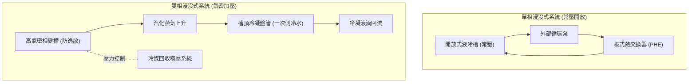

# 技術對比：單相 vs 雙相浸沒式液冷

在極致密度（單機架 >100 kW）與追求極限 PUE（<1.05）的 AIDC 設計中，**浸沒式液冷（Immersion Cooling）** 被視為終極冷卻技術。浸沒式將伺服器直接浸泡在完全不導電的介電液（Dielectric Fluid）中，移除所有伺服器風扇與散熱片界面的熱阻。然而，依據冷卻液在換熱過程中是否發生相變，技術路線分為 **單相（Single-Phase）** 與 **雙相（Two-Phase）**。

---

## 1. 熱力學物理機制：顯熱 vs 潛熱

| 物理指標 | 單相浸沒式 (Single-Phase) | 雙相浸沒式 (Two-Phase) |
| :--- | :--- | :--- |
| **換熱原理** | **顯熱交換 (Sensible Heat)** | **潛熱相變 (Latent Heat / Phase Change)** |
| **物理行為** | 介電液吸收 IT 熱量後溫度上升，保持液態，透過泵循環至外部板換（PHE）散熱。 | 介電液吸收 IT 熱量達到沸點後**沸騰汽化**，蒸氣上升至槽頂冷凝管，受冷凝結回流。 |
| **主要傳熱方程式** | $Q = \dot{m} \times C_p \times \Delta T$ | $Q = \dot{m} \times h_{fg}$ |
| **核心優勢參數** | $C_p$ (比熱容) 與 $\Delta T$ (供回水溫差) | $h_{fg}$ (汽化潛熱，熱導率極大) |

### 物理特點分析：
*   **單相浸沒**：完全依賴液體的循環對流。液體不發生汽化，因而對液體的比熱容和泵的循環流量要求較高。其換熱效率高於空氣，但受限於液體邊界層的對流換熱係數。
*   **雙相浸沒**：利用冷媒汽化時高昂的**汽化潛熱（Heat of Vaporization）**，沸騰換熱係數（Boiling Heat Transfer Coefficient）極大，能在晶片表面形成氣泡擾動，換熱效率達到物理極限，表面逼近溫差（Approach Temp）幾乎為 0°C。

---

## 2. 冷卻介質（Dielectric Fluid）選型與環保挑戰

介電液的物理與化學性質決定了浸沒式系統的成敗。

### A. 單相介電液
*   **常用介質**：**合成烴（Synthetic Hydrocarbons / PAO）** 或 **有機矽油（Silicon Oils）**（如綠色環保的植物油基介質）。
*   **特點**：
    *   無味、無毒，閃點高（>150°C），無蒸發損耗。
    *   **電導率極低**，漏液時不會引起短路。
    *   缺點是黏度較高（Viscosity），在低溫啟動時阻力較大，需精準計算流道水阻。

### B. 雙相介電液
*   **常用介質**：**氟化液（Fluorinated Liquids）**（如 3M Novec 系列、Fluorinert 系列或其替代氟化碳化合物）。
*   **特點**：
    *   沸點極低且精確（如 50°C ~ 60°C），黏度極低，熱傳速度極快。
    *   **致命弱點：環保與法規風險**。
        *   **PFAS (永久化學品) 限制**：由於氟化液屬於全氟和多氟烷基物質（PFAS），在自然界中極難降解，全球（尤以歐盟和美國 EPA）法規正逐步禁用，導致 3M 等主要化工廠宣布停產。
        *   **GWP (全球暖化潛勢) 極高**：早期雙相氟化液的 GWP 是二氧化碳的數千倍，微量蒸發逸散會對環境造成嚴重溫室效應。

---

## 3. 硬體結構與機械運維複雜度 (MTTR)

由於雙相存在氣液相變，其槽體（Tank）的機械設計與單相有本質區別。

### A. 單相系統：開放/半封閉式結構
*   **結構設計**：通常為常壓設計的頂開式槽體（類似魚缸）。液位保持恆定，頂部蓋板僅作防塵與防微量揮發用，不需要絕對氣密。
*   **運維與 MTTR**：**極為簡單**。當伺服器故障時，直接打開蓋板，將伺服器緩慢吊裝拉起，靜置滴乾介電液後即可進行熱插拔維護。MTTR 通常 <30 分鐘。

### B. 雙相系統：嚴格氣密與壓力容器
*   **結構設計**：必須是**絕對氣密（Hermetic Sealing）**的密封壓力容器。因為冷媒沸騰會產生蒸氣壓，一旦氣密失效，高昂的氟化液將迅速蒸發逸散（每天損失 1% 即代表數萬美元的 OPEX 災難）。
*   **運維與 MTTR**：**極度複雜**。維護伺服器前，必須先停止白區白區發熱，等待冷媒蒸氣完全冷凝回流，或利用**冷媒回收系統**將槽內氣體抽空並冷凝儲存，才能打開艙門。維護時需穿戴專業防護配備，MTTR 常大於 2 小時。

---

## 4. CAPEX 與 OPEX 成本結構回收期分析

浸沒式系統的經濟效益評估必須考慮壽命週期總成本（LCC）。

### A. 初始投資 (CAPEX)
*   **單相**：中等偏高。液冷槽體與外部 PHE 成本適中，合成烴介電液價格合理（約佔槽體系統成本的 20~30%）。
*   **雙相**：**極度高昂**。需要氣密槽體、高精密冷凝管路、壓力防爆安全閥與昂貴的**冷媒回收泵站**。最關鍵的是**氟化液成本極高**（初裝液體成本可能佔整個系統 CAPEX 的 50% 以上）。

### B. 營運成本 (OPEX) 與能效
*   **單相**：水泵循環能耗低，PUE 表現穩定在 1.02 ~ 1.04。由於無揮發損耗，液體補給成本極低。
*   **雙相**：理論上 PUE 可以達到物理極限的 1.01 ~ 1.02（完全無泵送能耗，靠重力回流），但 **氟化液蒸發補償成本**（每天只要有微量 0.05% 的逸散率，累積一年即是龐大負擔）通常會抵消省下的電費。

---

## 5. 技術規格與工程選型矩陣

| 對比項目 | 單相浸沒式液冷 (Single-Phase) | 雙相浸沒式液冷 (Two-Phase) |
| :--- | :---: | :---: |
| **極限排熱容量 (per Rack)** | **100 kW ~ 150 kW** | **200 kW ~ 300+ kW** (物理散熱上限最高) |
| **設計 PUE 表現** | 1.02 ~ 1.04 | 1.01 ~ 1.02 |
| **冷卻介質成本** | 較低 (合成烴/植物基油) | 極高 (全氟化液) |
| **運維維護難度 (MTTR)** | 簡單 (熱插拔，靜置滴乾) | 極複雜 (需氣密回收、抽真空) |
| **環保法規風險 (PFAS / GWP)**| **無風險** | **極高風險** (歐美逐步禁用 PFAS，面臨停產) |
| **介質揮發損失** | 幾乎為 0 | 每年 1% ~ 5% 揮發耗損風險 (依氣密性而定) |
| **伺服器硬體修改** | 拆卸風扇，安裝加長拉環即可。 | 需拔除風扇，且需進行**沸騰增強塗層**以防晶片熱點。 |
| **化學相容性挑戰** | 需注意電纜護套、密封膠的溶脹與 TIM 材料溶解。 | 氟化液溶解性極強，會迅速洗掉硬體上的標籤與不相容油脂。 |
| **鴻海/AIDC 戰術定位** | **目前商用與試點的主力首選**，技術成熟度（TRL 8）高。 | **技術儲備與前瞻研究**，在法規與介質問題未解決前，暫不推薦大規模發包。 |

---

## 6. Cross-References

*   系統基礎模組：[[Module 04 - 液冷系統深度解析]]、[[Module 08 - 廠商生態系統]]
*   上游冷源：[[設備與廠商選型對照矩陣]]
*   代表性廠商實體：[[Foxconn]] (自研相變研究)、[[Rittal]] (液冷槽體結構)、[[CoolIT]] (DLC 對比)
