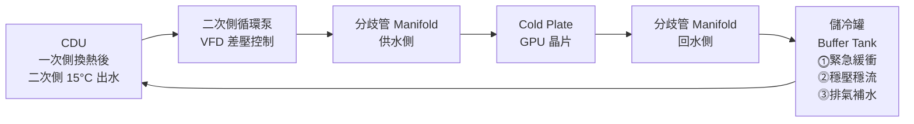
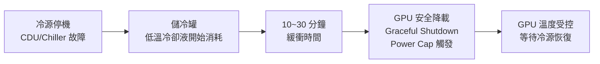

# 儲冷罐（Thermal Buffer Tank）

## 一句話理解

儲冷罐就是液冷系統的「緊急蓄冷池」：平時默默儲存低溫冷卻液，等到冷源（CDU / Chiller）異常停機時，靠罐內存量繼續帶走 GPU 的熱，爭取 10~30 分鐘讓控制系統完成安全降載（Graceful Shutdown）。

> **類比：儲冷罐 ＝ 冷卻系統的 UPS。** 就像 UPS 在市電中斷時繼續供電，儲冷罐在冷源中斷時繼續供冷。沒有 UPS，伺服器停電；沒有儲冷罐，GPU 沒有冷卻直接過熱。

---

## 先搞清楚：AIDC 有三種不同的「Buffer Tank」

工程文件常讓人混淆，AIDC 裡「Buffer Tank」其實指三種不同設備：

| 名稱 | 位置 | 容積規模 | 主要用途 |
|-----|------|---------|---------|
| **TCS 儲冷罐** | CDU 二次側液冷迴路 | 數百~數千 L | 液冷緊急緩衝、穩壓穩流、排氣補水 |
| **冷凍水水頭缸** | Chiller 一次/二次側之間 | 數千~數萬 L | 一次/二次側流量解耦（詳見[[冷卻水泵浦系統]]）|
| **蓄冷槽 TES** | Chiller Plant 一次側 | 數萬~數十萬 L | 電力尖峰移載（夜間儲冷、白天釋冷）|

**本頁講的是 TCS 儲冷罐**（液冷 CDU 二次側），規模最小但最靠近 GPU，重要性最高。

---

## 在系統中的位置



儲冷罐接在**回水側**（GPU 用完的熱水回來後、進泵之前）：
- 回水溫度均勻（無局部高溫），利於排氣
- 泵入口前的低流速區，氣泡自然上浮排出

---

## 三大功能詳解

### ⓵ 熱慣性緩衝（最重要）

CDU 或 Chiller 異常停機後，GPU 仍持續發熱。儲冷罐內的低溫冷卻液繼續流動，爭取時間：



沒有緩衝時間：CDU 停機 → GPU 繼續滿載 → 幾分鐘內過熱 → **Thermal Shutdown 或硬體損壞**。

---

### ⓶ 穩壓穩流

液冷管路中產生壓力衝擊的場景：

| 事件 | 衝擊原因 |
|-----|---------|
| 快速接頭帶壓插拔 | 瞬間阻力突變，水柱動量改變 |
| VFD 泵轉速快速調整 | 流速瞬間升降，管路壓力波 |
| 多台伺服器同時開/關流量閥 | 並聯迴路阻力分佈突變 |

**水錘（Water Hammer）不緩衝的後果：**
- Cold Plate 內 0.5~2 mm 微流道因衝擊變形或裂縫
- 快速接頭密封件加速磨損 → 滴漏
- 管路振動 → 接頭逐漸鬆動

**緩衝機制：** 儲冷罐液面上方保留氮氣（N₂）氣層或橡膠氣囊，如同液壓彈簧，吸收壓力波。

---

### ⓷ 排氣補水

**為什麼氣泡危險：**

```
氣泡進入 Cold Plate 微流道
    → 阻塞部分流道，冷卻液無法通過
    → 局部 Dry Spot（乾燒點）
    → GPU Die 局部溫度飆升
    → Thermal Throttling 降頻
    → 嚴重時晶片損壞
```

儲冷罐頂部設置**自動排氣閥（Automatic Air Vent）**：

- 氣泡比水輕，自然上浮到罐頂
- 排氣閥感測到氣體自動開閥排出
- 排出後水位略降 → 補水閥自動補充去離子水

> 新系統安裝或維修後必須先手動**排氣充液（Purging）**，讓整個迴路完全充滿冷卻液再開機。

---

## 容積計算（最重要的設計步驟）

### 公式

```
V_buffer（L）= P_IT（kW）× t_buffer（min）× 60
              ─────────────────────────────────────
               ρ（kg/L）× Cp（kJ/kg·°C）× ΔT_允許（°C）

P_IT   = GPU 滿載功耗（kW）
t      = 目標緩衝時間（分鐘，AIDC 標準 ≥ 10 min）
ρ      = 冷卻液密度，純水 1.0 kg/L
Cp     = 比熱，純水 4.186 kJ/(kg·°C)
ΔT     = 允許水溫上升量（°C），通常取 5~10°C
```

### 範例計算

GB200 NVL72 機架，IT 負載 132 kW，目標緩衝 10 分鐘，允許水溫上升 8°C：

```
V = 132 × 10 × 60
    ─────────────────
    1.0 × 4.186 × 8

V = 79,200 / 33.5 ≈ 2,364 L ≈ 2.4 m³
```

加上 20% 安全裕度 → **設計選用 ~2,900 L（≈3 m³）的儲冷罐**。

> ΔT 允許值越小（對溫度越敏感），需要的罐體越大、越重。GB200 供水上限 17°C，實際設計時 ΔT 通常取 5~6°C，儲冷罐體積會更大。

---

## 設計規格參考

| 參數 | 典型值 |
|------|-------|
| 容積（中型 AIDC，單 CDU）| 500~3,000 L |
| 材質 | 304/316L 不鏽鋼（純水環境）|
| 工作壓力 | 6~10 bar（與二次側管路相同）|
| 緩衝時間目標 | **≥ 10 分鐘**（Graceful Shutdown 最低需求）|
| 安裝位置 | 回水側，靠近泵入口，高點設排氣閥 |
| 氣層 / 氣囊預壓 | 1.0~1.5 bar N₂（穩壓用）|
| 二次側水量比例 | 儲冷罐容積 ≈ 迴路總水量的 10~20% |

---

## Cross-References

- 上層系統：[[CDU 架構與選型]]（儲冷罐是 CDU 內建或外掛的標配）
- 功能類比：[[UPS]]（儲冷罐之於液冷 = UPS 之於電力）
- 壓力衝擊來源：[[快速接頭]]（帶壓插拔是主要水錘來源）
- 氣泡的受害者：[[Cold Plate]]（微流道最怕乾燒）
- 水頭缸（不同概念）：[[冷卻水泵浦系統]]（Chiller 一次/二次側解耦用）
- 蓄冷槽 TES（不同概念）：[[Chiller Plant]]（大規模電力尖峰移載）
- 液冷架構：[[Module 04 - 液冷系統深度解析]]
