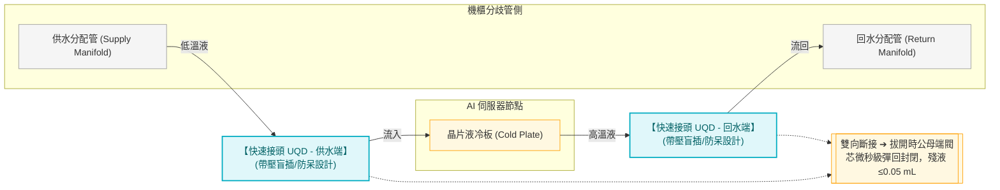

# 快速接頭（Quick Disconnect Coupling）

**快速接頭**是 DLC 液冷系統中連接 CDU 二次側分歧管與伺服器 Cold Plate 的可插拔接頭。三大特性使它成為 GPU 旁帶壓作業的安全基礎，也讓 Hot Swap 成為可能。

在高密度 AI 資料中心（如 GB200 機櫃），快速接頭技術已從傳統手動插拔演進至高度精密、零洩漏的**雙向斷接標準組件**。

---

## 核心技術：單向斷接 vs. 雙向斷接 (UQD)

依據斷開連接時的內部閘閥控制機制，快速接頭分為以下兩類：

*   **單向斷接 (Single-shut-off / Single Valved)**：
    *   **機制**：僅有插頭（Male）或插座（Female）的其中一側（通常為一次側/管路供水側）裝有單向控制閥。
    *   **缺點**：拔開接頭的瞬間，未裝閥的另一側（伺服器冷板側）管路內殘存的冷卻液會直接流出。這在滿佈昂貴 GPU/CPU 晶片的白區機櫃內是**絕對不可接受的災難**。
*   **雙向斷接 (Double-shut-off / Double Valved)**：
    *   **機制**：公頭與母頭兩側均內建精密彈簧滑塞閥。連接時，兩端閥芯互相頂開建立通道；斷開時，兩側閥芯在幾微秒內藉由內部彈簧迅速彈回，同時緊密關閉兩端水路。
    *   **無滴漏（Zero-drip / Flat-face）設計**：採用平底無滴漏（Flat-face）閥芯設計，拔開時殘餘溢出液體極限壓制在 **$\le 0.02 \sim 0.05 \text{ mL}$** 以下（僅幾滴微量濕潤，可用擦拭布抹除），徹底保障了帶電運行（Hot-swap）安全性。

---

## OCP UQD (Universal Quick Disconnect) 標準規範

為推動高密度液冷生態系的互換性與標準化，**開放運算計畫 (OCP)** 定義了 UQD 標準：

1.  **規格互換性**：定義了 UQD10、UQD15、UQD20（數字代表水力流道通徑，如 $10\text{ mm}$, $15\text{ mm}$），確保不同製造商（如 Stäubli、CPC、Parker）的快速接頭能無縫互插。
2.  **極限流阻與壓力損失**：要求在額定流量下，UQD 的流阻壓降必須控制在極低範圍（例如 UQD10 在 $15 \text{ L/min}$ 下壓降 $\le 0.2 \text{ bar}$），防止其成為二次側管路的流阻瓶頸。
3.  **盲插對準補償 (Blind-Mate Alignment)**：
    *   在 GB200 NVL72 等機櫃中，伺服器抽屜是直接推入機架後部進行盲插對接的。
    *   UQD 盲插接頭（Blind-mate Connector）具備 **$\pm 1.0 \sim 2.0 \text{ mm}$ 的徑向與軸向對準偏差補償能力**，插頭端能在滑動座上微幅浮動，防止對接時因機架形變或施工公差硬碰硬磨損毀壞。
4.  **超長循環壽命**：規範在帶壓狀態下至少需承受 **$500 \sim 1000$ 次以上的插拔循環**，且無任何機械疲勞或滲漏。

---

## 三大特性

| 特性 | 說明 | 工程意義 |
|------|------|---------|
| **乾式雙向斷接（Dry Disconnect）**| 拔開後兩端閥芯同時自動封閉，無洩漏 | 高價 GPU（H100/B200 = 數萬美元）旁作業的基本安全要求 |
| **帶壓插拔（Live Disconnect）**| 系統在運作壓力下仍可安全插拔 | Hot Swap 熱插拔成為可能，不需停整個液冷迴路 |
| **防呆設計（Fool-proof）**| 供水接頭與回水接頭外觀不同，插反物理上插不進去 | 防止現場施工接反供/回水方向 |

> 三個特性缺一不可：少了乾式雙向斷接，拔接頭就噴水在 GPU 上；少了防呆，施工方向接反會讓 Cold Plate 反向流動，冷卻效果異常。

## 在系統中的位置

## Hot Swap 作業流程

帶壓插拔讓單台伺服器維修不需停整個機架的液冷系統：

1. 確認該台伺服器流量閥關閉（若有）
2. 拔開回水接頭 → 兩端閘門同時關閉，無洩漏
3. 拔開供水接頭 → 同上
4. 抽出伺服器，進行維修或更換
5. 插入伺服器，接上供/回水接頭（防呆確保方向正確）
6. 確認流量恢復正常

## 設計規格

| 參數 | 典型值 |
|------|-------|
| 工作壓力 | 5~10 bar |
| 適用流量 | 依管徑，DN10~DN25 常見 |
| 材質 | 不鏽鋼 316L 或黃銅（二次側純水環境用不鏽鋼）|
| 接液材質限制 | 與二次側純水相容，禁止鋅合金（離子污染）|

## 代表廠商

- **Stäubli**（瑞士，AIDC 快速接頭市場主流）
- **Parker Hannifin**（Schrader-Bellows 系列）
- **CPC（Colder Products）**
- Eaton（Aeroquip）

## Cross-References

- 上層系統：[[CDU 架構與選型]]（快速接頭屬於二次側末端）
- 末端設備：[[Cold Plate]]（快速接頭連接 Cold Plate 進出水口）
- 液冷架構：[[Module 04 - 液冷系統深度解析]]
- 搭配元件：[[儲冷罐]]（系統壓力穩定後，快速接頭插拔才安全）
