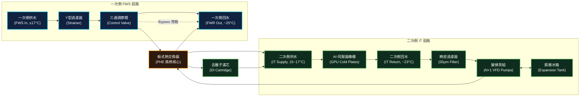

# 液冷系統 - CDU 架構

**CDU（Coolant Distribution Unit，冷卻液分配裝置）** 是 DLC（Direct Liquid Cooling）直接液冷系統與機房一次側冰水系統（Facility Water System）的物理邊界。其核心功能是藉由內部的板式熱交換器（PHE）進行 **「傳熱不傳質」** 的熱交換，徹底隔離外部機電水路與機架內的高敏感 GPU 液冷迴路。

---

## 1. 內部水路系統架構

CDU 內部包含了精密的一/二次側熱交換模組、循環水泵、過濾器、控制閥門及各類感測器。以下是典型的 CDU 內部構造示意圖：

### 核心內部組件功能說明

1. **板式熱交換器 (Plate Heat Exchanger, PHE)**
   - **材質**：通常使用高抗腐蝕的 **316L 不鏽鋼**，表面經精密雷射焊接，耐壓能力 > 10~16 bar。
   - **作用**：高效率換熱，並形成物理屏障，防止一次側混濁的廠務冰水與二次側高純度去離子水混合。
2. **二次側變頻循環水泵 (IT Loop VFD Pumps)**
   - **配置**：通常採 **N+1 備援**（例如雙泵 1+1，或三泵 2+1，通常為垂直多段離心泵）。
   - **控制**：配備變頻器（VFD），依據伺服器發熱量實施**恆定壓差（Constant DP）**控制。
3. **一次側三通調節閥 (3-Way Modulating Control Valve)**
   - **作用**：根據二次側供水溫度的反饋，自動調節流入板式熱交換器的一次側冰水流量。當伺服器低負載時，三通閥將大部分一次側水由旁路（Bypass）直接旁通回水管路，防止二次側過度冷卻導致低溫結露。
4. **精密過濾器 (Secondary Loop Strainers)**
   - **配置**：二次側通常設有 **50 微米 (μm)** 的主過濾器，並在伺服器機架進口處設有 **5 微米** 的二級過濾，確保無碎屑堵塞 Cold Plate 微細流道（Micro-channels）。
5. **去離子濾芯 (DI/Polishing Cartridge)**
   - **作用**：二次側迴路旁接一條小流量的 DI 濾芯（約佔總流量的 5~10%），連續濾除水中的溶解離子，維持電導度 < 10 μS/cm。
6. **穩壓膨脹系統 (Expansion Tank / Accumulator)**
   - **作用**：與 [[儲冷罐]] 及膨脹水箱整合，吸收溫升導致的水體膨脹、維持系統正壓防止氣蝕、並在泵切換時提供壓力補償與熱慣性緩衝。

---

## 2. 關鍵控制邏輯 (Operations & Control)

CDU 的自動控制系統（BMS/PLC）必須高度穩定，以確保 GPU 在極端載荷波動下供水溫度與壓力的平穩。

### A. 二次側流量控制：恆定壓差控制 (DP Control)
*   **機制**：在二次側供水總管（Supply Manifold）與回水總管（Return Manifold）之間裝設**壓差變送器 (DP Sensor)**。
*   **邏輯**：當伺服器因運算結束使 Cold Plate 端的二通閥關閉（或快接拔除）導致管路阻力增加、壓差升高時，CDU PLC 會自動調降變頻泵（VFD）轉速，使壓差維持在設定值。
*   **工程意義**：防止管路超壓損壞快速接頭與冷板，並節省泵功耗。

### B. 二次側供水溫度控制：PID 調節
*   **目標**：維持二次側供水溫度在 **15°C ~ 17°C** 之間（依 GB200 原廠規範）。
*   **邏輯**：
    *   當**二次側供水溫度高於設定值**（例如 17°C），PID 控制器會輸出訊號，加大一次側三通調節閥的開度，讓更多冷冰水流入 PHE。
    *   當**溫度過低**（例如低於 15°C），閥門關小，部分一次側水旁通，以**防止機房露點溫度 (Dew Point) 高於水溫時產生表面結露**。

### C. 泵組備援與故障切換 (Failover)
*   **主從切換 (Lead-Lag)**：雙變頻泵定期（例如每運行 100 小時）進行主備輪換，平衡設備磨損。
*   **故障自檢**：當運作中的泵浦發生故障（電流異常、變頻器告警、或泵後無流量/壓差驟降），PLC 必須在 **< 2.0 秒** 內發出指令啟動備用泵，並在切換期間由累積水罐吸收水阻波動，實現無感無痛切換。

---

## 3. 一/二次側隔離設計與水質指標

水質是決定液冷系統壽命的關鍵。一次側水與二次側水指標相差甚巨：

| 指標項目 | 一次側（廠務冰水 Facility Water）| 二次側（IT 冷卻液 IT Coolant）| 控制技術 / 備註 |
|:---|:---|:---|:---|
| **電導度 (Conductivity)** | 200 ~ 500 μS/cm | **< 10 μS/cm** (最佳常態 1.0~2.0) | 使用 DI 離子交換濾芯連續吸附 |
| **pH 值** | 6.5 ~ 8.5 | **7.0 ~ 9.0** (弱鹼性) | 防止酸性腐蝕銅製冷板，添加緩蝕劑 |
| **濁度 (Turbidity)** | < 5 NTU | **< 1 NTU** | 精密濾芯過濾細小雜質 |
| **生物控制** | 加氯/殺菌劑定期處理 | 嚴格防菌、加長效非氧化性殺菌劑 | 防止生物粘泥堵塞微流道 |
| **物理隔離意義** | 水質差，含泥沙與大顆粒，管路長 | 水質極高，與高溫高壓電子元件直接換熱 | **PHE 傳熱不傳質** 的根本出發點 |

> ⚠️ **警告：二次側電導度超標的危害**
> 若二次側水質變差，電導度上升至 > 50 μS/cm，一旦 Cold Plate 或快速接頭發生微滲漏，液體流經 GPU 板卡將會引發**電弧與短路**，造成單張價值數萬美元的 GPU 晶片永久性燒毀。

---

## 4. Cross-References

*   選型與商務評估：[[CDU 架構與選型]]
*   二次側吸熱組件：[[Cold Plate]]、[[TIM 導熱介面材料]]
*   管路配件：[[快速接頭]]、[[儲冷罐]]
*   物理溫差計算：[[LMTD 計算]]
*   系統整合模組：[[Module 04 - 液冷系統深度解析]]
*   代表廠商實體：[[Vertiv]]、[[CoolIT]]
