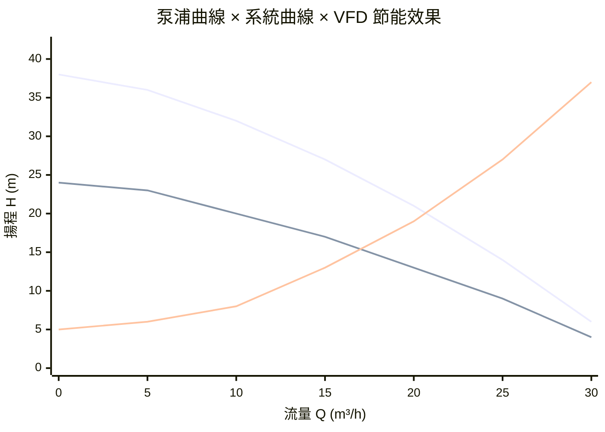
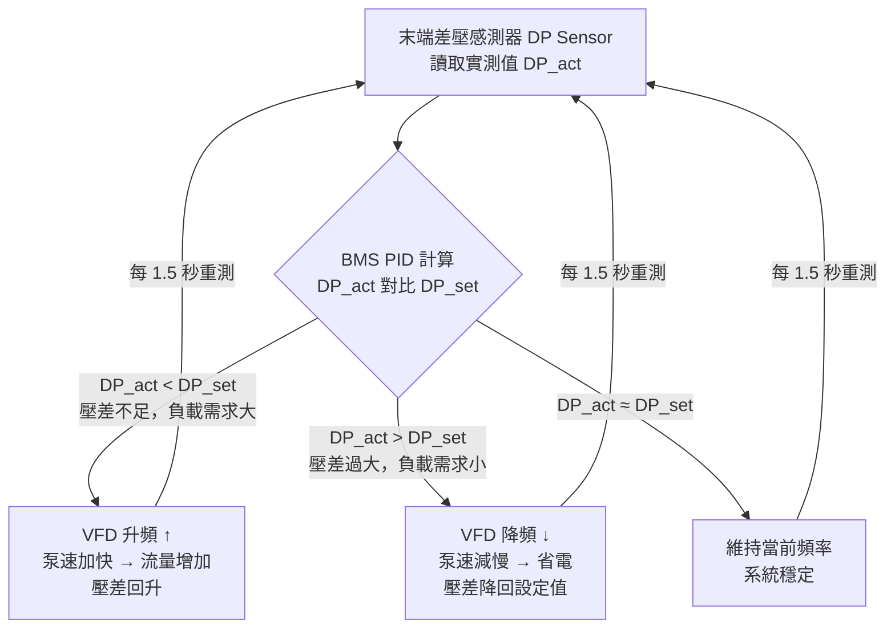
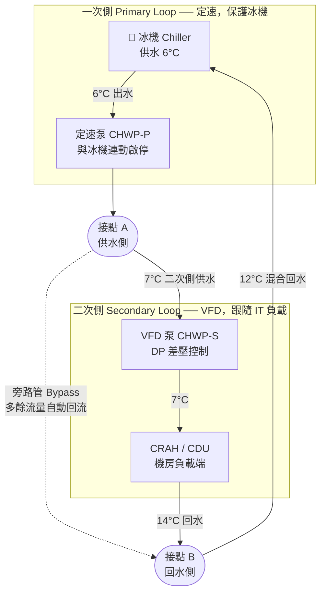
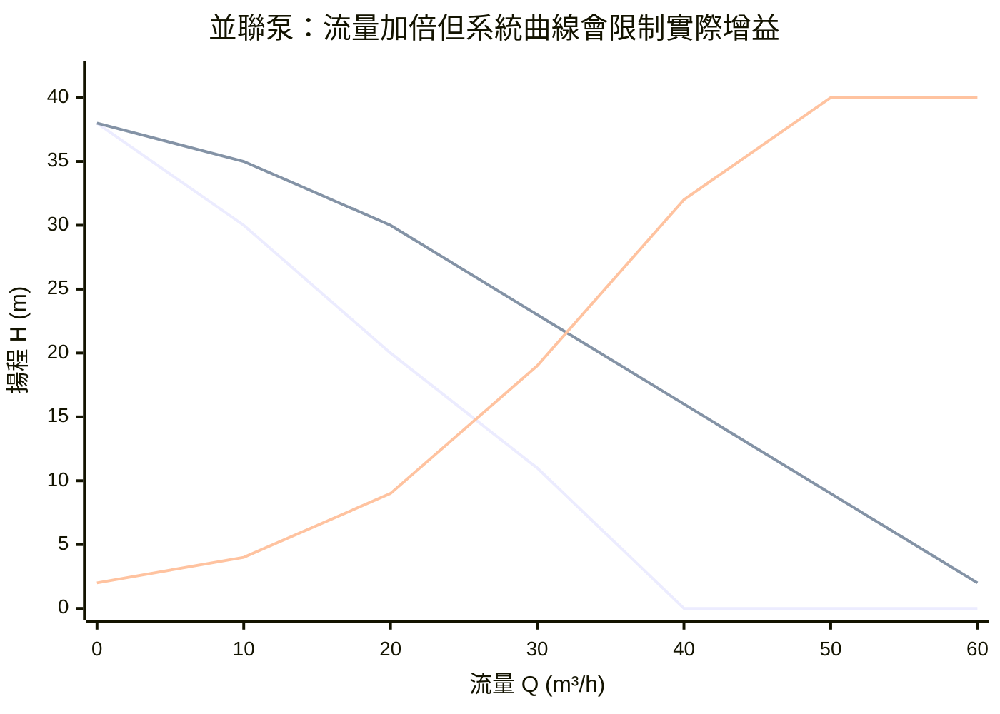

# 冷卻水泵浦系統（Cooling Water Pump System）

AIDC 冷卻水路裡有三種主要泵浦迴路，各自服務不同的水系統。泵浦是唯一讓冷卻水持續流動的動力來源，選型與控制邏輯直接影響 PUE。

| 泵浦類型 | 服務迴路 | 控制方式 | 典型揚程 |
|---------|---------|---------|---------|
| **冷凍水一次側泵（CHWP-P）** | Chiller ↔ 水頭缸 | 定速（與冰機連動）| 15~25 m |
| **冷凍水二次側泵（CHWP-S）** | 水頭缸 ↔ CRAH/CDU | VFD 差壓控制 | 20~35 m |
| **冷卻水泵（CWP）** | Chiller 冷凝器 ↔ 冷卻水塔 | 定速或 VFD | 15~25 m |
| **CDU 二次側泵（TCS Pump）** | CDU PHE ↔ 伺服器冷板 | VFD 差壓控制 | 25~35 m |

---

## 泵浦基礎參數

### 流量（Q）

單位：m³/h、L/min、GPM（US gallons per minute）

```
Q = P_cooling / (ρ × Cp × ΔT)

P_cooling = 冷卻需求（kW）
ρ = 密度，純水 ~1,000 kg/m³
Cp = 比熱，純水 4.186 kJ/(kg·°C)
ΔT = 供回水溫差（°C）
```

範例：冷凍水 6/12°C（ΔT = 6°C），冷卻 1,000 kW：
Q = 1,000 / (1,000 × 4.186/3600 × 6) = **40.1 m³/h（668 L/min）**

### 揚程（H）

泵浦克服管路所有阻力所需的壓差，以「米水柱（m）」表示：

```
ΔP（Pa）= H（m）× ρ × g = H × 1,000 × 9.81

例：25 m 揚程 = 25 × 1,000 × 9.81 = 245,250 Pa ≈ 2.45 bar
```

管路阻力來源：直管摩擦（Darcy-Weisbach）+ 局部阻力（彎頭、閥門、換熱器）。

### 功率（P）與效率（η）

```
P_水力（kW）= ρ × g × Q × H / 1,000
           = (1,000 × 9.81 × Q[m³/s] × H[m]) / 1,000

P_軸功率（kW）= P_水力 / η_pump

P_電功率（kW）= P_軸功率 / η_motor

η_pump（優良）= 75~88%
η_motor（IE3/IE4）= 92~96%
```

---

## 泵浦特性曲線與系統曲線

### 泵浦曲線、系統曲線與 VFD 工作點

下圖同時顯示三條曲線：全速泵浦曲線（100% N）、VFD 降速後的泵浦曲線（80% N）、以及系統阻力曲線（ΔP = R × Q²）。**兩條曲線的交叉點就是實際運行工作點。**



| 工作點 | 流量 Q | 揚程 H | 相對功耗 |
|-------|-------|-------|---------|
| 全速（100% N）| ~19 m³/h | ~18 m | 100% |
| VFD 降速（80% N）| ~14 m³/h | ~12 m | **~51%** |

> 泵浦選型目標：工作點落在泵浦曲線的高效率區間（Best Efficiency Point, BEP）附近。偏離 BEP 過遠 → 效率下降 → 能耗增加 → 軸承磨損加速。

---

## VFD 變頻控制與相似律（Affinity Laws）

### 相似律（最重要！）

泵浦轉速改變時，Q、H、P 的關係：

```
Q₂/Q₁ = N₂/N₁           （流量與轉速成正比）
H₂/H₁ = (N₂/N₁)²        （揚程與轉速平方成正比）
P₂/P₁ = (N₂/N₁)³        （功率與轉速三次方成正比）
```

**關鍵在三次方律：轉速降低 20%，功耗降至 51%：**

```
N₂/N₁ = 0.8
P₂/P₁ = 0.8³ = 0.512  → 省電 48.8%
```

| 轉速比（N₂/N₁）| 流量比 Q | 揚程比 H | 功耗比 P |
|--------------|---------|---------|---------|
| 100%（全速）| 100% | 100% | 100% |
| 90% | 90% | 81% | 73% |
| 80% | 80% | 64% | **51%** |
| 70% | 70% | 49% | **34%** |
| 60% | 60% | 36% | **22%** |

> 這就是二次側泵安裝 VFD 的最大理由：AIDC 大多時間在部分負載，泵浦轉速只需 70~80%，功耗直接砍半以上。

### VFD 控制邏輯（恆壓差控制）



設定差壓（DP_set）通常取最不利迴路（末端機櫃）的設計壓差，約 **0.8~1.5 bar**。

---

## 一次 / 二次側解耦架構（Primary-Secondary Decoupling）

這是 AIDC 冷凍水系統最重要的水路設計概念。

### 為什麼需要解耦？

冰機（Chiller）有固定流量要求——流量太低會導致蒸發器結冰，太高則無意義浪費泵功。但機房側的負載是動態變化的，流量需求隨 IT 負載波動。

**解決方案：用水頭缸（Buffer Tank）或旁路管（Common Pipe）隔開兩個迴路。**

### 架構圖



### 旁路管的關鍵作用

| 情況 | 旁路管流向 | 說明 |
|-----|----------|------|
| 機房負載小，二次側需求 < 一次側供應 | 一次側多餘流量→旁路管→回到冰機 | 冰機流量維持穩定，不會空轉 |
| 機房負載大，二次側需求 > 一次側供應 | 回水部分從旁路管補入 | 供水溫度略升，但冰機不超載 |
| 滿負載，兩側流量相等 | 旁路管無流動 | 理想設計工況 |

> ⚠️ 旁路管若設計過短（阻力過小）會造成「短路」：一次側冷水未進機房就直接回流，供水溫度上升，冷卻效果大降。正確設計是讓旁路管阻力僅略低於末端迴路。

---

## NPSH 與空蝕（Cavitation）

### 什麼是空蝕？

泵浦葉輪入口若壓力低於該溫度下的水蒸氣壓，水會局部沸騰形成氣泡。氣泡在高壓區瞬間崩潰，產生微型衝擊波，侵蝕葉輪表面，最終導致葉輪蜂窩狀損壞。

### NPSH 定義

```
NPSHa（有效汽蝕餘量）= 泵浦入口絕對壓力 - 該溫度水蒸氣壓（均以m換算）
NPSHr（必須汽蝕餘量）= 泵浦廠商規定的最小值（由葉輪設計決定）

安全條件：NPSHa > NPSHr + 1 m（安全裕度）
```

### AIDC 常見空蝕原因與對策

| 原因 | 場景 | 對策 |
|-----|------|------|
| 入口靜壓不足 | 泵浦安裝位置過高，吸水管路過長 | 泵浦盡量靠近水頭缸（低位安裝）|
| 水溫偏高 | 回水溫度高（如 CDU 回水 35°C+）| 提高系統靜壓（膨脹罐預壓）|
| 入口過濾器堵塞 | Y 型濾網積垢，壓差上升 | 定期清洗，設差壓告警 |
| 流量過大（超設計點）| 並聯冰機分台運行後流量重分配 | 設流量保護上限 |

> **CDU 液冷系統的膨脹罐預壓設計（1.0~1.5 bar）**就是為了確保在高回水溫度下 NPSHa 仍大於 NPSHr，防止空蝕。

---

## AIDC 各迴路泵浦類型

### 冷凍水側（CHW 迴路）

- **臥式單吸離心泵（End Suction Centrifugal Pump）**：最常見，流量 50~500 m³/h，維護方便
- **臥式雙吸離心泵（Double Suction Split Case Pump）**：大流量場景（>500 m³/h），軸向力平衡，壽命長

### CDU 二次側（TCS 迴路）

- **無軸封屏蔽泵（Canned Motor Pump）**：轉子在冷卻液中旋轉，無機械密封，**零洩漏風險**，AIDC 首選
- **磁力驅動泵（Magnetic Drive Pump）**：磁力隔離驅動，同樣無軸封，適合純水或腐蝕性液體

> **AIDC CDU 絕對不用有機械密封的泵浦。** 機械密封磨損後會滴漏，在伺服器機架旁發生漏液是一級事故。

### 泵浦備援

| 備援模式 | 說明 | AIDC 標準 |
|---------|------|---------|
| N+1（互備）| 每組系統多配一台備用泵，故障自動切換 | ✅ 冷凍水側標準 |
| 雙泵各 100%| 兩台各自能承擔 100% 流量，平時一用一備 | ✅ CDU 二次側標準 |
| 並聯擴容 | 多台同型泵並聯，共同承擔流量（但不計為備援）| 大流量場景 |

---

## 並聯泵運行原理

兩台相同泵並聯運行時，**理論上流量加倍，揚程不變**，但實際工作點受系統曲線陡峭程度影響：



| 運行狀態 | 工作點流量 | 說明 |
|---------|----------|------|
| 單泵 | ~21 m³/h | 單泵曲線 × 系統曲線交叉 |
| 並聯 2 台 | ~34 m³/h | 並非 2 倍（42 m³/h），系統阻力限制了增益 |

> ⚠️ **並聯陷阱：** 系統曲線越陡（高阻力管路），並聯增益越小。極端情況下第二台泵幾乎無法出力。並聯適合**低揚程、高流量、系統曲線平緩**的場景。

---

## Cross-References

- 冷凍水系統架構：[[Chiller Plant]]（一次/二次/三次側水路完整架構）
- CDU 泵選型計算：[[CDU 架構與選型]]（揚程計算、無軸封泵規格）
- VFD 差壓控制邏輯：[[BMS與DCIM序列控制邏輯]]（PID 控制序列、設定值調整）
- 系統靜壓與防空蝕：[[CDU 架構與選型]]（膨脹罐預壓設計）
- 乙二醇對泵浦的影響：[[TCS 二次側與冷卻水化學管理]]（黏度升高導致壓降增加 20%）
- 效率計算：[[PUE 計算]]（泵浦功耗佔冷卻總功耗 10~20%）
- 空蝕與漏液防護：[[漏液偵測系統]]、[[AIDC FMEA 故障模式與效應分析]]
