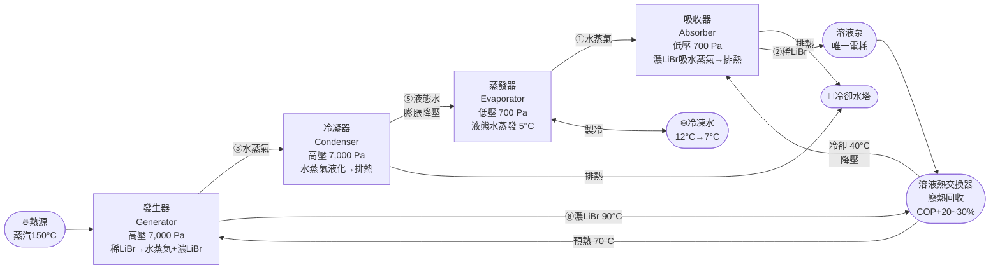
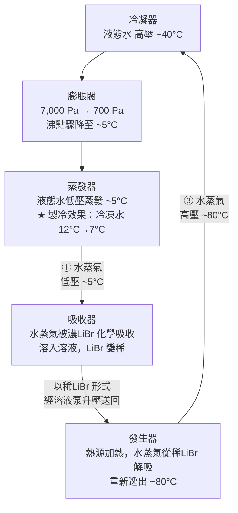
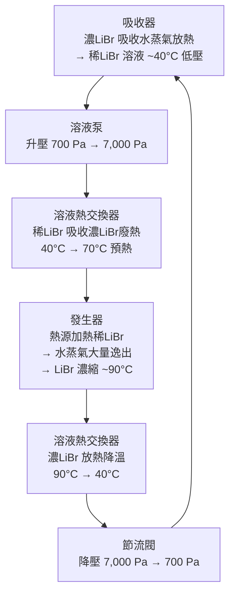
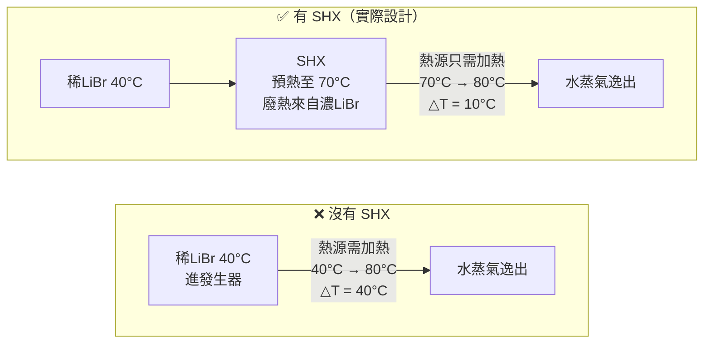
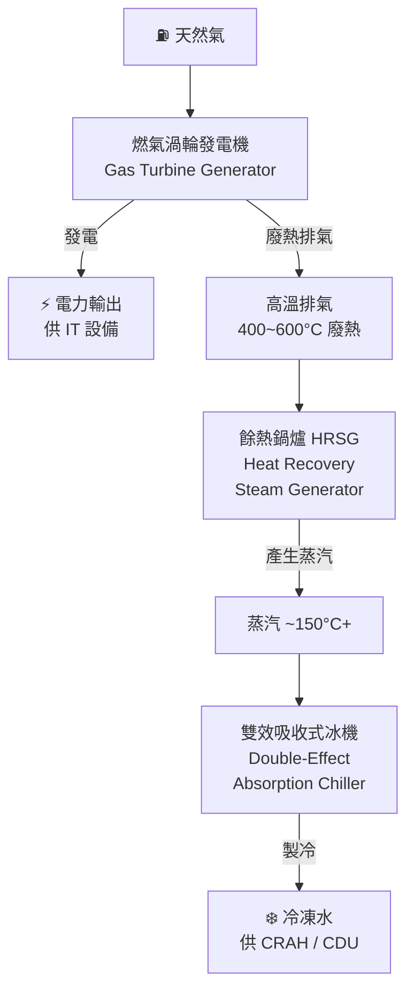

# 吸收式冰機（Absorption Chiller）

**吸收式冰機**以**熱能（蒸汽／熱水／廢熱）**驅動製冷循環，取代壓縮機的機械功。無旋轉壓縮機，幾乎無電耗（僅溶液泵與控制），特別適合有廢熱可回收的場景（CHP 熱電聯產、工業餘熱）。

最常見配對：**溴化鋰（LiBr）＋水**（水為冷媒）。LiBr 對水蒸氣具有強烈的化學吸附力，以此取代機械壓縮。

> ⚠️ LiBr 系統製冷溫度下限約 **5°C**，冷凍水供水溫度不能低於此。氨（NH₃）＋水的配對可達 0°C 以下，但腐蝕性強，主要用於工業製程，不用於 AIDC。

## 製冷原理（LiBr 系統）

### 四大核心元件

| 元件 | 所在壓力側 | 功能 | 連接的外部迴路 |
|-----|---------|------|-------------|
| **發生器 Generator** | 高壓側 ~7,000 Pa | 熱源蒸煮稀 LiBr 溶液，逼出水蒸氣（冷媒）；LiBr 濃縮 | 熱源輸入（蒸汽/廢熱）|
| **冷凝器 Condenser** | 高壓側 ~7,000 Pa | 水蒸氣液化成液態水，排熱 | 冷卻水塔（排熱）|
| **蒸發器 Evaporator** | 低壓側 ~700 Pa | 液態水在超低壓下蒸發（~5°C），吸收冷凍水熱量 | 冷凍水迴路（製冷目的）|
| **吸收器 Absorber** | 低壓側 ~700 Pa | 濃 LiBr 化學吸收水蒸氣，放熱；LiBr 稀化 | 冷卻水塔（排熱）|

> **為何 700 Pa 下水就能在 5°C 蒸發？** 水的沸點隨壓力降低而下降。大氣壓（101,325 Pa）下 100°C 沸騰；在 700 Pa 超低壓真空下，水只需 ~5°C 即可沸騰。整個低壓側就是一個高真空環境。

---

### 系統全貌圖



---

### 冷媒循環（水的路徑）

水是這台機器的「冷媒」，全程只有液態 ↔ 氣態兩種狀態切換：



---

### 溶液循環（LiBr 的路徑）

LiBr 是「吸收劑」，在濃 ↔ 稀之間切換，扮演「化學壓縮機」的角色：



---

### 溶液熱交換器的作用（為什麼重要）



有 SHX：熱源負荷降低 75%（△T 從 40°C 縮為 10°C）→ **COP 提升約 20~30%**。

---

### 各點壓力與溫度

| 位置 | 壓力 | 溫度 | 說明 |
|-----|------|------|------|
| 蒸發器 | ~700 Pa（0.007 bar）| ~5°C | 水在超低壓下沸騰 |
| 吸收器 | ~700 Pa | ~35~40°C | 吸收水蒸氣，放熱至冷卻水 |
| 發生器（雙效）| ~7,000 Pa（0.07 bar）| ~80~90°C | 熱源蒸煮稀LiBr |
| 冷凝器 | ~7,000 Pa | ~38~42°C | 水蒸氣液化，排熱至冷卻水 |
| 冷凍水（進/出）| — | 12°C / 7°C | 機房側冷卻需求 |
| 冷卻水（進/出）| — | 29°C / 34°C | 冷卻水塔排熱 |

---

### 熱量守恆（能量哪裡來、哪裡去）

```
輸入：
  Q_gen  = 熱源投入（蒸汽/廢熱）→ 發生器
  Q_evap = 冷凍水帶入的熱量    → 蒸發器（這是「製冷」吸收的熱）
  W_pump = 溶液泵電力          → 極小，可忽略

輸出（排至冷卻水塔）：
  Q_cond = 冷凝器排熱
  Q_abs  = 吸收器排熱

守恆：Q_gen + Q_evap + W_pump = Q_cond + Q_abs

COP（冷卻）= Q_evap / Q_gen
雙效約 1.1~1.4，意思是每投入 1 kW 廢熱，可製造 1.1~1.4 kW 冷卻量
```

> ⚠️ 吸收式冰機同樣**需要冷卻水塔**，而且冷卻水塔負荷比壓縮式更大（要排走吸收器＋冷凝器兩個熱源），冷卻水塔容量約為壓縮式的 1.5~2 倍。

## 單效 vs 雙效 vs 三效

| 類型 | 熱源要求 | COP（冷卻）| 適用熱源 |
|-----|---------|-----------|---------|
| **單效（Single-Effect）** | 蒸汽 0.05~0.1 MPa（100°C），熱水 75~95°C | **0.6~0.8** | 低品位廢熱（工廠排熱、地熱）|
| **雙效（Double-Effect）** | 蒸汽 0.4~0.8 MPa（150~170°C），天然氣直燃 | **1.1~1.4** | 中高壓蒸汽、CHP 排氣餘熱 |
| **三效（Triple-Effect）** | 蒸汽 ≥ 1.0 MPa（≥180°C）| **1.5~1.8** | 高壓蒸汽，工業場景為主，較少見 |

> **COP < 1 不代表違反熱力學**——驅動能源是熱能，不是電能。雙效 COP 1.2 意思是：輸入 1 kW 熱能，產生 1.2 kW 冷卻量，差額來自冷凝熱（環境熱）的提升。

## 吸收式 vs 壓縮式比較

| 比較項目 | 吸收式冰機 | 壓縮式冰機（水冷）|
|---------|---------|----------------|
| **驅動能源** | 熱能（蒸汽/熱水/廢熱）| 電力 |
| **電力消耗** | 極低（僅泵，< 5% 同容量壓縮式）| 高（壓縮機主功耗）|
| **COP（熱源基準）** | 0.7~1.4（雙效）| — |
| **機械震動/噪音** | **極低**（無壓縮機）| 中~高 |
| **維護複雜度** | 高（LiBr 結晶、腐蝕、真空管理）| 中（冷凍油、機械保養）|
| **啟動時間** | 慢（15~30 分鐘暖機）| 快（數分鐘）|
| **容量調節** | 慢，範圍 25~100% | 快，VFD 靈活 |
| **冷凍水溫下限** | 5°C（LiBr 系統）| 可達 0°C 以下 |
| **廢熱回收能力** | **核心優勢** | 無 |
| **需要冷卻水塔** | ✅ 是（吸收器 + 冷凝器均需排熱）| ✅ 是 |

## AIDC 應用場景

吸收式冰機在 AIDC 是**小眾應用**，主要出現在有廢熱可用的系統整合情境：

### 1. 熱電聯產（CHP / Cogeneration）

資料中心若自建燃氣渦輪發電機，排氣溫度 400~600°C，可透過餘熱鍋爐（HRSG）產生蒸汽，驅動雙效吸收式冰機：



電費與冷卻費均降低，綜合能源效率（Site PUE）可顯著改善。這種架構又稱 **CCHP（Combined Cooling, Heat and Power，冷熱電三聯產）**。

### 2. 工業區廢熱利用

鄰近工廠、煉油廠、焚化爐等大量低品位廢熱來源，以廢熱驅動單效吸收式冰機可近乎零成本製冷。

> ⚠️ **AIDC 限制：** 吸收式冰機響應速度慢、容量調節不靈活，**不能作為主要冷源**，通常與電動壓縮式冰機並聯，在廢熱充足時承擔基礎負載（Base Load），壓縮式承擔尖峰與調節。

## LiBr 系統維護重點

| 風險 | 原因 | 防護方式 |
|-----|------|---------|
| **LiBr 結晶（Crystallization）** | 冷卻水溫過低，LiBr 濃度超過飽和 | 控制冷卻水溫 ≥ 24°C，設置防結晶溫度保護與自動稀釋 |
| **腐蝕** | LiBr 溶液具強腐蝕性（尤其對鋼鐵）| 添加鉬酸鋰（Li₂MoO₄）緩蝕劑，維持 pH 9.5~10.5 |
| **真空洩漏** | LiBr 系統在真空（~700 Pa）下運行，微量空氣洩入即降低性能 | 定期抽真空（Purging），設置氙氣偵漏 |
| **銅管腐蝕** | 溴離子對銅管點蝕 | 定期水質分析，必要時化學清洗 |

## 代表廠商

- **荏原（Ebara）** — 日系雙效吸收式，工業與區域能源應用
- **矢崎（Yazaki）** — 小型單效，廢熱回收專用，太陽熱能驅動
- **Carrier**（開利）— 16JB/17WB 系列
- **Trane**（特靈）— ABSC 系列雙效吸收式
- **遠大空調（BROAD）** — 中國最大吸收式冰機廠商，天然氣直燃型雙效
- **三洋 / Panasonic** — 中小型單效與雙效

## Cross-References

- 所屬系統：[[Chiller Plant]]
- 對比機型：[[磁浮式冷凍機]]、[[離心式 vs 螺桿式冷凍機]]
- 氣冷替代（免電力冷凝）：[[氣冷式冰機]]
- 效率指標：[[PUE 計算]]（CHP 對 Site PUE 計算的影響）
- 冷卻水系統：[[冷卻水塔]]（吸收器與冷凝器均需排熱至冷卻塔）
- 換熱計算：[[LMTD 計算]]
- 標準參考：[[Module 05 - 冷源與冷凍機房]]
