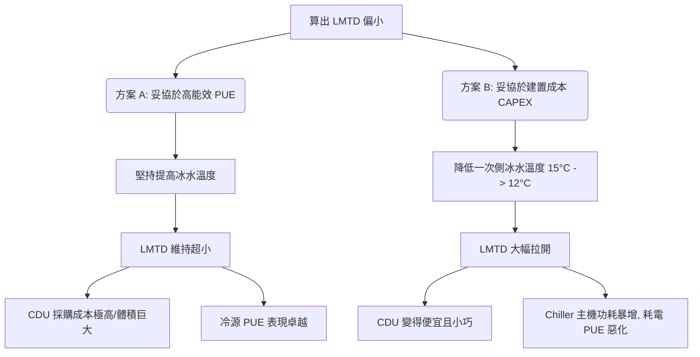

# LMTD 計算

**LMTD（Log Mean Temperature Difference，對數平均溫差）** 是熱交換器（PHE, 板式熱交換器）設計的核心物理指標。它代表了熱交換器中「熱側流體」與「冷側流體」在整個換熱流道中的**對數平均溫差驅動力**。

---

## 1. 核心物理公式

$$LMTD = \frac{\Delta T_1 - \Delta T_2}{\ln(\Delta T_1 / \Delta T_2)}$$

在 AIDC 實務中，為達到最高熱交換效率，熱交換器一律採用**逆流配置（Counterflow）**：
*   **$\Delta T_1$（熱端溫差）** = 二次側熱液回水溫度（進 CDU） - 一次側冷水回水溫度（出 CDU 去 Chiller）
*   **$\Delta T_2$（冷端溫差）** = 二次側冷液供水溫度（出 CDU 去 GPU） - 一次側冷水供水溫度（進 CDU 從 Chiller 來）

### 物理意義：傳熱基本公式

$$Q = U \times A \times LMTD$$

*   **$Q$**：總散熱量（kW），例如 NVIDIA GB200 單機櫃為 $120 \text{ kW}$。
*   **$U$**：總傳熱係數（$\text{kW/m}^2\cdot\text{K}$），由板片材質、波紋形狀及流速決定，屬於製造商專利參數。
*   **$A$**：所需換熱面積（$\text{m}^2$），直接決定了熱交換器的**體積大小、重量與成本（CAPEX）**。
*   **LMTD**：溫差驅動力。**LMTD 與 換熱面積 $A$ 成絕對反比。**
    *   LMTD 越大 $\rightarrow$ 傳熱動力極強 $\rightarrow$ 換熱面積 $A$ 可以很小 $\rightarrow$ 設備便宜、體積小。
    *   LMTD 越小 $\rightarrow$ 傳熱動力極弱 $\rightarrow$ 需要極大的面積 $A$ $\rightarrow$ 設備巨大、極貴，且水阻壓降會飆升。

---

## 2. 數字大小的實務工程概念（建立直覺）

在進行 AIDC HVAC 設計時，工程師算出 LMTD 數字後，必須立刻判斷這個數值在工程實務上的可行性與預算影響：

| LMTD 數值範圍 | 工程分級 | 實務物理狀態與設備影響 | AIDC 應用場景與實務判定 |
| :--- | :---: | :--- | :--- |
| **$< 2.5^\circ\text{C}$** | **紅色警戒區** (極度嚴苛) | 溫差極小，傳熱極為困難。熱交換器必須設計得**極度龐大**，板片數量翻倍，會佔滿整個 CDU 空間。此外，因為流道超長，**水路壓降會飆升，水泵能耗大增**。 | **通常出現在「自然冷卻（Free Cooling）機房」** 或 Waterside Economizer。在此工況下，為了壓榨最後的低溫，必須使用昂貴的「超貼近溫差板式換熱器（Close-Approach PHE）」。 |
| **$2.5^\circ\text{C} \sim 4.0^\circ\text{C}$** | **高難度設計區** (AIDC 液冷主流) | 溫差偏小，對板片製造工藝要求極高，需要極薄的波紋板（如 $0.4\text{ mm}$ 鈦合金或不銹鋼片）以強行拉高傳熱係數 $U$。 | **GB200 高供水溫度（$16^\circ\text{C} \sim 17^\circ\text{C}$）的 CDU 標準配置。** 雖然設備較貴，但能保證一次側冷凍水溫拉高，提升冰機 COP，為系統 PUE 優化的黃金折衷帶。 |
| **$4.0^\circ\text{C} \sim 6.0^\circ\text{C}$** | **綠色安全區** (最推薦) | 溫差舒適，傳熱效率良好。熱交換器尺寸適中，能輕鬆塞入標準 $19$ 吋機櫃式 CDU 中，且成本與水阻表現均衡。 | **中大型 AIDC 液冷系統的標準首選設計。** 屬於廠商最成熟、交期最快、報價最平實的產品區間。 |
| **$> 6.0^\circ\text{C}$** | **輕鬆設計區** (低成本/高能耗) | 溫差極大，傳熱非常輕鬆。熱交換器可以設計得非常小巧便宜。 | **但代價是浪費了「冷源品質」！** 代表您使用了過低的 Chiller 供水（例如用 $7^\circ\text{C}$ 冰水來冷卻 $30^\circ\text{C}$ 的回水），導致 Chiller 壓縮機做功極重，**PUE 能效會嚴重惡化**。 |

---

## 3. 算出 LMTD 後，工程師下一步要做什麼？

工程師算出 LMTD 絕對不是寫在筆記本上就結束了，它是整個 **RFQ（詢價發包書）**、**TBE（技術評標）** 到 **設備採購驗收** 的核心科學依據。以下是標準工程作業流程：

### 第一步：寫入 RFQ 技術數據表 (Datasheet) —「鎖定四溫點」
*   **重要觀念**：**不要**在採購合同中直接指定「我要 LMTD 為 $3.9^\circ\text{C}$ 的設備」，因為廠商無法直接驗收 LMTD。
*   **實務作法**：您必須在 RFQ Technical Datasheet 中明確寫死**「四溫點」**與**「熱負荷 $Q$」**。
    *   例如填寫：一次側供/回水：$14^\circ\text{C} / 24^\circ\text{C}$；二次側供/回水：$16^\circ\text{C} / 26^\circ\text{C}$；散熱容量：$120\text{ kW}$。
    *   這五個數據一旦寫死，**就等於在法律與技術上強制鎖定了 $LMTD = 2.0^\circ\text{C}$** 的硬性指標，製造商必須無條件滿足。

### 第二步：進行 TBE 技術評標 —「審查廠商的 PHE 計算書」
當 Vertiv、CoolIT 或 Delta 等廠商收到您的 RFQ 回標時，他們的工程團隊會運行其專利的 PHE 設計軟體，並提供一份 **PHE 技術規格計算書（PHE Run Sheet）**。作為 Foxconn 的 HVAC 主建工程師，您必須審查以下三項關鍵指標：
1.  **容許壓降（Pressure Drop, $\Delta P$）**：
    *   小 LMTD 會導致廠商使用超多板片或長流道來強行換熱，這會使**壓降飆升**。
    *   **審查標準**：必須強制要求一次側壓降 $\le 0.6 \text{ bar}$，二次側壓降 $\le 0.8 \text{ bar}$。如果廠商的計算書水阻超標，代表他們的 CDU 將會耗用更多水泵電力，必須要求廠商重選板片。
2.  **熱面積裕量（Area Margin / NTU Margin）**：
    *   因為水路運轉久了會結垢（Fouling），導致熱傳效率衰退。
    *   **審查標準**：檢查計算書中的「Area Margin（面積裕度）」是否達到 **`10% ~ 15%`**。如果廠商只給 $2\%$，代表只要有輕微結垢，冷卻液溫度就會失控，必須予以扣分或退件重算。
3.  **材質防蝕等級**：
    *   在高密度 AI 白區中，二次側水質要求電導度 $< 10 \mu\text{m}$。
    *   **審查標準**：要求熱交換器板片必須使用 **SS316L 不銹鋼** 或更高規格的 **鈦合金**，以防長期弱鹼性水質沖刷導致穿孔漏液。

### 第三步：全系統級 PUE 與總擁有成本（TCO）折衷評估
如果您算出的 LMTD 偏小（如 $2.0^\circ\text{C}$），您面臨兩個抉擇，這就是工程師展現架構價值的時刻：

*   **決策下一步**：將這兩種方案的 **CAPEX（CDU 採購溢價）** 與 **OPEX（5 年冰電費差額）** 寫成報告，向專案主管（Boss）回報，決定整座 AIDC 的最優平衡點。

---

## 4. ε-NTU 換熱有效度法（補充）

在評估**現有熱交換器**的實際性能（而非設計新設備）時，工程師更常用 **ε-NTU（Effectiveness - Number of Transfer Units）** 方法，避免 LMTD 需要知道出口溫度的循環計算問題。

### 核心參數

$$NTU = \frac{U \times A}{\dot{m}_{min} \times C_p}$$

$$\varepsilon = \frac{Q_{actual}}{Q_{max}} = \frac{\text{實際換熱量}}{\text{理論最大換熱量}}$$

其中：
- $\dot{m}_{min}$：熱容量較小一側的質量流量
- $Q_{max} = \dot{m}_{min} \times C_p \times (T_{hot,in} - T_{cold,in})$：兩側進口最大溫差可達到的最大傳熱量

### 逆流換熱器的 ε-NTU 關係（最常用）

$$\varepsilon = \frac{1 - e^{-NTU(1-C^*)}}{1 - C^* \cdot e^{-NTU(1-C^*)}}$$

其中 $C^* = \dot{m}_{min} C_p / \dot{m}_{max} C_p$（容量比）

| NTU | $C^*=0.5$（典型 CDU PHE）| $C^*=1.0$ |
|:---:|:---:|:---:|
| 1.0 | 0.58 | 0.50 |
| 2.0 | 0.78 | 0.67 |
| 3.0 | 0.89 | 0.75 |
| **4.0** | **0.94** | **0.80** |

> **工程應用：** 當 CDU 一次側流量減少（Chiller 部分負載）、導致四溫點偏移時，用 ε-NTU 法快速估算新的出口溫度，判斷是否仍滿足 GPU 供水 ≤ 17°C 的要求。

## 5. Cross-References

*   系統級選型決策：[[CDU 架構與選型]]
*   冷凍機房冷源配合：[[Chiller Plant]]、[[Module 05 - 冷源與冷凍機房]]
*   廠商發包配合：[[設備與廠商選型對照矩陣]]（RFQ 技術要點）、[[Module 08 - 廠商生態系統]]
*   IT 側源頭冷卻需求：[[GB200 NVL72 冷卻需求]]
