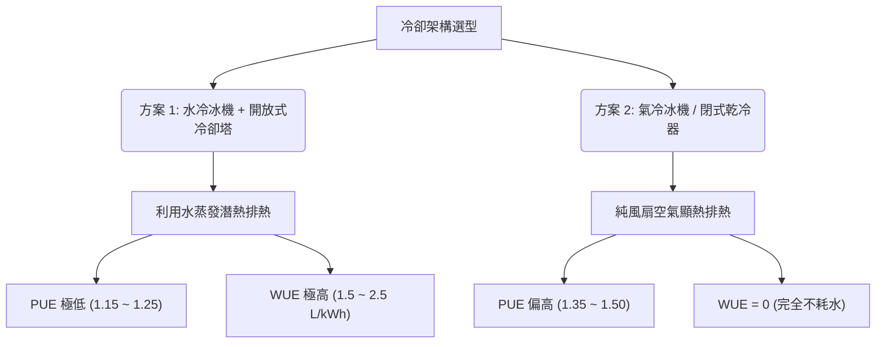

# WUE 計算

**WUE（Water Usage Effectiveness，水資源使用效率）** 是評估資料中心（Data Center）水資源消耗效率的國際標準指標，由 **The Green Grid（綠色網格）** 組織定義。

隨著 AI 晶片功率飆升，高密度 AIDC（如 NVIDIA GB200）對冷卻的需求極度依賴「冷卻水塔的蒸發潛熱」來排熱。這導致資料中心成為龐大的**耗水怪獸**。在水資源緊張的地區（如台灣夏季限水、新加坡、美國亞利桑那州），**WUE 的評估與控制與 PUE 同等重要**。

---

## 1. 計算公式

### A. 年度標準公式

$$WUE = \frac{\text{資料中心年度總用水量 (L)}}{\text{IT 設備年度總用電量 (kWh)}}$$

*   **單位**：**$\text{L/kWh}$**（升/度電）。
*   **數值對等**：在國際單位制中，WUE 也常寫作 **$\text{m}^3\text{/MWh}$**（立方米/兆瓦時），數值完全等價（$1 \text{ L/kWh} = 1 \text{ m}^3\text{/MWh}$）。
*   **分子定義**：**年度總用水量**包括冷卻塔蒸發水、系統排污水（Blowdown）、漂水（Drift）、設備清洗水以及辦公生活用水，其中 **95% 以上均耗費在冷卻排熱**。

### B. 瞬時補水流量計算（建廠管徑設計依據）

在 HVAC 工程設計中，我們需要依據瞬時最大耗水量來設計自來水進水管徑：

$$\text{總補水量 (Make-up Water)} = \text{蒸發水量 (Evaporation)} + \text{排污水量 (Blowdown)} + \text{漂水損失 (Drift)}$$

---

## 2. PUE vs. WUE 的物理折衷（Trade-off）

在 HVAC 系統規劃中，**降低 PUE（省電）往往會導致 WUE 上升（費水）**，這是一個經典的物理天平：

*   **理想結合：液冷（DLC） + 閉式乾冷器（Dry Cooler）**：
    由於液冷二次側供水溫度可拉高至 **$16^\circ\text{C} \sim 22^\circ\text{C}$**，在多數氣候區可直接使用乾冷器進行一次側自然冷卻，**達成 PUE $\le 1.15$ 且 WUE = 0** 的終極綠色目標。

---

## 3. WUE 各等級意義與合規標準

資料中心的 WUE 表現可劃分為以下工程等級：

| WUE 值 ($\text{L/kWh}$) | 耗水評級 | 典型冷卻架構與水路狀態 | 實務工程判定 |
| :--- | :---: | :--- | :--- |
| **$0$** | **零耗水** | 氣冷主機、閉式乾冷器（無蒸發輔助）。 | **水資源限水地區唯一解**。PUE 會稍微犧牲，但免除停水停機風險。 |
| **$< 0.2$** | **極優異** | 採用「間接蒸發冷卻（IEC）」或「噴霧輔助乾冷器（Adiabatic）」，僅在夏季高溫時噴水降溫。 | 高度節水的 AIDC 設計，兼顧了省電與省水。 |
| **$0.2 \sim 0.5$** | **良好** | 水冷系統，但配合高效率冷卻塔、高濃縮倍數（CoC $\ge 6$）及冷凝水回收。 | 現代化、精細化管理的資料中心。 |
| **$0.5 \sim 1.5$** | **一般** | 標準水冷冰機 + 傳統冷卻塔，濃縮倍數在 $3 \sim 5$ 之間。 | 大多數大型商業資料中心的現狀。 |
| **$> 1.5$** | **高耗水** | 水質管理極差，冷卻塔頻繁排污，或濃縮倍數 $< 3.0$。 | 屬於綠能環保黑名單，在台灣夏季或新加坡將面臨高額水費懲罰。 |

*   **新加坡 IMDA 標準 (SS 564)**：超大規模資料中心必須強制進行水資源審計。
*   **台灣經濟部水利署**：資料中心建案必須通過「用水計畫書」審查，評估限水時期（如新竹、台南梅雨季前）的儲水罐（能維持運轉 24~48 小時）容量。

---

## 4. 實務計算範例

### 專案背景：
鴻海規劃在南部建置一座 IT 負載 **$50 \text{ MW}$** 的 AI 算力中心（GB200 NVL72），全年無休運轉（運轉時數 $8,760 \text{ h}$）。冷卻系統採用水冷冰機搭配開放式冷卻塔，設計 **$WUE = 1.6 \text{ L/kWh}$**。

#### 1. 計算年度總用電量：
$$\text{Annual IT Energy} = 50,000 \text{ kW} \times 8,760 \text{ h} = 438,000,000 \text{ kWh (4.38 億度電)}$$

#### 2. 計算年度總消耗水量：
$$\text{Annual Water} = 438,000,000 \text{ kWh} \times 1.6 \text{ L/kWh} = 700,800,000 \text{ L} = 700,800 \text{ m}^3$$

> 💡 **驚人數據**：該 AIDC 每年將消耗 **$70$ 萬噸自來水**，相當於 **$280$ 個奧運標準游泳池** 的水量！

#### 3. 計算瞬時補水流量（設計進水管徑）：
$$\text{瞬時補水量} = \frac{700,800,000 \text{ L}}{8,760 \text{ h}} = 80,000 \text{ L/h} = 80 \text{ m}^3\text{/h} \approx 22.2 \text{ L/s}$$

*   **設計行動**：廠務工程師必須依據 **$22.2 \text{ L/s}$** 的連續補水量來設計自來水引入管徑（通常需選用 **DN150/6吋管**），並規劃至少 **$1,920 \text{ m}^3$ 的儲水罐（Buffer Tank）**，以防市政自來水管爆管限水時，系統能維持至少 $24$ 小時不中斷運轉。

---

## 5. WUE 的工程優化手段

作為 HVAC 設計工程師，要強效拉低 WUE，必須採取以下手段：

1.  **拉高冷卻塔「濃縮循環倍數（Cycle of Concentration, CoC）」**：
    *   CoC 代表冷卻水不斷循環蒸發後，內部雜質被濃縮的倍數。
    *   **優化**：透過導入「高精度自動加藥加排污控制器」與「水磁化防垢處理」，將 CoC 從 $3.0$ 提升至 $6.0$，**可降低 $50\%$ 的排污水路浪費**。
2.  **蒸發冷卻與乾冷（Dry Cooling）智慧自動切換**：
    *   在冬季或春季（戶外濕球溫度 $< 15^\circ\text{C}$ 時），將系統切換為純乾冷（Dry Cooler）運轉，完全關閉冷卻塔噴淋水，實現**冬季耗水量歸零**。
3.  **冷凝水回收系統（Condensate Recovery）**：
    *   收集機房白區空調 CRAH 在夏季除濕時產生的冷凝水（極為純淨，無礦物質），打回冷卻塔作為補水，可省下約 $3 \sim 5\%$ 的進水量。
4.  **雨水收集與中水利用**：
    *   收集廠房大底屋頂雨水，經多介質過濾器後作為冷卻水塔補水。

---

## 6. Cross-References

*   能效核心指標：[[PUE 計算]]
*   耗水核心設備：[[冷卻水塔]]、[[開式冷卻塔 vs 閉式冷卻塔]]
*   系統水量熱負荷計算：[[Module 02 - AIDC 熱負荷與冷卻需求]]、[[Module 05 - 冷源與冷凍機房]]
*   發包矩陣水質標準：[[設備與廠商選型對照矩陣]]
